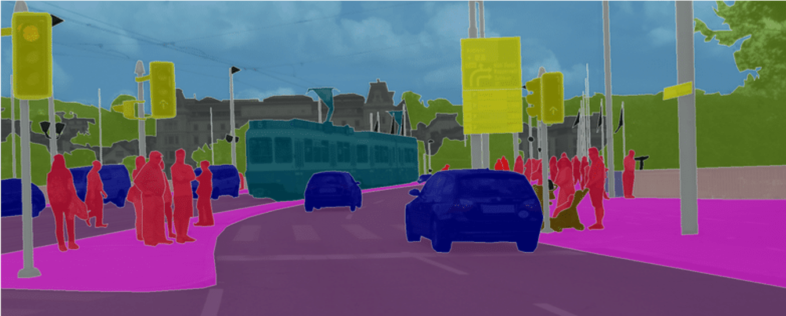

English | [简体中文](README_CN.md)

# PaddleSeg

[](https://travis-ci.org/PaddlePaddle/PaddleSeg)
[](LICENSE)
[](https://github.com/PaddlePaddle/PaddleSeg/releases)


 *[2020-12-02] PaddleSeg has released the [dynamic graph](./dygraph) version, which supports PaddlePaddle 2.0rc. For the static graph, we only fix bugs without adding new features. See detailed [release notes](./docs/release_notes.md).*

## Introduction

PaddleSeg is an end-to-end image segmentation development kit based on PaddlePaddle, which aims to help developers in the whole process of training models, optimizing performance and inference speed, and deploying models. Currently PaddleSeg supports seven efficient segmentation models, including DeepLabv3+, U-Net, ICNet, PSPNet, HRNet, Fast-SCNN, and OCRNet, which are extensively used in both academia and industry. Enjoy your Seg journey!



## Main Features

- **Practical Data Augmentation Techniques**

PaddleSeg provides 10+ data augmentation techniques, which are developed from the product-level applications in Baidu. The techniques are able to help developers improve the generalization and robustness ability of their customized models.

- **Modular Design**

PaddleSeg supports seven popular segmentation models, including U-Net, DeepLabv3+, ICNet, PSPNet, HRNet, Fast-SCNN, and OCRNet. Combing with different components, such as pre-trained models, adjustable backbone architectures and loss functions, developer can easily build an efficient segmentation model according to their practical performance requirements.

- **High Performance**

PaddleSeg supports the efficient acceleration strategies, such as multi-processing I/O operations, and multi-GPUs parallel training. Moreover, integrating GPU memory optimization techniques in the PaddlePaddle framework, PaddleSeg significantly reduces training overhead of the segmentation models, which helps developers complete the segmentation tasks in a high-efficient way.

- **Industry-Level Deployment**

PaddleSeg supports the industry-level deployment in both **server** and **mobile devices** with the high-performance inference engine and image processing ability, which helps developers achieve the high-performance deployment and integration of segmentation model efficiently. Particularly, using another paddle tool [Paddle-Lite](https://github.com/PaddlePaddle/Paddle-Lite), the segmentation models trained in PaddleSeg are able to be deployed on mobile/embedded devices quickly and easily.

- **Rich Practical Cases**

PaddleSeg provides rich practical cases in industry, such as human segmentation, mechanical meter segmentation, lane segmentation, remote sensing image segmentation, human parsing, and industry inspection, etc. The practical cases allow developers to get a closer look at the image segmentation area, and get more hand-on experiences on the real practice.

## Installation

### 1. Install PaddlePaddle

System Requirements:
* PaddlePaddle >= 1.7.0 and < 2.0
* Python >= 3.5+

> Note: the above requirements are for the **static** graph version. If you intent to use the dynamic one, please refers to [here](./dygraph).

Highly recommend you install the GPU version of PaddlePaddle, due to large overhead of segmentation models, otherwise it could be out of memory while running the models.

For more detailed installation tutorials, please refer to the official website of [PaddlePaddle](https://www.paddlepaddle.org.cn/install/quick)。

### 2. Download PaddleSeg

```
git clone https://github.com/PaddlePaddle/PaddleSeg
```

### 3. Install Dependencies
Install the python dependencies via the following commands，and please make sure execute it at least once in your branch.
```
cd PaddleSeg
pip install -r requirements.txt
```

## Tutorials

For a better understanding of PaddleSeg, we provide comprehensive tutorials to show the whole process of using PaddleSeg on model training, evaluation and deployment. Besides the basic usages of PaddleSeg, the design insights will be also mentioned in the tutorials.

### Quick Start

* [PaddleSeg Start](./docs/usage.md)

### Basic Usages

* [Customized Data Preparation](./docs/data_prepare.md)
* [Scripts and Config Guide](./docs/config.md)
* [Data and Config Verification](./docs/check.md)
* [Segmentation Models](./docs/models.md)
* [Pretrained Models](./docs/model_zoo.md)
* [DeepLabv3+ Tutorial](./tutorial/finetune_deeplabv3plus.md)

### Inference and Deployment

* [Model Export](./docs/model_export.md)
* [Python Inference](./deploy/python/)
* [C++ Inference](./deploy/cpp/)
* [Paddle-Lite Mobile Inference & Deployment](./deploy/lite/)
* [PaddleServing Inference & Deployment](./deploy/paddle-serving)


### Advanced features

* [Data Augmentation](./docs/data_aug.md)
* [Loss Functions](./docs/loss_select.md)
* [Practical Cases](./contrib)
* [Multiprocessing and Mixed-Precision Training](./docs/multiple_gpus_train_and_mixed_precision_train.md)
* Model Compression ([Quantization](./slim/quantization/README.md), [Distillation](./slim/distillation/README.md), [Pruning](./slim/prune/README.md), [NAS](./slim/nas/README.md))


### Online Tutorials

We further provide a few online tutorials in Baidu AI Studio：[Get Started](https://aistudio.baidu.com/aistudio/projectdetail/100798), [U-Net](https://aistudio.baidu.com/aistudio/projectDetail/102889), [DeepLabv3+](https://aistudio.baidu.com/aistudio/projectDetail/226703), [Industry Inspection](https://aistudio.baidu.com/aistudio/projectdetail/184392), [HumanSeg](https://aistudio.baidu.com/aistudio/projectdetail/475345), [More](https://aistudio.baidu.com/aistudio/projectdetail/226710).


## Feedbacks and Contact
* If your question is not answered properly in [FAQ](./docs/faq.md) or you have an idea on PaddleSeg, please report an issue via [Github Issues](https://github.com/PaddlePaddle/PaddleSeg/issues).
* PaddleSeg User Group (QQ): 850378321 or 793114768


## Contributing

All contributions and suggestions are welcomed. If you want to contribute to PaddleSeg，please summit an issue or create a pull request directly.
