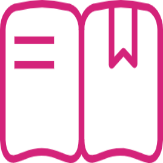

English | [简体中文](README_CN.md)

# PaddleSeg

[](LICENSE)
[](https://github.com/PaddlePaddle/PaddleSeg/releases)


## PaddleSeg has released the new version including the following features:

* Our team won the AutoNUE@CVPR 2021 challenge, where the technical [report](https://bj.bcebos.com/paddleseg/docs/autonue21_presentation_PaddleSeg.pdf) and [source code](https://github.com/PaddlePaddle/PaddleSeg/tree/release/2.2/contrib/AutoNUE) are available.
* We released an efficient interactive annotation tool for image segmentation, named [EISeg](https://github.com/PaddlePaddle/PaddleSeg/tree/release/2.2/contrib/EISeg).
* We introduced [Panoptic-DeepLab](https://github.com/PaddlePaddle/PaddleSeg/tree/release/2.2/contrib/PanopticDeepLab), which is a proposal-free algorithm  for panoptic segmentation.
* We provided an ultra-lightweight [portrait segmentation](./contrib/PP-HumanSeg) solution for the mobile devices and even the web

## PaddleSeg Introduction

Welcome to PaddleSeg! PaddleSeg is an end-to-end image segmentation development kit developed based on [PaddlePaddle](https://www.paddlepaddle.org.cn), which covers a large number of high-quality segmentation models in different directions such as *high-performance* and *lightweight*. With the help of modular design, we provide two application methods: *Configuration Drive* and *API Calling*. So one can conveniently complete the entire image segmentation application from training to deployment through configuration calls or API calls.

* ### PaddleSeg provides four image segmentation capabilities: semantic segmentation, interactive segmentation, panoptic segmentation and Matting.

<div align="center">
  
</div>


---------------

 * ### PaddleSeg is widely used in autonomous driving, medical, quality inspection, inspection, entertainment and other scenarios.

<div align="center">
  
</div>


---------------


## Core Features

*  **High Performance Model**: Based on the high-performance backbone trained by Baidu's self-developed [semi-supervised label knowledge distillation scheme (SSLD)](https://paddleclas.readthedocs.io/zh_CN/latest/advanced_tutorials/distillation/distillation.html#ssld), combined with the state of the art segmentation technology, we provides 50+ high-quality pre-training models, which are better than other open source implementations.

*  **Modular Design**: PaddleSeg support 15+ mainstream *segmentation networks*, developers can start based on actual application scenarios and assemble diversified training configurations combined with modular design of *data enhancement strategies*, *backbone networks*, *loss functions* and other different components to meet different performance and accuracy requirements.

*  **High Efficiency**: PaddleSeg provides multi-process asynchronous I/O, multi-card parallel training, evaluation and other acceleration strategies, combined with the memory optimization function of the PaddlePaddle, which can greatly reduce the training overhead of the segmentation model, all this allowing developers to lower cost and more efficiently train image segmentation model.

* :heart:**You can go to  [Complete PaddleSeg Online Documentation Directory](https://paddleseg.readthedocs.io)  for more detailed documentation**:heart:

## Technical Communication 

* If you find any problems or have a suggestion with PaddleSeg, please send us issues through [GitHub Issues](https://github.com/PaddlePaddle/PaddleSeg/issues).
* Welcome to Join PaddleSeg QQ Group
<div align="center">
  
</div>

## Model Instraction  

[Model Zoo](./configs/)

<div align="center">
  
</div>


## Dataset

- [x] Cityscapes
- [x] Pascal VOC
- [x] ADE20K
- [x] Pascal Context
- [x] COCO stuff

## Tutorials 

* [Installation](./docs/install.md)
* [Get Started](./docs/whole_process.md)
*  Prepare Datasets
   * [Preparation of Annotation Data](./docs/data/marker/marker.md)
   * [Annotating Tutorial](./docs/data/transform/transform.md)
   * [Custom Dataset](./docs/data/custom/data_prepare.md)

*  Custom Software Development of PaddleSeg
    * [Detailed Configuration File](./docs/design/use/use.md)
    * [Create Your Own Model](./docs/design/create/add_new_model.md)
* [Model Training](/docs/train/train.md)
* [Model Evaluation](./docs/evaluation/evaluate/evaluate.md)
* [Prediction](./docs/predict/predict.md)
* [Model Export](./docs/export/export/model_export.md)

*  Model Deploy
    * [Inference](./docs/deployment/inference/inference.md)
    * [Lite](./docs/deployment/lite/lite.md)
    * [Serving](./docs/deployment/serving/serving.md)
    * [Web](./docs/deployment/web/web.md)
* Model Compression
    * [Quantization](./docs/slim/quant/quant.md)
    * [Prune](./docs/slim/prune/prune.md)
*  API Tutorial
    * [API Documention](./docs/apis/README.md)
    * [API Application](./docs/api_example.md)
*  Description of Important Modules
    * [Data Augmentation](./docs/module/data/data.md)
    * [Loss Description](./docs/module/loss/losses_en.md)
    * [Tricks](./docs/module/tricks/tricks.md)
* Description of Classical Models
    * [DeeplabV3](./docs/models/deeplabv3.md)
    * [UNet](./docs/models/unet.md)
    * [OCRNet](./docs/models/ocrnet.md)
    * [Fast-SCNN](./docs/models/fascnn.md)
* [PR Instruction](./docs/pr/pr/pr.md)
* [FAQ](./docs/faq/faq/faq.md)

## Installation

#### step 1. Install PaddlePaddle

System Requirements:
* PaddlePaddle >= 2.0.0
* Python >= 3.6+

Highly recommend you install the GPU version of PaddlePaddle, due to large overhead of segmentation models, otherwise it could be out of memory while running the models. For more detailed installation tutorials, please refer to the official website of [PaddlePaddle](https://www.paddlepaddle.org.cn/install/quick?docurl=/documentation/docs/zh/2.0/install/)。


#### step 2. Install PaddleSeg
Support to construct a customized segmentation framework with *API Calling* method for flexible development.

```shell
pip install paddleseg
```


#### step 3. Download PaddleSeg Repo
Support to complete the whole process segmentation application with *Configuration Drive* method, simple and fast.

```shell
git clone https://github.com/PaddlePaddle/PaddleSeg
```

#### step 4. Verify Installation
Run the following command. If you can train normally, you have installed it successfully.

```shell
python train.py --config configs/quick_start/bisenet_optic_disc_512x512_1k.yml
```


## Practical Cases

* [PP-HumanSeg](./contrib/PP-HumanSeg)
* [Cityscapes SOTA](./contrib/CityscapesSOTA)
* [Panoptic Segmentation](./contrib/PanopticDeepLab)

## Feedbacks and Contact
* The dynamic version is still under development, if you find any issue or have an idea on new features, please don't hesitate to contact us via [GitHub Issues](https://github.com/PaddlePaddle/PaddleSeg/issues).
* PaddleSeg User Group (QQ): 1004738029 or 850378321 or 793114768

## Acknowledgement
* Thanks [jm12138](https://github.com/jm12138) for contributing U<sup>2</sup>-Net.
* Thanks [zjhellofss](https://github.com/zjhellofss) (Fu Shenshen) for contributing Attention U-Net, and Dice Loss.
* Thanks [liuguoyu666](https://github.com/liguoyu666), [geoyee](https://github.com/geoyee) for contributing U-Net++ and U-Net3+.
* Thanks [yazheng0307](https://github.com/yazheng0307) (LIU Zheng) for contributing quick-start document.

## Citation
If you find our project useful in your research, please consider citing:

```latex
@misc{liu2021paddleseg,
      title={PaddleSeg: A High-Efficient Development Toolkit for Image Segmentation},
      author={Yi Liu and Lutao Chu and Guowei Chen and Zewu Wu and Zeyu Chen and Baohua Lai and Yuying Hao},
      year={2021},
      eprint={2101.06175},
      archivePrefix={arXiv},
      primaryClass={cs.CV}
}

@misc{paddleseg2019,
    title={PaddleSeg, End-to-end image segmentation kit based on PaddlePaddle},
    author={PaddlePaddle Authors},
    howpublished = {\url{https://github.com/PaddlePaddle/PaddleSeg}},
    year={2019}
}
```
