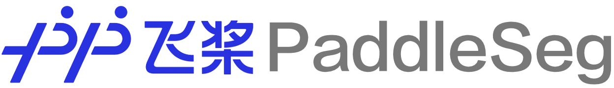

简体中文 | [English](README_EN.md)

<div align="center">

<p align="center">
  
</p>

**飞桨高性能图像分割开发套件，端到端完成从训练到部署的全流程图像分割应用。**


[](LICENSE)
[](https://github.com/PaddlePaddle/PaddleSeg/releases)


</div>

<div align="center">
  
</div>

##  最新动态
* [2022-11-30] :fire:  PaddleSeg 2.7版本发布！详细发版信息请参考[Release Note](https://github.com/PaddlePaddle/PaddleSeg/releases)。
  * 发布实时人像抠图模型[PP-MattingV2](./Matting/)：推理速度提升44.6%，平均误差减小17.91%，完美超越此前SOTA模型，支持零成本开箱即用。
  * 发布3D医疗影像分割方案[MedicalSegV2](./contrib/MedicalSeg/)：涵盖3D医疗影像交互式标注工具EISeg-Med3D、3个高精分割模型，集成并优化前沿分割方案nnUNet-D。
  * 官方发布轻量级语义分割模型[RTFormer](./configs/rtformer/)：由百度提出并发表于NeurIPS 2022，在公开数据集上实现SOTA性能。
* [2022-07-20] PaddleSeg 2.6版本发布实时人像分割SOTA方案[PP-HumanSegV2](./contrib/PP-HumanSeg)、高性能智能标注工具[EISeg v1.0](./EISeg)正式版、ImageNet分割伪标签数据预训练方法PSSL，开源PP-MattingV1代码和预训练模型。
* [2022-04-20] PaddleSeg 2.5版本发布超轻量级语义分割模型[PP-LiteSeg](./configs/pp_liteseg)，高精度抠图模型PP-MattingV1，3D医疗影像开发套件MedicalSegV1，交互式分割工具EISeg v0.5。
* [2022-01-20] PaddleSeg 2.4版本发布交互式分割工具EISeg v0.4，超轻量级人像分割方案PP-HumanSegV1，以及大规模视频会议数据集[PP-HumanSeg14K](./contrib/PP-HumanSeg/paper.md#pp-humanseg14k-a-large-scale-teleconferencing-video-dataset)。


##  简介

**PaddleSeg**是基于飞桨PaddlePaddle的端到端图像分割套件，内置**45+模型算法**及**140+预训练模型**，支持**配置化驱动**和**API调用**开发方式，打通数据标注、模型开发、训练、压缩、部署的**全流程**，提供**语义分割、交互式分割、Matting、全景分割**四大分割能力，助力算法在医疗、工业、遥感、娱乐等场景落地应用。

<div align="center">
  
</div>

##  特性

* **高精度**：跟踪学术界的前沿分割技术，结合高精度训练的骨干网络，提供40+主流分割网络、140+的高质量预训练模型，效果优于其他开源实现。

* **高性能**：使用多进程异步I/O、多卡并行训练、评估等加速策略，结合飞桨核心框架的显存优化功能，大幅度减少分割模型的训练开销，让开发者更低成本、更高效地完成图像分割训练。

* **模块化**：源于模块化设计思想，解耦数据准备、分割模型、骨干网络、损失函数等不同组件，开发者可以基于实际应用场景出发，组装多样化的配置，满足不同性能和精度的要求。

* **全流程**：打通数据标注、模型开发、模型训练、模型压缩、模型部署全流程，经过业务落地的验证，让开发者完成一站式开发工作。

<div align="center">
  
</div>

##  技术交流

* 如果大家有PaddleSeg的使用问题和功能建议, 可以通过[GitHub Issues](https://github.com/PaddlePaddle/PaddleSeg/issues)提issue。
* **欢迎加入PaddleSeg的微信用户群👫**（扫码填写简单问卷即可入群），大家可以**领取30G重磅学习大礼包🎁**，也可以和值班同学、各界大佬直接进行交流。
  * 🔥 获取深度学习视频教程、图像分割论文合集
  * 🔥 获取PaddleSeg的历次直播视频，最新发版信息和直播动态
  * 🔥 获取PaddleSeg自建的人像分割数据集，整理的开源数据集
  * 🔥 获取PaddleSeg在垂类场景的预训练模型和应用合集，涵盖人像分割、交互式分割等等
  * 🔥 获取PaddleSeg的全流程产业实操范例，包括质检缺陷分割、抠图Matting、道路分割等等
<div align="center">
  
</div>

##  产品矩阵

<table align="center">
  <tbody>
    <tr align="center" valign="bottom">
      <td>
        <b>模型</b>
      </td>
      <td colspan="2">
        <b>组件</b>
      </td>
      <td>
        <b>特色案例</b>
      </td>
    </tr>
    <tr valign="top">
      <td>
        <ul>
        <details><summary><b>语义分割模型</b></summary>
          <ul>
            <li><a href="./configs/pp_liteseg">PP-LiteSeg</a> </li>
            <li><a href="./configs/deeplabv3p">DeepLabV3P</a> </li>
            <li><a href="./configs/ocrnet">OCRNet</a> </li>
            <li><a href="./configs/mobileseg">MobileSeg</a> </li>
            <li><a href="./configs/ann">ANN</a></li>
            <li><a href="./configs/attention_unet">Att U-Net</a></li>
            <li><a href="./configs/bisenetv1">BiSeNetV1</a></li>
            <li><a href="./configs/bisenet">BiSeNetV2</a></li>
            <li><a href="./configs/ccnet">CCNet</a></li>
            <li><a href="./configs/danet">DANet</a></li>
            <li><a href="./configs/ddrnet">DDRNet</a></li>
            <li><a href="./configs/decoupled_segnet">DecoupledSeg</a></li>
            <li><a href="./configs/deeplabv3">DeepLabV3</a></li>
            <li><a href="./configs/dmnet">DMNet</a></li>
            <li><a href="./configs/dnlnet">DNLNet</a></li>
            <li><a href="./configs/emanet">EMANet</a></li>
            <li><a href="./configs/encnet">ENCNet</a></li>
            <li><a href="./configs/enet">ENet</a></li>
            <li><a href="./configs/espnetv1">ESPNetV1</a></li>
            <li><a href="./configs/espnet">ESPNetV2</a></li>
            <li><a href="./configs/fastfcn">FastFCN</a></li>
            <li><a href="./configs/fastscnn">Fast-SCNN</a></li>
            <li><a href="./configs/gcnet">GCNet</a></li>
            <li><a href="./configs/ginet">GINet</a></li>
            <li><a href="./configs/glore">GloRe</a></li>
            <li><a href="./configs/gscnn">GSCNN</a></li>
            <li><a href="./configs/hardnet">HarDNet</a></li>
            <li><a href="./configs/fcn">HRNet-FCN</a></li>
            <li><a href="./configs/hrnet_w48_contrast">HRNet-Contrast</a></li>
            <li><a href="./configs/isanet">ISANet</a></li>
            <li><a href="./configs/pfpn">PFPNNet</a></li>
            <li><a href="./configs/pointrend">PointRend</a></li>
            <li><a href="./configs/portraitnet">PotraitNet</a></li>
            <li><a href="./configs/pp_humanseg_lite">PP-HumanSeg-Lite</a></li>
            <li><a href="./configs/pspnet">PSPNet</a></li>
            <li><a href="./configs/pssl">PSSL</a></li>
            <li><a href="./configs/segformer">SegFormer</a></li>
            <li><a href="./configs/segmenter">SegMenter</a></li>
            <li><a href="./configs/segmne">SegNet</a></li>
            <li><a href="./configs/setr">SETR</a></li>
            <li><a href="./configs/sfnet">SFNet</a></li>
            <li><a href="./configs/stdcseg">STDCSeg</a></li>
            <li><a href="./configs/u2net">U<sup>2</sup>Net</a></li>
            <li><a href="./configs/unet">UNet</a></li>
            <li><a href="./configs/unet_plusplus">UNet++</a></li>
            <li><a href="./configs/unet_3plus">UNet3+</a></li>
            <li><a href="./configs/upernet">UperNet</a></li>
            <li><a href="./configs/rtformer">RTFormer</a></li>
            <li><a href="./configs/uhrnet">UHRNet</a></li>
            <li><a href="./configs/topformer">TopFormer</a></li>
            <li><a href="./configs/mscale_ocrnet">MscaleOCRNet-PSA</a></li>
          </ul>
        </details>
        <details><summary><b>交互式分割模型</b></summary>
          <ul>
            <li><a href="./EISeg">EISeg</a></li>
            <li>RITM</li>
            <li>EdgeFlow</li>
          </ul>
        </details>
        <details><summary><b>图像抠图模型</b></summary>
          <ul>
              <li><a href="./Matting/configs/ppmattingv2">PP-MattingV2</a></li>
              <li><a href="./Matting/configs/ppmatting">PP-MattingV1</a></li>
              <li><a href="./Matting/configs/dim/dim-vgg16.yml">DIM</a></li>
              <li><a href="./Matting/configs/modnet/modnet-hrnet_w18.yml">MODNet</a></li>
              <li><a href="./Matting/configs/human_matting/human_matting-resnet34_vd.yml">PP-HumanMatting</a></li>
          </ul>
        </details>
        <details><summary><b>全景分割</b></summary>
          <ul>
            <li><a href="./contrib/PanopticDeepLab/README_CN.md">Panoptic-DeepLab</a></li>
          </ul>
        </details>
      </td>
      <td>
        <details><summary><b>骨干网络</b></summary>
          <ul>
            <li><a href="./paddleseg/models/backbones/hrnet.py">HRNet</a></li>
            <li><a href="./paddleseg/models/backbones/resnet_cd.py">ResNet</a></li>
            <li><a href="./paddleseg/models/backbones/stdcnet.py">STDCNet</a></li>
            <li><a href="./paddleseg/models/backbones/mobilenetv2.py">MobileNetV2</a></li>
            <li><a href="./paddleseg/models/backbones/mobilenetv3.py">MobileNetV3</a></li>
            <li><a href="./paddleseg/models/backbones/shufflenetv2.py">ShuffleNetV2</a></li>
            <li><a href="./paddleseg/models/backbones/ghostnet.py">GhostNet</a></li>
            <li><a href="./paddleseg/models/backbones/lite_hrnet.py">LiteHRNet</a></li>
            <li><a href="./paddleseg/models/backbones/xception_deeplab.py">XCeption</a></li>
            <li><a href="./paddleseg/models/backbones/vision_transformer.py">VIT</a></li>
            <li><a href="./paddleseg/models/backbones/mix_transformer.py">MixVIT</a></li>
            <li><a href="./paddleseg/models/backbones/swin_transformer.py">Swin Transformer</a></li>
          </ul>
        </details>
        <details><summary><b>损失函数</b></summary>
          <ul>
            <li><a href="./paddleseg/models/losses/binary_cross_entropy_loss.py">Binary CE Loss</a></li>
            <li><a href="./paddleseg/models/losses/bootstrapped_cross_entropy_loss.py">Bootstrapped CE Loss</a></li>
            <li><a href="./paddleseg/models/losses/cross_entropy_loss.py">Cross Entropy Loss</a></li>
            <li><a href="./paddleseg/models/losses/decoupledsegnet_relax_boundary_loss.py">Relax Boundary Loss</a></li>
            <li><a href="./paddleseg/models/losses/detail_aggregate_loss.py">Detail Aggregate Loss</a></li>
            <li><a href="./paddleseg/models/losses/dice_loss.py">Dice Loss</a></li>
            <li><a href="./paddleseg/models/losses/edge_attention_loss.py">Edge Attention Loss</a></li>
            <li><a href="./paddleseg/models/losses/focal_loss.py">Focal Loss</a></li>
            <li><a href="./paddleseg/models/losses/binary_cross_entropy_loss.py">MultiClassFocal Loss</a></li>
            <li><a href="./paddleseg/models/losses/gscnn_dual_task_loss.py">GSCNN Dual Task Loss</a></li>
            <li><a href="./paddleseg/models/losses/kl_loss.py">KL Loss</a></li>
            <li><a href="./paddleseg/models/losses/l1_loss.py">L1 Loss</a></li>
            <li><a href="./paddleseg/models/losses/lovasz_loss.py">Lovasz Loss</a></li>
            <li><a href="./paddleseg/models/losses/mean_square_error_loss.py">MSE Loss</a></li>
            <li><a href="./paddleseg/models/losses/ohem_cross_entropy_loss.py">OHEM CE Loss</a></li>
            <li><a href="./paddleseg/models/losses/pixel_contrast_cross_entropy_loss.py">Pixel Contrast CE Loss</a></li>
            <li><a href="./paddleseg/models/losses/point_cross_entropy_loss.py">Point CE Loss</a></li>
            <li><a href="./paddleseg/models/losses/rmi_loss.py">RMI Loss</a></li>
            <li><a href="./paddleseg/models/losses/semantic_connectivity_loss.py">Connectivity Loss</a></li>
          </ul>
        </details>
        <details><summary><b>评估指标</b></summary>
          <ul>
            <li>mIoU</li>
            <li>Accuracy</li>
            <li>Kappa</li>
            <li>Dice</li>
            <li>AUC_ROC</li>
          </ul>  
        </details>
      </td>
      <td>
        <details><summary><b>支持数据集</b></summary>
          <ul>
            <li><a href="./paddleseg/datasets/ade.py">ADE20K</a></li>  
            <li><a href="./paddleseg/datasets/cityscapes.py">Cityscapes</a></li>
            <li><a href="./paddleseg/datasets/cocostuff.py">COCO Stuff</a></li>
            <li><a href="./paddleseg/datasets/voc.py">Pascal VOC</a></li>
            <li><a href="./paddleseg/datasets/eg1800.py">EG1800</a></li>
            <li><a href="./paddleseg/datasets/pascal_context.py">Pascal Context</a></li>  
            <li><a href="./paddleseg/datasets/supervisely.py">SUPERVISELY</a></li>
            <li><a href="./paddleseg/datasets/optic_disc_seg.py">OPTIC DISC SEG</a></li>
            <li><a href="./paddleseg/datasets/chase_db1.py">CHASE_DB1</a></li>
            <li><a href="./paddleseg/datasets/hrf.py">HRF</a></li>
            <li><a href="./paddleseg/datasets/drive.py">DRIVE</a></li>
            <li><a href="./paddleseg/datasets/stare.py">STARE</a></li>
            <li><a href="./paddleseg/datasets/pp_humanseg14k.py">PP-HumanSeg14K</a></li>
            <li><a href="./paddleseg/datasets/pssl.py">PSSL</a></li>
          </ul>
        </details>
        <details><summary><b>数据增强</b></summary>
          <ul>
            <li>Flipping</li>  
            <li>Resize</li>  
            <li>ResizeByLong</li>
            <li>ResizeByShort</li>
            <li>LimitLong</li>  
            <li>ResizeRangeScaling</li>  
            <li>ResizeStepScaling</li>
            <li>Normalize</li>
            <li>Padding</li>
            <li>PaddingByAspectRatio</li>
            <li>RandomPaddingCrop</li>  
            <li>RandomCenterCrop</li>
            <li>ScalePadding</li>
            <li>RandomNoise</li>  
            <li>RandomBlur</li>  
            <li>RandomRotation</li>  
            <li>RandomScaleAspect</li>  
            <li>RandomDistort</li>  
            <li>RandomAffine</li>  
          </ul>
        </details>
      </td>
      <td>
        <details><summary><b>模型选型工具</b></summary>
          <ul>
              <li><a href="./configs/smrt">PaddleSMRT</a></li>
          </ul>
        </details>
        <details><summary><b>人像分割模型</b></summary>
          <ul>
              <li><a href="./contrib/PP-HumanSeg/README_cn.md">PP-HumanSegV1</a></li>
              <li><a href="./contrib/PP-HumanSeg/README_cn.md">PP-HumanSegV2</a></li>
          </ul>
        </details>
        <details><summary><b>3D医疗分割模型</b></summary>
          <ul>
            <li><a href="./contrib/MedicalSeg/configs/lung_coronavirus">VNet</a></li>
            <li><a href="./contrib/MedicalSeg/configs/msd_brain_seg">UNETR</a></li>
            <li><a href="./contrib/MedicalSeg/configs/acdc">nnFormer</a></li>
            <li><a href="./contrib/MedicalSeg/configs/nnunet/msd_lung">nnUNet-D</a></li>
            <li><a href="./contrib/MedicalSeg/configs/synapse">TransUNet</a></li>
            <li><a href="./contrib/MedicalSeg/configs/synapse">SwinUNet</a></li>
          </ul>
        </details>
        <details><summary><b>Cityscapes打榜模型</b></summary>
          <ul>
              <li><a href="./contrib/CityscapesSOTA">HMSA</a></li>
          </ul>
        </details>
        <details><summary><b>CVPR冠军模型</b></summary>
          <ul>
              <li><a href="./contrib/AutoNUE">MLA Transformer</a></li>
          </ul>
        </details>
        <details><summary><b>领域自适应</b></summary>
          <ul>
              <li><a href="./contrib/DomainAdaptation">PixMatch</a></li>
          </ul>
        </details>
      </td>  
    </tr>
</td>
    </tr>
  </tbody>
</table>

##  产业级分割模型库

<details>
<summary><b>高精度语义分割模型</b></summary>

#### 高精度模型，分割mIoU高、推理算量大，适合部署在服务器端GPU和Jetson等设备。

| 模型名称  | 骨干网络   | Cityscapes精度mIoU(%) |  V100 TRT推理速度(FPS)  |  配置文件 |
|:-------- |:--------:|:---------------------:|:---------------------:|:--------:|
| FCN            | HRNet_W18        | 78.97                 | 24.43     | [yml](./configs/fcn/)         |
| FCN            | HRNet_W48        | 80.70                 | 10.16     | [yml](./configs/fcn/)         |
| DeepLabV3      | ResNet50_OS8     | 79.90                 | 4.56      | [yml](./configs/deeplabv3/)   |
| DeepLabV3      | ResNet101_OS8    | 80.85                 | 3.2       | [yml](./configs/deeplabv3/)   |
| DeepLabV3      | ResNet50_OS8     | 80.36                 | 6.58      | [yml](./configs/deeplabv3p/)  |
| DeepLabV3      | ResNet101_OS8    | 81.10                 | *3.94*    | [yml](./configs/deeplabv3p/)  |
| OCRNet :star2:    | HRNet_w18        | 80.67                 | 13.26     | [yml](./configs/ocrnet/)      |
| OCRNet         | HRNet_w48        | 82.15                 | 6.17      | [yml](./configs/ocrnet/)      |
| CCNet          | ResNet101_OS8    | 80.95                 | 3.24      | [yml](./configs/ccnet/)       |


测试条件：
* V100上测速条件：针对Nvidia GPU V100，使用PaddleInference预测库的Python API，开启TensorRT加速，数据类型是FP32，输入图像维度是1x3x1024x2048。

</details>


<details>
<summary><b>轻量级语义分割模型</b></summary>

#### 轻量级模型，分割mIoU中等、推理算量中等，可以部署在服务器端GPU、服务器端X86 CPU和移动端ARM CPU。

| 模型名称  | 骨干网络   | Cityscapes精度mIoU(%) |  V100 TRT推理速度(FPS) | 骁龙855推理速度(FPS) |  配置文件 |
|:-------- |:--------:|:---------------------:|:---------------------:|:-----------------:|:--------:|
| PP-LiteSeg :star2:    | STDC1         | 77.04               | 69.82           | 17.22      | [yml](./configs/pp_liteseg/)  |
| PP-LiteSeg :star2:      | STDC2         | 79.04               | 54.53           | 11.75       | [yml](./configs/pp_liteseg/)  |
| BiSeNetV1           | -             | 75.19               | 14.67           | 1.53      |[yml](./configs/bisenetv1/)  |
| BiSeNetV2           | -             | 73.19               | 61.83           | 13.67       |[yml](./configs/bisenet/)  |
| STDCSeg             | STDC1         | 74.74               | 62.24           | 14.51       |[yml](./configs/stdcseg/)  |
| STDCSeg             | STDC2         | 77.60               | 51.15           | 10.95       |[yml](./configs/stdcseg/)  |
| DDRNet_23           | -             | 79.85               | 42.64           | 7.68      |[yml](./configs/ddrnet/)  |
| HarDNet             | -             | 79.03               | 30.3            | 5.44      |[yml](./configs/hardnet/)  |
| SFNet               | ResNet18_OS8  |  78.72              | *10.72*         |   -         | [yml](./configs/sfnet/)  |

测试条件：
* V100上测速条件：针对Nvidia GPU V100，使用PaddleInference预测库的Python API，开启TensorRT加速，数据类型是FP32，输入图像维度是1x3x1024x2048。
* 骁龙855上测速条件：针对小米9手机，使用PaddleLite预测库的CPP API，ARMV8编译，单线程，输入图像维度是1x3x256x256。

</details>


<details>
<summary><b>超轻量级语义分割模型</b></summary>

#### 超轻量级模型，分割mIoU一般、推理算量低，适合部署在服务器端X86 CPU和移动端ARM CPU。

| 模型名称  | 骨干网络   | Cityscapes精度mIoU(%) |  V100 TRT推理速度(FPS)  | 骁龙855推理速度(FPS)|  配置文件 |
|:-------- |:--------:|:---------------------:|:---------------------:|:-----------------:|:--------:|
| MobileSeg      | MobileNetV2              | 73.94                 | 67.57          | 27.01   | [yml](./configs/mobileseg/)  |
| MobileSeg :star2:  | MobileNetV3              | 73.47                 | 67.39          | 32.90   | [yml](./configs/mobileseg/)  |
| MobileSeg      | Lite_HRNet_18            | 70.75                 | *10.5*         | 13.05   | [yml](./configs/mobileseg/)  |
| MobileSeg      | ShuffleNetV2_x1_0        | 69.46                 | *37.09*        | 39.61  | [yml](./configs/mobileseg/)  |
| MobileSeg      | GhostNet_x1_0            | 71.88                 | *35.58*        | 38.74  | [yml](./configs/mobileseg/)  |

测试条件：
* V100上测速条件：针对Nvidia GPU V100，使用PaddleInference预测库的Python API，开启TensorRT加速，数据类型是FP32，输入图像维度是1x3x1024x2048。
* 骁龙855上测速条件：针对小米9手机，使用PaddleLite预测库的CPP API，ARMV8编译，单线程，输入图像维度是1x3x256x256。

</details>

##  使用教程

**入门教程**

* [安装说明](./docs/install_cn.md)
* [快速体验](./docs/quick_start_cn.md)
* [20分钟快速上手PaddleSeg](./docs/whole_process_cn.md)
* [模型库](./docs/model_zoo_overview_cn.md)

**基础教程**

* 准备数据集
   * [准备公开数据集](./docs/data/pre_data_cn.md)
   * [准备自定义数据集](./docs/data/marker/marker_cn.md)
   * [EISeg 数据标注](./EISeg)
* [准备配置文件](./docs/config/pre_config_cn.md)
* [模型训练](./docs/train/train_cn.md)
* [模型评估](./docs/evaluation/evaluate_cn.md)
* [模型预测](./docs/predict/predict_cn.md)

* 模型导出
    * [导出预测模型](./docs/model_export_cn.md)
    * [导出ONNX模型](./docs/model_export_onnx_cn.md)

* 模型部署
    * [Paddle Inference部署(Python)](./docs/deployment/inference/python_inference_cn.md)
    * [Paddle Inference部署(C++)](./docs/deployment/inference/cpp_inference_cn.md)
    * [Paddle Lite部署](./docs/deployment/lite/lite_cn.md)
    * [Paddle Serving部署](./docs/deployment/serving/serving_cn.md)
    * [Paddle JS部署](./docs/deployment/web/web_cn.md)
    * [推理Benchmark](./docs/deployment/inference/infer_benchmark_cn.md)

**进阶教程**

* [训练技巧](./docs/train/train_tricks_cn.md)

* 模型压缩
    * [量化](./docs/deployment/slim/quant/quant_cn.md)
    * [蒸馏](./docs/deployment/slim/distill/distill_cn.md)
    * [裁剪](./docs/deployment/slim/prune/prune_cn.md)

* [常见问题汇总](./docs/faq/faq/faq_cn.md)

**欢迎贡献**

* [API文档](./docs/apis/README_CN.md)
*  二次开发教程
    * [配置文件详解](./docs/design/use/use_cn.md)
    * [如何创造自己的模型](./docs/design/create/add_new_model_cn.md)
*  模型贡献
    * [提交PR说明](./docs/pr/pr/pr_cn.md)
    * [模型PR规范](./docs/pr/pr/style_cn.md)

##  特色能力

- [交互式分割](./EISeg)
- [图像抠图](./Matting)
- [人像分割](./contrib/PP-HumanSeg)
- [3D医疗分割](./contrib/MedicalSeg)
- [Cityscapes打榜模型](./contrib/CityscapesSOTA)
- [全景分割](./contrib/PanopticDeepLab)
- [CVPR冠军模型](./contrib/AutoNUE)
- [领域自适应](./contrib/DomainAdaptation)

##  产业实践范例

* [使用PP-HumanSegV2进行人像分割](https://aistudio.baidu.com/aistudio/projectdetail/4504982?contributionType=1)
* [使用PP-HumanSegV1进行人像分割](https://aistudio.baidu.com/aistudio/projectdetail/2189481?channelType=0&channel=0)
* [使用PP-LiteSeg进行遥感道路分割](https://aistudio.baidu.com/aistudio/projectdetail/3873145?contributionType=1)
* [PaddleSeg实战之小数据集3D椎骨分割](https://aistudio.baidu.com/aistudio/projectdetail/3878920)
* [PaddleSeg实战之车道线图像分割](https://aistudio.baidu.com/aistudio/projectdetail/1752986?channelType=0&channel=0)
* [PaddleSeg动态图API使用教程](https://aistudio.baidu.com/aistudio/projectdetail/1339458?channelType=0&channel=0)
* [10分钟上手PaddleSeg](https://aistudio.baidu.com/aistudio/projectdetail/1672610?channelType=0&channel=0)

## 许可证书
本项目的发布受Apache 2.0 license许可认证。

## 社区贡献

- 非常感谢[jm12138](https://github.com/jm12138)贡献U<sup>2</sup>-Net模型。
- 非常感谢[zjhellofss](https://github.com/zjhellofss)（傅莘莘）贡献Attention U-Net模型，和Dice loss损失函数。
- 非常感谢[liuguoyu666](https://github.com/liguoyu666)贡献U-Net++模型。
- 非常感谢[yazheng0307](https://github.com/yazheng0307) (刘正)贡献快速开始教程文档。
- 非常感谢[CuberrChen](https://github.com/CuberrChen)贡献STDC (rethink BiSeNet) PointRend，和 Detail Aggregate损失函数。
- 非常感谢[stuartchen1949](https://github.com/stuartchen1949)贡献 SegNet。
- 非常感谢[justld](https://github.com/justld)(郎督)贡献 UPerNet, DDRNet, CCNet, ESPNetV2, DMNet, ENCNet, HRNet_W48_Contrast, BiSeNetV1, FastFCN, SECrossEntropyLoss 和PixelContrastCrossEntropyLoss。
- 非常感谢[Herman-Hu-saber](https://github.com/Herman-Hu-saber)(胡慧明)参与贡献 ESPNetV2。
- 非常感谢[zhangjin12138](https://github.com/zhangjin12138)贡献数据增强方法 RandomCenterCrop。
- 非常感谢[simuler](https://github.com/simuler) 贡献 ESPNetV1。
- 非常感谢[ETTR123](https://github.com/ETTR123)(张恺) 贡献 ENet，PFPNNet。


##  学术引用

如果我们的项目在学术上帮助到你，请考虑以下引用：

```latex
@misc{liu2021paddleseg,
      title={PaddleSeg: A High-Efficient Development Toolkit for Image Segmentation},
      author={Yi Liu and Lutao Chu and Guowei Chen and Zewu Wu and Zeyu Chen and Baohua Lai and Yuying Hao},
      year={2021},
      eprint={2101.06175},
      archivePrefix={arXiv},
      primaryClass={cs.CV}
}

@misc{paddleseg2019,
    title={PaddleSeg, End-to-end image segmentation kit based on PaddlePaddle},
    author={PaddlePaddle Authors},
    howpublished = {\url{https://github.com/PaddlePaddle/PaddleSeg}},
    year={2019}
}
```
