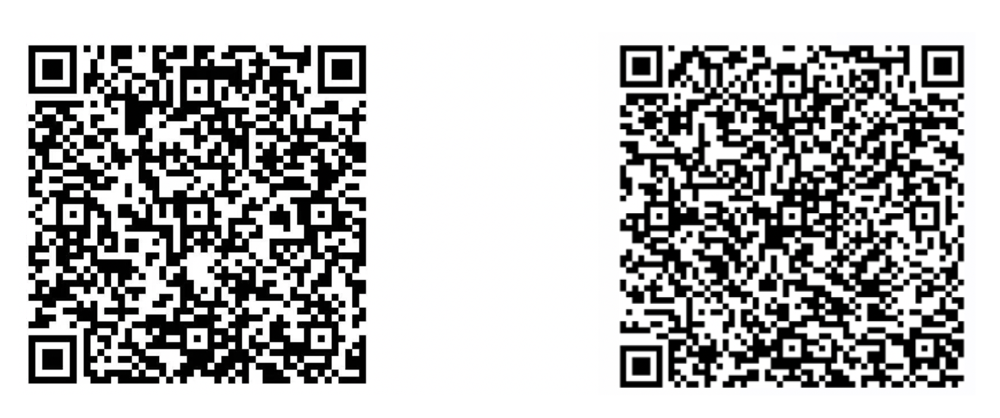

简体中文 | [English](README.md)

# PaddleSeg

[](https://travis-ci.org/PaddlePaddle/PaddleSeg)
[](LICENSE)
[](https://github.com/PaddlePaddle/PaddleSeg/releases)


 *[2021-06-19] PaddleSeg团队获得CVPR2021 AutoNUE语义分割赛道冠军! 已发布[演讲报告](https://bj.bcebos.com/paddleseg/docs/autonue21_presentation_PaddleSeg.pdf)。详细的技术报告和源码即将公布。*


PaddleSeg是基于飞桨[PaddlePaddle](https://www.paddlepaddle.org.cn)开发的端到端图像分割开发套件，涵盖了**高精度**和**轻量级**等不同方向的大量高质量分割模型。通过模块化的设计，提供了**配置化驱动**和**API调用**两种应用方式，帮助开发者更便捷地完成从训练到部署的全流程图像分割应用。

## 特性 


*  **高精度模型**：基于百度自研的[半监督标签知识蒸馏方案（SSLD）](https://paddleclas.readthedocs.io/zh_CN/latest/advanced_tutorials/distillation/distillation.html#ssld)训练得到高精度骨干网络，结合前沿的分割技术，提供了50+的高质量预训练模型，效果优于其他开源实现。

*  **模块化设计**：支持20+主流 *分割网络* ，结合模块化设计的 *数据增强策略* 、*骨干网络*、*损失函数* 等不同组件，开发者可以基于实际应用场景出发，组装多样化的训练配置，满足不同性能和精度的要求。

*  **高性能**：支持多进程异步I/O、多卡并行训练、评估等加速策略，结合飞桨核心框架的显存优化功能，可大幅度减少分割模型的训练开销，让开发者更低成本、更高效地完成图像分割训练。
* :heart:**您可以前往  [完整PaddleSeg在线使用文档目录](https://paddleseg.readthedocs.io)  获得更详细的说明文档**:heart:


## 技术交流 

* 如果你发现任何PaddleSeg存在的问题或者是建议, 欢迎通过[GitHub Issues](https://github.com/PaddlePaddle/PaddleSeg/issues)给我们提issues。
* 欢迎加入PaddleSeg微信群（左侧）和QQ群（右侧）
<div align="center">
  
</div>

## 模型库  

|模型\骨干网络|ResNet50|ResNet101|HRNetw18|HRNetw48|
|-|-|-|-|-|
|[ANN](./configs/ann)|✔|✔|||
|[BiSeNetv2](./configs/bisenet)|-|-|-|-|
|[DANet](./configs/danet)|✔|✔|||
|[Deeplabv3](./configs/deeplabv3)|✔|✔|||
|[Deeplabv3P](./configs/deeplabv3p)|✔|✔|||
|[Fast-SCNN](./configs/fastscnn)|-|-|-|-|
|[FCN](./configs/fcn)|||✔|✔|
|[GCNet](./configs/gcnet)|✔|✔|||
|[GSCNN](./configs/gscnn)|✔|✔|||
|[HarDNet](./configs/hardnet)|-|-|-|-|
|[OCRNet](./configs/ocrnet/)|||✔|✔|
|[PSPNet](./configs/pspnet)|✔|✔|||
|[U-Net](./configs/unet)|-|-|-|-|
|[U<sup>2</sup>-Net](./configs/u2net)|-|-|-|-|
|[Att U-Net](./configs/attention_unet)|-|-|-|-|
|[U-Net++](./configs/unet_plusplus)|-|-|-|-|
|[U-Net3+](./configs/unet_3plus)|-|-|-|-|
|[DecoupledSegNet](./configs/decoupled_segnet)|✔|✔|||
|[EMANet](./configs/emanet)|✔|✔|-|-|
|[ISANet](./configs/isanet)|✔|✔|-|-|
|[DNLNet](./configs/dnlnet)|✔|✔|-|-|
|[SFNet](./configs/sfnet)|✔|-|-|-|
|[ShuffleNetV2](./configs/shufflenetv2)|-|-|-|-|

## 使用教程 

* [安装](./docs/install.md)
* [全流程跑通PaddleSeg](./docs/quick_start.md)
*  数据处理
   * [数据格式说明](./docs/data/marker/marker_c.md)
   * [数据标注和转换](./docs/data/transform/transform_c.md)
   * [自定义数据集](./docs/data/custom/data_prepare.md)

*  PaddleSeg的设计思想
    * [配置文件详解](./docs/design/use/use.md)
    * [如何创造自己的模型](./docs/design/create/add_new_model.md)
* [模型训练](/docs/train/train.md)
* [模型评估](./docs/evaluation/evaluate/evaluate.md)
* [模型导出](./docs/export/export/model_export.md)

*  模型部署
    * [Inference](./docs/deployment/inference/inference.md)
    * [Lite](./docs/deployment/lite/lite.md)
    * [Serving](./docs/deployment/serving/serving.md)
    * [Web](./docs/deployment/web/web.md)
* [模型压缩](./docs/slim/slim/slim.md)
*  API使用教程
    * [API文档说明](./docs/apis)
    * [API应用案例](./docs/api_example.md)
*  重要模块说明
    * [数据增强](./docs/module/data/data.md)
    * [Loss说明](./docs/module/loss/lovasz_loss.md)
    * [Tricks](./docs/module/tricks/tricks.md)
* 经典模型说明
    * [DeeplabV3](./docs/models/deeplabv3.md)
    * [UNet](./docs/models/unet.md)
    * [OCRNet](./docs/models/ocrnet.md)
    * [Fast-SCNN](./docs/models/fascnn.md)
* [提交PR说明](./docs/pr/pr/pr.md)
* [FAQ](./docs/faq/faq/faq.md)

## 实践案例 

* [人像分割](https://github.com/PaddlePaddle/PaddleSeg/tree/release/2.1/contrib/HumanSeg)
* [医疗图像](./docs/solution/medical/medical.md)
* [遥感分割](https://github.com/PaddlePaddle/PaddleSeg/tree/release/2.1/contrib/remote_sensing)

## 代码贡献

* 非常感谢[jm12138](https://github.com/jm12138)贡献U<sup>2</sup>-Net模型。
* 非常感谢[zjhellofss](https://github.com/zjhellofss)（傅莘莘）贡献Attention U-Net模型，和Dice loss损失函数。
* 非常感谢[liuguoyu666](https://github.com/liguoyu666)贡献U-Net++模型。

## 学术引用 

如果我们的项目在学术上帮助到你，请考虑以下引用：

```latex
@misc{liu2021paddleseg,
      title={PaddleSeg: A High-Efficient Development Toolkit for Image Segmentation},
      author={Yi Liu and Lutao Chu and Guowei Chen and Zewu Wu and Zeyu Chen and Baohua Lai and Yuying Hao},
      year={2021},
      eprint={2101.06175},
      archivePrefix={arXiv},
      primaryClass={cs.CV}
}

@misc{paddleseg2019,
    title={PaddleSeg, End-to-end image segmentation kit based on PaddlePaddle},
    author={PaddlePaddle Authors},
    howpublished = {\url{https://github.com/PaddlePaddle/PaddleSeg}},
    year={2019}
}
```
