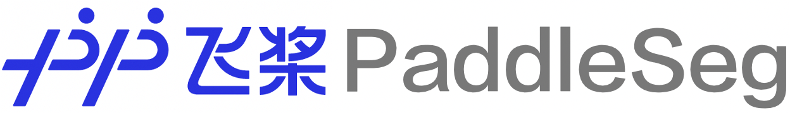

English | [简体中文](README_CN.md)

<div align="center">

<p align="center">
  
</p>

**A High-Efficient Development Toolkit for Image Segmentation based on [PaddlePaddle](https://github.com/paddlepaddle/paddle).**

[](LICENSE)
[](https://github.com/PaddlePaddle/PaddleSeg/releases)


</div>


<div align="center">
  
</div>

##  News
<ul class="nobull">
    <li>[2022-11-30] :fire: PaddleSeg v2.7 is released! More details in <a href="https://github.com/PaddlePaddle/PaddleSeg/releases">Release Notes</a>.</li>
    <ul>
        <li>Release <a href="./Matting/">PP-MattingV2</a>, a real-time human matting model with SOTA performance. Compared to previous models, the mean error is reduced by 17.91%, the inference speed is accelerated by 44.6% on GPU. </li>
        <li>Release <a href="./contrib/MedicalSeg/">MedicalSegV2</a>, a superior 3D medical image segmentation solution, including an intelligent annotation toolkit called EISeg-Med3D, several state-of-the-art models and an optimized nnUNet-D with high performance.</li>
        <li>Release <a href="./configs/rtformer/">RTFormer</a>, a real-time semantic segmentation model accepted by NeurIPS 2022. RTFormer combines the advantages of CNN and Transformer modules, and it achieves SOTA trade-off between performance and efficiency on several datasets.</li>
    </ul>
  <li>[2022-07-20] PaddleSeg v2.6 released a real-time human segmentation SOTA solution <a href="./contrib/PP-HumanSeg">PP-HumanSegV2</a>,  a stable-version semi-automatic segmentation annotation <a href="./EISeg">EISeg v1.0</a>, a pseudo label pre-training method PSSL and the source code of PP-MattingV1. </li>
  <li>[2022-04-20] PaddleSeg v2.5 released a real-time semantic segmentation model <a href="./configs/pp_liteseg">PP-LiteSeg</a>, a trimap-free image matting model PP-MattingV1, and an easy-to-use solution for 3D medical image segmentation MedicalSegV1.</li>
  <li>[2022-01-20] We release PaddleSeg v2.4 with EISeg v0.4, and PP-HumanSegV1 including open-sourced dataset <a href="./contrib/PP-HumanSeg/paper.md#pp-humanseg14k-a-large-scale-teleconferencing-video-dataset">PP-HumanSeg14K</a>. </li>

</ul>


##  Introduction

PaddleSeg is an end-to-end high-efficent development toolkit for image segmentation based on PaddlePaddle, which  helps both developers and researchers in the whole process of designing segmentation models, training models, optimizing performance and inference speed, and deploying models. A lot of well-trained models and various real-world applications in both industry and academia help users conveniently build hands-on experiences in image segmentation.

<div align="center">
  
</div>


##  Features

* **High-Performance Model**: Following the state of the art segmentation methods and use the high-performance backbone, we provide 40+ models and 140+ high-quality pre-training models, which are better than other open-source implementations.

* **High Efficiency**: PaddleSeg provides multi-process asynchronous I/O, multi-card parallel training, evaluation, and other acceleration strategies, combined with the memory optimization function of the PaddlePaddle, which can greatly reduce the training overhead of the segmentation model, all this allowing developers to lower cost and more efficiently train image segmentation model.

* **Modular Design**: We desigin PaddleSeg with the modular design philosophy. Therefore, based on actual application scenarios, developers can assemble diversified training configurations with *data enhancement strategies*, *segmentation models*, *backbone networks*, *loss functions* and other different components to meet different performance and accuracy requirements.

* **Complete Flow**: PaddleSeg support image labeling, model designing, model training, model compression and model deployment. With the help of PaddleSeg, developers can easily finish all taskes.

<div align="center">
  
</div>

##  Community

* If you have any questions, suggestions and feature requests, please create an issues in [GitHub Issues](https://github.com/PaddlePaddle/PaddleSeg/issues).
* Welcome to scan the following QR code and join paddleseg wechat group to communicate with us.
<div align="center">
  
</div>


##  Overview

<table align="center">
  <tbody>
    <tr align="center" valign="bottom">
      <td>
        <b>Models</b>
      </td>
      <td colspan="2">
        <b>Components</b>
      </td>
      <td>
        <b>Special Cases</b>
      </td>
    </tr>
    <tr valign="top">
      <td>
        <ul>
        <details><summary><b>Semantic Segmentation</b></summary>
          <ul>
 <li><a href="./configs/pp_liteseg">PP-LiteSeg</a> </li>
            <li><a href="./configs/deeplabv3p">DeepLabV3P</a> </li>
            <li><a href="./configs/ocrnet">OCRNet</a> </li>
            <li><a href="./configs/mobileseg">MobileSeg</a> </li>
            <li><a href="./configs/ann">ANN</a></li>
            <li><a href="./configs/attention_unet">Att U-Net</a></li>
            <li><a href="./configs/bisenetv1">BiSeNetV1</a></li>
            <li><a href="./configs/bisenet">BiSeNetV2</a></li>
            <li><a href="./configs/ccnet">CCNet</a></li>
            <li><a href="./configs/danet">DANet</a></li>
            <li><a href="./configs/ddrnet">DDRNet</a></li>
            <li><a href="./configs/decoupled_segnet">DecoupledSeg</a></li>
            <li><a href="./configs/deeplabv3">DeepLabV3</a></li>
            <li><a href="./configs/dmnet">DMNet</a></li>
            <li><a href="./configs/dnlnet">DNLNet</a></li>
            <li><a href="./configs/emanet">EMANet</a></li>
            <li><a href="./configs/encnet">ENCNet</a></li>
            <li><a href="./configs/enet">ENet</a></li>
            <li><a href="./configs/espnetv1">ESPNetV1</a></li>
            <li><a href="./configs/espnet">ESPNetV2</a></li>
            <li><a href="./configs/fastfcn">FastFCN</a></li>
            <li><a href="./configs/fastscnn">Fast-SCNN</a></li>
            <li><a href="./configs/gcnet">GCNet</a></li>
            <li><a href="./configs/ginet">GINet</a></li>
            <li><a href="./configs/glore">GloRe</a></li>
            <li><a href="./configs/gscnn">GSCNN</a></li>
            <li><a href="./configs/hardnet">HarDNet</a></li>
            <li><a href="./configs/fcn">HRNet-FCN</a></li>
            <li><a href="./configs/hrnet_w48_contrast">HRNet-Contrast</a></li>
            <li><a href="./configs/isanet">ISANet</a></li>
            <li><a href="./configs/pfpn">PFPNNet</a></li>
            <li><a href="./configs/pointrend">PointRend</a></li>
            <li><a href="./configs/portraitnet">PotraitNet</a></li>
            <li><a href="./configs/pp_humanseg_lite">PP-HumanSeg-Lite</a></li>
            <li><a href="./configs/pspnet">PSPNet</a></li>
            <li><a href="./configs/pssl">PSSL</a></li>
            <li><a href="./configs/segformer">SegFormer</a></li>
            <li><a href="./configs/segmenter">SegMenter</a></li>
            <li><a href="./configs/segmne">SegNet</a></li>
            <li><a href="./configs/setr">SETR</a></li>
            <li><a href="./configs/sfnet">SFNet</a></li>
            <li><a href="./configs/stdcseg">STDCSeg</a></li>
            <li><a href="./configs/u2net">U<sup>2</sup>Net</a></li>
            <li><a href="./configs/unet">UNet</a></li>
            <li><a href="./configs/unet_plusplus">UNet++</a></li>
            <li><a href="./configs/unet_3plus">UNet3+</a></li>
            <li><a href="./configs/upernet">UperNet</a></li>
            <li><a href="./configs/rtformer">RTFormer</a></li>
            <li><a href="./configs/uhrnet">UHRNet</a></li>
            <li><a href="./configs/topformer">TopFormer</a></li>
            <li><a href="./configs/mscale_ocrnet">MscaleOCRNet-PSA</a></li>
          </ul>
        </details>
        <details><summary><b>Interactive Segmentation</b></summary>
          <ul>
            <li><a href="./EISeg">EISeg</a></li>
            <li>RITM</li>
            <li>EdgeFlow</li>
          </ul>
        </details>
        <details><summary><b>Image Matting</b></summary>
          <ul>
              <li><a href="./Matting/configs/ppmattingv2">PP-MattingV2</a></li>
              <li><a href="./Matting/configs/ppmatting">PP-MattingV1</a></li>
              <li><a href="./Matting/configs/dim/dim-vgg16.yml">DIM</a></li>
              <li><a href="./Matting/configs/modnet/modnet-hrnet_w18.yml">MODNet</a></li>
              <li><a href="./Matting/configs/human_matting/human_matting-resnet34_vd.yml">PP-HumanMatting</a></li>
          </ul>
        </details>
        <details><summary><b>Panoptic Segmentation</b></summary>
          <ul>
            <li><a href="./contrib/PanopticDeepLab/README_CN.md">Panoptic-DeepLab</a></li>
          </ul>
        </details>
      </td>
      <td>
        <details><summary><b>Backbones</b></summary>
          <ul>
            <li><a href="./paddleseg/models/backbones/hrnet.py">HRNet</a></li>
            <li><a href="./paddleseg/models/backbones/resnet_cd.py">ResNet</a></li>
            <li><a href="./paddleseg/models/backbones/stdcnet.py">STDCNet</a></li>
            <li><a href="./paddleseg/models/backbones/mobilenetv2.py">MobileNetV2</a></li>
            <li><a href="./paddleseg/models/backbones/mobilenetv3.py">MobileNetV3</a></li>
            <li><a href="./paddleseg/models/backbones/shufflenetv2.py">ShuffleNetV2</a></li>
            <li><a href="./paddleseg/models/backbones/ghostnet.py">GhostNet</a></li>
            <li><a href="./paddleseg/models/backbones/lite_hrnet.py">LiteHRNet</a></li>
            <li><a href="./paddleseg/models/backbones/xception_deeplab.py">XCeption</a></li>
            <li><a href="./paddleseg/models/backbones/vision_transformer.py">VIT</a></li>
            <li><a href="./paddleseg/models/backbones/mix_transformer.py">MixVIT</a></li>
            <li><a href="./paddleseg/models/backbones/swin_transformer.py">Swin Transformer</a></li>
          </ul>
        </details>
        <details><summary><b>Losses</b></summary>
          <ul>
            <li><a href="./paddleseg/models/losses/binary_cross_entropy_loss.py">Binary CE Loss</a></li>
            <li><a href="./paddleseg/models/losses/bootstrapped_cross_entropy_loss.py">Bootstrapped CE Loss</a></li>
            <li><a href="./paddleseg/models/losses/cross_entropy_loss.py">Cross Entropy Loss</a></li>
            <li><a href="./paddleseg/models/losses/decoupledsegnet_relax_boundary_loss.py">Relax Boundary Loss</a></li>
            <li><a href="./paddleseg/models/losses/detail_aggregate_loss.py">Detail Aggregate Loss</a></li>
            <li><a href="./paddleseg/models/losses/dice_loss.py">Dice Loss</a></li>
            <li><a href="./paddleseg/models/losses/edge_attention_loss.py">Edge Attention Loss</a></li>
            <li><a href="./paddleseg/models/losses/focal_loss.py">Focal Loss</a></li>
            <li><a href="./paddleseg/models/losses/binary_cross_entropy_loss.py">MultiClassFocal Loss</a></li>
            <li><a href="./paddleseg/models/losses/gscnn_dual_task_loss.py">GSCNN Dual Task Loss</a></li>
            <li><a href="./paddleseg/models/losses/kl_loss.py">KL Loss</a></li>
            <li><a href="./paddleseg/models/losses/l1_loss.py">L1 Loss</a></li>
            <li><a href="./paddleseg/models/losses/lovasz_loss.py">Lovasz Loss</a></li>
            <li><a href="./paddleseg/models/losses/mean_square_error_loss.py">MSE Loss</a></li>
            <li><a href="./paddleseg/models/losses/ohem_cross_entropy_loss.py">OHEM CE Loss</a></li>
            <li><a href="./paddleseg/models/losses/pixel_contrast_cross_entropy_loss.py">Pixel Contrast CE Loss</a></li>
            <li><a href="./paddleseg/models/losses/point_cross_entropy_loss.py">Point CE Loss</a></li>
            <li><a href="./paddleseg/models/losses/rmi_loss.py">RMI Loss</a></li>
            <li><a href="./paddleseg/models/losses/semantic_connectivity_loss.py">Connectivity Loss</a></li>
          </ul>
        </details>
        <details><summary><b>Metrics</b></summary>
          <ul>
            <li>mIoU</li>
            <li>Accuracy</li>
            <li>Kappa</li>
            <li>Dice</li>
            <li>AUC_ROC</li>
          </ul>  
        </details>
      </td>
      <td>
        <details><summary><b>Datasets</b></summary>
          <ul>
            <li><a href="./paddleseg/datasets/ade.py">ADE20K</a></li>  
            <li><a href="./paddleseg/datasets/cityscapes.py">Cityscapes</a></li>
            <li><a href="./paddleseg/datasets/cocostuff.py">COCO Stuff</a></li>
            <li><a href="./paddleseg/datasets/voc.py">Pascal VOC</a></li>
            <li><a href="./paddleseg/datasets/eg1800.py">EG1800</a></li>
            <li><a href="./paddleseg/datasets/pascal_context.py">Pascal Context</a></li>  
            <li><a href="./paddleseg/datasets/supervisely.py">SUPERVISELY</a></li>
            <li><a href="./paddleseg/datasets/optic_disc_seg.py">OPTIC DISC SEG</a></li>
            <li><a href="./paddleseg/datasets/chase_db1.py">CHASE_DB1</a></li>
            <li><a href="./paddleseg/datasets/hrf.py">HRF</a></li>
            <li><a href="./paddleseg/datasets/drive.py">DRIVE</a></li>
            <li><a href="./paddleseg/datasets/stare.py">STARE</a></li>
            <li><a href="./paddleseg/datasets/pp_humanseg14k.py">PP-HumanSeg14K</a></li>
            <li><a href="./paddleseg/datasets/pssl.py">PSSL</a></li>
          </ul>
        </details>
        <details><summary><b>Data Augmentation</b></summary>
          <ul>
            <li>Flipping</li>  
            <li>Resize</li>  
            <li>ResizeByLong</li>
            <li>ResizeByShort</li>
            <li>LimitLong</li>  
            <li>ResizeRangeScaling</li>  
            <li>ResizeStepScaling</li>
            <li>Normalize</li>
            <li>Padding</li>
            <li>PaddingByAspectRatio</li>
            <li>RandomPaddingCrop</li>  
            <li>RandomCenterCrop</li>
            <li>ScalePadding</li>
            <li>RandomNoise</li>  
            <li>RandomBlur</li>  
            <li>RandomRotation</li>  
            <li>RandomScaleAspect</li>  
            <li>RandomDistort</li>  
            <li>RandomAffine</li>  
          </ul>
        </details>
      </td>
      <td>
        <details><summary><b>Model Selection Tool</b></summary>
          <ul>
              <li><a href="./configs/smrt">PaddleSMRT</a></li>
          </ul>
        </details>
        <details><summary><b>Human Segmentation</b></summary>
          <ul>
              <li><a href="./contrib/PP-HumanSeg/README_cn.md">PP-HumanSegV1</a></li>
              <li><a href="./contrib/PP-HumanSeg/README_cn.md">PP-HumanSegV2</a></li>
          </ul>
        </details>
        <details><summary><b>MedicalSeg</b></summary>
          <ul>
            <li><a href="./contrib/MedicalSeg/configs/lung_coronavirus">VNet</a></li>
            <li><a href="./contrib/MedicalSeg/configs/msd_brain_seg">UNETR</a></li>
            <li><a href="./contrib/MedicalSeg/configs/acdc">nnFormer</a></li>
            <li><a href="./contrib/MedicalSeg/configs/nnunet/msd_lung">nnUNet-D</a></li>
            <li><a href="./contrib/MedicalSeg/configs/synapse">TransUNet</a></li>
            <li><a href="./contrib/MedicalSeg/configs/synapse">SwinUNet</a></li>
          </ul>
        </details>
        <details><summary><b>Cityscapes SOTA Model</b></summary>
          <ul>
              <li><a href="./contrib/CityscapesSOTA">HMSA</a></li>
          </ul>
        </details>
        <details><summary><b>CVPR Champion Model</b></summary>
          <ul>
              <li><a href="./contrib/AutoNUE">MLA Transformer</a></li>
          </ul>
        </details>
        <details><summary><b>Domain Adaptation</b></summary>
          <ul>
              <li><a href="./contrib/DomainAdaptation">PixMatch</a></li>
          </ul>
        </details>
      </td>  
    </tr>
</td>
    </tr>
  </tbody>
</table>


##  Industrial Segmentation Models

<details>
<summary><b>High Accuracy Semantic Segmentation Models</b></summary>

#### These models have good performance and costly inference time, so they are designed for GPU and Jetson devices.

| Model    | Backbone | Cityscapes mIoU(%)    |  V100 TRT Inference Speed(FPS)  |  Config File |
|:-------- |:--------:|:---------------------:|:-------------------------------:|:------------:|
| FCN            | HRNet_W18        | 78.97                 | 24.43     | [yml](./configs/fcn/)         |
| FCN            | HRNet_W48        | 80.70                 | 10.16     | [yml](./configs/fcn/)         |
| DeepLabV3      | ResNet50_OS8     | 79.90                 | 4.56      | [yml](./configs/deeplabv3/)   |
| DeepLabV3      | ResNet101_OS8    | 80.85                 | 3.2       | [yml](./configs/deeplabv3/)   |
| DeepLabV3      | ResNet50_OS8     | 80.36                 | 6.58      | [yml](./configs/deeplabv3p/)  |
| DeepLabV3      | ResNet101_OS8    | 81.10                 | *3.94*    | [yml](./configs/deeplabv3p/)  |
| OCRNet :star2:      | HRNet_w18        | 80.67                 | 13.26     | [yml](./configs/ocrnet/)      |
| OCRNet         | HRNet_w48        | 82.15                 | 6.17      | [yml](./configs/ocrnet/)      |
| CCNet          | ResNet101_OS8    | 80.95                 | 3.24      | [yml](./configs/ccnet/)       |

Note that:
* Test the inference speed on Nvidia GPU V100: use PaddleInference Python API, enable TensorRT, the data type is FP32, the dimension of input is 1x3x1024x2048.

</details>


<details>
<summary><b>Lightweight Semantic Segmentation Models</b></summary>

#### The segmentation accuracy and inference speed of these models are medium. They can be deployed on GPU, X86 CPU and ARM CPU.

| Model    | Backbone | Cityscapes mIoU(%)    |  V100 TRT Inference Speed(FPS)  | Snapdragon 855 Inference Speed(FPS) | Config File |
|:-------- |:--------:|:---------------------:|:-------------------------------:|:-----------------:|:--------:|
| PP-LiteSeg :star2:      | STDC1         | 77.04               | 69.82           | 17.22       | [yml](./configs/pp_liteseg/)  |
| PP-LiteSeg :star2:      | STDC2         | 79.04               | 54.53           | 11.75       | [yml](./configs/pp_liteseg/)  |
| BiSeNetV1           | -             | 75.19               | 14.67           | 1.53      |[yml](./configs/bisenetv1/)  |
| BiSeNetV2           | -             | 73.19               | 61.83           | 13.67       |[yml](./configs/bisenet/)  |
| STDCSeg             | STDC1         | 74.74               | 62.24           | 14.51       |[yml](./configs/stdcseg/)  |
| STDCSeg             | STDC2         | 77.60               | 51.15           | 10.95       |[yml](./configs/stdcseg/)  |
| DDRNet_23           | -             | 79.85               | 42.64           | 7.68      |[yml](./configs/ddrnet/)  |
| HarDNet             | -             | 79.03               | 30.3            | 5.44      |[yml](./configs/hardnet/)  |
| SFNet               | ResNet18_OS8  |  78.72              | *10.72*         |   -         | [yml](./configs/sfnet/)  |

Note that:
* Test the inference speed on Nvidia GPU V100: use PaddleInference Python API, enable TensorRT, the data type is FP32, the dimension of input is 1x3x1024x2048.
* Test the inference speed on Snapdragon 855: use PaddleLite CPP API, 1 thread, the dimension of input is 1x3x256x256.

</details>


<details>
<summary><b>Super Lightweight Semantic Segmentation Models</b></summary>

#### These super lightweight semantic segmentation models are designed for X86 CPU and ARM CPU.

| Model    | Backbone | Cityscapes mIoU(%)    |  V100 TRT Inference Speed(FPS)  | Snapdragon 855 Inference Speed(FPS) | Config File |
|:-------- |:--------:|:---------------------:|:-------------------------------:|:-----------------------------------:|:-----------:|
| MobileSeg      | MobileNetV2              | 73.94                 | 67.57          | 27.01   | [yml](./configs/mobileseg/)  |
| MobileSeg :star2:  | MobileNetV3              | 73.47                 | 67.39          | 32.90   | [yml](./configs/mobileseg/)  |
| MobileSeg      | Lite_HRNet_18            | 70.75                 | *10.5*         | 13.05   | [yml](./configs/mobileseg/)  |
| MobileSeg      | ShuffleNetV2_x1_0        | 69.46                 | *37.09*        | 39.61  | [yml](./configs/mobileseg/)  |
| MobileSeg      | GhostNet_x1_0            | 71.88                 | *35.58*        | 38.74  | [yml](./configs/mobileseg/)  |

Note that:
* Test the inference speed on Nvidia GPU V100: use PaddleInference Python API, enable TensorRT, the data type is FP32, the dimension of input is 1x3x1024x2048.
* Test the inference speed on Snapdragon 855: use PaddleLite CPP API, 1 thread, the dimension of input is 1x3x256x256.

</details>


##  Tutorials

**Introductory Tutorials**

* [Installation](./docs/install.md)
* [Quick Start](./docs/quick_start.md)
* [A 20 minutes Blitz to Learn PaddleSeg](./docs/whole_process.md)
* [Model Zoo](./docs/model_zoo_overview.md)

**Basic Tutorials**

* Data Preparation
    * [Prepare Public Dataset](./docs/data/pre_data.md)
    * [Prepare Customized Dataset](./docs/data/marker/marker.md)
    * [Label Data with EISeg](./EISeg)
* [Config Preparation](./docs/config/pre_config.md)
* [Model Training](/docs/train/train.md)
* [Model Evaluation](./docs/evaluation/evaluate.md)
* [Model Prediction](./docs/predict/predict.md)

* Model Export
    * [Export Inference Model](./docs/model_export.md)
    * [Export ONNX Model](./docs/model_export_onnx.md)

* Model Deploy
    * [Paddle Inference (Python)](./docs/deployment/inference/python_inference.md)
    * [Paddle Inference (C++)](./docs/deployment/inference/cpp_inference.md)
    * [Paddle Lite](./docs/deployment/lite/lite.md)
    * [Paddle Serving](./docs/deployment/serving/serving.md)
    * [Paddle JS](./docs/deployment/web/web.md)
    * [Benchmark](./docs/deployment/inference/infer_benchmark.md)

**Advanced Tutorials**

* [Training Tricks](./docs/train/train_tricks.md)

*  Model Compression
    * [Quantization](./docs/deployment/slim/quant/quant.md)
    * [Distillation](./docs/deployment/slim/distill/distill.md)
    * [Prune](./docs/deployment/slim/prune/prune.md)

* [FAQ](./docs/faq/faq/faq.md)

**Welcome to Contribute**

* [API Documention](./docs/apis)

*  Advanced Development
    * [Detailed Configuration File](./docs/design/use/use.md)
    * [Create Your Own Model](./docs/design/create/add_new_model.md)
*  Pull Request
    * [PR Tutorial](./docs/pr/pr/pr.md)
    * [PR Style](./docs/pr/pr/style.md)

##  Special Features
  * [Interactive Segmentation](./EISeg)
  * [Image Matting](./Matting)
  * [PP-HumanSeg](./contrib/PP-HumanSeg)
  * [3D Medical Segmentation](./contrib/MedicalSeg)
  * [Cityscapes SOTA](./contrib/CityscapesSOTA)
  * [Panoptic Segmentation](./contrib/PanopticDeepLab)
  * [CVPR Champion Solution](./contrib/AutoNUE)
  * [Domain Adaptation](./contrib/DomainAdaptation)

##  Industrial Tutorial Examples

* [Using PP-HumanSegV2 for Human Segmentation](https://aistudio.baidu.com/aistudio/projectdetail/4504982?contributionType=1)
* [Using PP-HumanSegV1 for Human Segmentation](https://aistudio.baidu.com/aistudio/projectdetail/2189481?channelType=0&channel=0)
* [Using PP-LiteSeg for Road Segmentation](https://aistudio.baidu.com/aistudio/projectdetail/3873145?contributionType=1)
* [Using PaddleSeg for Mini-dataset Spine Segmentation](https://aistudio.baidu.com/aistudio/projectdetail/3878920)
* [Using PaddleSeg for Lane Segmentation](https://aistudio.baidu.com/aistudio/projectdetail/1752986?channelType=0&channel=0)
* [PaddleSeg in APIs](https://aistudio.baidu.com/aistudio/projectdetail/1339458?channelType=0&channel=0)
* [Learn Paddleseg in 10 Mins](https://aistudio.baidu.com/aistudio/projectdetail/1672610?channelType=0&channel=0)

## License

PaddleSeg is released under the [Apache 2.0 license](LICENSE).

## Acknowledgement
* Thanks [jm12138](https://github.com/jm12138) for contributing U<sup>2</sup>-Net.
* Thanks [zjhellofss](https://github.com/zjhellofss) (Fu Shenshen) for contributing Attention U-Net, and Dice Loss.
* Thanks [liuguoyu666](https://github.com/liguoyu666), [geoyee](https://github.com/geoyee) for contributing U-Net++ and U-Net3+.
* Thanks [yazheng0307](https://github.com/yazheng0307) (LIU Zheng) for contributing quick-start document.
* Thanks [CuberrChen](https://github.com/CuberrChen) for contributing STDC(rethink BiSeNet), PointRend and DetailAggregateLoss.
* Thanks [stuartchen1949](https://github.com/stuartchen1949) for contributing SegNet.
* Thanks [justld](https://github.com/justld) (Lang Du) for contributing UPerNet, DDRNet, CCNet, ESPNetV2, DMNet, ENCNet, HRNet_W48_Contrast, FastFCN, BiSeNetV1, SECrossEntropyLoss and PixelContrastCrossEntropyLoss.
* Thanks [Herman-Hu-saber](https://github.com/Herman-Hu-saber) (Hu Huiming) for contributing ESPNetV2.
* Thanks [zhangjin12138](https://github.com/zhangjin12138) for contributing RandomCenterCrop.
* Thanks [simuler](https://github.com/simuler) for contributing ESPNetV1.
* Thanks [ETTR123](https://github.com/ETTR123)(Zhang Kai) for contributing ENet, PFPNNet.

## Citation
If you find our project useful in your research, please consider citing:

```latex
@misc{liu2021paddleseg,
      title={PaddleSeg: A High-Efficient Development Toolkit for Image Segmentation},
      author={Yi Liu and Lutao Chu and Guowei Chen and Zewu Wu and Zeyu Chen and Baohua Lai and Yuying Hao},
      year={2021},
      eprint={2101.06175},
      archivePrefix={arXiv},
      primaryClass={cs.CV}
}

@misc{paddleseg2019,
    title={PaddleSeg, End-to-end image segmentation kit based on PaddlePaddle},
    author={PaddlePaddle Contributors},
    howpublished = {\url{https://github.com/PaddlePaddle/PaddleSeg}},
    year={2019}
}
```
