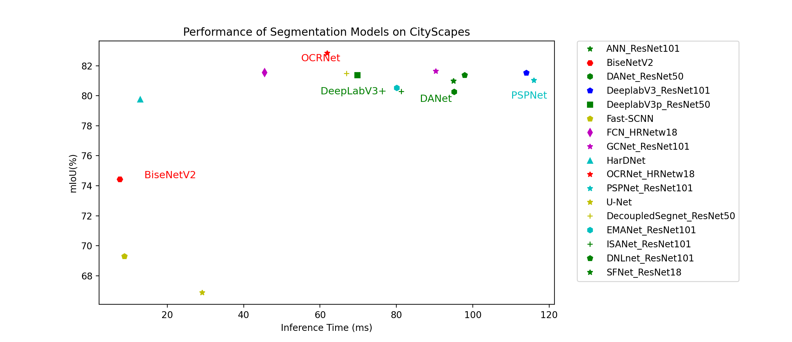

# 模型库

### CNN系列

|模型\骨干网络|ResNet50|ResNet101|HRNetw18|HRNetw48|
|-|-|-|-|-|
|[ANN](./ann)|✔|✔|||
|[BiSeNetv2](./bisenet)|-|-|-|-|
|[DANet](./danet)|✔|✔|||
|[Deeplabv3](./deeplabv3)|✔|✔|||
|[Deeplabv3P](./deeplabv3p)|✔|✔|||
|[Fast-SCNN](./fastscnn)|-|-|-|-|
|[FCN](./fcn)|||✔|✔|
|[GCNet](./gcnet)|✔|✔|||
|[GSCNN](./gscnn)|✔|✔|||
|[HarDNet](./hardnet)|-|-|-|-|
|[OCRNet](./ocrnet/)|||✔|✔|
|[PSPNet](./pspnet)|✔|✔|||
|[U-Net](./unet)|-|-|-|-|
|[U2-Net](./u2net)|-|-|-|-|
|[Att U-Net](./attention_unet)|-|-|-|-|
|[U-Net++](./unet_plusplus)|-|-|-|-|
|[U-Net3+](./unet_3plus)|-|-|-|-|
|[DecoupledSegNet](./decoupled_segnet)|✔|✔|||
|[EMANet](./emanet)|✔|✔|-|-|
|[ISANet](./isanet)|✔|✔|-|-|
|[DNLNet](./dnlnet)|✔|✔|-|-|
|[SFNet](./sfnet)|✔|-|-|-|
|[PP-HumanSeg-Lite](./pp_humanseg_lite)|-|-|-|-|
|[PortraitNet](./portraitnet)|-|-|-|-|
|[STDC](./stdcseg)|-|-|-|-|
|[GINet](./ginet)|✔|✔|-|-|
|[PointRend](./pointrend)|✔|✔|-|-|
|[SegNet](./segnet)|-|-|-|-|

### Transformer系列
* [SETR](./setr)
* [MLATransformer](../contrib/AutoNUE/configs)
* [SegFormer](./segformer)

# 模型说明

  

# 模型性能参数

|Model|Backbone|mIoU|Flops(G)|Params(M)|Inference Time(ms)|Preprocess Time(ms)|Postprocess Time(ms)
|-|-|-|-|-|-|-|-|-|-|
|ANN|ResNet101|79.50%|94.91|143.35|0.013
|BiSeNetv2|-|73.19%|16.00|167.45|0.013
|DANet|ResNet50|80.27%|95.08|134.78|0.015
|Deeplabv3|ResNet101_OS8|80.85%|114|141.65|0.014
|Deeplabv3P|ResNet50_OS8|81.10%|69.78|147.24|0.016
|Fast-SCNN|-|69.31%|10.43|161.52|0.012
|FCN|HRNet_W48|80.70%|45.46|130.58|0.012
|GCNet|ResNet101_OS8|81.01%|90.28|119.38|0.013
|GSCNN|ResNet50_OS8|80.67%|-|-|-
|HarDNet|-|79.03%|21.19|164.36|0.013
|OCRNet|HRNet_W48|82.15%|61.88|138.48|0.014
|PSPNet|ResNet101_OS8|80.48%|115.93|115.94|0.012
|U-Net|-|65.00%|29.11|137.75|0.012
|DecoupledSegNet|ResNet50_OS8|81.26%|66.89|136.28|0.013
|EMANet|ResNet101_OS8|80.00%|80.05|140.47|0.013
|ISANet|ResNet101_OS8|80.10%|91.72|129.12|0.012
|DNLNet|ResNet101_OS8|81.03%|97.81|138.95|0.014
|SFNet|ResNet50_OS8|81.49%|121.35|160.45|0.013

- 以上性能参数均在Tesla V100 16GB下得到。
- 该表展示了PaddleSeg所实现的分割模型在取得最高分类精度的配置下的一些评价参数。
- 推理时间是使用CityScapes数据集中的图像进行100次预测取平均值的结果，batch size=1。

# 配置项

----
### train_dataset
>  训练数据集
>
>  * 参数
>     * type : 数据集类型，所支持值请参考训练配置文件
>     * **others** : 请参考对应模型训练配置文件

----
### val_dataset
>  评估数据集
>  * 参数
>     * type : 数据集类型，所支持值请参考训练配置文件
>     * **others** : 请参考对应模型训练配置文件
>

----
### batch_size
>  单张卡上，每步迭代训练时的数据量

----
### iters
>  训练步数

----
### optimizer
> 训练优化器
>  * 参数
>     * type : 优化器类型，支持目前Paddle官方所有优化器
>     * weight_decay : L2正则化的值
>     * **others** : 请参考[Paddle官方Optimizer文档](https://www.paddlepaddle.org.cn/documentation/docs/zh/api/paddle/optimizer/Overview_cn.html)

----
### lr_scheduler
> 学习率
>  * 参数
>     * type : 学习率类型，支持10种策略，分别是'PolynomialDecay', 'PiecewiseDecay', 'StepDecay', 'CosineAnnealingDecay', 'ExponentialDecay', 'InverseTimeDecay', 'LinearWarmup', 'MultiStepDecay', 'NaturalExpDecay', 'NoamDecay'.
>     * **others** : 请参考[Paddle官方LRScheduler文档](https://www.paddlepaddle.org.cn/documentation/docs/zh/api/paddle/optimizer/lr/LRScheduler_cn.html)

----
### learning_rate（不推荐使用该配置，将来会被废弃，建议使用`lr_scheduler`代替）
> 学习率
>  * 参数
>     * value : 初始学习率
>     * decay : 衰减配置
>       * type : 衰减类型，目前只支持poly
>       * power : 衰减率
>       * end_lr : 最终学习率

----
### loss
> 损失函数
>  * 参数
>     * types : 损失函数列表
>       * type : 损失函数类型，所支持值请参考损失函数库
>       * ignore_index : 训练过程需要忽略的类别，默认取值与`train_dataset`的ignore_index一致，**推荐不用设置此项**。如果设置了此项，`loss`和`train_dataset`的ignore_index必须相同。
>     * coef : 对应损失函数列表的系数列表

----
### model
> 待训练模型
>  * 参数
>     * type : 模型类型，所支持值请参考模型库
>     * **others** : 请参考对应模型训练配置文件
---
### export
> 模型导出配置
>  * 参数
>    * transforms : 预测时的预处理操作，支持配置的transforms与`train_dataset`、`val_dataset`等相同。如果不填写该项，默认只会对数据进行归一化标准化操作。

具体配置文件说明请参照[配置文件详解](../docs/design/use/use_cn.md)
