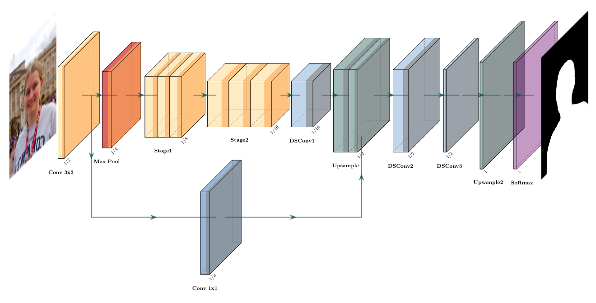

# PP-HumanSeg-Lite

A self-developed ultra lightweight model ConnectNet, is suitable for real-time segmentation scenarios on the web or mobile. See [paper](https://arxiv.org/abs/2112.07146) for more information.

## Network Structure

## Performance
Refer to [PP-HumanSeg](../../contrib/PP-HumanSeg).
