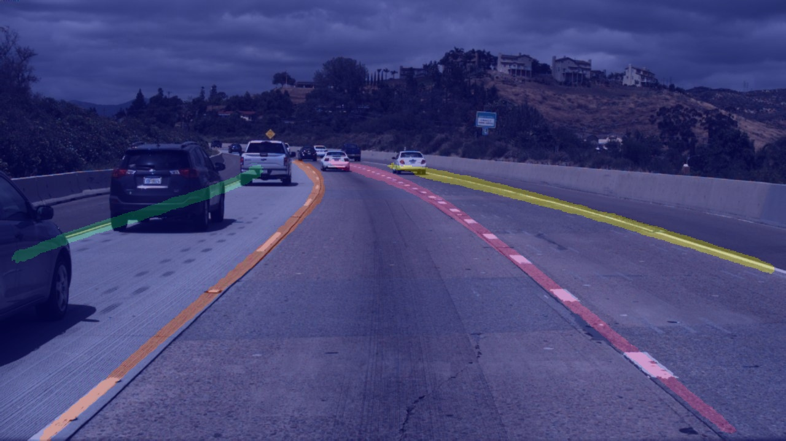

English | [简体中文](README_CN.md)

# LaneSeg
Lane detection is a category of automatic driving algorithms, which can be used to assist vehicle positioning and decision-making. In the early days, there were lane detection methods based on traditional image processing, but with the evolution of technology, the scenes that lane detection tasks deal with are more and more diversified, and more methods are currently seeking to detect the location of lane semantically. This project mainly uses PaddleSeg for lane detection.

## Contents
- [Installation](#Installation)
- [Models](#Models)
- [Dataset Preparation](#Dataset-Preparation)
- [Training, Evaluation and Prediction](#Training-Evaluation-and-Prediction)
- [Export and Deploy](#Export-and-Deploy)

## Installation

#### 1. Install PaddlePaddle

Versions

* PaddlePaddle >= 2.0.2

* Python >= 3.7+

Due to the high computational cost of model, PaddleSeg is recommended for GPU version PaddlePaddle. CUDA 10.0 or later is recommended. See [PaddlePaddle official website](https://www.paddlepaddle.org.cn/install/quick?docurl=/documentation/docs/zh/install/pip/linux-pip.html) for the installation tutorial.

#### 2. Download the PaddleSeg repository

```shell
git clone https://github.com/PaddlePaddle/PaddleSeg
```

#### 3. Installation

```shell
cd PaddleSeg
pip install scikit-learn
pip install opencv-python
pip install scikit-image
pip install -e .
cd contrib/LaneSeg
```

## Models

The evaluation is base on TuSimple challenge evaluation method. You can get more information from [TuSimple example](https://github.com/TuSimple/tusimple-benchmark/blob/master/example/lane_demo.ipynb)

Lane detection model performance on Tusimple.

| Method | Acc | FN | FP | Link|
|-|-|-|-|-|
|BiseNetV2|96.38%|0.04545|0.03363|[model](https://paddleseg.bj.bcebos.com/lane_seg/bisenet/model.pdparams)|
|FastScnn|96.04% |0.04909|0.04058|[model](https://paddleseg.bj.bcebos.com/lane_seg/fastscnn/model.pdparams)|

Note: The model input size is (640, 368) and the GPU is Tesla V100 32G.

## Dataset preparation

Using Tusimple's open source [Tusimple](https://github.com/TuSimple/tusimple-benchmark/issues/3) dataset as our demo dataset for the tutorial. Baidu Yun [download](https://pan.baidu.com/s/1RuDUne5CpaNxVLVLmpEg-w), code: 9568. we should download train_set.zip, test_set.zip, test_label.json, and unzip train_set.zip，test_set.zip to `data/tusimple` directory, meanwhile, we should place test_label.json to `test_set` directory.

```shell
cd data
mkdir tusimple && cd tusimple
unzip -d train_set train_set.zip
unzip -d test_set test_set.zip
cd ../../
```

The folder structure is as follow:
```
 LaneSeg
 |-- data
     |-- tusimple
        |-- train_set
            |-- clips
                |-- 0313-1
                |-- 0313-2
                |-- 0531
                |-- 0601
            |-- label_data_0313.json
            |-- label_data_0531.json
            |-- label_data_0601.json
        |-- test_set
            |-- clips
                |-- 0530
                |-- 0531
                |-- 0601
            |-- test_tasks_0627.json
            |-- test_label.json
```


Run the following command:
```shell
python third_party/generate_tusimple_dataset.py --root data/tusimple
```

Organize the dataset into the following structure and place the dataset under the `data` directory.

```
 The folder structure is as follow:

 LaneSeg
 |-- data
     |-- tusimple
        |-- train_set
            ...
            |-- labels
                |-- 0313-1
                |-- 0313-2
                |-- 0531
                |-- 0601
            |-- train_list.txt
        |-- test_set
            ...
            |-- labels
                |-- 0530
                |-- 0531
                |-- 0601
            |-- train_list.txt
```

The contents of train_list.txt is as follows:
```
/train_set/clips/0313-1/6040/20.jpg /train_set/labels/0313-1/6040/20.png
/train_set/clips/0313-1/5320/20.jpg /train_set/labels/0313-1/5320/20.png
/train_set/clips/0313-1/23700/20.jpg /train_set/labels/0313-1/23700/20.png
...
```

The contents of test_list.txt is as follows:
```
/test_set/clips/0530/1492626760788443246_0/20.jpg /test_set/labels/0530/1492626760788443246_0/20.png
/test_set/clips/0530/1492627171538356342_0/20.jpg /test_set/labels/0530/1492627171538356342_0/20.png
/test_set/clips/0530/1492627288467128445_0/20.jpg /test_set/labels/0530/1492627288467128445_0/20.png
...
```

## Training, Evaluation and Prediction
### Training
```shell
export CUDA_VISIBLE_DEVICES=0
python train.py \
       --config configs/bisenetV2_tusimple_640x368_300k.yml \
       --do_eval \
       --use_vdl \
       --save_interval 2000 \
       --num_workers 5 \
       --save_dir output
```

**note:** Using `--do_eval` will affect training speed and increase memory consumption, turning on and off according to needs.

`--num_workers` Read data in multi-process mode. Speed up data preprocessing.

Run the following command to view more parameters.
```shell
python train.py --help
```
If you want to use multiple GPUs，please use `python -m paddle.distributed.launch` to run.

### Evaluation
```shell
export CUDA_VISIBLE_DEVICES=0
python val.py \
       --config configs/bisenetV2_tusimple_640x368_300k.yml \
       --model_path output/best_model/model.pdparams \
       --save_dir ./output/results \
       --is_view True
```
`--is_view` The prediction results will be saved if turn on. If it is off, it will speed up the evaluation.

You can directly download the provided model for evaluation.

Run the following command to view more parameters.
```shell
python val.py --help
```

### Prediction
```shell
export CUDA_VISIBLE_DEVICES=0
python predict.py \
    --config configs/bisenetV2_tusimple_640x368_300k.yml \
    --model_path output/best_model/model.pdparams \
    --image_path data/test_images/3.jpg \
    --save_dir ./output/results
```

You can directly download the provided model for evaluation.

Run the following command to view more parameters.
```shell
python predict.py --help
```
  prediction：<br/>
  <br/>
  pseudo_color_prediction：<br/>
  <br/>
  added_prediction：<br/>
  

## Export and Deploy
### Model Export
```shell
python export.py \
    --config configs/bisenetV2_tusimple_640x368_300k.yml \
    --model_path output/best_model/model.pdparams \
    --save_dir output/export
```

Run the following command to view more parameters.
```shell
python export.py --help
```

### Deploy
#### Paddle Inference (python)
```shell
python deploy/python/infer.py \
    --config output/export/deploy.yaml \
    --image_path data/test_images/3.jpg \
    --save_dir ouput/results
```

Run the following command to view more parameters.
```shell
python deploy/python/infer.py --help
```

#### Paddle Inference（C++）
reference [Paddle Inference tutorial](../../deploy/cpp/)

the C++ sources files of the project is in LaneSeg/deploy/cpp
