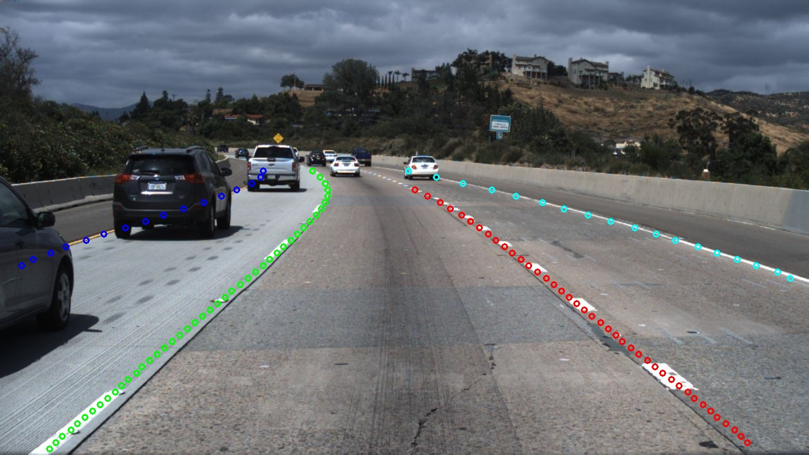

简体中文 | [English](README.md)

# LaneSeg
车道线检测是自动驾驶算法的一个范畴，可以用来辅助进行车辆定位和进行决策，早期已有基于传统图像处理的车道线检测方法，但是随着技术的演进，车道线检测任务所应对的场景越来越多样化，目前更多的方式是寻求在语义上对车道线存在位置的检测。本项目主要使用PaddleSeg进行车道线检测。


## 目录
- [环境配置](#环境配置)
- [模型](#模型)
- [数据准备](#数据准备)
- [训练评估预测](#训练评估预测)
- [导出部署](#导出部署)


## 环境配置

#### 1. 安装PaddlePaddle

版本要求

* PaddlePaddle >= 2.0.2

* Python >= 3.7+

由于车道线模型计算开销大，推荐在GPU版本的PaddlePaddle下使用PaddleSeg。推荐安装10.0以上的CUDA环境。安装教程请见[PaddlePaddle官网](https://www.paddlepaddle.org.cn/install/quick?docurl=/documentation/docs/zh/install/pip/linux-pip.html)。

#### 2. 下载PaddleSeg仓库

```shell
git clone https://github.com/PaddlePaddle/PaddleSeg
```

#### 3. 安装

```shell
cd PaddleSeg
pip install scikit-learn
pip install opencv-python
pip install scikit-image
pip install -e .
cd contrib/LaneSeg
```

## 模型

基于TuSimple评估方法的评估，您可以从[TuSimple exampe](https://github.com/TuSimple/tusimple-benchmark/blob/master/example/lane_demo.ipynb) 获取更多信息

车道线检测模型在Tusimple数据集上的性能

| Method | Acc | FP| FN | Link|
|-|-|-|-|-|
|BiseNetV2|96.38%|0.04545|0.03363|[model](https://paddleseg.bj.bcebos.com/lane_seg/bisenet/model.pdparams)|
|FastScnn|96.04% |0.04909|0.04058|[model](https://paddleseg.bj.bcebos.com/lane_seg/fastscnn/model.pdparams)|

注意：模型输入大小为(640, 368), GPU为Tesla V100 32G。

## 数据准备

利用Tusimple开源的[Tusimple](https://github.com/TuSimple/tusimple-benchmark/issues/3)数据集作为我们教程的示例数据集，百度网盘[下载](https://pan.baidu.com/s/1RuDUne5CpaNxVLVLmpEg-w), 提取码: 9568。需要下载的数据有train_set.zip, test_set.zip, test_label.json,
分别将train_set.zip，test_set.zip解压， 并将数据集置于data/tusimple目录下，同时将test_label.json放置在test_set目录下。

```shell
cd data
mkdir tusimple && cd tusimple
unzip -d train_set train_set.zip
unzip -d test_set test_set.zip
cd ../../
```

数据集整理结构如下:
```
 LaneSeg
 |-- data
     |-- tusimple
        |-- train_set
            |-- clips
                |-- 0313-1
                |-- 0313-2
                |-- 0531
                |-- 0601
            |-- label_data_0313.json
            |-- label_data_0531.json
            |-- label_data_0601.json
        |-- test_set
            |-- clips
                |-- 0530
                |-- 0531
                |-- 0601
            |-- test_tasks_0627.json
            |-- test_label.json
```

执行如下命令：
```shell
python third_party/generate_tusimple_dataset.py --root data/tusimple
```

数据生成结果如下:

```
 The folder structure is as follow:

 LaneSeg
 |-- data
     |-- tusimple
        |-- train_set
            ...
            |-- labels
                |-- 0313-1
                |-- 0313-2
                |-- 0531
                |-- 0601
            |-- train_list.txt
        |-- test_set
            ...
            |-- labels
                |-- 0530
                |-- 0531
                |-- 0601
            |-- train_list.txt
```

train_list.txt的内容如下:
```
/train_set/clips/0313-1/6040/20.jpg /train_set/labels/0313-1/6040/20.png
/train_set/clips/0313-1/5320/20.jpg /train_set/labels/0313-1/5320/20.png
/train_set/clips/0313-1/23700/20.jpg /train_set/labels/0313-1/23700/20.png
...
```
test_list.txt的内容如下:
```
/test_set/clips/0530/1492626760788443246_0/20.jpg /test_set/labels/0530/1492626760788443246_0/20.png
/test_set/clips/0530/1492627171538356342_0/20.jpg /test_set/labels/0530/1492627171538356342_0/20.png
/test_set/clips/0530/1492627288467128445_0/20.jpg /test_set/labels/0530/1492627288467128445_0/20.png
...
```

## 训练评估预测
### 训练
```shell
export CUDA_VISIBLE_DEVICES=0
python train.py \
       --config configs/bisenetV2_tusimple_640x368_300k.yml \
       --do_eval \
       --use_vdl \
       --save_interval 2000 \
       --num_workers 5 \
       --save_dir output
```

**note:** 使用--do_eval会影响训练速度及增加显存消耗，根据需求进行开闭。

`--num_workers` 多进程数据读取，加快数据预处理速度

更多参数信息请运行如下命令进行查看:
```shell
python train.py --help
```
如需使用多卡，请用`python -m paddle.distributed.launch`进行启动

### 评估
```shell
export CUDA_VISIBLE_DEVICES=0
python val.py \
       --config configs/bisenetV2_tusimple_640x368_300k.yml \
       --model_path output/best_model/model.pdparams \
       --save_dir ./output/results \
       --is_view True
```
`--is_view` 开启会保留图片的预测结果，可选择关闭以加快评估速度。

你可以直接下载我们提供的模型进行评估。

更多参数信息请运行如下命令进行查看:
```shell
python val.py --help
```

### 预测
```shell
export CUDA_VISIBLE_DEVICES=0
python predict.py \
       --config configs/bisenetV2_tusimple_640x368_300k.yml \
       --model_path output/best_model/model.pdparams \
       --image_path data/test_images/3.jpg \
       --save_dir output/result
```

你可以直接下载我们提供的模型进行预测。

更多参数信息请运行如下命令进行查看:
```shell
python predict.py --help
```

  预测结果：<br/>
  <br/>
  分割结果：<br/>
  <br/>
  车道线预测结果：<br/>
  

## 导出部署
### 模型导出
```shell
python export.py \
    --config configs/bisenetV2_tusimple_640x368_300k.yml \
    --model_path output/best_model/model.pdparams \
    --save_dir output/export
```

更多参数信息请运行如下命令进行查看:
```shell
python export.py --help
```

### 应用部署

#### Paddle Inference部署 (python)
```shell
python deploy/python/infer.py \
    --config output/export/deploy.yaml \
    --image_path  data/test_images/3.jpg \
    --save_dir ouput/results
```

更多参数信息请运行如下命令进行查看:
```shell
python deploy/python/infer.py --help
```

#### Paddle Inference部署（C++）
参见[Paddle Inference部署教程](./deploy/cpp/README_CN.md)

本项目使用的C++源文件在LaneSeg/deploy/cpp目录下
