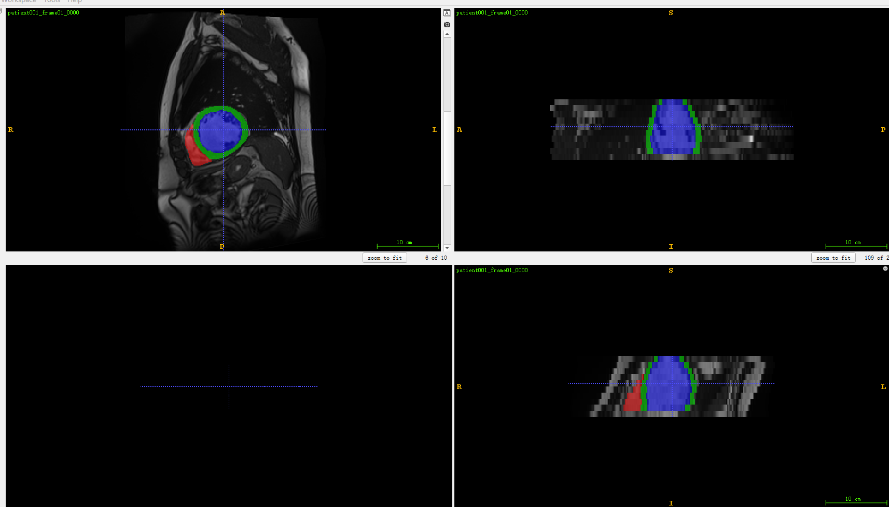
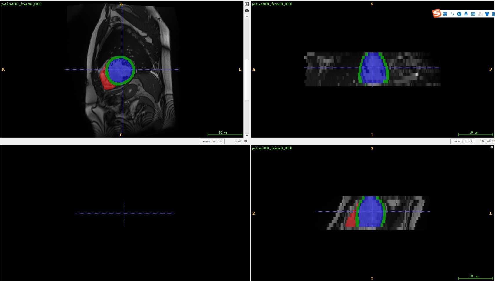
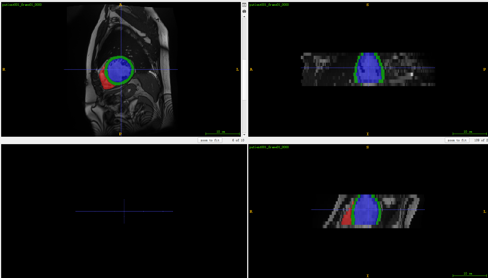
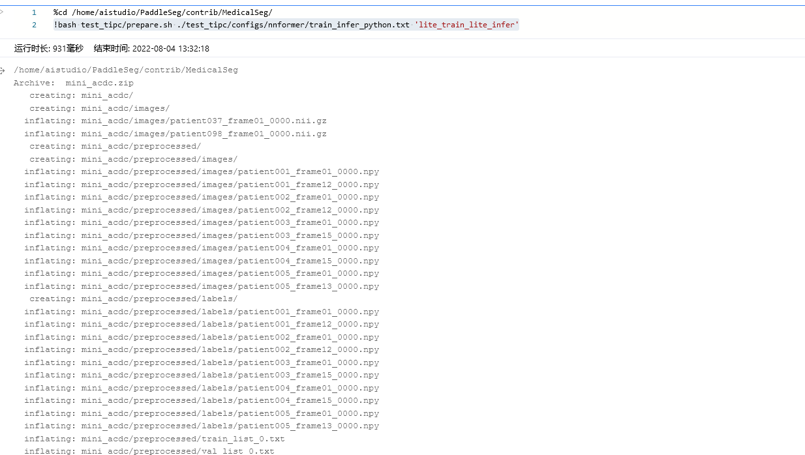
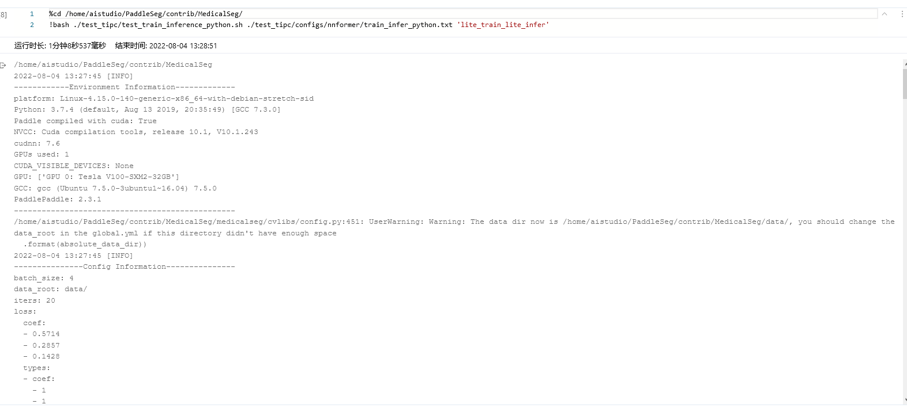
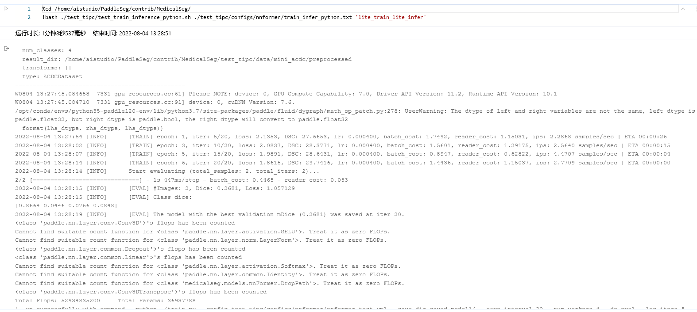
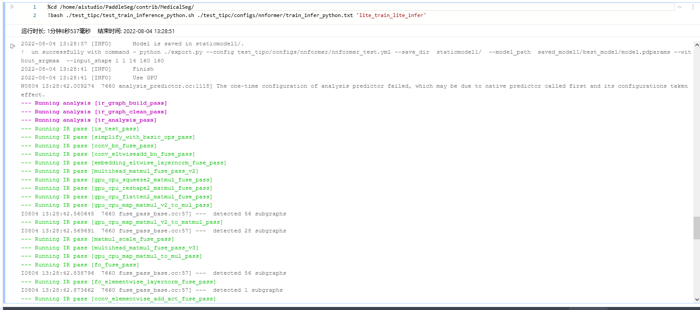
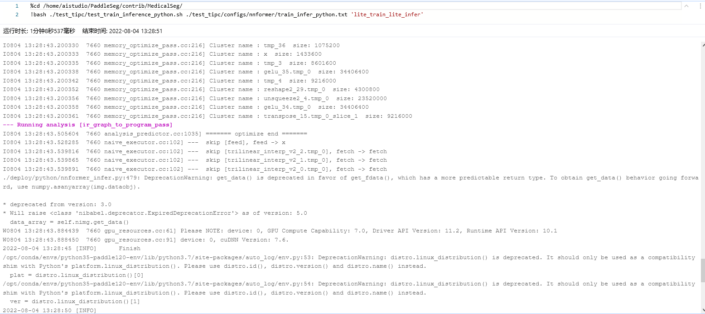
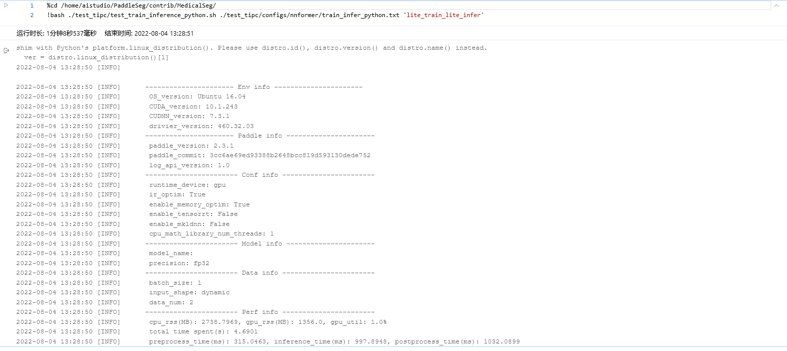

# 基于Paddle复现
## 1.论文简介
nnFormer: Interleaved Transformer for Volumetric Segmentation(https://arxiv.org/pdf/2109.03201.pdf)，


到目前为止transformer在计算机视觉上的应用越来越多，并且取得了非常不错的精度。
本repo介绍一种与常规transfomer不太一样的transformer网络结构用于3d医疗图像分割任务。
nnFormer（not normal transformer)不仅利用了交叉卷积和自注意操作的结合，还引入了局部和全局的基于体积的自注意机制来学习体积表示。
此外，nnFormer还提出用跳跃式注意取代U-Net类跳跃式连接中传统的连接/求和操作。

**参考实现**：
https://github.com/282857341/nnFormer

## 2.复现精度
注意：本文复现环境是在baiduaistudio上的notebook环境，所以有些配置参数也是基于notebook环境的。
如果想完全跑通该repo在其他环境下也可自行更改一些路径配置，比较简单此处不在啰嗦。

在ACDC的测试集的测试效果如下表,达到验收指标，dice-Score=0.9178   满足精度要求 0.9188

2022-08-04 13:57:37 [INFO]	[EVAL] #Images: 40, Dice: 0.9188, Loss: 0.232877
2022-08-04 13:57:37 [INFO]	[EVAL] Class dice: 
[0.9972 0.8648 0.8825 0.9307]


精度和loss可以在train.log中看到训练的详细过程

## 3.环境依赖
通过以下命令安装对应依赖
```shell
!pip install -r PaddleSeg/contrib/MedicalSeg/requirements.txt
```

## 4.数据集

下载地址:

[ACDC - Segmentation: https://aistudio.baidu.com/aistudio/datasetdetail/56020)

数据集从下载到解压预处理使用prepare_acdc.py处理。执行以下命令。

```shell
cd PaddleSeg/contrib/MedicalSeg/tools
python prepare_acdc.py
```

## 5.快速开始

### 模型训练

运行一下命令进行模型训练，在训练过程中会对模型进行评估，启用了VisualDL日志功能，运行之后在`` 文件夹下找到对应的日志文件

```shell
# Train the model: see the train.py for detailed explanation on script args
cd PaddleSeg/contrib/MedicalSeg/
!python train.py --config /home/aistudio/PaddleSeg/contrib/MedicalSeg/configs/nnformer_acdc/nnformer_acdc.yml \
 --save_interval 250 --num_workers 4 --do_eval --log_iters 250 --sw_num 1 --is_save_data False \
 --has_dataset_json False >>train.log
```

**参数介绍**：
--config:配置路径
--save_dir:模型输出文件夹
--save_interval :保存间隔，单位iter
--log_iters：记录日志间隔，单位iter
--num_workers:读取数据集的worker数量，一般等同于batchsize
--do_eval --use_vdl \   使用eval， 使用vdl记录
--keep_checkpoint_max ：最大保存的检查点数量


其他超参数已经设置好。最后一个epoch结束，模型验证日志在train.log 下面截取一段发现21400iter时候已经超过论文要求：
```shell
2022-08-04 13:28:12 [INFO]	[EVAL] The model with the best validation mDice (0.9188) was saved at iter 214000.
2022-08-04 13:28:20 [INFO]	[TRAIN] epoch: 897, iter: 224260/250000, loss: 0.1186, DSC: 90.2639, lr: 0.000052, batch_cost: 0.8523, reader_cost: 0.49460, ips: 4.6934 samples/sec | ETA 06:05:37
2022-08-04 13:28:25 [INFO]	[TRAIN] epoch: 897, iter: 224270/250000, loss: 0.1224, DSC: 89.5611, lr: 0.000052, batch_cost: 0.5098, reader_cost: 0.16900, ips: 7.8455 samples/sec | ETA 03:38:38
2022-08-04 13:28:32 [INFO]	[TRAIN] epoch: 897, iter: 224280/250000, loss: 0.1231, DSC: 89.7906, lr: 0.000052, batch_cost: 0.6311, reader_cost: 0.29649, ips: 6.3384 samples/sec | ETA 04:30:31
2022-08-04 13:28:37 [INFO]	[TRAIN] epoch: 897, iter: 224290/250000, loss: 0.1583, DSC: 87.1975, lr: 0.000052, batch_cost: 0.4922, reader_cost: 0.15096, ips: 8.1268 samples/sec | ETA 03:30:54
2022-08-04 13:28:43 [INFO]	[TRAIN] epoch: 897, iter: 224300/250000, loss: 0.1159, DSC: 90.0311, lr: 0.000052, batch_cost: 0.6365, reader_cost: 0.29298, ips: 6.2845 samples/sec | ETA 04:32:37
2022-08-04 13:28:48 [INFO]	[TRAIN] epoch: 897, iter: 224310/250000, loss: 0.1693, DSC: 87.2451, lr: 0.000052, batch_cost: 0.5239, reader_cost: 0.18165, ips: 7.6344 samples/sec | ETA 03:44:20
2022-08-04 13:28:55 [INFO]	[TRAIN] epoch: 897, iter: 224320/250000, loss: 0.1366, DSC: 89.3969, lr: 0.000052, batch_cost: 0.7069, reader_cost: 0.37070, ips: 5.6582 samples/sec | ETA 05:02:34
2022-08-04 13:29:01 [INFO]	[TRAIN] epoch: 897, iter: 224330/250000, loss: 0.1293, DSC: 89.9117, lr: 0.000052, batch_cost: 0.6293, reader_cost: 0.28747, ips: 6.3558 samples/sec | ETA 04:29:15
2022-08-04 13:29:07 [INFO]	[TRAIN] epoch: 897, iter: 224340/250000, loss: 0.1568, DSC: 88.0213, lr: 0.000052, batch_cost: 0.5843, reader_cost: 0.24611, ips: 6.8460 samples/sec | ETA 04:09:52
2022-08-04 13:29:13 [INFO]	[TRAIN] epoch: 897, iter: 224350/250000, loss: 0.1221, DSC: 89.8704, lr: 0.000052, batch_cost: 0.5672, reader_cost: 0.22599, ips: 7.0519 samples/sec | ETA 04:02:29
2022-08-04 13:29:19 [INFO]	[TRAIN] epoch: 897, iter: 224360/250000, loss: 0.1229, DSC: 90.1956, lr: 0.000052, batch_cost: 0.5992, reader_cost: 0.25699, ips: 6.6756 samples/sec | ETA 04:16:03
2022-08-04 13:29:25 [INFO]	[TRAIN] epoch: 897, iter: 224370/250000, loss: 0.1310, DSC: 89.4617, lr: 0.000051, batch_cost: 0.6198, reader_cost: 0.26686, ips: 6.4540 samples/sec | ETA 04:24:44
2022-08-04 13:29:31 [INFO]	[TRAIN] epoch: 897, iter: 224380/250000, loss: 0.1265, DSC: 89.6275, lr: 0.000051, batch_cost: 0.6050, reader_cost: 0.26853, ips: 6.6115 samples/sec | ETA 04:18:20
2022-08-04 13:29:36 [INFO]	[TRAIN] epoch: 897, iter: 224390/250000, loss: 0.1123, DSC: 90.6223, lr: 0.000051, batch_cost: 0.5084, reader_cost: 0.16734, ips: 7.8673 samples/sec | ETA 03:37:00
2022-08-04 13:29:42 [INFO]	[TRAIN] epoch: 897, iter: 224400/250000, loss: 0.1160, DSC: 90.2366, lr: 0.000051, batch_cost: 0.6184, reader_cost: 0.26683, ips: 6.4682 samples/sec | ETA 04:23:51
2022-08-04 13:29:49 [INFO]	[TRAIN] epoch: 897, iter: 224410/250000, loss: 0.1192, DSC: 90.1119, lr: 0.000051, batch_cost: 0.6519, reader_cost: 0.30856, ips: 6.1355 samples/sec | ETA 04:38:03
2022-08-04 13:29:55 [INFO]	[TRAIN] epoch: 897, iter: 224420/250000, loss: 0.1519, DSC: 87.4541, lr: 0.000051, batch_cost: 0.5662, reader_cost: 0.22096, ips: 7.0652 samples/sec | ETA 04:01:22
2022-08-04 13:30:01 [INFO]	[TRAIN] epoch: 897, iter: 224430/250000, loss: 0.1350, DSC: 89.2586, lr: 0.000051, batch_cost: 0.5821, reader_cost: 0.23943, ips: 6.8716 samples/sec | ETA 04:08:04
2022-08-04 13:30:06 [INFO]	[TRAIN] epoch: 897, iter: 224440/250000, loss: 0.1184, DSC: 90.3130, lr: 0.000051, batch_cost: 0.5612, reader_cost: 0.21793, ips: 7.1274 samples/sec | ETA 03:59:04
2022-08-04 13:30:12 [INFO]	[TRAIN] epoch: 897, iter: 224450/250000, loss: 0.1761, DSC: 86.4561, lr: 0.000051, batch_cost: 0.5551, reader_cost: 0.20649, ips: 7.2065 samples/sec | ETA 03:56:21
2022-08-04 13:30:19 [INFO]	[TRAIN] epoch: 897, iter: 224460/250000, loss: 0.1204, DSC: 90.0802, lr: 0.000051, batch_cost: 0.6852, reader_cost: 0.34521, ips: 5.8374 samples/sec | ETA 04:51:40
2022-08-04 13:30:25 [INFO]	[TRAIN] epoch: 897, iter: 224470/250000, loss: 0.1364, DSC: 88.9072, lr: 0.000051, batch_cost: 0.6103, reader_cost: 0.25855, ips: 6.5541 samples/sec | ETA 04:19:41
2022-08-04 13:30:31 [INFO]	[TRAIN] epoch: 897, iter: 224480/250000, loss: 0.1450, DSC: 87.8348, lr: 0.000051, batch_cost: 0.6098, reader_cost: 0.27449, ips: 6.5593 samples/sec | ETA 04:19:22
2022-08-04 13:30:36 [INFO]	[TRAIN] epoch: 897, iter: 224490/250000, loss: 0.1301, DSC: 89.4968, lr: 0.000051, batch_cost: 0.4985, reader_cost: 0.15426, ips: 8.0244 samples/sec | ETA 03:31:56
2022-08-04 13:30:41 [INFO]	[TRAIN] epoch: 898, iter: 224500/250000, loss: 0.1131, DSC: 90.4714, lr: 0.000051, batch_cost: 0.5750, reader_cost: 0.24678, ips: 6.9568 samples/sec | ETA 04:04:21
2022-08-04 13:30:41 [INFO]	Start evaluating (total_samples: 40, total_iters: 40)...
2022-08-04 13:30:52 [INFO]	[EVAL] #Images: 40, Dice: 0.9176, Loss: 0.058783
2022-08-04 13:30:52 [INFO]	[EVAL] Class dice: 
[0.9972 0.8605 0.8819 0.9306]
```


### 模型验证

除了可以再训练过程中验证模型精度，可以使用val.py脚本进行测试，权重文件可在 链接下载：链接：https://pan.baidu.com/s/1CQF0lI_JZ5sgWuNtzMmU8Q 
提取码：ce7x


```shell
%cd /home/aistudio/PaddleSeg/contrib/MedicalSeg/
!python val.py --config /home/aistudio/PaddleSeg/contrib/MedicalSeg/configs/nnformer_acdc/nnformer_acdc.yml \
--model_path /home/aistudio/train_model_out/best_model/model.pdparams --save_dir /home/aistudio/train_model_out/best_model \
--num_workers 1 --sw_num 1 --is_save_data False --has_dataset_json False
```
**参数介绍**：


--config:配置路径
- model_path  模型权重所在路径

输出如下：

```shell
val_dataset:
  anno_path: val_list_0.txt
  dataset_root: /home/aistudio/ACDCDataset/preprocessed
  mode: val
  num_classes: 4
  result_dir: /home/aistudio/ACDCDataset/preprocessed
  transforms: []
  type: ACDCDataset
------------------------------------------------
W0804 13:57:11.316898 22617 gpu_resources.cc:61] Please NOTE: device: 0, GPU Compute Capability: 7.0, Driver API Version: 11.2, Runtime API Version: 10.1
W0804 13:57:11.316946 22617 gpu_resources.cc:91] device: 0, cuDNN Version: 7.6.
2022-08-04 13:57:13 [INFO]	Loading pretrained model from /home/aistudio/PaddleSeg/contrib/MedicalSeg/output/best_model/model.pdparams
2022-08-04 13:57:14 [INFO]	There are 250/250 variables loaded into nnFormer.
2022-08-04 13:57:14 [INFO]	Loaded trained params of model successfully
2022-08-04 13:57:14 [INFO]	Start evaluating (total_samples: 40, total_iters: 40)...
/opt/conda/envs/python35-paddle120-env/lib/python3.7/site-packages/paddle/fluid/dygraph/math_op_patch.py:278: UserWarning: The dtype of left and right variables are not the same, left dtype is paddle.float32, but right dtype is paddle.bool, the right dtype will convert to paddle.float32
  format(lhs_dtype, rhs_dtype, lhs_dtype))
40/40 [==============================] - 23s 566ms/step - batch_cost: 0.5654 - reader cost: 0.00659s - batch_cost: 0.94 - ETA: 13s - batch_cost: 0.692
2022-08-04 13:57:37 [INFO]	[EVAL] #Images: 40, Dice: 0.9188, Loss: 0.232877
2022-08-04 13:57:37 [INFO]	[EVAL] Class dice: 
[0.9972 0.8648 0.8825 0.9307]
```


### 导出

可以将模型导出，动态图转静态图，使模型预测更快，可以使用export.py脚本进行测试

在这里因为动静态模型转化的问题，修改了stanet的模型代码使其可以转出静态模型。

调试过程中参考这份文档   [报错调试](https://www.paddlepaddle.org.cn/documentation/docs/zh/guides/04_dygraph_to_static/debugging_cn.html)

```shell
%cd /home/aistudio/PaddleSeg/contrib/MedicalSeg/
!python export.py --config /home/aistudio/PaddleSeg/contrib/MedicalSeg/configs/nnformer_acdc/nnformer_acdc.yml \
--save_dir /home/aistudio/staticmodel/  \
--model_path /home/aistudio/train_model_out/best_model/model.pdparams \
--without_argmax               \
--input_shape 1 1 14 160 160
```
**参数介绍**：
- input_shape 预测图的形状
-save_dir  静态模型导出路径
- model_path  模型权重所在路径
--without_argmax  不带argmax 


### 使用静态图推理

可以使用unetr_infer.py脚本进行测试(需要安装autolog，安装方式参考下文tipc测试那边介绍)

```shell
%cd /home/aistudio/PaddleSeg/contrib/MedicalSeg/
!python deploy/python/nnformer_infer.py --config /home/aistudio/staticmodel/deploy.yaml \
--image_path /home/aistudio/test_images --benchmark True --save_dir /home/aistudio/staticinferlabel \
--enable_mkldnn True --benchmark True --with_argmax --use_swl True
```
**参数介绍**：
--config:导出的静态模型配置路径
- benchmark ：记录推理耗时
- image_path ：用于推理的图片路径
- batch_size 批次

带标签的原图

动态推理图

静态推理图



### 使用动态图推理

可以使用dynPrediction.py脚本进行测试

```shell
%cd /home/aistudio/PaddleSeg/contrib/MedicalSeg/
!python predict.py --config /home/aistudio/PaddleSeg/contrib/MedicalSeg/configs/nnformer_acdc/nnformer_acdc.yml \
--model_path /home/aistudio/train_model_out/best_model/model.pdparams \
--image_path /home/aistudio/test_images \
--save_dir /home/aistudio/dyinferlabel

```
**参数介绍**：
--config:动态模型配置路径
--model_path:模型路径
- benchmark ：记录推理耗时
- image_path ：用于推理的图片路径
- batch_size 批次

```shell
/home/aistudio/PaddleSeg/contrib/MedicalSeg
/home/aistudio/PaddleSeg/contrib/MedicalSeg/medicalseg/cvlibs/config.py:451: UserWarning: Warning: The data dir now is /home/aistudio/PaddleSeg/contrib/MedicalSeg/data/, you should change the data_root in the global.yml if this directory didn't have enough space
  .format(absolute_data_dir))
2022-08-04 13:51:26 [INFO]	
---------------Config Information---------------
batch_size: 4
data_root: data/
iters: 250000
loss:
  coef:
  - 0.5714
  - 0.2857
  - 0.1428
  types:
  - coef:
    - 1
    - 1
    losses:
    - type: CrossEntropyLoss
      weight: null
    - type: DiceLoss
    type: MixedLoss
lr_scheduler:
  decay_steps: 250000
  end_lr: 0
  learning_rate: 0.0004
  power: 0.9
  type: PolynomialDecay
model:
  crop_size:
  - 14
  - 160
  - 160
  deep_supervision: true
  depths:
  - 2
  - 2
  - 2
  - 2
  down_stride:
  - - 1
    - 4
    - 4
  - - 1
    - 8
    - 8
  - - 2
    - 16
    - 16
  - - 4
    - 32
    - 32
  embedding_dim: 96
  input_channels: 1
  num_classes: 4
  num_heads:
  - 3
  - 6
  - 12
  - 24
  patch_size:
  - 1
  - 4
  - 4
  type: nnFormer
  window_size:
  - - 3
    - 5
    - 5
  - - 3
    - 5
    - 5
  - - 7
    - 10
    - 10
  - - 3
    - 5
    - 5
optimizer:
  momentum: 0.99
  type: sgd
  weight_decay: 5.0e-05
train_dataset:
  anno_path: train_list_0.txt
  dataset_root: /home/aistudio/ACDCDataset/preprocessed
  mode: train
  num_classes: 4
  result_dir: /home/aistudio/ACDCDataset/preprocessed
  transforms:
  - degrees: 15
    type: RandomRotation3D
  - interpolation: 3
    max_scale_factor: 1.25
    min_scale_factor: 0.85
    p_per_sample: 0.25
    type: ResizeRangeScaling
  - p_per_sample: 0.1
    type: GaussianNoiseTransform
  - blur_sigma:
    - 0.5
    - 1.0
    different_sigma_per_channel: true
    p_per_channel: 0.5
    p_per_sample: 0.2
    type: GaussianBlurTransform
  - multiplier_range:
    - 0.75
    - 1.25
    p_per_sample: 0.15
    type: BrightnessMultiplicativeTransform
  - p_per_sample: 0.15
    type: ContrastAugmentationTransform
  - order_downsample: 0
    order_upsample: 3
    p_per_channel: 0.5
    p_per_sample: 0.25
    per_channel: true
    type: SimulateLowResolutionTransform
    zoom_range:
    - 0.5
    - 1
  - gamma_range:
    - 0.5
    - 2
    type: GammaTransform
  - p_per_sample: 0.2
    type: MirrorTransform
  - crop_size:
    - 14
    - 160
    - 160
    type: RandomPaddingCrop
  type: ACDCDataset
val_dataset:
  anno_path: val_list_0.txt
  dataset_root: /home/aistudio/ACDCDataset/preprocessed
  mode: val
  num_classes: 4
  result_dir: /home/aistudio/ACDCDataset/preprocessed
  transforms: []
  type: ACDCDataset
------------------------------------------------
W0804 13:51:26.427147  9883 gpu_resources.cc:61] Please NOTE: device: 0, GPU Compute Capability: 7.0, Driver API Version: 11.2, Runtime API Version: 10.1
W0804 13:51:26.427193  9883 gpu_resources.cc:91] device: 0, cuDNN Version: 7.6.
2022-08-04 13:51:27 [INFO]	Loading pretrained model from /home/aistudio/train_model_out/best_model/model.pdparams
2022-08-04 13:51:28 [INFO]	There are 250/250 variables loaded into nnFormer.
2022-08-04 13:51:28 [INFO]	Loaded trained params of model successfully
  0%|                                                     | 0/5 [00:00<?, ?it/s]predict.py:119: DeprecationWarning: get_data() is deprecated in favor of get_fdata(), which has a more predictable return type. To obtain get_data() behavior going forward, use numpy.asanyarray(img.dataobj).

* deprecated from version: 3.0
* Will raise <class 'nibabel.deprecator.ExpiredDeprecationError'> as of version: 5.0
  data_array = nimg.get_data()
100%|█████████████████████████████████████████████| 5/5 [00:12<00:00,  2.46s/it]

```


### TIPC基础链条测试

该部分依赖auto_log，需要进行安装，安装方式如下：

auto_log的详细介绍参考[https://github.com/LDOUBLEV/AutoLog](https://github.com/LDOUBLEV/AutoLog)。

```shell
git clone https://github.com/LDOUBLEV/AutoLog
cd   AutoLog/
pip3 install -r requirements.txt
python3 setup.py bdist_wheel
pip3 install ./dist/auto_log-1.2.0-py3-none-any.whl
```


```shell
%cd /home/aistudio/PaddleSeg/contrib/MedicalSeg/
!bash test_tipc/prepare.sh ./test_tipc/configs/nnformer/train_infer_python.txt 'lite_train_lite_infer'
%cd /home/aistudio/PaddleSeg/contrib/MedicalSeg/
!bash ./test_tipc/test_train_inference_python.sh ./test_tipc/configs/nnformer/train_infer_python.txt 'lite_train_lite_infer'
```

测试结果如截图所示








## 6.代码结构与详细说明

```
MedicalSeg
├── configs         # All configuration stays here. If you use our model, you only need to change this and run-vnet.sh.
├── data            # Data stays here.
├── test_tipc       # test_tipc stays here.
├── deploy          # deploy related doc and script.
├── medicalseg  
│   ├── core        # the core training, val and test file.
│   ├── datasets  
│   ├── models  
│   ├── transforms  # the online data transforms
│   └── utils       # all kinds of utility files
├── export.py
├── run-vnet.sh     # the script to reproduce our project, including training, validate, infer and deploy
├── tools           # Data preprocess including fetch data, process it and split into training and validation set
├── train.py
├── val.py
└── visualize.ipynb # You can try to visualize the result use this file.

```

## 7.模型信息

| 信息 | 描述 |
| --- | --- |
|模型名称| nnFormer|
|框架版本| PaddlePaddle==2.3.1|


## 8.说明
感谢百度提供的算力，以及举办的本场比赛，让我增强对paddle的熟练度，加深对模型的理解！
