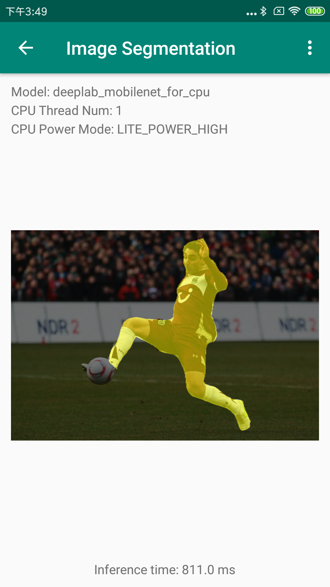
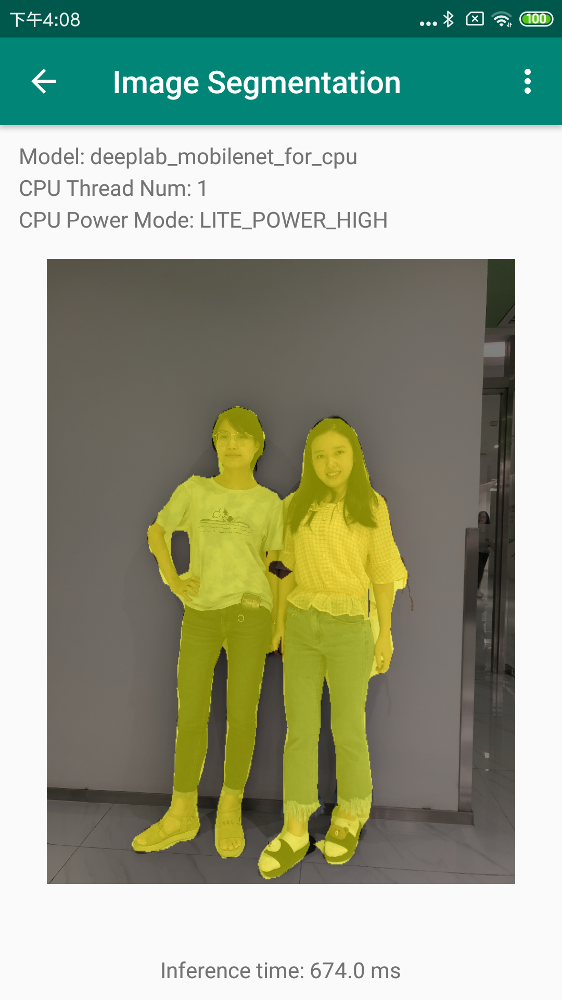
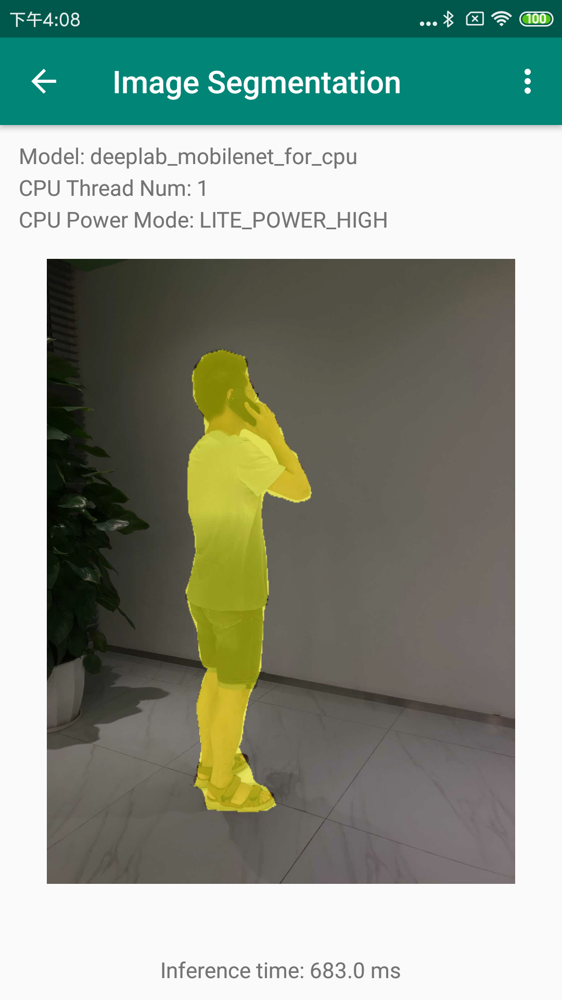

English | [简体中文](README_cn.md)

# PP-HumanSeg

Human segmentation is a high-frequency application in the field of image segmentation. PaddleSeg has launched a series of human segmentation models PP-HumanSeg trained on large-scale human data, including an ultra-lightweight model **PP-HumanSeg-Lite**. It can meet the needs of various usage scenarios on server, mobile, and web. We provide full-process application guides from training to deployment, as well as video streaming segmentation and background replacement tutorials. Based on Paddle.js, you can experience the effects of [Portrait Snapshot](https://paddlejs.baidu.com/humanseg), [Video Background Replacement and Barrage Penetration](https://www.paddlepaddle.org.cn/paddlejs).

<p align="center">
        
</p>

The COVID-19 epidemic has catalyzed the demand for remote office, and video conferencing products have exploded rapidly. Baidu Video Conference can realize one-second joining on the web side. The virtual background function adopts our PP-HumanSeg-Lite model to realize real-time background replacement and background blur function, protect user privacy, and increase the fun in the meeting.

<p align="center">

</p>

## Updates
- [2022-1-4] Human segmentation paper [PP-HumanSeg](./paper.md) was published in WACV 2022 Workshop, and open-sourced Connectivity Learning (SCL) method and large-scale video conferencing dataset.

## Content
- [Human segmentation model](#Human-segmentation-model)
  - [General human segmentation](#General-Human-Segmentation)
  - [Portrait segmentation](#Portrait-segmentation)
- [Install](#install)
- [Quick experience](#Quick-experience)
  - [Video streaming human segmentation](#Video-streaming-human-segmentation)
  - [Video stream background replacement](#Video-stream-background-replacement)
  - [Online running tutorial](#Online-running-tutorial)
- [Training evaluation prediction demo](#Training-evaluation-prediction-demo)
- [Model export](#Model-export)
- [Web deployment](#Web-deployment)
- [Mobile deployment](#mobile-deployment)

## Human segmentation model
### General human segmentation
For general human segmentation tasks, PP-HumanSeg has opened three human models trained on large-scale human data to meet the needs of various usage scenarios on the server, mobile and web.

| Model | Model Description | Checkpoint | Inference Model |
| --- | --- | --- | ---|
| PP-HumanSeg-Server | High-precision model, suitable for server-side GPU and complex background scenes, model structure is Deeplabv3+/ResNet50, input size (512, 512) |[server_ckpt](https://paddleseg.bj.bcebos.com/dygraph/humanseg/train/deeplabv3p_resnet50_os8_humanseg_512x512_100k.zip) | [server_inference](https://paddleseg.bj.bcebos.com/dygraph/humanseg/export/deeplabv3p_resnet50_os8_humanseg_512x512_100k_with_softmax.zip) |
| PP-HumanSeg-Mobile | Lightweight model, suitable for front camera scenarios on mobile or server CPU, model structure is HRNet_w18_samll_v1, input size (192, 192) | [mobile_ckpt](https://paddleseg.bj.bcebos.com/dygraph/humanseg/train/fcn_hrnetw18_small_v1_humanseg_192x192.zip) | [mobile_inference](https://paddleseg.bj.bcebos.com/dygraph/humanseg/export/fcn_hrnetw18_small_v1_humanseg_192x192_with_softmax.zip) |
| PP-HumanSeg-Lite | Ultra-lightweight model, suitable for real-time segmentation scenarios on the web or mobile, such as mobile phone selfies, web video conferences, the model structure is [Paddle self-developed model](../../configs/pp_humanseg_lite/README.md), input size (192, 192) | [lite_ckpt](https://paddleseg.bj.bcebos.com/dygraph/humanseg/train/pphumanseg_lite_generic_192x192.zip) | [lite_inference](https://paddleseg.bj.bcebos.com/dygraph/humanseg/export/pphumanseg_lite_generic_192x192_with_softmax.zip) |


NOTE:
* Where Checkpoint is the model weight, which is used in the Fine-tuning scene.

* Inference Model is a predictive deployment model, including `model.pdmodel` computational graph structure, `model.pdiparams` model parameters and `deploy.yaml` basic model configuration information.

* Among them, the Inference Model is suitable for the prediction deployment of CPU and GPU on the server, and is suitable for the deployment of end devices such as mobile terminals through Paddle Lite. For more Paddle Lite deployment instructions, see [Paddle Lite Documentation](https://paddle-lite.readthedocs.io/zh/latest/)

#### Model performance

| Model | Input Size | FLOPS | Parameters | Latency | Model Size |
|-|-|-|-|-|-|
| PP-HumanSeg-Server | 512x512 | 114G | 26.8M | 37.96ms | 103Mb |
| PP-HumanSeg-Mobile | 192x192 | 584M | 1.54M | 13.17ms | 5.9Mb |
| PP-HumanSeg-Lite | 192x192 | 121M | 137K | 10.51ms | 543Kb |

Test environment: Nvidia Tesla V100 single card.

### Portrait segmentation
For the portrait segmentation task, PP-HumanSeg has opened a portrait segmentation model, which has been applied to Baidu Video Conferencing.

| Model | Model Description | Checkpoint | Inference Model |
| --- | --- | --- | ---|
| PP-HumanSeg-Lite | Ultra-lightweight model, suitable for real-time segmentation scenarios on the web or mobile, such as mobile phone selfies, web video conferences, the model structure is [Paddle self-developed model](../../configs/pp_humanseg_lite/README.md), recommended input size (398, 224) | [lite_portrait_ckpt](https://paddleseg.bj.bcebos.com/dygraph/ppseg/ppseg_lite_portrait_398x224.tar.gz) | [lite_portrait_inference](https://paddleseg.bj.bcebos.com/dygraph/ppseg/ppseg_lite_portrait_398x224_with_softmax.tar.gz) |

#### Model performance

| Model | Input Size | FLOPS | Parameters | Latency | Model Size |
|-|-|-|-|-|-|
| PP-HumanSeg-Lite | 398x224 | 266M | 137K | 23.49ms | 543Kb |
| PP-HumanSeg-Lite | 288x162 | 138M | 137K | 15.62ms | 543Kb |

Test environment: Use Paddle.js converter to optimize the graph structure, deploy on the web side, the GPU is AMD Radeon Pro 5300M 4 GB.


## Install

#### 1. Install PaddlePaddle

Version requirements

* PaddlePaddle >= 2.0.2

* Python >= 3.7+

Due to the high computational cost of the image segmentation model, it is recommended to use PaddleSeg under the GPU version of PaddlePaddle. It is recommended to install a CUDA environment above 10.0. Please refer to the [PaddlePaddle official website](https://www.paddlepaddle.org.cn/install/quick?docurl=/documentation/docs/zh/install/pip/linux-pip.html) for the installation tutorial.


#### 2. Install PaddleSeg package

```shell
pip install paddleseg
```

#### 3. Download PaddleSeg repository

```shell
git clone https://github.com/PaddlePaddle/PaddleSeg
```

## Quick experience
All the following commands are executed in the `PaddleSeg/contrib/PP-HumanSeg` directory.
```shell
cd PaddleSeg/contrib/PP-HumanSeg
```

### Download Inference Model

Execute the following script to quickly download all Inference Models
```bash
python export_model/download_export_model.py
```

### Download test data
We provide some test data, randomly select a small part from the human segmentation dataset [Supervise.ly Person](https://app.supervise.ly/ecosystem/projects/persons) and convert it into a PaddleSeg data format that can be directly loaded , hereinafter referred to as mini_supervisely, and also provides the test video `video_test.mp4` of the front camera of the mobile phone. Quick download by running the following code:

```bash
python data/download_data.py
```

### Video streaming human segmentation
```bash
# Real-time segmentation processing through computer camera
python bg_replace.py \
--config export_model/ppseg_lite_portrait_398x224_with_softmax/deploy.yaml

# Process the portrait video
python bg_replace.py \
--config export_model/deeplabv3p_resnet50_os8_humanseg_512x512_100k_with_softmax/deploy.yaml \
--video_path data/video_test.mp4
```

The video segmentation results are as follows:


We also support the use of DIS (Dense Inverse Search-based method) optical flow post-processing algorithm to reduce the problem of video prediction frame flicker by combining optical flow results and segmentation results. Just use `--use_optic_flow` to enable optical flow post-processing, for example
```bash
# Add optical flow post-processing
python bg_replace.py \
--config export_model/ppseg_lite_portrait_398x224_with_softmax/deploy.yaml \
--use_optic_flow
```

### Video stream background replacement
The background is replaced according to the selected background, which can be a picture or a video.
```bash
# Perform real-time background replacement processing through the computer camera. You can pass in the background video through '--background_video_path'
python bg_replace.py \
--config export_model/ppseg_lite_portrait_398x224_with_softmax/deploy.yaml \
--input_shape 224 398 \
--bg_img_path data/background.jpg

# Perform background replacement processing on portrait video. You can pass in the background video through '--background_video_path'
python bg_replace.py \
--config export_model/deeplabv3p_resnet50_os8_humanseg_512x512_100k_with_softmax/deploy.yaml \
--bg_img_path data/background.jpg \
--video_path data/video_test.mp4

# background replacement for a single image
python bg_replace.py \
--config export_model/ppseg_lite_portrait_398x224_with_softmax/deploy.yaml \
--input_shape 224 398 \
--img_path data/human_image.jpg \
--bg_img_path data/background.jpg

```


The result of background replacement is as follows:


**NOTE**:

The video segmentation processing time will take a few minutes, please be patient.

The Portrait model is suitable for widescreen shooting scenes, and the vertical screen effect will be slightly worse.

### Online running tutorial
We provide an AI Studio-based [Online Running Tutorial](https://aistudio.baidu.com/aistudio/projectdetail/2189481) to facilitate your practical experience.

## Training evaluation prediction demo
If the above models pre-trained on large-scale data cannot meet your accuracy requirements, you can perform fine-tuning in your scene based on the above models to better suit your usage scenarios.

### Download pretrained model

Execute the following script to quickly download all checkpoints as pretrained models
```bash
python pretrained_model/download_pretrained_model.py
```

### Train
Demonstrates how to do fine-tuning based on the above model. We use the extracted mini_supervisely dataset as an example dataset, taking PP-HumanSeg-Mobile as an example, the training command is as follows:
```bash
export CUDA_VISIBLE_DEVICES=0 # Set 1 available card
# Please execute the following command under windows
# set CUDA_VISIBLE_DEVICES=0
python train.py \
--config configs/fcn_hrnetw18_small_v1_humanseg_192x192_mini_supervisely.yml \
--save_dir saved_model/fcn_hrnetw18_small_v1_humanseg_192x192_mini_supervisely \
--save_interval 100 --do_eval --use_vdl
````

More command line help can be viewed by running the following command:
```bash
python train.py --help
```

### Evaluate
Use the following command to evaluate
```bash
python val.py \
--config configs/fcn_hrnetw18_small_v1_humanseg_192x192_mini_supervisely.yml \
--model_path saved_model/fcn_hrnetw18_small_v1_humanseg_192x192_mini_supervisely/best_model/model.pdparams
```

### Predict
Use the following command to make predictions, the prediction results are saved in the `./output/result/` folder by default.
```bash
python predict.py \
--config configs/fcn_hrnetw18_small_v1_humanseg_192x192_mini_supervisely.yml \
--model_path saved_model/fcn_hrnetw18_small_v1_humanseg_192x192_mini_supervisely/best_model/model.pdparams \
--image_path data/human_image.jpg
```

## Model export
### Export the model as a static graph model

Make sure you are in the PaddleSeg directory and execute the following script:

```shell
export CUDA_VISIBLE_DEVICES=0 # Set 1 available card
# Please execute the following command under windows
# set CUDA_VISIBLE_DEVICES=0
python ../../export.py \
--config configs/fcn_hrnetw18_small_v1_humanseg_192x192_mini_supervisely.yml \
--model_path saved_model/fcn_hrnetw18_small_v1_humanseg_192x192_mini_supervisely/best_model/model.pdparams \
--save_dir export_model/fcn_hrnetw18_small_v1_humanseg_192x192_mini_supervisely_with_softmax \
--without_argmax --with_softmax
```

Export the PP-HumanSeg-Lite model:

```shell
python ../../export.py \
--config ../../configs/pp_humanseg_lite/pp_humanseg_lite_export_398x224.yml \
--save_dir export_model/pp_humanseg_lite_portrait_398x224_with_softmax \
--model_path pretrained_model/ppseg_lite_portrait_398x224/model.pdparams \
--without_argmax --with_softmax
```

### Export parameter

|Parameter name|Purpose|Required option|Default value|
|-|-|-|-|
|config|Configuration File|Yes|-|
|save_dir|Save root path for model and VisualDL log files|no |output|
|model_path|path to pretrained model parameter|no|specified value in configuration file|
|with_softmax|Add a softmax operator at the end of the network. Since the PaddleSeg network returns logits by default, if you want to deploy the model to obtain the probability value, you can set it to True|No|False|
|without_argmax| Whether or not to add the argmax operator at the end of the network. Since the PaddleSeg network returns logits by default, in order to deploy the model, the prediction results can be obtained directly. By default, we add the argmax operator at the end of the network | No | False |

### Result file

```shell
output
  ├── deploy.yaml # Deploy related configuration files
  ├── model.pdiparams # Static graph model parameters
  ├── model.pdiparams.info # Additional parameter information, generally do not need to pay attention
  └── model.pdmodel # Static graph model file
```

## Web deployment


See [Web deployment tutorial](../../deploy/web)

## Mobile deployment

  

See [Mobile Deployment Tutorial](../../deploy/lite/)
