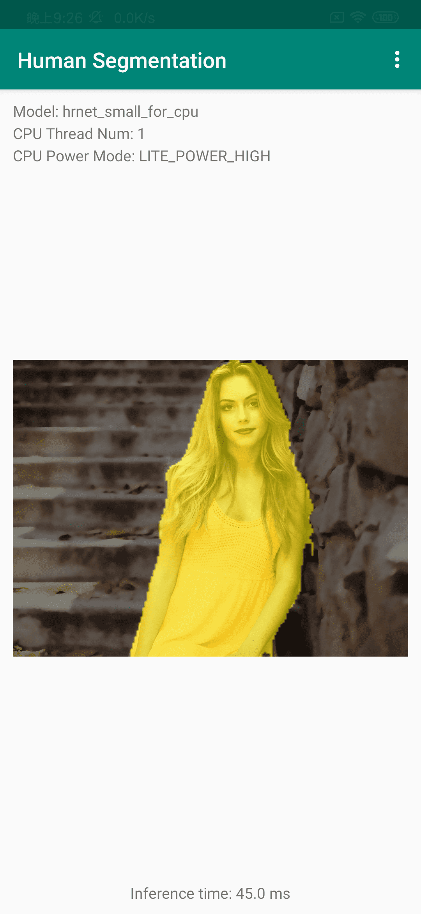
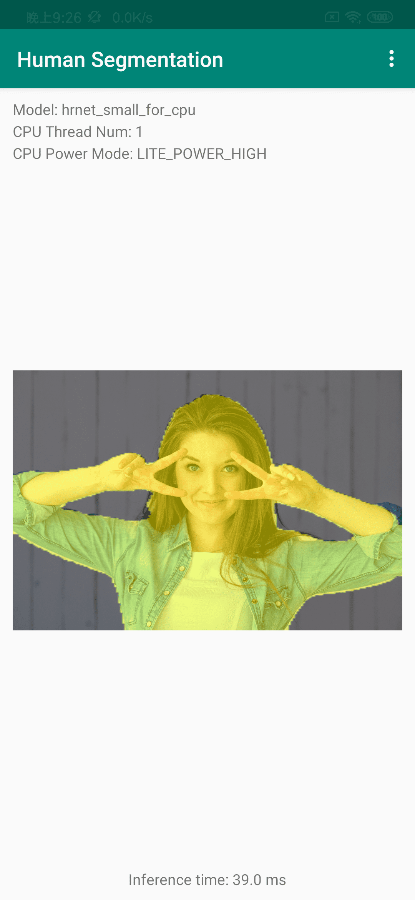
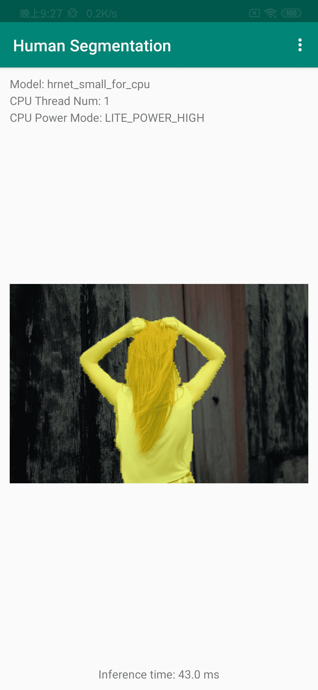

简体中文 | [English](README.md)

# 人像分割PP-HumanSeg

**目录**
- 1 简介
- 2 最新消息
- 3 PP-HumanSeg模型
- 4 快速体验
- 5 训练评估预测演示
- 6 部署

## 1 简介

将人物和背景在像素级别进行区分，是一个图像分割的经典任务，具有广泛的应用。
一般而言，该任务可以分为两类：针对半身人像的分割，简称肖像分割；针对全身和半身人像的分割，简称通用人像分割。

对于肖像分割和通用人像分割，PaddleSeg发布了**PP-HumanSeg系列模型**，具有**分割精度高、推理速度快、通用型强**的优点。而且PP-HumanSeg系列模型可以**开箱即用**，零成本部署到产品中，也支持针对特定场景数据进行微调，实现更佳分割效果。

大家可以在Paddle.js的网页体验人像扣图效果([链接](https://paddlejs.baidu.com/humanseg))、视频背景替换及弹幕穿透效果([链接](https://www.paddlepaddle.org.cn/paddlejs))。

<p align="center">
        
</p>

## 2 最新消息
- [2022-7] 发布**PP-HumanSeg V2版本模型，肖像分割模型的推理速度提升45.5%、mIoU提升0.63%、可视化效果更佳**，通用人像分割模型的推理速度和精度也有明显提升。
- [2022-1] 人像分割论文[PP-HumanSeg](./paper.md)发表于WACV 2022 Workshop，并开源连通性学习（SCL）方法和大规模视频会议数据集。
- [2021-7] 百度视频会议可实现Web端一秒入会，其中的虚拟背景功能采用我们的PP-HumanSeg肖像模型，实现实时背景替换和背景虚化功能，保护用户隐私，并增加视频会议的趣味性。
- [2021-7] 发布PP-HumanSeg V1版本模型，包括一个肖像分割模型和三个通用人像分割模型。

<p align="center">

</p>

## 3 PP-HumanSeg模型

### 3.1 肖像分割模型

针对手机视频通话、Web视频会议等实时半身人像的分割场景，PP-HumanSeg发布了自研的肖像分割模型。该系列模型可以开箱即用，零成本直接集成到产品中。

* PP-HumanSegV1-Lite肖像分割模型，分割效果较好，模型体积非常小，模型结构见[链接](../../configs/pp_humanseg_lite/)。
* **PP-HumanSegV2-Lite肖像分割模型，对比V1模型，推理速度提升45.5%、mIoU提升0.63%、可视化效果更佳**，核心在于：
  * 更高的分割精度：使用PaddleSeg推出的超轻量级分割模型([链接](../../configs/mobileseg/))，具体选择MobileNetV3作为骨干网络，设计多尺度特征融合模块(Multi-Scale Feature Aggregation Module)。
  * 更快的推理速度：减小模型最佳输入尺寸，既减少了推理耗时，又增大模型感受野。
  * 更好的通用性：使用迁移学习的思想，首先在大型通用人像分割数据集上预训练，然后在小型肖像分割数据集上微调。

| 模型名 | 最佳输入尺寸 | 精度mIou(%) | 手机端推理耗时(ms) | 模型体积(MB) | 配置文件 | 下载连接 |
| --- | --- | --- | ---| --- | --- | --- |
| PP-HumanSegV1-Lite | 398x224 | 96.00 | 29.68 | 2.2 | [cfg](./configs/portrait_pp_humansegv1_lite.yml) | [Checkpoint](https://paddleseg.bj.bcebos.com/dygraph/pp_humanseg_v2/portrait_pp_humansegv1_lite_398x224_pretrained.zip) \| [Inference Model (Argmax)](https://paddleseg.bj.bcebos.com/dygraph/pp_humanseg_v2/portrait_pp_humansegv1_lite_398x224_inference_model.zip) \| [Inference Model (Softmax)](https://paddleseg.bj.bcebos.com/dygraph/pp_humanseg_v2/portrait_pp_humansegv1_lite_398x224_inference_model_with_softmax.zip) |
| PP-HumanSegV2-Lite | 256x144 | 96.63 | 15.86 | 13.5 | [cfg](./configs/portrait_pp_humansegv2_lite.yml) | [Checkpoint](https://paddleseg.bj.bcebos.com/dygraph/pp_humanseg_v2/portrait_pp_humansegv2_lite_256x144_pretrained.zip) \| [Inference Model (Argmax)](https://paddleseg.bj.bcebos.com/dygraph/pp_humanseg_v2/portrait_pp_humansegv2_lite_256x144_inference_model.zip) \| [Inference Model (Softmax)](https://paddleseg.bj.bcebos.com/dygraph/pp_humanseg_v2/portrait_pp_humansegv2_lite_256x144_inference_model_with_softmax.zip) |

<details><summary>表格说明：</summary>

* 测试肖像模型的精度mIoU：针对PP-HumanSeg-14k数据集，使用模型最佳输入尺寸进行测试，没有应用多尺度和flip等操作。
* 测试肖像模型的推理耗时：基于[PaddleLite](https://www.paddlepaddle.org.cn/lite)预测库，小米9手机（骁龙855 CPU）、单线程、大核，使用模型最佳输入尺寸进行测试。
* 最佳输入尺寸的宽高比例是16:9，和手机、电脑的摄像头拍摄尺寸比例相同。
* Checkpoint是模型权重，结合模型配置文件，可以用于Finetuning场景。
* Inference Model为预测模型，可以直接用于部署。
* Inference Model (Argmax) 指模型最后使用Argmax算子，输出单通道预测结果(int64类型)，人像区域为1，背景区域为0。
* Inference Model (Softmax) 指模型最后使用Softmax算子，输出单通道预测结果（float32类型），每个像素数值表示是人像的概率。
</details>

<details><summary>使用说明：</summary>

* 肖像分割模型专用性较强，可以开箱即用，建议使用最佳输入尺寸。
* 在手机端部署肖像分割模型，存在横屏和竖屏两种情况。大家可以根据实际情况对图像进行旋转，保持人像始终是竖直，然后将图像（尺寸比如是256x144或144x256）输入模型，得到最佳分割效果。
</details>

### 3.2 通用人像分割模型

针对通用人像分割任务，我们首先构建的大规模人像数据集，然后使用PaddleSeg的SOTA模型，最终发布了多个PP-HumanSeg通用人像分割模型。

* PP-HumanSegV2-Lite通用人像分割模型，使用PaddleSeg推出的[超轻量级分割模型](../../configs/mobileseg/)，相比V1模型精度mIoU提升6.5%，手机端推理耗时增加3ms。
* PP-HumanSegV2-Mobile通用分割模型，使用PaddleSeg自研的[PP-LiteSeg](../../configs/pp_liteseg/)模型，相比V1模型精度mIoU提升1.49%，服务器端推理耗时减少5.7%。

| 模型名 | 最佳输入尺寸 | 精度mIou(%) | 手机端推理耗时(ms) | 服务器端推理耗时(ms) | 配置文件 | 下载链接 |
| ----- | ---------- | ---------- | -----------------| ----------------- | ------- | ------- |
| PP-HumanSegV1-Lite   | 192x192 | 86.02 | 12.3  | -    | [cfg](./configs/human_pp_humansegv1_lite.yml)   | [Checkpoint](https://paddleseg.bj.bcebos.com/dygraph/pp_humanseg_v2/human_pp_humansegv1_lite_192x192_pretrained.zip) \| [Inference Model (Argmax)](https://paddleseg.bj.bcebos.com/dygraph/pp_humanseg_v2/human_pp_humansegv1_lite_192x192_inference_model.zip) \| [Inference Model (Softmax)](https://paddleseg.bj.bcebos.com/dygraph/pp_humanseg_v2/human_pp_humansegv1_lite_192x192_inference_model_with_softmax.zip) |
| PP-HumanSegV2-Lite   | 192x192 | 92.52 | 15.3  | -    | [cfg](./configs/human_pp_humansegv2_lite.yml)   | [Checkpoint](https://paddleseg.bj.bcebos.com/dygraph/pp_humanseg_v2/human_pp_humansegv2_lite_192x192_pretrained.zip) \| [Inference Model (Argmax)](https://paddleseg.bj.bcebos.com/dygraph/pp_humanseg_v2/human_pp_humansegv2_lite_192x192_inference_model.zip) \| [Inference Model (Softmax)](https://paddleseg.bj.bcebos.com/dygraph/pp_humanseg_v2/human_pp_humansegv2_lite_192x192_inference_model_with_softmax.zip) |
| PP-HumanSegV1-Mobile | 192x192 | 91.64 |  -    | 2.83 | [cfg](./configs/human_pp_humansegv1_mobile.yml) | [Checkpoint](https://paddleseg.bj.bcebos.com/dygraph/pp_humanseg_v2/human_pp_humansegv1_mobile_192x192_pretrained.zip) \| [Inference Model (Argmax)](https://paddleseg.bj.bcebos.com/dygraph/pp_humanseg_v2/human_pp_humansegv1_mobile_192x192_inference_model.zip) \| [Inference Model (Softmax)](https://paddleseg.bj.bcebos.com/dygraph/pp_humanseg_v2/human_pp_humansegv1_mobile_192x192_inference_model_with_softmax.zip) |
| PP-HumanSegV2-Mobile | 192x192 | 93.13 |  -    | 2.67 | [cfg](./configs/human_pp_humansegv2_mobile.yml) | [Checkpoint](https://paddleseg.bj.bcebos.com/dygraph/pp_humanseg_v2/human_pp_humansegv2_mobile_192x192_pretrained.zip) \| [Inference Model (Argmax)](https://paddleseg.bj.bcebos.com/dygraph/pp_humanseg_v2/human_pp_humansegv2_mobile_192x192_inference_model.zip) \| [Inference Model (Softmax)](https://paddleseg.bj.bcebos.com/dygraph/pp_humanseg_v2/human_pp_humansegv2_mobile_192x192_inference_model_with_softmax.zip) |
| PP-HumanSegV1-Server | 512x512 | 96.47 |  -    | 24.9 | [cfg](./configs/human_pp_humansegv1_server.yml) | [Checkpoint](https://paddleseg.bj.bcebos.com/dygraph/pp_humanseg_v2/human_pp_humansegv1_server_512x512_pretrained.zip) \| [Inference Model (Argmax)](https://paddleseg.bj.bcebos.com/dygraph/pp_humanseg_v2/human_pp_humansegv1_server_512x512_inference_model.zip) \| [Inference Model (Softmax)](https://paddleseg.bj.bcebos.com/dygraph/pp_humanseg_v2/human_pp_humansegv1_server_512x512_inference_model_with_softmax.zip) |


<details><summary>表格说明：</summary>

* 测试通用人像模型的精度mIoU：通用分割模型在大规模人像数据集上训练完后，在小规模Supervisely Person 数据集([下载链接](https://paddleseg.bj.bcebos.com/humanseg/data/mini_supervisely.zip))上进行测试。
* 测试手机端推理耗时：基于[PaddleLite](https://www.paddlepaddle.org.cn/lite)预测库，小米9手机（骁龙855 CPU）、单线程、大核，使用模型最佳输入尺寸进行测试。
* 测试服务器端推理耗时：基于[PaddleInference](https://www.paddlepaddle.org.cn/inference/product_introduction/inference_intro.html)预测裤，V100 GPU、开启TRT，使用模型最佳输入尺寸进行测试。
* Checkpoint是模型权重，结合模型配置文件，可以用于Finetune场景。
* Inference Model为预测模型，可以直接用于部署。
* Inference Model (Argmax) 指模型最后使用Argmax算子，输出单通道预测结果(int64类型)，人像区域为1，背景区域为0。
* Inference Model (Softmax) 指模型最后使用Softmax算子，输出单通道预测结果（float32类型），每个像素数值表示是人像的概率。
</details>

<details><summary>使用说明：</summary>

* 由于通用人像分割任务的场景变化很大，大家需要根据实际场景评估PP-HumanSeg通用人像分割模型的精度。
* 如果满足业务要求，可以直接应用到产品中。
* 如果不满足业务要求，大家可以收集、标注数据，基于开源通用人像分割模型进行Finetune。
</details>


## 4 快速体验

### 4.1 准备环境

安装PaddlePaddle，要求：
* PaddlePaddle >= 2.2.0
* Python >= 3.7+

由于图像分割模型计算开销大，推荐在GPU版本的PaddlePaddle下使用PaddleSeg，详细安装教程请见[PaddlePaddle官网](https://www.paddlepaddle.org.cn/install/quick?docurl=/documentation/docs/zh/install/pip/linux-pip.html)。


执行如下命令，下载PaddleSeg，安装必要库。

```shell
git clone https://github.com/PaddlePaddle/PaddleSeg
cd PaddleSeg
pip install -r requirements.txt
```

### 4.2 准备模型和数据

以下所有命令均在`PaddleSeg/contrib/PP-HumanSeg`目录下执行。

```shell
cd PaddleSeg/contrib/PP-HumanSeg
```

执行以下命令下载Inference Model，保存在当前`inference_models`目录。

```bash
python src/download_inference_models.py
```

执行以下命令下载测试数据保存在`data`目录，下载数据包括：
* `portrait_heng.jpg`和`portrait_shu.jpg`分别是手机摄像头在横屏和竖屏下，拍摄的肖像测试图片。
* `video_heng.mp4`和`video_shu.mp4`分别是手机摄像头在横屏和竖屏下，拍摄的肖像测试视频。
* `mini_supervisely`数据集从人像分割数据集 [Supervise.ly Person](https://app.supervise.ly/ecosystem/projects/persons) 中随机抽取一小部分并转化成PaddleSeg可直接加载数据格式。

```bash
python src/download_data.py
```

### 4.3 肖像分割

使用`src/seg_demo.py`脚本实现肖像分割、背景替换等功能的演示。

`src/seg_demo.py`脚本的输入数据可以是图片、视频或者摄像头，主要参数说明如下。

| 参数  | 说明 | 类型 | 是否必选项 | 默认值 |
| -    | -    | -   |  -       | -     |
| config          | 预测模型中`deploy.yaml`文件的路径      | str | 是 | - |
| img_path        | 待分割图片的路径                      | str | 否  | - |
| video_path      | 待分割视频的路径                      | str | 否  | - |
| bg_img_path     | 背景图片的路径，用于替换图片或视频的背景  | str | 否  | - |
| bg_video_path   | 背景视频的路径，用于替换视频的背景       | str | 否  | - |
| save_dir        | 保存输出图片或者视频的路径              | str | 否  | `./output` |
| vertical_screen | 表明输入图片和视频是竖屏                | store_true | 否  | False |
| use_optic_flow  | 设置使用光流处理                      | store_true | 否  | False |

<details><summary>参数说明：</summary>

* 如果设置了img_path，则对图像进行分割；如果设置了video_path，则对视频进行分割。
* 如果img_path和video_path都没有设置，则使用摄像头拍摄视频，进行分割。
* 默认输入图像和视频是横屏模式，即是宽大于高，如果输入图像和视频是竖屏模式，需要设置`--vertical_screen`参数。
* 使用光流处理可以缓解视频分割的抖动，要求opencv-python版本大于4.0。
</details>

**1）输入图片进行测试**

加载`data/images/portrait_heng.jpg`横屏图像，使用PP-HumanSeg肖像分割模型进行预测，结果保存在`data/images_result/`目录。

```bash
# Use PP-HumanSegV2-Lite
python src/seg_demo.py \
  --config inference_models/portrait_pp_humansegv2_lite_256x144_inference_model_with_softmax/deploy.yaml \
  --img_path data/images/portrait_heng.jpg \
  --save_dir data/images_result/portrait_heng_v2.jpg

# Use PP-HumanSegV1-Lite
python src/seg_demo.py \
  --config inference_models/portrait_pp_humansegv1_lite_398x224_inference_model_with_softmax/deploy.yaml \
  --img_path data/images/portrait_heng.jpg \
  --save_dir data/images_result/portrait_heng_v1.jpg
```

加载`data/images/portrait_shu.jpg`竖屏图像，使用PP-HumanSeg肖像分割模型进行预测。

```bash
python src/seg_demo.py \
  --config inference_models/portrait_pp_humansegv2_lite_256x144_inference_model_with_softmax/deploy.yaml \
  --img_path data/images/portrait_shu.jpg \
  --save_dir data/images_result/portrait_shu_v2.jpg \
  --vertical_screen
```

使用背景图片，得到替换背景的图片。

```bash
python src/seg_demo.py \
  --config inference_models/portrait_pp_humansegv2_lite_256x144_inference_model_with_softmax/deploy.yaml \
  --img_path data/images/portrait_heng.jpg \
  --bg_img_path data/images/bg_2.jpg \
  --save_dir data/images_result/portrait_heng_v2_withbg.jpg

python src/seg_demo.py \
  --config inference_models/portrait_pp_humansegv2_lite_256x144_inference_model_with_softmax/deploy.yaml \
  --img_path data/images/portrait_shu.jpg \
  --bg_img_path data/images/bg_1.jpg \
  --save_dir data/images_result/portrait_shu_v2_withbg.jpg \
  --vertical_screen
```

**2）输入视频进行分割**

加载`data/videos/video_heng.mp4`横屏视频，使用PP-HumanSeg肖像分割模型进行预测，结果保存在`data/videos_result/`目录。

```bash
# Use PP-HumanSegV2-Lite
python src/seg_demo.py \
  --config inference_models/portrait_pp_humansegv2_lite_256x144_inference_model_with_softmax/deploy.yaml \
  --video_path data/videos/video_heng.mp4 \
  --save_dir data/videos_result/video_heng_v2.avi

# Use PP-HumanSegV1-Lite
python src/seg_demo.py \
  --config inference_models/portrait_pp_humansegv1_lite_398x224_inference_model_with_softmax/deploy.yaml \
  --video_path data/videos/video_heng.mp4 \
  --save_dir data/videos_result/video_heng_v1.avi
```

加载`data/videos/video_shu.mp4`竖屏视频，使用PP-HumanSeg肖像分割模型进行预测。

```bash
python src/seg_demo.py \
  --config inference_models/portrait_pp_humansegv2_lite_256x144_inference_model_with_softmax/deploy.yaml \
  --video_path data/videos/video_shu.mp4 \
  --save_dir data/videos_result/video_shu_v2.avi \
  --vertical_screen
```

使用背景图片，得到替换背景的视频。

```bash
python src/seg_demo.py \
  --config inference_models/portrait_pp_humansegv2_lite_256x144_inference_model_with_softmax/deploy.yaml \
  --video_path data/videos/video_heng.mp4 \
  --bg_img_path data/images/bg_2.jpg \
  --save_dir data/videos_result/video_heng_v2_withbg.avi
```

此外可以使用 DIS（Dense Inverse Search-basedmethod）光流后处理算法 (要求opencv-python版本大于4.0)，减少视频预测前后帧闪烁的问题。

```bash
python src/seg_demo.py \
  --config inference_models/portrait_pp_humansegv2_lite_256x144_inference_model_with_softmax/deploy.yaml \
  --video_path data/videos/video_shu.mp4 \
  --save_dir data/videos_result/video_shu_v2_use_optic_flow.avi \
  --vertical_screen \
  --use_optic_flow
```

**3）摄像头输入进行分割**

开启电脑摄像头（横屏），进行实时肖像分割。

```bash
python src/seg_demo.py \
  --config inference_models/portrait_pp_humansegv2_lite_256x144_inference_model_with_softmax/deploy.yaml
```

开启电脑摄像头（横屏），添加背景图像，进行实时肖像分割。

```bash
python src/seg_demo.py \
  --config inference_models/portrait_pp_humansegv2_lite_256x144_inference_model_with_softmax/deploy.yaml \
  --bg_img_path data/images/bg_2.jpg
```

视频分割结果如下：
<p align="center">
  

</p>


背景替换结果如下：
<p align="center">
  

</p>

### 4.4 在线运行教程

PP-HumanSeg V1版本提供了基于AI Studio的[在线运行教程](https://aistudio.baidu.com/aistudio/projectdetail/2189481)，大家可以实践体验。

## 5 训练微调

由于分割任务的场景变化很大，大家需要根据实际场景评估PP-HumanSeg系列模型的精度。
如果开源模型满足业务要求，可以直接应用到产品中。如果不满足业务要求，大家可以收集、标注数据，基于开源模型进行Finetune。

我们以PP-HumanSeg通用人像分割模型为例，介绍训练、评估、导出的方法。

### 5.1 准备

参考前文"快速体验 - 准备环境"，安装Paddle和PaddleSeg。

执行如下命令，下载`mini_supervisely`数据集，具体参考前文"快速体验 - 准备模型和数据"。
```bash
python src/download_data.py
```

执行如下命令，下载预训练权重。
```bash
python src/download_pretrained_models.py
```

### 5.2 训练

配置文件保存在`./configs`目录下，如下。配置文件中，已经通过`pretrained`设置好预训练权重的路径。

```
configs
├── human_pp_humansegv1_lite.yml
├── human_pp_humansegv2_lite.yml
├── human_pp_humansegv1_mobile.yml
├── human_pp_humansegv2_mobile.yml
├── human_pp_humansegv1_server.yml
```

执行如下命令，进行模型微调。模型训练的详细文档，请参考[链接](../../docs/train/train_cn.md)。

```bash
export CUDA_VISIBLE_DEVICES=0 # Linux下设置1张可用的卡
# set CUDA_VISIBLE_DEVICES=0  # Windows下设置1张可用的卡
python ../../train.py \
  --config configs/human_pp_humansegv2_lite.yml \
  --save_dir output/human_pp_humansegv2_lite \
  --save_interval 100 --do_eval --use_vdl
```

### 5.3 评估

执行如下命令，加载模型和训练好的权重，进行模型评估，输出验证集上的评估精度。模型评估的详细文档，请参考[链接](../../docs/evaluation/evaluate/evaluate_cn.md)。

```bash
python ../../val.py \
  --config configs/human_pp_humansegv2_lite.yml \
  --model_path pretrained_models/human_pp_humansegv2_lite_192x192_pretrained/model.pdparams
```

### 5.4 预测

执行如下命令，加载模型和训练好的权重，对单张图像进行预测，预测结果保存在`./data/images_result`目录下的`added_prediction`和`pseudo_color_prediction`文件夹中。

```bash
python ../../predict.py \
  --config configs/human_pp_humansegv2_lite.yml \
  --model_path pretrained_models/human_pp_humansegv2_lite_192x192_pretrained/model.pdparams \
  --image_path data/images/human.jpg \
  --save_dir ./data/images_result
```

### 5.5 导出

执行如下命令，加载模型和训练好的权重，导出预测模型。模型导出的详细文档，请参考[链接](../../docs/model_export_cn.md)。

```shell
python ../../export.py \
  --config configs/human_pp_humansegv2_lite.yml \
  --model_path pretrained_models/human_pp_humansegv2_lite_192x192_pretrained/model.pdparams \
  --save_dir output/human_pp_humansegv2_lite \
  --without_argmax \
  --with_softmax
```

注意，使用`--without_argmax --with_softmax`参数，则模型导出的时候，模型最后面不会添加Argmax算子，而是添加Softmax算子。
所以，输出是浮点数类型，表示前景的概率，使得图像融合的边缘更为平滑。

## 6 部署
### 6.1 移动端部署

参见[移动端部署教程](../../docs/deployment/lite/lite_cn.md)

<p align="center">
  


</p>

### 6.2 Web端部署

参见[Web端部署教程](../../docs/deployment/web/web_cn.md)

<p align="center">

</p>
