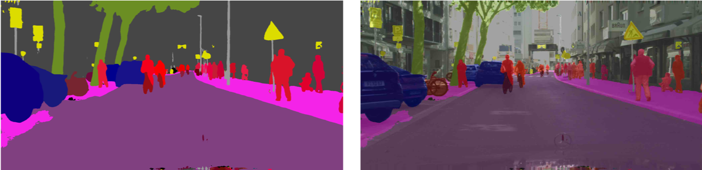
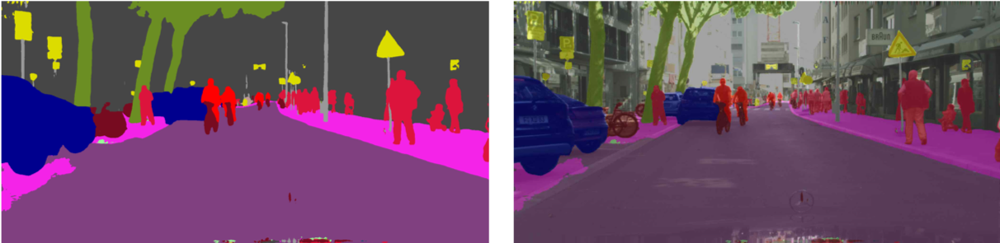

English | [简体中文](README_CN.md)

# Panoptic DeepLab

The implementation of [Panoptic Deeplab](https://arxiv.org/abs/1911.10194) algorithm based on PaddlePaddle.

Panoptic DeepLab has comfirmed that the bottem-up algorithm can achieve state-of-the-art effect for the first time。Panoptic DeepLab predicts three ouputs: Semantic Segmentation, Center Prediction and Center Regression。According to the principle of nearest distance, the pixels of instance category are gathered to the center of the instance to obtain the segmentation result. Finally, according to the rules of majority-vote, semantic segmentation results and instance segmentation results are fused to obtain the final panoptic segmentation results.
It achieves segmentation by assigning each pixel to one category or instance.


## Model Baselines

### Cityscapes
| Backbone | Batch Size |Resolution | Training Iters | PQ | SQ | RQ | AP | mIoU | Links |
|:-:|:-:|:-:|:-:|:-:|:-:|:-:|:-:|:-:|:-:|
|ResNet50_OS32| 8  | 2049x1025|90000|58.35%|80.03%|71.52%|25.80%|79.18%|[model](https://bj.bcebos.com/paddleseg/dygraph/pnoptic_segmentation/panoptic_deeplab_resnet50_os32_cityscapes_2049x1025_bs1_90k_lr00005/model.pdparams) \| [log](https://bj.bcebos.com/paddleseg/dygraph/pnoptic_segmentation/panoptic_deeplab_resnet50_os32_cityscapes_2049x1025_bs1_90k_lr00005/train.log)|
|ResNet50_OS32| 64 | 1025x513|90000|60.32%|80.56%|73.56%|26.77%|79.67%|[model](https://bj.bcebos.com/paddleseg/dygraph/pnoptic_segmentation/panoptic_deeplab_resnet50_os32_cityscapes_1025x513_bs8_90k_lr00005/model.pdparams) \| [log](https://bj.bcebos.com/paddleseg/dygraph/pnoptic_segmentation/panoptic_deeplab_resnet50_os32_cityscapes_1025x513_bs8_90k_lr00005/train.log)|

## Environment Installation

1. System environment
* PaddlePaddle >= 2.0.0
* Python >= 3.6+
PaddlePaddle of GPU version is recommended。Please refer to the official website for detailed installation tutorials[PaddlePaddle](https://www.paddlepaddle.org.cn/install/quick?docurl=/documentation/docs/zh/install/pip/windows-pip.html)

2. Download PaddleSeg repository
```shell
git clone https://github.com/PaddlePaddle/PaddleSeg
```

3. Install paddleseg
```shell
cd PaddleSeg
pip install -e .
```

4. Enter PaddleSeg/contrib/PanopticDeepLab directory
```shell
cd contrib/PanopticDeepLab
```

## Dataset Preparation

Please put the dataset in `data` directory under the `PaddleSeg/contrib/PanopticDeepLab`.

### Cityscapes

Go to [CityScapes website](https://www.cityscapes-dataset.com/) to download dataset and make is as the following structure:

```
cityscapes/
|--gtFine/
|  |--train/
|  |  |--aachen/
|  |  |  |--*_color.png, *_instanceIds.png, *_labelIds.png, *_polygons.json,
|  |  |  |--*_labelTrainIds.png
|  |  |  |--...
|  |--val/
|  |--test/
|  |--cityscapes_panoptic_train_trainId.json
|  |--cityscapes_panoptic_train_trainId/
|  |  |-- *_panoptic.png
|  |--cityscapes_panoptic_val_trainId.json
|  |--cityscapes_panoptic_val_trainId/
|  |  |--  *_panoptic.png
|--leftImg8bit/
|  |--train/
|  |--val/
|  |--test/

```

Install CityscapesScripts
```shell
pip install git+https://github.com/mcordts/cityscapesScripts.git
```

`*_panoptic.png` Generation command (need to find the `createPanopticImgs.py` file)：
```shell
python /path/to/cityscapesscripts/preparation/createPanopticImgs.py \
        --dataset-folder data/cityscapes/gtFine/ \
        --output-folder data/cityscapes/gtFine/ \
        --use-train-id
```

## Training
```shell
export CUDA_VISIBLE_DEVICES=0,1,2,3,4,5,6,7 # 根据实际情况进行显卡数量的设置
python -m paddle.distributed.launch train.py \
       --config configs/panoptic_deeplab/panoptic_deeplab_resnet50_os32_cityscapes_1025x513_bs8_90k_lr00005.yml \
       --do_eval \
       --use_vdl \
       --save_interval 5000 \
       --save_dir output
```

**note:** Using --do_eval affects training speed and increases GPU memory consumption, turning on and off as you need.

To view more informationg of parameters, run the following command:
```shell
python train.py --help
```

## Evaluation
```shell
python val.py \
       --config configs/panoptic_deeplab/panoptic_deeplab_resnet50_os32_cityscapes_1025x513_bs8_90k_lr00005.yml \
       --model_path output/iter_90000/model.pdparams
```
You can download the pretrained model we provide for evaluation directly.

To view more informationg of parameters, run the following command:
```shell
python val.py --help
```

## Prediction
```shell
export CUDA_VISIBLE_DEVICES=0,1,2,3,4,5,6,7 # Set the number of GPUs as required.
python -m paddle.distributed.launch predict.py \
    --config configs/panoptic_deeplab/panoptic_deeplab_resnet50_os32_cityscapes_1025x513_bs8_90k_lr00005.yml \
    --model_path output/iter_90000/model.pdparams \
    --image_path data/cityscapes/leftImg8bit/val/ \
    --save_dir ./output/result
```
You can download the pretrained model we provide for prediction directly.

To view more informationg of parameters, run the following command:
```shell
python predict.py --help
```
Panoptic segmentations results:
<center>
    
</center>

Semantic segmentations results:
<center>
    
</center>

Instance sementations results:
<center>
    
</center>
