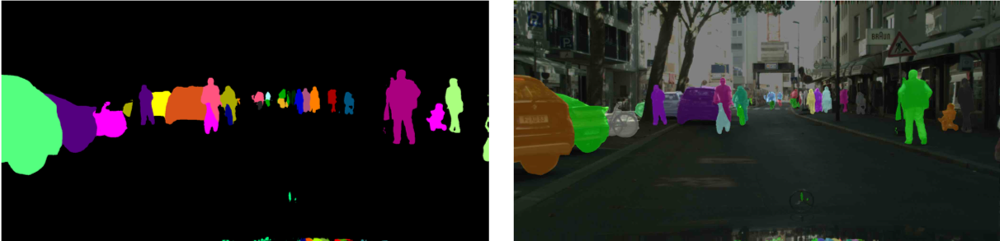

简体中文 | [English](README.md)
# Panoptic DeepLab

基于PaddlePaddle实现[Panoptic Deeplab](https://arxiv.org/abs/1911.10194)全景分割算法。

Panoptic DeepLab首次证实了bottem-up算法能够达到state-of-the-art的效果。Panoptic DeepLab预测三个输出：Semantic Segmentation, Center Prediction 和 Center Regression。实例类别像素根据最近距离原则聚集到实例中心点得到实例分割结果。最后按照majority-vote规则融合语义分割结果和实例分割结果，得到最终的全景分割结果。
其通过将每一个像素赋值给某一个类别或实例达到分割的效果。


## Model Baselines

### Cityscapes
| Backbone | Batch Size |Resolution | Training Iters | PQ | SQ | RQ | AP | mIoU | Links |
|:-:|:-:|:-:|:-:|:-:|:-:|:-:|:-:|:-:|:-:|
|ResNet50_OS32| 8  | 2049x1025|90000|58.35%|80.03%|71.52%|25.80%|79.18%|[model](https://bj.bcebos.com/paddleseg/dygraph/pnoptic_segmentation/panoptic_deeplab_resnet50_os32_cityscapes_2049x1025_bs1_90k_lr00005/model.pdparams) \| [log](https://bj.bcebos.com/paddleseg/dygraph/pnoptic_segmentation/panoptic_deeplab_resnet50_os32_cityscapes_2049x1025_bs1_90k_lr00005/train.log)|
|ResNet50_OS32| 64 | 1025x513|90000|60.32%|80.56%|73.56%|26.77%|79.67%|[model](https://bj.bcebos.com/paddleseg/dygraph/pnoptic_segmentation/panoptic_deeplab_resnet50_os32_cityscapes_1025x513_bs8_90k_lr00005/model.pdparams) \| [log](https://bj.bcebos.com/paddleseg/dygraph/pnoptic_segmentation/panoptic_deeplab_resnet50_os32_cityscapes_1025x513_bs8_90k_lr00005/train.log)|

## 环境安装

1. 系统环境
* PaddlePaddle >= 2.0.0
* Python >= 3.6+
推荐使用GPU版本的PaddlePaddle版本。详细安装教程请参考官方网站[PaddlePaddle](https://www.paddlepaddle.org.cn/install/quick?docurl=/documentation/docs/zh/install/pip/windows-pip.html)

2. 下载PaddleSeg repository
```shell
git clone https://github.com/PaddlePaddle/PaddleSeg
```

3. 安装paddleseg
```shell
cd PaddleSeg
pip install -e .
```

4. 进入PaddleSeg/contrib/PanopticDeepLab目录
```shell
cd contrib/PanopticDeepLab
```

## 数据集准备

将数据集放置于`PaddleSeg/contrib/PanopticDeepLab`目录下的`data`目录下。

### Cityscapes

前往[CityScapes官网](https://www.cityscapes-dataset.com/)下载数据集并整理成如下结构:

```
cityscapes/
|--gtFine/
|  |--train/
|  |  |--aachen/
|  |  |  |--*_color.png, *_instanceIds.png, *_labelIds.png, *_polygons.json,
|  |  |  |--*_labelTrainIds.png
|  |  |  |--...
|  |--val/
|  |--test/
|  |--cityscapes_panoptic_train_trainId.json
|  |--cityscapes_panoptic_train_trainId/
|  |  |-- *_panoptic.png
|  |--cityscapes_panoptic_val_trainId.json
|  |--cityscapes_panoptic_val_trainId/
|  |  |--  *_panoptic.png
|--leftImg8bit/
|  |--train/
|  |--val/
|  |--test/

```

安装CityscapesScripts
```shell
pip install git+https://github.com/mcordts/cityscapesScripts.git
```

`*_panoptic.png` 生成命令(需找到`createPanopticImgs.py`文件)：
```shell
python /path/to/cityscapesscripts/preparation/createPanopticImgs.py \
        --dataset-folder data/cityscapes/gtFine/ \
        --output-folder data/cityscapes/gtFine/ \
        --use-train-id
```

## 训练
```shell
export CUDA_VISIBLE_DEVICES=0,1,2,3,4,5,6,7 # 根据实际情况进行显卡数量的设置
python -m paddle.distributed.launch train.py \
       --config configs/panoptic_deeplab/panoptic_deeplab_resnet50_os32_cityscapes_1025x513_bs8_90k_lr00005.yml \
       --do_eval \
       --use_vdl \
       --save_interval 5000 \
       --save_dir output
```

**note:** 使用--do_eval会影响训练速度及增加显存消耗，根据选择进行开闭。

更多参数信息请运行如下命令进行查看:
```shell
python train.py --help
```

## 评估
```shell
python val.py \
       --config configs/panoptic_deeplab/panoptic_deeplab_resnet50_os32_cityscapes_1025x513_bs8_90k_lr00005.yml \
       --model_path output/iter_90000/model.pdparams
```
你可以直接下载我们提供的模型进行评估。

更多参数信息请运行如下命令进行查看:
```shell
python val.py --help
```

## 预测
```shell
export CUDA_VISIBLE_DEVICES=0,1,2,3,4,5,6,7 # 根据实际情况进行显卡数量的设置
python -m paddle.distributed.launch predict.py \
    --config configs/panoptic_deeplab/panoptic_deeplab_resnet50_os32_cityscapes_1025x513_bs8_90k_lr00005.yml \
    --model_path output/iter_90000/model.pdparams \
    --image_path data/cityscapes/leftImg8bit/val/ \
    --save_dir ./output/result
```
你可以直接下载我们提供的模型进行预测。

更多参数信息请运行如下命令进行查看:
```shell
python predict.py --help
```
全景分割结果:
<center>
    
</center>

语义分割结果:
<center>
    
</center>

实例分割结果:
<center>
    
</center>
