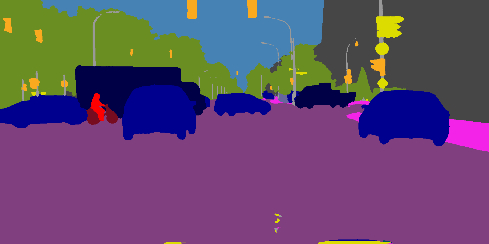

English | [简体中文](full_features_cn.md)

# Full Features

## 0 Contents

+ [1 Installation](#1-installation)
+ [2 Dataset Preparation](#2-dataset-preparation)
+ [3 Writing Configuration Files](#3-writing-configuration-files)
+ [4 Model Training](#4-model-training)
+ [5 Model Deployment](#5-model-deployment)

## 1 Installation

### 1.1 Install PaddlePaddle

+ PaddlePaddle >= 2.4.0
+ Python >= 3.7

Due to the high computational cost of model training, GPU version of PaddlePaddle (with CUDA 10.2 or later) is highly recommended. See [PaddlePaddle official website](https://www.paddlepaddle.org.cn/en/install/quick?docurl=/documentation/docs/en/develop/install/pip/linux-pip_en.html) for the installation tutorial.

### 1.2 Download PaddleSeg

```shell
git clone https://github.com/PaddlePaddle/PaddleSeg
```

By default we are fetching the latest release version of PaddleSeg. Note that the following requirement should be met:

+ PaddleSeg >= 2.8

### 1.3 Install PaddleSeg and Panoptic Segmentation Toolkit

First, switch to root directory of the cloned PaddleSeg repo and run the following instructions:

```shell
# Install dependencies of PaddleSeg
pip install -r requirements.txt
# Install PaddleSeg
pip install .
```

Then, install the toolkit by running the following instructions:

```shell
cd PaddleSeg/contrib/PanopticSeg
# Install dependencies
pip install -r requirements.txt
# Install panoptic segmentation toolkit in editable mode
pip install -e .
```

### 1.4 Check Installation

Run the following instructions:

```shell
python -c "import paddlepanseg; print(paddlepanseg.__version__)"
```

If the version number of the toolkit is printed, you can verify that the installation was successful.

## 2 Dataset Preparation

This toolkit supports model training and evaluation on both public datasets and user-created datasets. In general, a PaddleSeg-style *file list* is required for each subset of the dataset to be used, in addition to the JSON annotations. The content of the file list follows the [PaddleSeg rules](https://github.com/PaddlePaddle/PaddleSeg/blob/release/2.7/docs/data/custom/data_prepare.md), except for the path to the panoptic labels (encoded in an RGB image) are used in place of the path to the semantic segmentation labels. 

### 2.1 Prepare Public Datasets

For commonly used public datasets, we provide some useful scripts to automatically preprocess data and generate file lists. These scripts, along with the detailed usage, can be found in `tools/data`.

### 2.2 Prepare Custom Dataset

In order to train and evaluate panoptic segmentation models on a custom dataset, you have to create file lists first. The file list contains a number of rows, each representing a training/validation sample. In each row, there is a pair of paths separated by a single blank, with the first path pointing to the original image and the second path pointing to the panoptic labels. For example:

```plain
val2017/000000001000.jpg panoptic_val2017/000000001000.png
val2017/000000001268.jpg panoptic_val2017/000000001268.png
val2017/000000001296.jpg panoptic_val2017/000000001296.png
val2017/000000001353.jpg panoptic_val2017/000000001353.png
val2017/000000001425.jpg panoptic_val2017/000000001425.png
...
```

One have to ensure that the panoptic labels are encoded in an RGB image, with the pixel values of the R, G, and B channels determined by:

```plain
r = id % 256
g = id // 256 % 256
b = id // (256 * 256) % 256
```

where `id` is a unique identifier for each instance/stuff region in the image.

## 3 Writing Configuration Files

Like PaddleSeg, we define several components (e.g. datasets, models) following a modular design, and all components are completely configurable. A configuration file is the recommended way to set the hyperparameters used to construct each component in model training, evaluation, and deployment.

### 3.1 Basic Rules

Since this toolkit is built on top of the PaddleSeg API, the basic rules of writing configuration files conform to PaddleSeg standard. Please read the [PaddleSeg documentation](https://github.com/PaddlePaddle/PaddleSeg/blob/release/2.7/docs/config/pre_config.md) for more details.

### 3.2 Postprocessors

In addition to the basic rules, this toolkit provides some special components to accommodate the characteristics of the panoptic segmentation task, which can also be configured via configuration files. Among these components are postprocessors. Roughly speaking, postprocessors are designed to be responsible for the transformation from the network output to the final panoptic segmentation result (i.e. all instance IDs in the image and the semantic class of each pixel).

To configure the parameters used to construct the postprocessor, add or modify the `postprocessor` key-value pair in the configuration file:

```yaml
postprocessor:
  type: MaskFormerPostprocessor
  num_classes: 19
  object_mask_threshold: 0.8
  overlap_threshold: 0.8
  label_divisor: 1000
  ignore_index: 255
```

For all postprocessors, you can set these four attributes: `num_classes`, `thing_ids`, `label_divisor`, and `ignore_index`. If any of the four attributes is not configured in `postprocessor`in the configuration file, the toolkit will first try to parse the value from `val_dataset` (with the same key), before using a pre-defined default value. 

### 3.3 `Collect`

A distinct difference between the configuration files of PaddleSeg and this toolkit is that **all** data transformations defined in this toolkit must end with `Collect`. The reason behind is that we use an [`InfoDict`](dev_guide_en.md#21-infodict)-based pipeline for data preprocessing, where `Collect` are used to pick out the key-value pairs we require from the `InfoDict` object.

Generally, the following keys are necessary for model training:

+ `img`: Preprocessed image that will be used as the network input.
+ `label`: Preprocessed panoptic segmentation labels.
+ `img_path`: Path of the original input image.
+ `lab_path`: Path of the ground-truth panoptic segmentation labels.
+ `img_h`: Height of the original image.
+ `img_w`: Width of the original image.

And the following keys are necessary for model evaluation:

+ `img`: Preprocessed image that will be used as the network input.
+ `label`: Preprocessed panoptic segmentation labels.
+ `ann`: Annotation information parsed from the JSON file.
+ `image_id`: ID of the original image.
+ `gt_fields`: Stores keys of the items in the `InfoDict` object that should be marked as a ground-truth map.
+ `trans_info`: Stores the meta information of tensor shape, used to recover the original shape of the image.
+ `img_path`: Path of the original input image.
+ `lab_path`: Path of the ground-truth panoptic segmentation labels.
+ `pan_label`: Preprocessed ground-truth panoptic segmentation labels.
+ `sem_label`: Preprocessed ground-truth semantic segmentation labels.
+ `ins_label`: Preprocessed ground-truth instance segmentation labels.

## 4 Model Training

### 4.1 Train a Model

The basic instruction for training is:

```shell
python tools/train.py \
    --config {CONFIG_PATH}
```

Typically, we configure some experimental parameters through setting command-line options. Note that the arguments passed from the command-line has **higher precedence** than those specified in the configuration file, which is useful when we need to *temporarily overwrite* a setting. Overall, `tools/train.py` supports command-line options very similar to the training script of PaddleSeg. You can find a full list of the command-line options by reading the [PaddleSeg documentation](https://github.com/PaddlePaddle/PaddleSeg/blob/release/2.7/docs/train/train.md) and by running:

```shell
python tools/train.py --help
```

We list some of the most important command-line options below:

+ `--config`: Path of the configuration file. 
+ `--save_dir`: Directory to save the model checkpoints.
+ `--num_workers`: Number of subprocesses used for data prefetching.
+ `--do_eval`: To periodically evaluate the model (also known as model validation) during training.
+ `--log_iters`: Logs will be displayed at every `log_iters`.
+ `--eval_sem`: To calculate semantic segmentation metrics (e.g. mIoU) during validation.
+ `--eval_ins`: To calculate instance segmentation metrics (e.g. mAP) during validation.
+ `--debug`: To enable debug mode. In debug mode, a [pdb](https://docs.python.org/3/library/pdb.html) breakpoint will be set where an exception is raised to abort the program, to facilitate post-mortem debugging.

By default we do not dump logs to files, as it is convenient to write to logs via shell utilities. For example:

```shell
TAG='mask2former'
python tools/train.py \
    --config configs/mask2former/mask2former_resnet50_os16_coco_1024x1024_bs4_370k.yml \
    --log_iters 50 \
    --num_workers 4 \
    --do_eval \
    --eval_sem \
    --eval_ins \
    --save_dir "output/${TAG}" \
    2>&1 \
    | tee "output/train_${TAG}.log"
```

For distributed training using multiple GPUs, run the script with `python -m paddle.distributed.launch`. For example:

```shell
# Set IDs of the devices to use
export CUDA_VISIBLE_DEVICES=0,1,2,3,4,5,6,7
python -m paddle.distributed.launch tools/train.py \
    --config {CONFIG_PATH}
```

Also note that some models have prerequisites. For example, you may have to compile an external C++/CUDA operator before performing any further steps. You can find the detailed instructions in the documentation for each model in `config`.

### 4.2 Evaluate the Model

During and after training, you can find model checkpoints that store model weights and (possibly) optimizer parameters in `output` (specified by the `--save_dir` option in `tools/train.py`). You can evaluate the model weights that achieve the highest [panoptic quality (PQ)](https://openaccess.thecvf.com/content_CVPR_2019/papers/Kirillov_Panoptic_Segmentation_CVPR_2019_paper.pdf) metric on the validation set (i.e. the checkpoint `output/best_model`) by running:

```shell
python tools/val.py \
    --config {CONFIG_PATH} \
    --model_path output/best_model/model.pdparams
```

To evaluate the performance of other checkpoints, be free to change `--model_path`. See `python tools/val.py --help` for a full list of command-line options.

Like `tools/train.py`, semantic segmentation metrics and instance segmentation metrics will be reported if `--eval_sem` and `--eval_ins` are set, respectively. Note, however, that calculating these metrics will require a longer evaluation time.

### 4.3 Get Visualization Results

Run the following instructions to run inference on one or multiple images and visualize the panoptic segmentation results:

```shell
python tools/predict.py \
    --config {CONFIG_PATH} \
    --model_path {MODEL_PATH} \
    --image_path {PATH_TO_SINGLE_IMAGE_OR_FOLDER} \
    --save_dir {PATH_TO_SAVE_RESULTS}
```

See `python tools/predict.py --help` for a full list of command-line options.

After executing the above script, the visualization results can be found in the path specified by `--save_dir`. For each input image, there are three resulting images that demonstrate the network prediction from different perspectives:

+ `{PREFIX}_sem.png`: Color of each pixel represents the semantic class.



+ `{PREFIX}_ins.png`: Different colors in the image stand for different instances. For stuff classes, all pixels of that class are considered to belong to **one** instance.


+ `{PREFIX}_pan.png`: Different *base* colors are used to mark different semantic classes. For thing classes, a unique color offset is added to each instance to distinguish different instances.


## 5 Model Deployment

### 5.1 Export the Model

For higher efficiency, we recommend converting models to a static graph format for inference. Run the following instructions:

```shell
python tools/export.py \
    --config {CONFIG_PATH} \
    --model_path {MODEL_PATH} \
    --save_dir {PATH_TO_SAVE_EXPORTED_MODEL} \
    --input_shape {FIXED_SHAPE_OF_INPUT_TENSOR}
```

Please refer to the [PaddleSeg documentation](https://github.com/PaddlePaddle/PaddleSeg/blob/release/2.7/docs/model_export.md) for more details on model export. Please also note that not all models are available for export. See the documentation for a particular model in `configs` to check if exporting is supported.

### 5.2 Infer Using Paddle-Inference API

Run the following instructions to perform model inference based on the [Paddle-Inference](https://github.com/PaddlePaddle/Paddle) API:

```shell
python deploy/python/infer.py \
    --config {DEPLOY_CONFIG_PATH} \
    --image_path {PATH_TO_SINGLE_IMAGE_OR_FOLDER}
```

Please note that `{DEPLOY_CONFIG_PATH}` is the path to the `deploy.yaml` file of the exported model. 

The output inference result is an RGB image with the pixel values:

```plain
r = pan_id % 256
g = pan_id // 256 % 256
b = pan_id // (256 * 256) % 256
```

where `pan_id` is a unique identifier representing either an instance (of thing class) or stuff region in the image, which is given by the network and the postprocessor. You can read more about how `pan_id` is calculated in [this document](encoding_protocol_en.md).