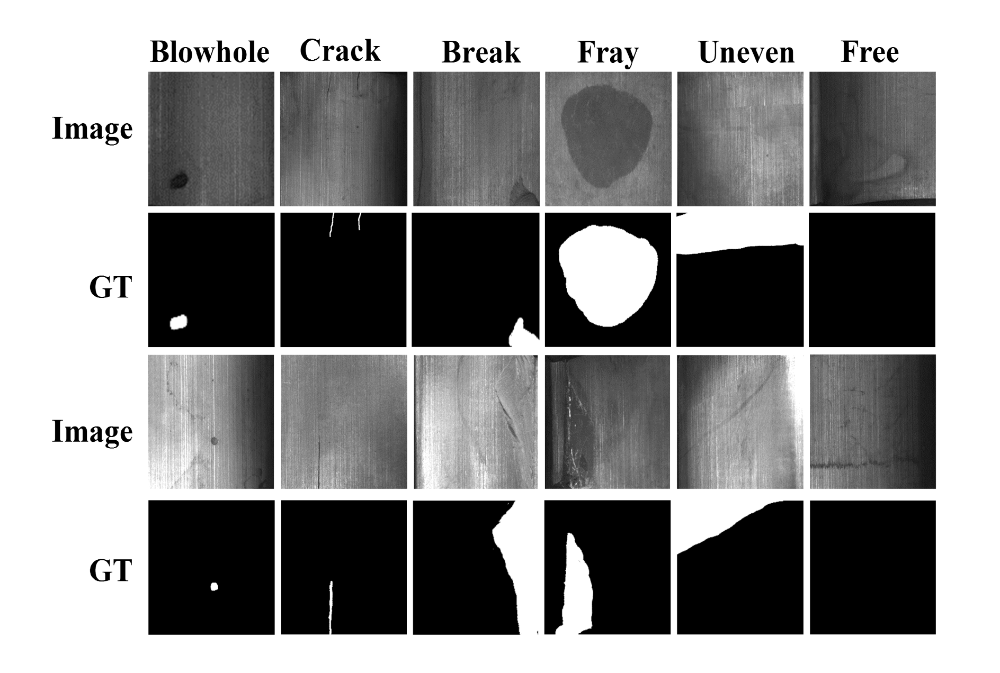

# 1 准备数据集

由于工业数据集没有统一的数据组织形式，该部分以Magnetic tile defect datasets数据为例进行说明，分割任务训练只要将数据集整理为以下2.2的文件组织形式，路径添加到配置文件中，即可进行分割任务的训练。若需要进行检测任务的训练，可按照以下2.4的说明，转为检测任务支持的json文件。

另外，也可以参考[PaddleDetection数据准备](https://github.com/PaddlePaddle/PaddleDetection/blob/release/2.6/docs/tutorials/data/PrepareDetDataSet.md)或[PaddleSeg数据准备](https://github.com/PaddlePaddle/PaddleSeg/blob/develop/docs/data/marker/marker_cn.md)的具体说明进行数据集的组织。

## 1.1 公开数据集下载

请前往[Magnetic-tile-defect-datasets](https://github.com/abin24/Magnetic-tile-defect-datasets.)下载数据集。 "Saliency of magnetic tile surface defects"论文中发布的数据集，收集了采集了6类常见磁砖图像（Free为正常OK图），并对其进行了像素级标记, 如下图：




下载保存到`dataset`路径，数据集结构如下：

```
    Magnetic-Tile-Defect
    |
    |--MT_Blowhole
    |  |--Imgs
    |  |  |--exp1_xxx.jpg
    |  |  |--exp1_xxx.png
    |  |  ...
    |--MT_Break
    |  |--Imgs
    |  |  |--exp1_xxx.jpg
    |  |  |--exp1_xxx.png
    |  |  ...
    |  ...
    |--MT_Free
    |  |--Imgs
    |--MT_Uneven
    |  |--Imgs
```

## 1.2 转换为全图分割训练数据格式

下载原始数据集后，运行下面命令进行转换，其中`dataset_path`是数据集保存的目录，`output_path`是保存路径，执行完成后，转换后的数据集保存在`dataset/MT_dataset/`路径下，保存为标准的PaddleSeg数据训练格式。

```shell
python3 tools/dataset/MT_dataset.py --dataset_path ./dataset/Magnetic-Tile-Defect --output_path ./dataset/MT_dataset/
```

数据转换后的结构如下：

```
    MT_dataset
    |
    |--images
    |  |--train
    |  |  |--exp1_xxx.jpg
    |  |  |--exp1_xxx.jpg
    |  |  ...
    |  |--val
    |  |  |--exp6_xxx.jpg
    |  |  |--exp6_xxx.jpg
    |--annos
    |  |--train
    |  |  |--exp1_xxx.png
    |  |  |--exp1_xxx.png
    |  |  ...
    |  |--val
    |  |  |--exp6_xxx.png
    |  |  |--exp6_xxx.png
    |--train.txt
    |--val.txt
```

其中train.txt和val.txt保存了原图和其对应的标签图像的相对路径。

## 1.3 将全图分割数据转为RoI分割文件

在2.2中，转换为标准分割数据格式后，如果需要尝试区域分割，具体可以参考[数据转换工具](./conver_tools.md#31-全图分割标签转roi分割)中3.1的说明，运行命令如下：

```shell
python3 tools/convert_tools/convert_mask_to_roi.py --image_path dataset/MT_dataset/images/train --anno_path dataset/MT_dataset/annos/train --class_num 5 --output_path dataset/MT_dataset/RoI/ --suffix .png --to_binary
```

其中由于除去背景是5类缺陷，因此分割class_num是5。

## 1.4 将全图分割数据转为coco格式的json文件

在2.2中，转换为标准分割数据格式后，如果需要尝试检测算法，具体可以参考[数据转换工具](./conver_tools.md#32-分割标签转coco格式json文件)中3.2的说明，运行命令如下：

```shell
python3 tools/convert_tools/convert_mask_to_coco.py --image_path dataset/MT_dataset/images/train --anno_path dataset/MT_dataset/annos/train --class_num 5 --label_file dataset/MT_dataset/mt_catIDs.json --output_name dataset/MT_dataset/train.json --suffix .png
```

其中由于除去背景是5类缺陷，因此class_num是5，执行该命令后，在`dataset/MT_dataset/train.json`中保存了train数据的coco格式检测训练文件。
