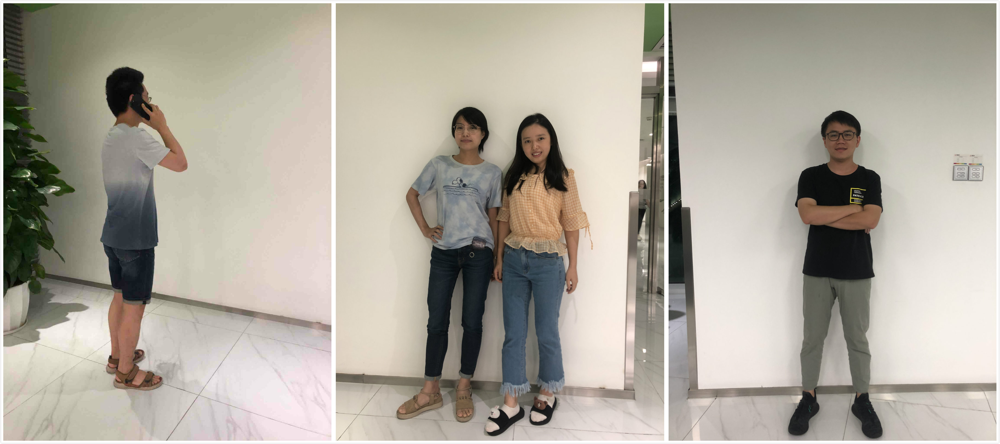
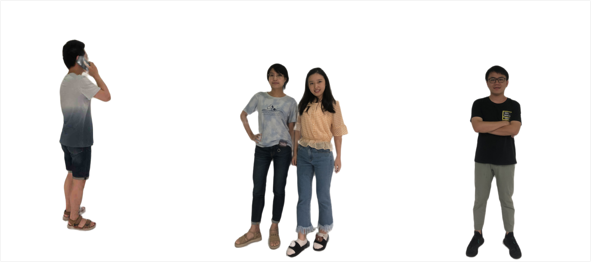
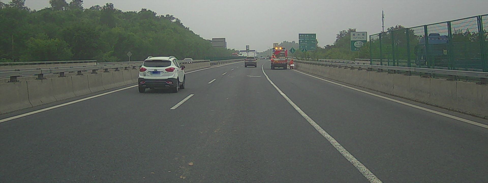
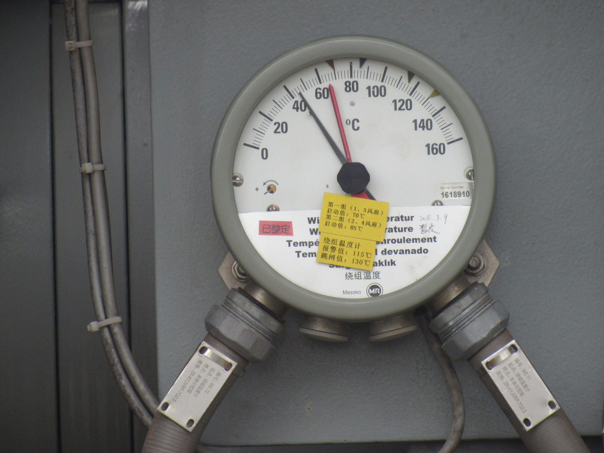
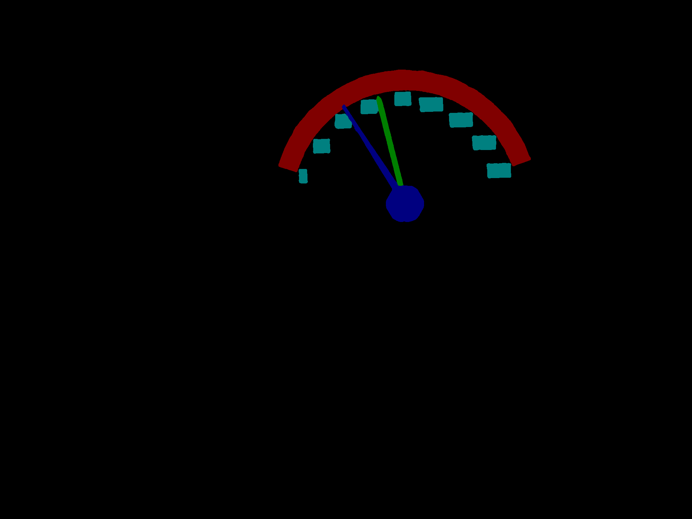

# PaddleSeg 特色垂类分割模型

提供基于PaddlePaddle最新的分割特色模型:

- [人像分割](#人像分割)
- [人体解析](#人体解析)
- [车道线分割](#车道线分割)
- [工业用表分割](#工业用表分割)
- [在线体验](#在线体验)

## 人像分割

**Note:** 本章节所有命令均在`contrib/HumanSeg`目录下执行。

```
cd contrib/HumanSeg
```

### 1. 模型结构

DeepLabv3+ backbone为Xception65

### 2. 下载模型和数据
 
执行以下命令下载并解压模型和数据集：

```
python download_HumanSeg.py
```

或点击[链接](https://paddleseg.bj.bcebos.com/models/HumanSeg.tgz)进行手动下载，并解压到contrib/HumanSeg文件夹下


### 3. 运行

使用GPU预测：
```
python -u infer.py --example HumanSeg --use_gpu
```


使用CPU预测：
```
python -u infer.py --example HumanSeg
```


预测结果存放在contrib/HumanSeg/HumanSeg/result目录下。

### 4. 预测结果示例：

  原图：
  
  
  
  预测结果：
  
  


## 人体解析


人体解析(Human Parsing)是细粒度的语义分割任务，旨在识别像素级别的人类图像的组成部分（例如，身体部位和服装）。本章节使用冠军模型Augmented Context Embedding with Edge Perceiving (ACE2P)进行预测分割。


**Note:** 本章节所有命令均在`contrib/ACE2P`目录下执行。

```
cd contrib/ACE2P
```

### 1. 模型概述

Augmented Context Embedding with Edge Perceiving (ACE2P)通过融合底层特征、全局上下文信息和边缘细节，端到端训练学习人体解析任务。以ACE2P单人人体解析网络为基础的解决方案在CVPR2019第三届Look into Person (LIP)挑战赛中赢得了全部三个人体解析任务的第一名。详情请参见[ACE2P](./ACE2P)

### 2. 模型下载

执行以下命令下载并解压ACE2P预测模型：

```
python download_ACE2P.py
```

或点击[链接](https://paddleseg.bj.bcebos.com/models/ACE2P.tgz)进行手动下载, 并在contrib/ACE2P下解压。

### 3. 数据下载

测试图片共10000张，
点击 [Baidu_Drive](https://pan.baidu.com/s/1nvqmZBN#list/path=%2Fsharelink2787269280-523292635003760%2FLIP%2FLIP&parentPath=%2Fsharelink2787269280-523292635003760)
下载Testing_images.zip，或前往LIP数据集官网进行下载。
下载后解压到contrib/ACE2P/data文件夹下


### 4. 运行


使用GPU预测
```
python -u infer.py --example ACE2P --use_gpu
```

使用CPU预测：
```
python -u infer.py --example ACE2P
```

**NOTE:** 运行该模型需要2G左右显存。由于数据图片较多，预测过程将比较耗时。

#### 5. 预测结果示例：
  
  原图：
  
  
  
  预测结果：
  
  
  
### 备注

1. 数据及模型路径等详细配置见ACE2P/HumanSeg/RoadLine下的config.py文件
2. ACE2P模型需预留2G显存，若显存超可调小FLAGS_fraction_of_gpu_memory_to_use


## 车道线分割

**Note:** 本章节所有命令均在`contrib/RoadLine`目录下执行。

```
cd contrib/RoadLine
```

### 1. 模型结构

Deeplabv3+ backbone为MobileNetv2


### 2. 下载模型和数据

 
执行以下命令下载并解压模型和数据集：

```
python download_RoadLine.py
```

或点击[链接](https://paddleseg.bj.bcebos.com/inference_model/RoadLine.tgz)进行手动下载，并解压到contrib/RoadLine文件夹下


### 3. 运行
  
使用GPU预测：

```
python -u infer.py --example RoadLine --use_gpu
```


使用CPU预测：

```
python -u infer.py --example RoadLine
```

预测结果存放在contrib/RoadLine/RoadLine/result目录下。

#### 4. 预测结果示例：
  
  原图：
  
  
  
  预测结果：
  
  


## 工业用表分割


**Note:** 本章节所有命令均在`PaddleSeg`目录下执行。

### 1. 模型结构

unet

### 2. 数据准备
 
执行以下命令下载并解压数据集，数据集将存放在contrib/MechanicalIndustryMeter文件夹下：

```
python ./contrib/MechanicalIndustryMeter/download_mini_mechanical_industry_meter.py
```


### 3. 下载预训练模型

```
python ./pretrained_model/download_model.py unet_bn_coco
```

### 4. 训练与评估

```
export CUDA_VISIBLE_DEVICES=0 
python ./pdseg/train.py --log_steps 10 --cfg contrib/MechanicalIndustryMeter/unet_mechanical_meter.yaml --use_gpu --do_eval --use_mpio 
```

### 5. 可视化
我们已提供了一个训练好的模型，执行以下命令进行下载，下载后将存放在./contrib/MechanicalIndustryMeter/文件夹下。

```
python ./contrib/MechanicalIndustryMeter/download_unet_mechanical_industry_meter.py
```

使用该模型进行预测可视化：

```
python ./pdseg/vis.py --cfg contrib/MechanicalIndustryMeter/unet_mechanical_meter.yaml --use_gpu --vis_dir vis_meter \
TEST.TEST_MODEL "./contrib/MechanicalIndustryMeter/unet_mechanical_industry_meter/" 
```
可视化结果会保存在./vis_meter文件夹下。

### 6. 可视化结果示例：

  原图：
  
  
  
  预测结果：
  
  

## 在线体验

PaddleSeg在AI Studio平台上提供了在线体验的教程，欢迎体验：

|教程|链接|
|-|-|
|工业质检|[点击体验](https://aistudio.baidu.com/aistudio/projectdetail/184392)|
|人像分割|[点击体验](https://aistudio.baidu.com/aistudio/projectdetail/188833)|
|特色垂类模型|[点击体验](https://aistudio.baidu.com/aistudio/projectdetail/226710)|


