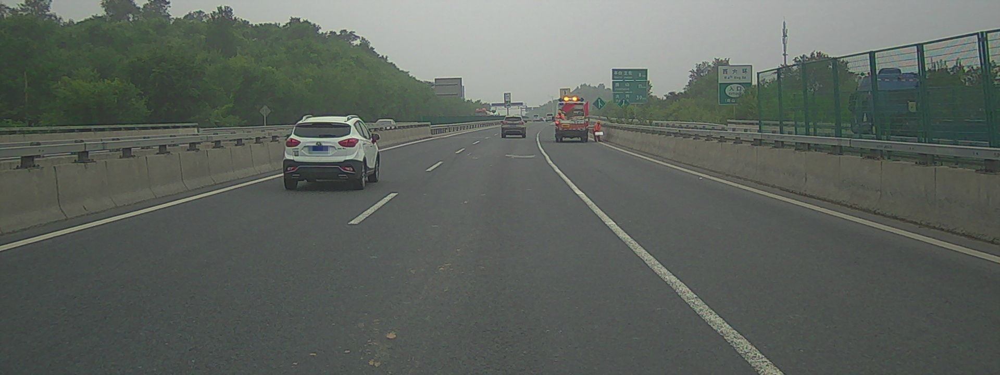

# PaddleSeg 特色垂类分割模型

提供基于PaddlePaddle最新的分割特色模型

## Augmented Context Embedding with Edge Perceiving (ACE2P)


### 1. 模型概述

CVPR 19 Look into Person (LIP) 单人人像分割比赛冠军模型，详见[ACE2P](./ACE2P)

### 2. 模型下载

点击[链接](https://paddleseg.bj.bcebos.com/models/ACE2P.tgz)，下载, 在contrib/ACE2P下解压, `tar -xzf ACE2P.tgz`

### 3. 数据下载

前往LIP数据集官网: http://47.100.21.47:9999/overview.php 或点击 [Baidu_Drive](https://pan.baidu.com/s/1nvqmZBN#list/path=%2Fsharelink2787269280-523292635003760%2FLIP%2FLIP&parentPath=%2Fsharelink2787269280-523292635003760), 

加载Testing_images.zip, 解压到contrib/ACE2P/data文件夹下


### 4. 运行

**NOTE:** 运行该模型需要2G左右显存

使用GPU预测
```
python -u infer.py --example ACE2P --use_gpu
```

使用CPU预测：
```
python -u infer.py --example ACE2P
```

## 人像分割 (HumanSeg)


### 1. 模型结构

DeepLabv3+ backbone为Xception65

### 2. 下载模型和数据
 
点击[链接](https://paddleseg.bj.bcebos.com/models/HumanSeg.tgz)，下载解压到contrib文件夹下


### 3. 运行

使用GPU预测：
```
python -u infer.py --example HumanSeg --use_gpu
```


使用CPU预测：
```
python -u infer.py --example HumanSeg
```


### 4. 预测结果示例：

  原图：
  
  预测结果：

## 车道线分割 (RoadLine)

### 1. 模型结构

Deeplabv3+ backbone为MobileNetv2


### 2. 下载模型和数据

点击[链接](https://paddleseg.bj.bcebos.com/inference_model/RoadLine.tgz)，下载解压在contrib文件夹下

### 3. 运行
  
使用GPU预测：

```
python -u infer.py --example RoadLine --use_gpu
```


使用CPU预测：

```
python -u infer.py --example RoadLine
```


#### 4. 预测结果示例：
  
  原图：
  
  预测结果：

# 备注

1. 数据及模型路径等详细配置见ACE2P/HumanSeg/RoadLine下的config.py文件
2. ACE2P模型需预留2G显存，若显存超可调小FLAGS_fraction_of_gpu_memory_to_use
