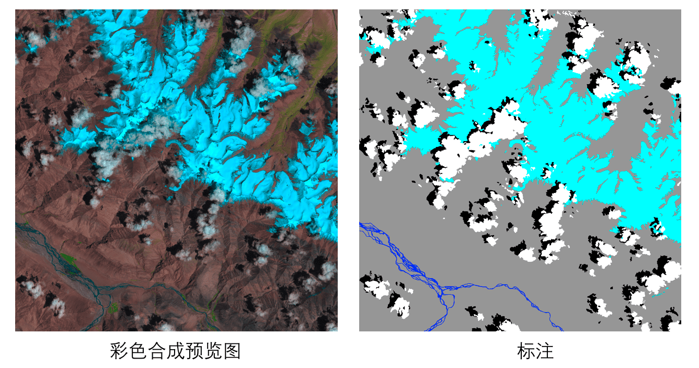
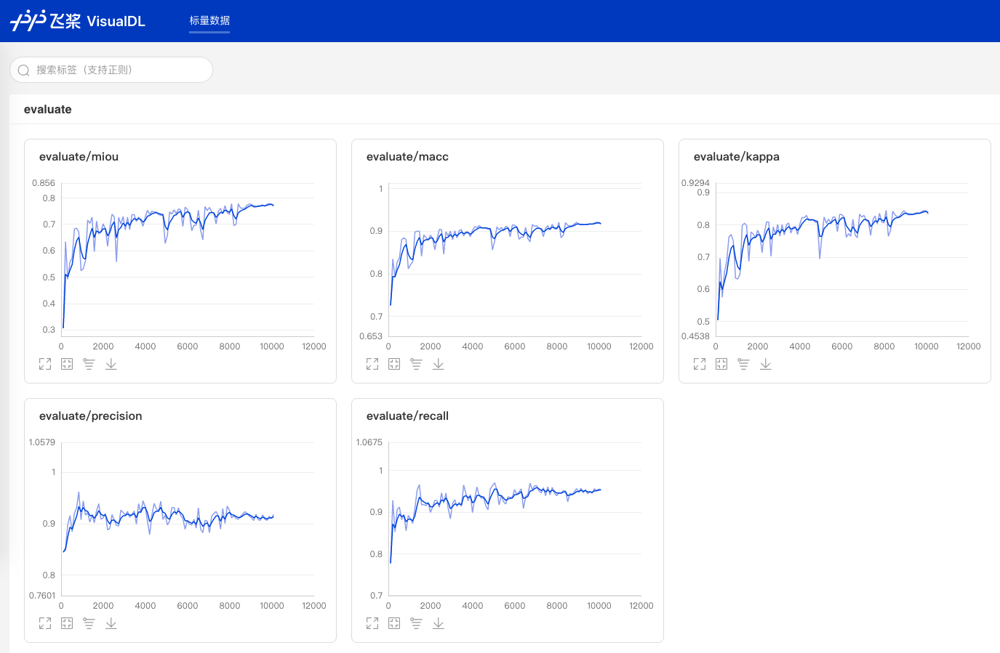

# PaddleSeg遥感影像分割
遥感影像分割是图像分割领域中的重要应用场景，广泛应用于土地测绘、环境监测、城市建设等领域。遥感影像分割的目标多种多样，有诸如积雪、农作物、道路、建筑、水源等地物目标，也有例如云层的空中目标。

PaddleSeg遥感影像分割涵盖数据分析、预处理、数据增强、模型训练、预测等流程，帮助用户利用深度学习技术解决遥感影像分割问题。

## 特点
- 针对遥感影像多通道、标注数据稀少的特点，我们支持多通道训练预测，内置10+多通道预处理和数据增强的策略，可结合实际业务场景进行定制组合，提升模型泛化能力和鲁棒性。

- 针对遥感影像分布范围广、分布不均的特点，我们提供数据分析工具，帮助深入了解数据组成、优化模型训练效果。为确保正常训练，我们提供数据校验工具，帮助排查数据问题。

- 内置U-Net, HRNet两种主流分割网络，可选择不同的损失函数如Dice Loss, BCE Loss等方式强化小目标和不均衡样本场景下的分割精度。

## 前置依赖
**Note:** 若没有特殊说明，以下所有命令需要在`PaddleSeg/contrib/RemoteSensing/`目录下执行。

- Paddle 1.7.1+
由于图像分割模型计算开销大，推荐在GPU版本的PaddlePaddle下使用。
PaddlePaddle的安装, 请按照[官网指引](https://paddlepaddle.org.cn/install/quick)安装合适自己的版本。

- Python 3.5+

- 其他依赖安装

通过以下命令安装python包依赖，请确保至少执行过一次以下命令：
```
pip install -r requirements.txt
```
另外需要安装gdal. **Note:** 使用pip安装gdal可能出错，推荐使用conda进行安装：
```
conda install gdal
```

## 目录结构说明
 ```
RemoteSensing               # 根目录
 |-- dataset                # 数据集
 |-- docs                   # 文档
 |-- models                 # 模型类定义模块
 |-- nets                   # 组网模块
 |-- readers                # 数据读取模块
 |-- tools                  # 工具集
 |-- transforms             # 数据增强模块
 |-- utils                  # 公用模块
 |-- train_demo.py          # 训练demo脚本
 |-- predict_demo.py        # 预测demo脚本
 |-- visualize_demo.py      # 可视化demo脚本
 |-- README.md              # 使用手册

 ```

## 使用教程

基于L8 SPARCS数据集进行云雪分割，提供数据准备、数据分析、训练、预测、可视化的全流程展示。

### 1. 数据准备
#### L8 SPARCS数据集
[L8 SPARCS](https://www.usgs.gov/land-resources/nli/landsat/spatial-procedures-automated-removal-cloud-and-shadow-sparcs-validation)数据集包含80张 Landsat 8 卫星影像，涵盖10个波段。
原始标注图片包含7个类别，分别是 “cloud”, “cloud shadow”, “shadow over water”, “snow/ice”, ”water”, “land”和”flooded”。

<p align="center">
 

<p align='center'>
 L8 SPARCS数据集示例
</p>

由于“flooded”和“shadow over water”2个类别占比仅为1.8%和0.24%，我们将其进行合并，
“flooded”归为“land”，“shadow over water”归为“shadow”，合并后标注包含5个类别。

数值、类别、颜色对应表：

|Pixel value|Class|Color|
|---|---|---|
|0|cloud|white|
|1|shadow|black|
|2|snow/ice|cyan|
|3|water|blue|
|4|land|grey|

执行以下命令下载并解压经过处理之后的数据集`remote_sensing_seg`：
```shell script
mkdir dataset && cd dataset
wget https://paddleseg.bj.bcebos.com/dataset/remote_sensing_seg.zip
unzip remote_sensing_seg.zip
cd ..
```
其中`data`目录存放遥感影像，`data_vis`目录存放彩色合成预览图，`mask`目录存放标注图。

#### 数据协议
对于您自己的数据集，需要按照我们的[数据协议](docs/data_prepare.md)进行数据准备。

### 2. 数据校验与分析
为确保能正常训练，我们应该先对数据集进行校验。同时，遥感影像往往由许多波段组成，不同波段数据分布可能大相径庭，例如可见光波段和热红外波段分布十分不同。为了更深入了解数据的组成、优化模型训练效果，需要对数据进行分析。
具体步骤参见[数据校验与分析](docs/data_analyse_and_check.md)章节。

### 3. 模型训练
#### （1） 设置GPU卡号
```shell script
export CUDA_VISIBLE_DEVICES=0
```
#### （2） 以U-Net为例，在RemoteSensing目录下运行`train_demo.py`即可开始训练。
```shell script
python train_demo.py --data_dir dataset/remote_sensing_seg \
--model_type unet \
--save_dir saved_model/remote_sensing_unet \
--num_classes 5 \
--channel 10 \
--lr 0.01 \
--clip_min_value 7172 6561 5777 5103 4291 4000 4000 4232 6934 7199 \
--clip_max_value 50000 50000 50000 50000 50000 40000 30000 18000 40000 36000 \
--mean 0.14311188522260637 0.14288498042151332 0.14812997807748615 0.16377211813814938 0.2737538363784552 0.2740934379398823 0.27749601919204 0.07767443032935262 0.5694699410349131 0.5549716085195542 \
--std 0.09101632762467489 0.09600705942721106 0.096193618606776 0.10371446736389771 0.10911951586604118 0.11043593115173281 0.12648042598739268 0.027746262217260665 0.06822348076384514 0.062377591186668725 \
--num_epochs 500 \
--train_batch_size 3
```

训练过程将自动开启边训边评估策略，并使用VisualDL保存训练日志，显示如下：

`mIoU`最高的模型将自动保存在`saved_model/remote_sensing_unet/best_model`目录下，最高mIoU=0.7782

### 4. 模型预测
#### （1） 设置GPU卡号
```shell script
export CUDA_VISIBLE_DEVICES=0
```
#### （2） 以刚训练好的U-Net最优模型为例，在RemoteSensing目录下运行`predict_demo.py`即可开始预测。
```shell script
python predict_demo.py --data_dir dataset/remote_sensing_seg/ \
--file_list val.txt \
--load_model_dir saved_model/remote_sensing_unet/best_model \
--save_img_dir saved_model/remote_sensing_unet/best_model/predict \
--color_map 255 255 255 0 0 0 0 255 255 0 0 255 150 150 150
```

### 5. 可视化
我们提供可视化API对预测效果进行直观的展示和对比。每张可视化图片包括彩色合成预览图、标注图、预测结果，使得效果好坏一目了然。
```shell script
python visualize_demo.py --data_dir dataset/remote_sensing_seg/ \
--file_list val.txt \
--pred_dir saved_model/remote_sensing_unet/best_model/predict \
--save_dir saved_model/remote_sensing_unet/best_model/vis_results
````
3张可视化图片示例：


## API说明

您可以使用`RemoteSensing`目录下提供的API构建自己的分割代码。

- [数据处理-transforms](docs/transforms.md)
