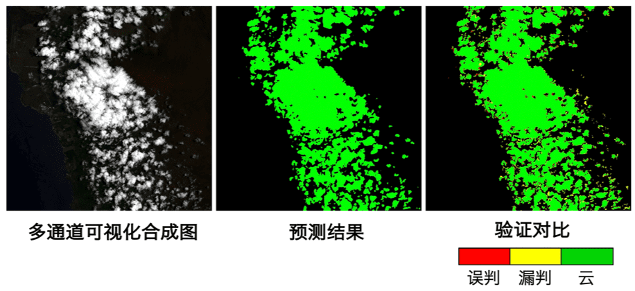

# PaddleSeg遥感影像分割
遥感影像分割是图像分割领域中的重要应用场景，广泛应用于土地测绘、环境监测、城市建设等领域。遥感影像分割的目标多种多样，有诸如积雪、农作物、道路、建筑、水源等地物目标，也有例如云层的空中目标。

PaddleSeg遥感影像分割涵盖图像预处理、数据增强、模型训练、预测流程，帮助用户利用深度学习技术解决遥感影像分割问题。

## 特点
- 针对遥感数据多通道、分布范围大、分布不均的特点，我们支持多通道训练预测，内置10+多通道预处理和数据增强的策略，可结合实际业务场景进行定制组合，提升模型泛化能力和鲁棒性。

- 内置U-Net, HRNet两种主流分割网络，可选择不同的损失函数如Dice Loss, BCE Loss等方式强化小目标和不均衡样本场景下的分割精度。

以下是遥感云检测的示例效果：



## 前置依赖
**Note:** 若没有特殊说明，以下所有命令需要在`PaddleSeg/contrib/RemoteSensing/`目录下执行。

- Paddle 1.7.1+
由于图像分割模型计算开销大，推荐在GPU版本的PaddlePaddle下使用。
PaddlePaddle的安装, 请按照[官网指引](https://paddlepaddle.org.cn/install/quick)安装合适自己的版本。

- Python 3.5+

- 其他依赖安装
通过以下命令安装python包依赖，请确保至少执行过一次以下命令：
```
pip install -r requirements.txt
```

## 目录结构说明
 ```
RemoteSensing               # 根目录
 |-- dataset                # 数据集
 |-- docs                   # 文档
 |-- models                 # 模型类定义模块
 |-- nets                   # 组网模块
 |-- readers                # 数据读取模块
 |-- tools                  # 工具集
 |-- transforms             # 数据增强模块
 |-- utils                  # 公用模块
 |-- train_demo.py          # 训练demo脚本
 |-- predict_demo.py        # 预测demo脚本
 |-- README.md              # 使用手册

 ```
## 数据协议
数据集包含原图、标注图及相应的文件列表文件。

参考数据文件结构如下：
```
./dataset/  # 数据集根目录
|--images  # 原图目录
|  |--xxx1.npy
|  |--...
|  └--...
|
|--annotations  # 标注图目录
|  |--xxx1.png
|  |--...
|  └--...
|
|--train_list.txt  # 训练文件列表文件
|
|--val_list.txt  # 验证文件列表文件
|
└--labels.txt  # 标签列表

```
其中，相应的文件名可根据需要自行定义。

遥感影像的格式多种多样，不同传感器产生的数据格式也可能不同。PaddleSeg以numpy.ndarray数据类型进行图像预处理。为统一接口并方便数据加载，我们采用numpy存储格式`npy`作为原图格式，采用`png`无损压缩格式作为标注图片格式。
原图的前两维是图像的尺寸，第3维是图像的通道数。
标注图像为单通道图像，像素值即为对应的类别,像素标注类别需要从0开始递增。
例如0，1，2，3表示有4种类别，标注类别最多为256类。其中可以指定特定的像素值用于表示该值的像素不参与训练和评估（默认为255）。

`train_list.txt`和`val_list.txt`文本以空格为分割符分为两列，第一列为图像文件相对于dataset的相对路径，第二列为标注图像文件相对于dataset的相对路径。如下所示：
```
images/xxx1.npy annotations/xxx1.png
images/xxx2.npy annotations/xxx2.png
...
```

具体要求和如何生成文件列表可参考[文件列表规范](../../docs/data_prepare.md#文件列表)。

`labels.txt`: 每一行为一个单独的类别，相应的行号即为类别对应的id（行号从0开始)，如下所示：
```
labelA
labelB
...
```


## 快速上手

本章节在一个小数据集上展示了如何通过RemoteSensing进行训练预测。

### 1. 准备数据集
为了快速体验，我们准备了一个小型demo数据集，已位于`RemoteSensing/dataset/demo/`目录下.

对于您自己的数据集，您需要按照上述的数据协议进行格式转换，可分别使用numpy和Pillow库保存遥感数据和标注图片。其中numpy API示例如下：
```python
import numpy as np

# 将遥感数据保存到以 .npy 为扩展名的文件中
# img类型：numpy.ndarray
np.save(save_path, img)
```

### 2. 训练代码开发
通过如下`train_demo.py`代码进行训练。

#### Step1 定义训练和验证时的数据处理和增强流程, 在`train_transforms`中加入了`RandomVerticalFlip`,`RandomHorizontalFlip`等数据增强方式。
```python
import transforms.transforms as T
from readers.reader import Reader
from models import UNet

train_transforms = T.Compose([
    T.RandomVerticalFlip(0.5),
    T.RandomHorizontalFlip(0.5),
    T.ResizeStepScaling(0.5, 2.0, 0.25),
    T.RandomPaddingCrop(256),
    T.Normalize(mean=[0.5] * channel, std=[0.5] * channel),
])

eval_transforms = T.Compose([
    T.Normalize(mean=[0.5] * channel, std=[0.5] * channel),
])
```

#### Step2 定义数据读取器
```python
import os
import os.path as osp

train_list = osp.join(data_dir, 'train.txt')
val_list = osp.join(data_dir, 'val.txt')
label_list = osp.join(data_dir, 'labels.txt')

train_reader = Reader(
    data_dir=data_dir,
    file_list=train_list,
    label_list=label_list,
    transforms=train_transforms,
    num_workers=8,
    buffer_size=16,
    shuffle=True,
    parallel_method='thread')

eval_reader = Reader(
    data_dir=data_dir,
    file_list=val_list,
    label_list=label_list,
    transforms=eval_transforms,
    num_workers=8,
    buffer_size=16,
    shuffle=False,
    parallel_method='thread')
```
#### Step3 模型构建
```python
model = UNet(
    num_classes=2, input_channel=channel, use_bce_loss=True, use_dice_loss=True)
```
#### Step4 模型训练，并开启边训边评估
```python
model.train(
    num_epochs=num_epochs,
    train_reader=train_reader,
    train_batch_size=train_batch_size,
    eval_reader=eval_reader,
    save_interval_epochs=5,
    log_interval_steps=10,
    save_dir=save_dir,
    pretrain_weights=None,
    optimizer=None,
    learning_rate=lr,
    use_vdl=True
)
```


### 3. 模型训练
#### Step1 设置GPU卡号
```shell script
export CUDA_VISIBLE_DEVICES=0
```
#### Step2 在RemoteSensing目录下运行`train_demo.py`即可开始训练。
```shell script
python train_demo.py --data_dir dataset/demo/ --save_dir saved_model/unet/ --channel 3 --num_epochs 20
```
### 4. 模型预测代码开发
通过如下`predict_demo.py`代码进行预测。

#### Step1 加载训练过程中最好的模型，设置预测结果保存路径。
```python
import os
import os.path as osp
from models import load_model

model = load_model(osp.join(save_dir, 'best_model'))
pred_dir = osp.join(save_dir, 'pred')
if not osp.exists(pred_dir):
    os.mkdir(pred_dir)
```

#### Step2 使用模型对验证集进行测试，并保存预测结果。
```python
import numpy as np
from PIL import Image as Image

val_list = osp.join(data_dir, 'val.txt')
color_map = [0, 0, 0, 255, 255, 255]
with open(val_list) as f:
    lines = f.readlines()
    for line in lines:
        img_path = line.split(' ')[0]
        print('Predicting {}'.format(img_path))
        img_path_ = osp.join(data_dir, img_path)

        pred = model.predict(img_path_)

        # 以伪彩色png图片保存预测结果
        pred_name = osp.basename(img_path).rstrip('npy') + 'png'
        pred_path = osp.join(pred_dir, pred_name)
        pred_mask = Image.fromarray(pred.astype(np.uint8), mode='P')
        pred_mask.putpalette(color_map)
        pred_mask.save(pred_path)
```

### 5. 模型预测
#### Step1 设置GPU卡号
```shell script
export CUDA_VISIBLE_DEVICES=0
```
#### Step2 在RemoteSensing目录下运行`predict_demo.py`即可开始训练。
```shell script
python predict_demo.py --data_dir dataset/demo/ --load_model_dir saved_model/unet/best_model/
```


## API说明

您可以使用`RemoteSensing`目录下提供的API构建自己的分割代码。

- [数据处理-transforms](docs/transforms.md)
