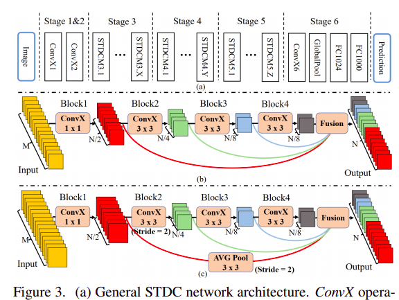

# STDCSeg

English | [简体中文](./README_cn.md)
   
  * [STDCSeg](#stdcseg)
      * [1 Introduction](#1-introduction)
      * [2 Metrics](#2-Metrics)
      * [3 Dataset](#3-dataset)
      * [4 Environment](#4-environment)
      * [5 Quick Start](#5-quick-start)
         * [Step1: Install](#step0-Install)
         * [Step1: Clone](#step1-clone)
         * [Step2: Training](#step2-training)
         * [Step3: val](#step3-val)
         * [Use Pre-trained Models to Infer](#use-pre-trained-models-to-infer)
      * [6 Code Structure and Explanation](#6-code-structure-and-explanation)
         * [6.1 Code Structure](#51-code-structure)
         * [6.2 Parameter Explanation](#52-parameter-explanation)
         * [6.3 Training Process](#53-training-process)
            * [One GPU Training](#one-gpu-training)
            * [Multiple GPUs Training](#multiple-gpus-training)
      * [7 Model Information](#7-model-information)
      * [8 Customization](#8-customization)

**Note**: model and corresponding loss have been added in paddleseg. There are sample YML files in configs. You can use train.py(also, val.py and predict.py) in [PaddleSeg](https://github.com/PaddlePaddle/PaddleSeg) directly. But note: there is no LR strategy used by warmup + polyday in PaddleSeg, and the default evaluation method of train.py is the whole map input evaluation.
In order to achieve the same results as the project / paper (i.e. using warmup learning rate strategy and miou50 evaluation method in the training process), it is necessary to use WarmupPolydelay learning rate strategy under the `scheduler/` directory and modify the evaluate function input in the training function.
## 1 Introduction

**STDC Architecture:**



**STDC-Seg Architecture:**


Paddle version of Paper“Rethinking BiSeNet For Real-time Semantic Segmentation(CVPR2021)”.

**Paper:** [Rethinking BiSeNet For Real-time Semantic Segmentation](https://arxiv.org/abs/2104.13188)

## 2 Metrics

| Model                   | mIOU |
| ----------------------- | -------- |
| STDC2-Seg50 (Pytorch-paper)     | 74.2     |
| STDC2-Seg50 (Paddle-ours) | 74.62  |

## 3 Dataset

The dataset is [Cityscapes](https://www.cityscapes-dataset.com/)

- The size of dataset: There are 19 categories, and 5000 images are of 1024*2048 pixels in width and height
  - Training set: 2975 images
  - Validation set: 500 images
  - Test set: 1525 images

data should be located at data/

```
data/
├── cityscapes
│   ├── gtFine
│   │   ├── test
│   │   ├── train
│   │   └── val
│   ├── leftImg8bit
│   │   ├── test
│   │   │   ├── berlin
│   │   │   ├── ...
│   │   │   └── munich
│   │   ├── train
│   │   │   ├── aachen
│   │   │   ├── ...
│   │   │   └── zurich
│   │   └── val
│   │       ├── frankfurt
│   │       ├── lindau
│   │       └── munster
│   ├── train.txt
│   ├── val.txt
│   ├── test.txt

```
.txt format style like as follow:

```leftImg8bit/test/mainz/mainz_000001_036412_leftImg8bit.png,gtFine/test/mainz/mainz_000001_036412_gtFine_labelTrainIds.png```

which can achieved by use PaddleSeg's create_dataset_list.py(need to clone PaddleSeg from PaddleSeg's git repo firstly):
 
```
python PaddleSeg/tools/create_dataset_list.py ./data/cityscapes/ --type cityscapes --separator ","

```

## 4 Environment

- Hardwares: XPU, GPU, CPU
- Framework: 
  - PaddlePaddle >= 2.0.2

## 5 Quick Start

### install(cmd line)

```bash
pip install -r requirements.txt
``` 

### step1: clone 

``` bash
# clone this repo
git clone git@github.com:CuberrChen/STDCNet-Paddle.git
```

### Step2: Training

Specific parameters (model, pretrained backbone model, optimizer learning rate and other parameters) can be set in train.py

``` bash
# Training
python train.py
```

### Step3: Eval
The pretrained model is used to evaluate the validation set. The specific parameters (model, pretrained model and other parameters) are similar to train.py

The default path of the pre training model is'output/best_model/model.pdparams'

```bash
# eval  
python eval.py
```


### Use Pre-trained Models to Infer
The Pre-trained model is used to test the image, and the specific parameters (model, Pre-trained model path, picture path and other parameters) are modified in predict.py

```bash
# Use Pre-trained Models to Infer
python predict.py
```

## 6 Code Structure and Explanation

### 6.1 Code Structure

```
├── README.md
├── README_EN.md
├── images/ # save images for README
├── data/ #data path
├── model/ # model difine
├── loss/ # loss function defined by self
├── utils/ # tools
├── scheduler/ # scheduler defined by self
├── pretrained/ # backbone/model's pre-trained
├── output/ # output path
├── train.py 
├── train_ngpu.py # m-gpu train
├── eval.py 
└── predict.py 
```

### 6.2 Parameter Explanation

6.2.1 You can set training and evaluation parameters in `train.py`. And relative information is as following:

|  Parameter Name  | Default Value | Description | Others |
|  ----  |  ----  |  ----  |  ----  |
| backbone  | 'STDCNet1446', optional | 1446(STDC2)/813(STDC1) （str） ||
| n_classes  | 19, optional | 数据集类别 ||
| pretrain_path | 'pretrained/STDCNet1446_76.47.pdiparams', optional | backbone's Pre-trained parameter path(str/None) | For training only, the download link is provided below|
| crop_size | [1024,512], optional | crop_size  |Other settings for data enhanced transform can be adjusted|
| dataset_root | 'data/cityscapes', optional |  Dataset path（str） ||
| base_lr | 0.01, optional | Default learning rate ||
| lr | Warmup_PolyDecay, optional | scheduler defined by self ||
| warmup_steps | 1000, optional | warmup' iter steps ||
| iters | 80000, optional | all iters ||
| val_scales | 0.5, optional | for miou50 |0.75 for miou75|
| aug_eval | True, optional | Enhanced during evaluation |if False,scale=1|
| save_dir | 'output', optional | Training save output path ||
| batch_size | 36, optional | batch_size for single gpu ||
| save_interval | 200, optional | iters to conduct an evaluation and save the model||
| num_workers | 8, optional | Number of threads|If an error is reported, change it to 0 to train normally and / or use 117 lines in the train.py of utils ```shared_Change memory=False``` |

6.2.2 You can set evaluation parameters in `eval.py`:

|  Parameter Name  | Default Value | Description | Others |
|  ----  |  ----  |  ----  |  ----  |
| path  | 'output/best_model/model.pdparams', optional | Pre-trained parameter path（str） ||

Except for the parameter path of the pre-trained model, other settings are consistent with the meaning of train.py

6.2.3 You can set evaluation parameters in `predict.py`:

|  Parameter Name  | Default Value | Description | Others |
|  ----  |  ----  |  ----  |  ----  |
| model_path | 'output/best_model/model.pdparams', optional | Pre-trained parameter path（str） ||
| image_path | 'images/xxxxxx', optional | Single image path / image folder path to be predicted（str） ||
| save_dir | 'predict_output', optional | Prediction result output path（str） ||

other settings are consistent with the meaning of train.py

### 6.3 Training Process

#### One GPU Training
```bash
python train.py
```

#### Multiple GPUs Training
```bash
python -m paddle.distributed.launch train_ngpu.py
```
It has not been tested yet, which may not be feasible. The paddleseg training style version will be added.


## 7 Model Information

Please refer to the following list to check other models’ information

| Information Name | Description |
| --- | --- |
| Announcer | xbchen |
| Time | 2021.08 |
| Framework Version | Paddle 2.0.2 |
| Application Scenario | Image Segmentation |
| Supported Hardwares | XPU GPU CPU |
| Download Links1 | [Pretrained backbone: Extraction code：tss7](https://pan.baidu.com/s/16kh3aHTBBX6wfKiIG-y3yA) |
| Download Links2 | [STDC2-Seg50: Extraction code：nchx](https://pan.baidu.com/s/1sFHqZWhcl8hFzGCrXu_c7Q) |
| Online Running | [AIStudio notebook](https://aistudio.baidu.com/aistudio/projectdetail/2206098) |

## 8 Customization

Note: If there are problems with the above items. It may be due to careless omission of documents, spelling mistakes and so on.You can conduct quick experience projects
with [AIStudio notebook](https://aistudio.baidu.com/aistudio/projectdetail/2206098) .

Special thanks to the platform and resources provided by Baidu paddle.

**STDCNet2-Seg50 Model analysis**：

- Backbone uses the pre-trained pytoch model parameters on Imagenet and then convert them to paddle model parameters,80000 iter,batch_size=36,base_lr=0.01 warmup+poly,**STDCNet2-Seg50 's best mIOU=74.62 at Cityscaps VAL dataset**.
***Note: the reason for adopting this scheme is that the single card 32g environment provided by aistudio allows 1024 × 512 enter the maximum batch_size is 36. If the memory is enough / multiple cards are used, the parameters provided by the author are recommended. The trained model has a link at the bottom. The training code and vdlrecords.1629043924.log (74.62miou complete training log) have been uploaded to the repo* The project has been published on aistudio, and the link has been provided.


- Supplementary experiment (single experiment results): backbone has no pre-trained model on Imagenet, 60000 iters, batch_Size = 32, 0.01 poly (original paper 60000 iters, batchsize = 48, warm + poly, with Imagenet pre-trained model), stdcnet2-seg50 model reaches the best Miou of 67.72 on the cityscaps Val dataset. Continue to use the trained model for further training, 60000 iters, batch_Size = 32, 0.001 poly, stdcnet2-seg50 model reached the best Miou of 69.47 on the cityscaps Val dataset.

**Tips**: the results show that the pre training model is very important for data sets with small amount of data!!!

Refrence:
- [Paper Official PyTorch](https://github.com/MichaelFan01/STDC-Seg)
