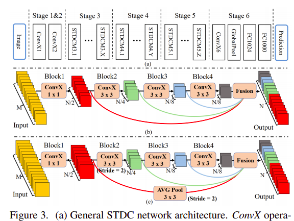
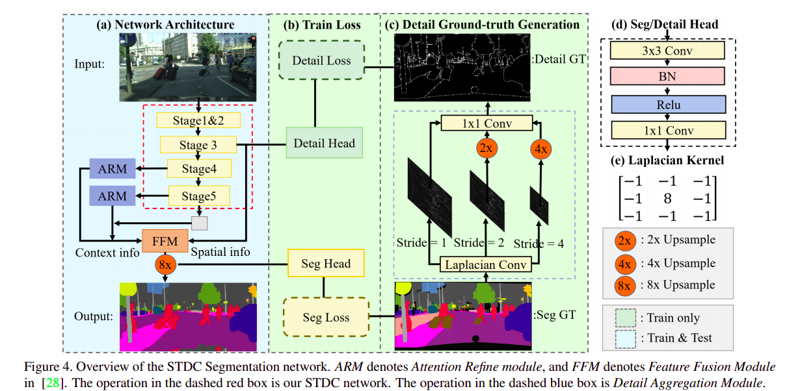

# STDCSeg-Paddle
[English](README.md) | 简体中文
   
   * [STDCSeg](#stdc)
      * [一、简介](#一简介)
      * [二、复现精度](#二复现精度)
      * [三、数据集](#三数据集)
      * [四、环境依赖](#四环境依赖)
      * [五、快速开始](#五快速开始)
         * [step0: install](#step0-安装必要依赖)
         * [step1: clone](#step1-clone)
         * [step2: 训练](#step2-训练)
         * [step3: 评估](#step3-评估)
         * [使用预训练模型预测](#使用预训练模型预测)
      * [六、代码结构与详细说明](#六代码结构与详细说明)
         * [6.1 代码结构](#61-代码结构)
         * [6.2 参数说明](#62-参数说明)
         * [6.3 训练流程](#63-训练流程)
            * [单机训练](#单机训练)
            * [多机训练](#多机训练)
      * [七、模型信息](#七模型信息)

**Note**: 已经在paddleseg中增加model和相应loss,configs中有样例yml文件。可以直接使用[PaddleSeg](https://github.com/PaddlePaddle/PaddleSeg) 仓库的train.py函数方式训练（也就是将本仓库的train.py更换后使用即可，同样的eval和predict也是,使用方法见PaddleSeg文档）。但是注意：paddleseg中没有warmup+polydecay同时使用的lr策略以及该train.py在val时默认评估方式是整图输入评估。
若要实现与本项目/论文相同的结果（即采用warmup学习率策略以及训练过程采用miou50的评估方式），需要采用scheduler目录下的Warmup_PolyDecay学习率策略以及对训练函数中的evaluate函数输入进行修改。

## 一、简介

**STDC Architecture:**



**STDC-Seg Architecture:**



论文“Rethinking BiSeNet For Real-time Semantic Segmentation(CVPR2021)”的STDCNet的Paddle实现版本
This project reproduces STDCNet-Seg based on paddlepaddle framework. 本项目利用百度的paddlepaddle框架对CVPR2021论文Rethinking BiSeNet For Real-time Semantic Segmentation的复现. 这里只做在Cityscapes数据集上的对于STDC2-Seg50的分割实验，不包括STDCNet的ImageNet分类实验. 项目依赖于paddleseg工具，模型的输出形式与paddleseg中的模型输出类似，因此可以利用paddleseg提供的训练和评估代码进行训练和评估.

**论文:** [Rethinking BiSeNet For Real-time Semantic Segmentation](https://arxiv.org/abs/2104.13188)

## 二、复现精度

| Model                   | mIOU |
| ----------------------- | -------- |
| STDC2-Seg50 (原文Pytorch)     | 74.2     |
| STDC2-Seg50 (本项目Paddle) | 74.62  |

## 三、数据集

使用的数据集为：[Cityscapes](https://www.cityscapes-dataset.com/)

- 数据集大小：19个类别的密集像素标注，5000张1024*2048大小的高质量像素级注释图像/20000个弱注释帧
  - 训练集：2975个图像
  - 验证集：500个图像
  - 测试集：1525个图像
  
数据集应有的结构:
```
data/
├── cityscapes
│   ├── gtFine
│   │   ├── test
│   │   ├── train
│   │   └── val
│   ├── leftImg8bit
│   │   ├── test
│   │   │   ├── berlin
│   │   │   ├── ...
│   │   │   └── munich
│   │   ├── train
│   │   │   ├── aachen
│   │   │   ├── ...
│   │   │   └── zurich
│   │   └── val
│   │       ├── frankfurt
│   │       ├── lindau
│   │       └── munster
│   ├── train.txt
│   ├── val.txt
│   ├── test.txt

```

.txt是利用Paddleseg提供的数据集处理工具生成，其风格如下:

```leftImg8bit/test/mainz/mainz_000001_036412_leftImg8bit.png,gtFine/test/mainz/mainz_000001_036412_gtFine_labelTrainIds.png```

利用PaddleSeg's create_dataset_list.py(需要先克隆[PaddleSeg](https://github.com/PaddlePaddle/PaddleSeg)):
 
```
python PaddleSeg/tools/create_dataset_list.py ./data/cityscapes/ --type cityscapes --separator ","

```
当然，需要首先生成xxxxx_gtFine_labelTrainIds.png标签。这个需要利用cityscapes提供的工具生成,相关脚本位于data/work/cityscapesscripts。具体使用方法这里不作介绍，请查阅[Cityscapes](https://www.cityscapes-dataset.com/)

## 四、环境依赖

- 硬件：XPU、GPU、CPU

- 框架：
  - PaddlePaddle >= 2.0.2

## 五、快速开始

### step0: 安装必要依赖

```bash
pip install -r requirements.txt
``` 

### step1: clone 

``` bash
# clone this repo
git clone git@github.com:CuberrChen/STDCNet-Paddle.git
```

### step2: 训练

**单块32G** GPU训练（多线程大约40多个小时，单线程70多个小时）

具体参数（模型型号、预训练backbone模型、优化器学习率等参数）可在train.py中进行设置：
``` bash
# 训练
python train.py
```

### step3: 评估
利用预训练模型进行验证集的评估，具体参数（模型型号、预训练模型等参数）与train.py类似

预训练模型默认路径为'output/best_model/model.pdparams'
```bash
# 评估  
python eval.py
```

### 使用预训练模型预测

利用预训练模型进行图像的测试，具体参数（模型型号、预训练模型路径、图片路径等参数）在predict.py里修改

```bash
# 使用预训练模型预测
python predict.py
```

此时的输出会保存在predict中设定的输出路径下。

## 六、代码结构与详细说明

### 6.1 代码结构

```
├── README.md
├── README_EN.md
├── images/ # 存放README需要的图像
├── data/ #数据路径
├── model/ # 模型定义
├── loss/ # 自定义损失函数
├── utils/ # 工具
├── scheduler/ # 自定义学习率策略
├── pretrained/ # backbone/完整模型的预训练模型
├── output/ # 输出目录
├── train.py # 训练
├── eval.py # 评估
└── predict.py # 预测
```

### 6.2 参数说明

6.2.1 可以在 `train.py/train_ngpu.py` 中设置训练与训练时的评估相关参数，具体如下：

|  参数   | 默认值  | 说明 | 其他 |
|  ----  |  ----  |  ----  |  ----  |
| backbone  | 'STDCNet1446', 可选 | 1446(STDC2)/813(STDC1) （str） ||
| n_classes  | 19, 可选 | 数据集类别 ||
| pretrain_path | 'pretrained/STDCNet1446_76.47.pdiparams', 可选 | backbone预训练参数路径(str/None) | 仅在训练时使用,下载链接下方提供 |
| crop_size | [1024,512], 可选 | crop_size 的大小 |可调整数据增强的transform其他设置|
| dataset_root | 'data/cityscapes', 可选 |  数据集路径（str） |可调整数据增强的transform其他设置|
| base_lr | 0.01, 可选 | 默认学习率 ||
| lr | Warmup_PolyDecay, 可选 | 自定义学习率策略 ||
| warmup_steps | 1000, 可选 | warmup的iter数 ||
| iters | 80000, 可选 | 训练总的iters ||
| val_scales | 0.5, 可选 | for miou50 |0.75 for miou75|
| aug_eval | True, 可选 | 是否在评估时增强 |若不开启，将以scale=1，即使用原图大小输入model|
| save_dir | 'output', 可选 | 训练保存输出路径 ||
| batch_size | 36, 可选 | batch_size大小 for 单卡 ||
| save_interval | 200, 可选 | 多少iter进行一次评估并保存模型||
| num_workers | 8, 可选 | 多线程数目|若报错，改为0可正常训练/或者在utils的train中将117行use_shared_memory改为False|

6.2.2 可以在 `eval.py` 中设置预训练模型的评估相关参数，具体如下：

|  参数   | 默认值  | 说明 | 其他 |
|  ----  |  ----  |  ----  |  ----  |
| path  | 'output/best_model/model.pdparams', 可选 | 预训练模型参数路径（str） ||

除预训练模型参数路径外，其他设置和train.py含义一致

6.2.3 可以在 `predict.py` 中设置预训练模型的测试相关参数，具体如下：

|  参数   | 默认值  | 说明 | 其他 |
|  ----  |  ----  |  ----  |  ----  |
| model_path | 'output/best_model/model.pdparams', 可选 | 预训练模型参数路径（str） ||
| image_path | 'images/xxxxxx', 可选 | 待预测的单个图像路径/图像文件夹路径（str） ||
| save_dir | 'predict_output', 可选 | 预测结果输出路径（str） ||

其他设置和train.py含义一致

### 6.3 训练流程

#### 单机训练
```bash
python train.py
```

#### 多机训练（TODO）
```bash
python -m paddle.distributed.launch train_ngpu.py
```
暂未做测试，待添加paddleseg训练风格版本。

## 七、模型信息

关于模型的其他信息，可以参考下表和复现分析：

| 信息 | 说明 |
| --- | --- |
| 发布者 | xbchen |
| 时间 | 2021.08 |
| 框架版本 |  PaddlePaddle >= 2.0.2 |
| 应用场景 | 图像分割 |
| 支持硬件 | XPU、GPU、CPU |
| 下载链接1 | [Pretrained backbone: 提取码：tss7](https://pan.baidu.com/s/16kh3aHTBBX6wfKiIG-y3yA)|
| 下载链接2 | [STDC2-Seg50: 提取码：nchx](https://pan.baidu.com/s/1sFHqZWhcl8hFzGCrXu_c7Q)|
| 在线运行项目 | [AIStudio notebook](https://aistudio.baidu.com/aistudio/projectdetail/2206098) |

Note: 若上述项目出现问题。可能是整理过程中不小心漏掉文件，拼写错误等等原因。可在[AIStudio notebook](https://aistudio.baidu.com/aistudio/projectdetail/2206098) 进行快速体验项目。
特别感谢百度paddle提供的平台和资源。

**STDCNet2-Seg50模型复现分析**：

- Backbone利用ImageNet上的预训练Pytorch模型参数转为Paddle模型参数，采用80000 iter，batch_size=36，base_lr=0.01 warmup+poly的学习率策略，**STDCNet2-Seg50模型在Cityscaps VAL数据集上达到了74.62的mIOU**。***说明：采用这个方案的原因是因为AIStudio提供的单卡32G环境允许的1024×512输入最大的batch_size为36，若内存够用/使用多卡，还是推荐使用作者提供的参数。训练好的模型在最下面有链接。训练代码、vdlrecords.1629043924.log（74.62miou完整训练日志）都已经上传到仓库。* AIStudio上已经公开项目，链接已经提供。

- 补充实验（单次实验结果）：Backbone无ImageNet上预训练的模型，在60000 iters, batch_size = 32，0.01 poly（原论文60000 iters，batch_size=48，warmup+poly，有ImageNet预训练模型）的情况下，STDCNet2-Seg50模型在Cityscaps VAL数据集上达到了67.72的best mIOU。继续用该训模型进行进一步训练，60000 iters，batch_size = 32，0.001 poly, STDCNet2-Seg50模型在Cityscaps VAL数据集上达到了69.47的best mIOU。

**Tips**：结果表明，预训练模型对于数据量不大的数据集非常重要！！！

Refrence:
- [Paper Official PyTorch](https://github.com/MichaelFan01/STDC-Seg)
