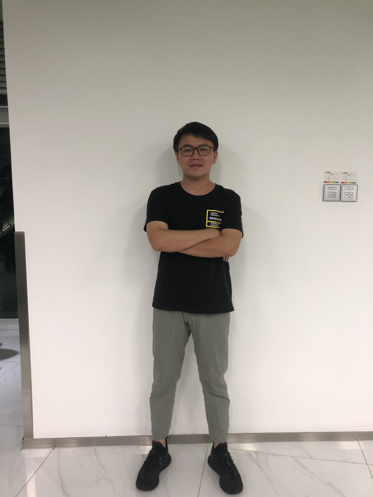

# PaddleSeg Python 预测部署方案

## 1. 说明
本方案旨在提供一个`PaddlePaddle`跨平台图像分割模型的`Python`预测部署方案作为参考，用户通过一定的配置，加上少量的代码，即可把模型集成到自己的服务中，完成图像分割的任务。

如果**硬件支持**(如`Tesla V100 GPU`等)，本程序支持使用`Nvidia TensorRT`进行`FP32`和`FP16`两种精度进行推理性能加速。

## 2. 依赖前置条件
* Python2.7/Python3

## 3. 目录结构和文件说明
```
├── infer.py #  核心代码，完成分割模型的预测以及结果可视化
├── requirements.txt # 依赖的Python包
└── README.md # 说明文档
```

## 4. 环境安装和准备
### 4.1 安装 PaddlePaddle

如何选择合适版本的`PaddlePaddle`版本进行安装，可参考: [PaddlePaddle安装教程](https://www.paddlepaddle.org.cn/install/doc/)

**注意**: 如硬件支持且需要使用`TensorRT`支持`FP16`半精度优化等， 则**本步骤**需要自行安装`TensorRT`并编译`PaddlePaddle`, 点击查看[编译安装参考文档](docs/compile_paddle_with_tensorrt.md)

### 4.2:安装Python依赖包
在**当前**目录下, 使用`pip`安装`Python`依赖包
```bash
pip install -r requirements.txt
```
### 4.3 安装`OpenCV` 相关依赖库
预测代码中需要使用`OpenCV`，所以还需要`OpenCV`安装相关的动态链接库。

`Ubuntu`下安装相关链接库：
```bash
apt-get install -y libglib2.0-0 libsm6 libxext6 libxrender-dev
```

CentOS 下安装相关链接库：
```bash
yum install -y libXext libSM libXrender
```

## 5. 开始预测
### 5.1 准备模型
请使用[模型导出工具](../../docs/model_export.md) 导出您的模型, 或点击下载我们的[人像分割样例模型](https://bj.bcebos.com/paddleseg/inference/human_freeze_model.zip)用于测试。

模型导出的目录通常包括三个文件:
```
├── model #  模型文件
├── params # 参数文件
└── deploy.yaml # 配置文件，用于C++或Python预测
```
配置文件的主要字段及其含义如下:
```yaml
DEPLOY:
    # 是否使用GPU预测
    USE_GPU: 1
    # 模型和参数文件所在目录路径
    MODEL_PATH: "/root/projects/models/deeplabv3p_xception65_humanseg"
    # 模型文件名
    MODEL_FILENAME: "__model__"
    # 参数文件名
    PARAMS_FILENAME: "__params__"
    # 预测图片的的标准输入尺寸，输入尺寸不一致会做resize
    EVAL_CROP_SIZE: (513, 513)
    # 均值
    MEAN: [0.5, 0.5, 0.5]
    # 方差
    STD: [0.5, 0.5, 0.5]
    # 分类类型数
    NUM_CLASSES: 2
    # 图片通道数
    CHANNELS : 3
    # 预测模式，支持 NATIVE 和 ANALYSIS
    PREDICTOR_MODE: "ANALYSIS"
    # 每次预测的 batch_size
    BATCH_SIZE : 3
```
### 5.2 执行预测程序
在终端输入以下命令进行预测:
```bash
python infer.py --conf=/path/to/deploy.yaml --input_dir=/path/to/images_directory
```
参数说明如下:

| 参数 | 是否必须|含义 |
|-------|-------|----------|
| conf | Yes|模型配置的Yaml文件路径 |
| input_dir |Yes| 需要预测的图片目录 |

**注意**: 如果硬件支持且安装的是从源码编译集成`TensorRT`的`PaddlePaddle`, 则可以使用参数`--trt_mode=fp16` 表示开启`FP16` 精度优化, 使用`trt_mode=fp32` 表示使用`FP32` 精度。

运行后程序会扫描`input_dir` 目录下所有指定格式图片，并生成`预测mask`和`可视化的结果`。

对于图片`a.jpeg`, `预测mask` 存在`a_jpeg.png` 中，而可视化结果则在`a_jpeg_result.png` 中。

输入样例:


输出结果:  

