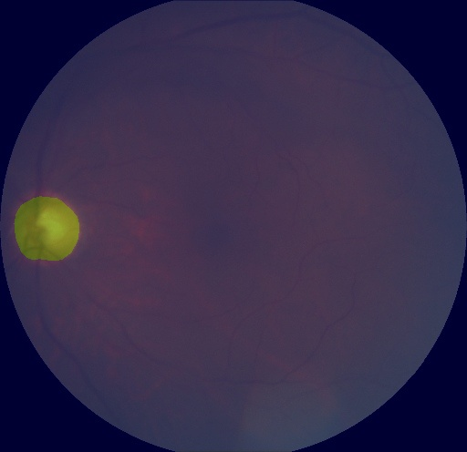

# API应用案例

通过本教程，你将快速学会PaddleSeg的API调用，轻松进行语义分割模型的训练、评估和预测。我们将以BiSeNetV2和视盘分割数据集为例一步一步的教导你如何调用API进行模型、数据集、损失函数、优化器等模块的构建。

如果对配置化调用方式更感兴趣，可参考[10分钟上手PaddleSeg](https://aistudio.baidu.com/aistudio/projectdetail/1672610)教程。

**Note**：请在AI studio上fork本项目的最新版本，然后运行使用。

**Note**：若想更详细地了解PaddleSeg API，请阅读[API文档](https://github.com/PaddlePaddle/PaddleSeg/tree/develop/docs/apis)

## PaddleSeg安装及环境配置

```python
!pip install paddleseg
```

## 模型训练

### 1. 构建模型

```python
from paddleseg.models import BiSeNetV2
model = BiSeNetV2(num_classes=2,
                 lambd=0.25,
                 align_corners=False,
                 pretrained=None)
```

### 2. 构建训练集

```python
# 构建训练用的transforms
import paddleseg.transforms as T
transforms = [
    T.Resize(target_size=(512, 512)),
    T.RandomHorizontalFlip(),
    T.Normalize()
]

# 构建训练集
from paddleseg.datasets import OpticDiscSeg
train_dataset = OpticDiscSeg(
    dataset_root='data/optic_disc_seg',
    transforms=transforms,
    mode='train'
)
```

### 3. 构建验证集

```python
# 构建验证用的transforms
import paddleseg.transforms as T
transforms = [
    T.Resize(target_size=(512, 512)),
    T.Normalize()
]

# 构建验证集
from paddleseg.datasets import OpticDiscSeg
val_dataset = OpticDiscSeg(
    dataset_root='data/optic_disc_seg',
    transforms=transforms,
    mode='val'
)
```

### 4. 构建优化器

```python
import paddle
# 设置学习率
base_lr = 0.01
lr = paddle.optimizer.lr.PolynomialDecay(base_lr, power=0.9, decay_steps=1000, end_lr=0)

optimizer = paddle.optimizer.Momentum(lr, parameters=model.parameters(), momentum=0.9, weight_decay=4.0e-5)
```

### 5. 构建损失函数

为了适应多路损失，损失函数应构建成包含'types'和'coef'的dict，如下所示。 其中losses['type']表示损失函数类型， losses['coef']为对应的系数。需注意len(losses['types'])应等于len(losses['coef'])。

```python
from paddleseg.models.losses import CrossEntropyLoss
losses = {}
losses['types'] = [CrossEntropyLoss()] * 5
losses['coef'] = [1]* 5
```

### 6.训练

```python
from paddleseg.core import train
train(
    model=model,
    train_dataset=train_dataset,
    val_dataset=val_dataset,
    optimizer=optimizer,
    save_dir='output',
    iters=1000,
    batch_size=4,
    save_interval=200,
    log_iters=10,
    num_workers=0,
    losses=losses,
    use_vdl=True)
```

## 模型评估

### 1. 构建模型

```python
from paddleseg.models import BiSeNetV2
model = BiSeNetV2(num_classes=2,
                 lambd=0.25,
                 align_corners=False,
                 pretrained=None)
```

### 2. 加载模型参数

```python
model_path = 'output/best_model/model.pdparams'
if model_path:
    para_state_dict = paddle.load(model_path)
    model.set_dict(para_state_dict)
    print('Loaded trained params of model successfully')
else: 
    raise ValueError('The model_path is wrong: {}'.format(model_path))
```

### 3. 构建验证集

```python
# 构建验证用的transforms
import paddleseg.transforms as T
transforms = [
    T.Resize(target_size=(512, 512)),
    T.Normalize()
]

# 构建验证集
from paddleseg.datasets import OpticDiscSeg
val_dataset = OpticDiscSeg(
    dataset_root='data/optic_disc_seg',
    transforms=transforms,
    mode='val'
)
```

### 4. 评估

```python
from paddleseg.core import evaluate
evaluate(
        model,
        val_dataset)
```

### 5. 多尺度+翻转评估

```python
evaluate(
        model,
        val_dataset,
        aug_eval=True,
        scales=[0.75, 1.0, 1.25],
        flip_horizontal=True)
```

## 效果可视化

### 1. 构建模型

```python
from paddleseg.models import BiSeNetV2
model = BiSeNetV2(num_classes=2,
                 lambd=0.25,
                 align_corners=False,
                 pretrained=None)
```

### 2. 创建transform

```python
import paddleseg.transforms as T
transforms = T.Compose([
    T.Resize(target_size=(512, 512)),
    T.RandomHorizontalFlip(),
    T.Normalize()
])
```

### 3. 构建待预测的图像列表

```python
import os
def get_image_list(image_path):
    """Get image list"""
    valid_suffix = [
        '.JPEG', '.jpeg', '.JPG', '.jpg', '.BMP', '.bmp', '.PNG', '.png'
    ]
    image_list = []
    image_dir = None
    if os.path.isfile(image_path):
        if os.path.splitext(image_path)[-1] in valid_suffix:
            image_list.append(image_path)
    elif os.path.isdir(image_path):
        image_dir = image_path
        for root, dirs, files in os.walk(image_path):
            for f in files:
                if os.path.splitext(f)[-1] in valid_suffix:
                    image_list.append(os.path.join(root, f))
    else:
        raise FileNotFoundError(
            '`--image_path` is not found. it should be an image file or a directory including images'
        )

    if len(image_list) == 0:
        raise RuntimeError('There are not image file in `--image_path`')

    return image_list, image_dir
image_path = 'data/optic_disc_seg/JPEGImages/N0010.jpg' # 也可以输入一个包含图像的目录
image_list, image_dir = get_image_list('data/optic_disc_seg/JPEGImages/N0010.jpg')
```

### 4. 预测

图片预测结果将会输出到保存路径`save_dir`当中。该路径下将生成2个目录，`pseudo_color_prediction`保存伪彩色预测结果图，可直接查看各个类别的预测效果，`added_prediction`保存伪彩色预测结果和原图的叠加效果图。

```python
from paddleseg.core import predict
predict(
        model,
        model_path='output/best_model/model.pdparams',
        transforms=transforms,
        image_list=image_list,
        image_dir=image_dir,
        save_dir='output/results'
    )
```

预测效果如下：

- 伪彩色预测结果


- 叠加效果

