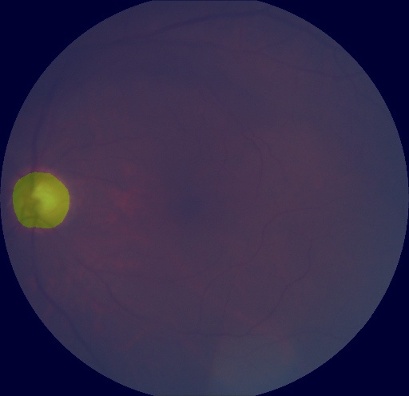

English | [简体中文](api_example_cn.md)

# API Tutorial

Through this tutorial, you will quickly learn the API calls of PaddleSeg, and easily train, evaluate and predict semantic segmentation models. We will take BiSeNetV2 and optic disc segmentation datasets as examples to teach you step by step how to call the API to build models, datasets, loss functions, optimizers and other modules.

If you are more interested in the configuration call method, you can refer to the [tutorial](https://aistudio.baidu.com/aistudio/projectdetail/1672610).

**Note**：Please fork the latest version of this project on AI studio, and then run it.

**Note**：For more details of PaddleSeg API，please refer to the [tutorial](https://github.com/PaddlePaddle/PaddleSeg/tree/develop/docs/apis).

## Installation 

```python
!pip install paddleseg
```

## Model Training

### 1. Bulid the model

```python
from paddleseg.models import BiSeNetV2
model = BiSeNetV2(num_classes=2,
                 lambd=0.25,
                 align_corners=False,
                 pretrained=None)
```

### 2. Build train dataset

```python
# bulid transforms for training
import paddleseg.transforms as T
transforms = [
    T.Resize(target_size=(512, 512)),
    T.RandomHorizontalFlip(),
    T.Normalize()
]

# bulid train dataset
from paddleseg.datasets import OpticDiscSeg
train_dataset = OpticDiscSeg(
    dataset_root='data/optic_disc_seg',
    transforms=transforms,
    mode='train'
)
```

### 3. Bulid validation dataset

```python
# bulid transforms for validation
import paddleseg.transforms as T
transforms = [
    T.Resize(target_size=(512, 512)),
    T.Normalize()
]

# bulid validation dataset
from paddleseg.datasets import OpticDiscSeg
val_dataset = OpticDiscSeg(
    dataset_root='data/optic_disc_seg',
    transforms=transforms,
    mode='val'
)
```

### 4. Optimizer

```python
import paddle
# set learning rate
base_lr = 0.01
lr = paddle.optimizer.lr.PolynomialDecay(base_lr, power=0.9, decay_steps=1000, end_lr=0)

optimizer = paddle.optimizer.Momentum(lr, parameters=model.parameters(), momentum=0.9, weight_decay=4.0e-5)
```

### 5. Loss function

To accommodate multi-pass loss, the loss function should be built as a dict containing 'types' and 'coef' as shown below. where losses['type'] represents the loss function type, and losses['coef'] is the corresponding coefficient. Note that len(losses['types']) should be equal to len(losses['coef']).

```python
from paddleseg.models.losses import CrossEntropyLoss
losses = {}
losses['types'] = [CrossEntropyLoss()] * 5
losses['coef'] = [1]* 5
```

### 6.Train

```python
from paddleseg.core import train
train(
    model=model,
    train_dataset=train_dataset,
    val_dataset=val_dataset,
    optimizer=optimizer,
    save_dir='output',
    iters=1000,
    batch_size=4,
    save_interval=200,
    log_iters=10,
    num_workers=0,
    losses=losses,
    use_vdl=True)
```

## Model Evaluation

### 1. Bulid model

```python
from paddleseg.models import BiSeNetV2
model = BiSeNetV2(num_classes=2,
                 lambd=0.25,
                 align_corners=False,
                 pretrained=None)
```

### 2. Load pretrained model

```python
model_path = 'output/best_model/model.pdparams'
if model_path:
    para_state_dict = paddle.load(model_path)
    model.set_dict(para_state_dict)
    print('Loaded trained params of model successfully')
else:
    raise ValueError('The model_path is wrong: {}'.format(model_path))
```

### 3. Bulid validation dataset

```python
# config transforms for validation
import paddleseg.transforms as T
transforms = [
    T.Resize(target_size=(512, 512)),
    T.Normalize()
]

# bulid validation dataset
from paddleseg.datasets import OpticDiscSeg
val_dataset = OpticDiscSeg(
    dataset_root='data/optic_disc_seg',
    transforms=transforms,
    mode='val'
)
```

### 4. Evaluation

```python
from paddleseg.core import evaluate
evaluate(
        model,
        val_dataset)
```

### 5. Multi-scale + flip evaluation

```python
evaluate(
        model,
        val_dataset,
        aug_eval=True,
        scales=[0.75, 1.0, 1.25],
        flip_horizontal=True)
```

## Visualization

### 1. Bulid model

```python
from paddleseg.models import BiSeNetV2
model = BiSeNetV2(num_classes=2,
                 lambd=0.25,
                 align_corners=False,
                 pretrained=None)
```

### 2. Config transform

```python
import paddleseg.transforms as T
transforms = T.Compose([
    T.Resize(target_size=(512, 512)),
    T.RandomHorizontalFlip(),
    T.Normalize()
])
```

### 3. Build a list of images to predict

```python
import os
def get_image_list(image_path):
    """Get image list"""
    valid_suffix = [
        '.JPEG', '.jpeg', '.JPG', '.jpg', '.BMP', '.bmp', '.PNG', '.png'
    ]
    image_list = []
    image_dir = None
    if os.path.isfile(image_path):
        if os.path.splitext(image_path)[-1] in valid_suffix:
            image_list.append(image_path)
    elif os.path.isdir(image_path):
        image_dir = image_path
        for root, dirs, files in os.walk(image_path):
            for f in files:
                if os.path.splitext(f)[-1] in valid_suffix:
                    image_list.append(os.path.join(root, f))
    else:
        raise FileNotFoundError(
            '`--image_path` is not found. it should be an image file or a directory including images'
        )

    if len(image_list) == 0:
        raise RuntimeError('There are not image file in `--image_path`')

    return image_list, image_dir
image_path = 'data/optic_disc_seg/JPEGImages/N0010.jpg' # You can also enter a directory containing images
image_list, image_dir = get_image_list('data/optic_disc_seg/JPEGImages/N0010.jpg')
```

### 4. Prediction

The image prediction result will be output to the save path `save_dir`. Two directories will be generated under this path. `pseudo_color_prediction` saves the pseudo-color prediction result graph, you can directly view the prediction effect of each category, and `added_prediction` saves the pseudo-color prediction result and the superimposed effect graph of the original image.

```python
from paddleseg.core import predict
predict(
        model,
        model_path='output/best_model/model.pdparams',
        transforms=transforms,
        image_list=image_list,
        image_dir=image_dir,
        save_dir='output/results'
    )
```

The predicted effect is as follows:

- False Color Prediction Results


- overlay effect


