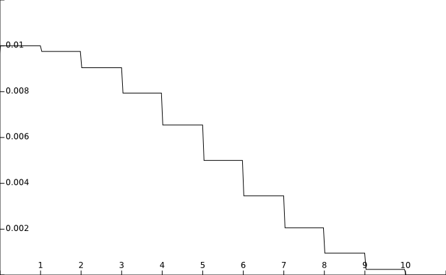

# cfg.SOLVER

SOLVER Group定义所有和训练优化相关的配置

## `LR`

初始学习率

### 默认值

0.1

 
 

## `LR_POLICY`

学习率的衰减策略，支持`poly` `piecewise` `cosine`三种策略

### 默认值

`poly`

### 示例
* 当使用`poly`衰减时，假设初始学习率为0.1，训练总步数为10000，则在power分别为`0.4``0.8``1``1.2``1.6`时，衰减曲线如下图：
  * power = 1 衰减曲线为直线
  * power > 1 衰减曲线内凹
  * power < 1 衰减曲线外凸

  

    
  

  
* 当使用`piecewise`衰减时，假设初始学习率为0.1，GAMMA为0.9，总EPOCH数量为100，DECAY_EPOCH为[10, 20]，衰减曲线如下图：
  
  

    
  

* 当使用`cosine`衰减时，假设初始学习率为0.1，总EPOCH数量为100，衰减曲线如下图：
  
  

    
  

 
 

## `POWER`

学习率Poly下降指数，仅当策略为[`LR_POLICY`](#LR_POLICY)为`poly`时有效

### 默认值

0.9

 
 

## `GAMMA`

学习率piecewise下降指数，仅当策略为[`LR_POLICY`](#LR_POLICY)为`piecewise`时有效

### 默认值

0.1

 
 

## `DECAY_EPOCH`

学习率piecewise下降间隔，仅当策略为[`LR_POLICY`](#LR_POLICY)为`piecewise`时有效

### 默认值

[10, 20]

 
 

## `WEIGHT_DECAY`

L2正则化系数

### 默认值

0.00004

 
 

## `BEGIN_EPOCH`

起始EPOCH值

### 默认值

0

 
 

## `NUM_EPOCHS`

训练EPOCH数

### 默认值

30（需要根据实际需求进行调整）

 
 

## `SNAPSHOT`

训练时，保存模型的间隔（单位为EPOCH）

### 默认值

10（意味着每训练10个EPOCH保存一次模型）

 
 

## `loss`

训练时选择的损失函数， 支持`softmax_loss(sotfmax with cross entroy loss)`, 
`dice_loss(dice coefficient loss)`, `bce_loss(binary cross entroy loss)`三种损失函数。
其中`dice_loss`和`bce_loss`仅在两类分割问题中适用，`softmax_loss`不能与`dice_loss`
或`bce_loss`组合，`dice_loss`可以和`bce_loss`组合使用。使用示例如下：

`['softmax_loss']`或`['dice_loss','bce_loss']`

### 损失函数说明
* softmax_loss

}) 

 

* dice_loss

 

[dice系数](https://zh.wikipedia.org/wiki/Dice%E7%B3%BB%E6%95%B0)

 

* bce_loss

}+(1-y_i)log(1-p_i))

其中和*Y*为标签，
 和*P*为预测结果

### 默认值

['softmax_loss']

 
 
