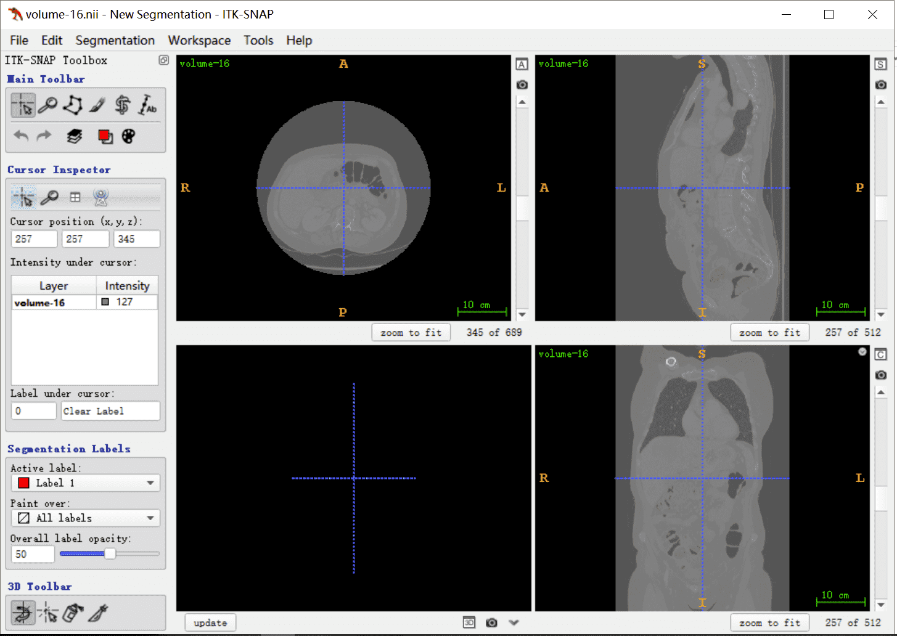

# ITK-SNAP 使用教程

## 打开文件，数据路径中不能包含中文

1.第一种点击 File 选择open Image 打开图片，第二种直接拖入文件。

2.当打开DICOM文件，可以选择读取方式。‘DICOM Image Series’或者‘DICOM Single Image’。其他医学影像格式文件，选择默认即可。

## 查看图像信息和调节窗宽窗位

Ctrl+i 调出对话框选择Contrast，可以调节图像的窗宽和窗位。

Ctrl+i 调出对话框选择Info，可以查看数据的Origin、Spacinging、Dimension等基本信息。

Ctrl+i 调出对话框选择Metadata，可以查看数据的Tag信息。

## 基本操作

【图像放大】移动鼠标 + 鼠标右键

【图像移动】移动鼠标 + 鼠标滚轮

【图像层数】鼠标滚轮

## 开始标注

标注方式可以选择打点和涂抹

