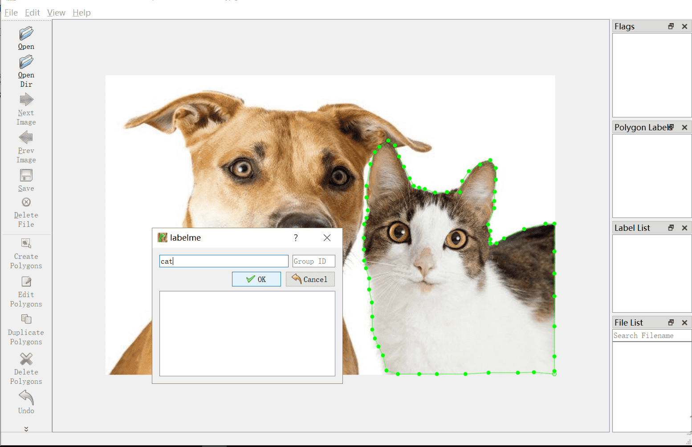

English|[简体中文](LabelMe_cn.md)
# LabelMe

If you have not installed it before, please refer to [LabelMe installation](https://paddlex.readthedocs.io/zh_CN/develop/data/annotation/labelme.html)

**Note：LabelMe is not friendly for chinese, please do not include Chinese characters in the following paths and file names!**

## Start labeling
1. open: open a certain picture
2. openDir: Open all pictures in this folder
3. Open the polygon box labeling tool (right-click menu -> Create Polygons), as shown in the figure below


4. Mark the object edge and give label to the object.



5. After clicking the save button, a json file is generated in the corresponding image directory

## Convert json file to images

1. It is recommended to install the version of labelme as 3.16.5

    ```shell
    $ pip install labelme==3.16.5
    ```


2. How to use

    ```shell
    $ python xxx.py -p path to json file
    ```


3. The code is as follows

        ```python
        # -*- coding: UTF-8 -*-
        import argparse
        import json
        import os
        import os.path as osp
        import warnings
        import PIL.Image
        import yaml
        from labelme import utils


        def main():
            parser = argparse.ArgumentParser(description="JsonToImage")
            parser.add_argument('-p', '--path', default=None)
            args = parser.parse_args()
            if args.path:
                json_file = args.path
            else:
                assert ("Do not exist json file")


            list_path = list(filter(lambda x: '.json' in x,os.listdir(json_file)))
            print('freedom =', json_file)
            for i in range(0, len(list_path)):
                path = os.path.join(json_file, list_path[i])
                if os.path.isfile(path):

                    data = json.load(open(path))
                    img = utils.img_b64_to_arr(data['imageData'])
                    lbl, lbl_names = utils.labelme_shapes_to_label(img.shape, data['shapes'])

                    captions = ['%d: %s' % (l, name) for l, name in enumerate(lbl_names)]

                    lbl_viz = utils.draw_label(lbl, img, captions)

                    out_dir = osp.basename(path).split('.json')[0]
                    save_file_name = out_dir

                    if not osp.exists(json_file + 'mask'):
                        os.mkdir(json_file + 'mask')
                    maskdir = json_file + 'mask'

                    if not osp.exists(json_file + 'mask_viz'):
                        os.mkdir(json_file + 'mask_viz')
                    maskvizdir = json_file + 'mask_viz'

                    out_dir1 = maskdir
                    PIL.Image.fromarray(lbl).save(out_dir1 + '/' + save_file_name + '.png')

                    PIL.Image.fromarray(lbl_viz).save(maskvizdir + '/' + save_file_name +
                                                    '_label_viz.png')

                    with open(osp.join(out_dir1, 'label_names.txt'), 'w') as f:
                        for lbl_name in lbl_names:
                            f.write(lbl_name + '\n')

                    warnings.warn('info.yaml is being replaced by label_names.txt')
                    info = dict(label_names=lbl_names)
                    with open(osp.join(out_dir1, 'info.yaml'), 'w') as f:
                        yaml.safe_dump(info, f, default_flow_style=False)

                    print('Saved to: %s' % out_dir1)


        if __name__ == '__main__':
            main()
        ```

4. The 'mask' and 'mask_viz' folders will be generated in the given directory. The'mask' folder stores the converted mask pictures. 'mask_viz' stores pseudo-color mask pictures.
