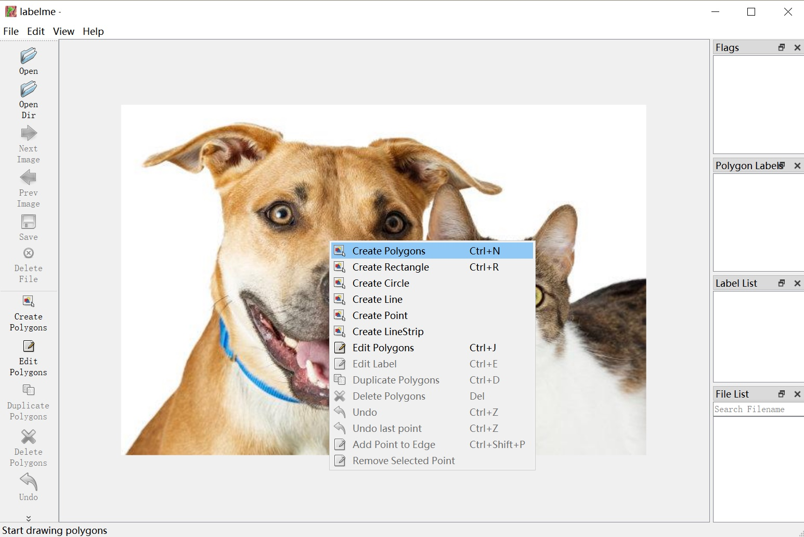
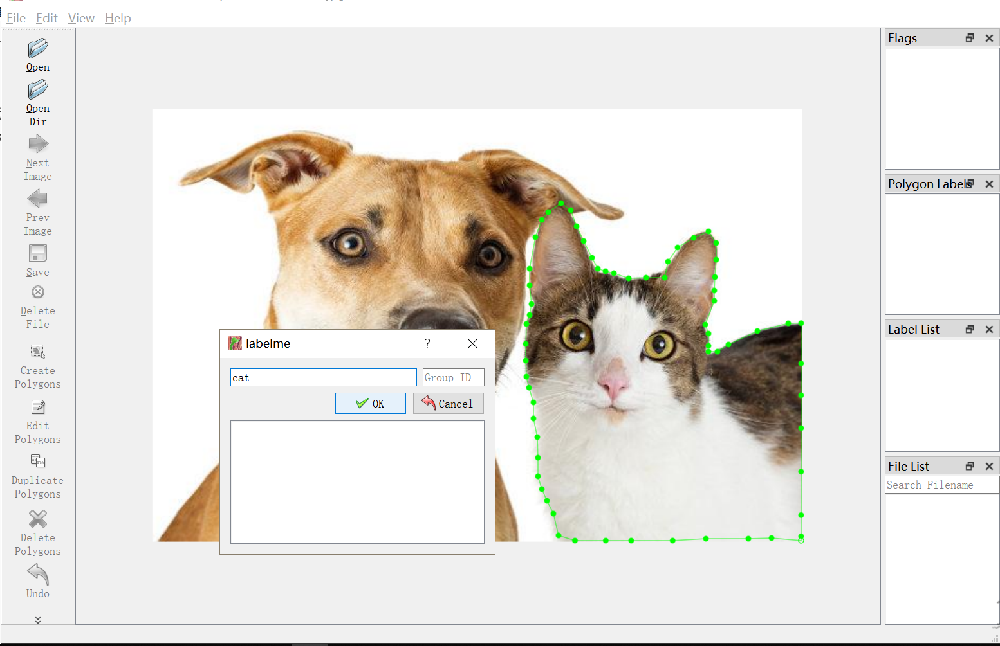

简体中文|[English](LabelMe.md)
# LabelMe

如您先前并无安装，那么LabelMe的安装可参考[LabelMe安装和启动](https://paddlex.readthedocs.io/zh_CN/develop/data/annotation/labelme.html)

**注意：LabelMe对于中文支持不够友好，因此请不要在如下的路径以及文件名中出现中文字符!**

## 开始标注

1. open：打开某一张图片
2. openDir：打开某一文件夹下所有的图片
3. 打开多边形框标注工具(右键菜单->Create Polygons)，具体如下图所示



4.源着目标边缘进行标注和给予目标标签。



5.点击保存按钮后对应图片目录下生成json文件

### 批量json文件转图片

1.建议安装labelme的版本为3.16.5

`!pip install labelme==3.16.5`

2.使用方式

`python xxx.py -p 存放json文件的文件夹路径 `

3.代码如下

```# -*- coding: UTF-8 -*-
import argparse
import json
import os
import os.path as osp
import warnings
import PIL.Image
import yaml
from labelme import utils


def main():
    parser = argparse.ArgumentParser(description="JsonToImage")
    parser.add_argument('-p', '--path', default=None)
    args = parser.parse_args()
    if args.path:
        json_file = args.path
    else:
        assert ("没有传入json路径")


    list_path = list(filter(lambda x: '.json' in x,os.listdir(json_file)))
    print('freedom =', json_file)
    for i in range(0, len(list_path)):
        path = os.path.join(json_file, list_path[i])
        if os.path.isfile(path):

            data = json.load(open(path))
            img = utils.img_b64_to_arr(data['imageData'])
            lbl, lbl_names = utils.labelme_shapes_to_label(img.shape, data['shapes'])

            captions = ['%d: %s' % (l, name) for l, name in enumerate(lbl_names)]

            lbl_viz = utils.draw_label(lbl, img, captions)

            out_dir = osp.basename(path).split('.json')[0]
            save_file_name = out_dir

            if not osp.exists(json_file + 'mask'):
                os.mkdir(json_file + 'mask')
            maskdir = json_file + 'mask'

            if not osp.exists(json_file + 'mask_viz'):
                os.mkdir(json_file + 'mask_viz')
            maskvizdir = json_file + 'mask_viz'

            out_dir1 = maskdir
            PIL.Image.fromarray(lbl).save(out_dir1 + '/' + save_file_name + '.png')

            PIL.Image.fromarray(lbl_viz).save(maskvizdir + '/' + save_file_name +
                                              '_label_viz.png')

            with open(osp.join(out_dir1, 'label_names.txt'), 'w') as f:
                for lbl_name in lbl_names:
                    f.write(lbl_name + '\n')

            warnings.warn('info.yaml is being replaced by label_names.txt')
            info = dict(label_names=lbl_names)
            with open(osp.join(out_dir1, 'info.yaml'), 'w') as f:
                yaml.safe_dump(info, f, default_flow_style=False)

            print('Saved to: %s' % out_dir1)


if __name__ == '__main__':
    main()
```

4. 在传入的目录下会生成'mask'和‘mask_viz’文件夹。‘mask’文件夹存放转换后mask图片。‘mask_viz’存放的是伪彩mask图片。
