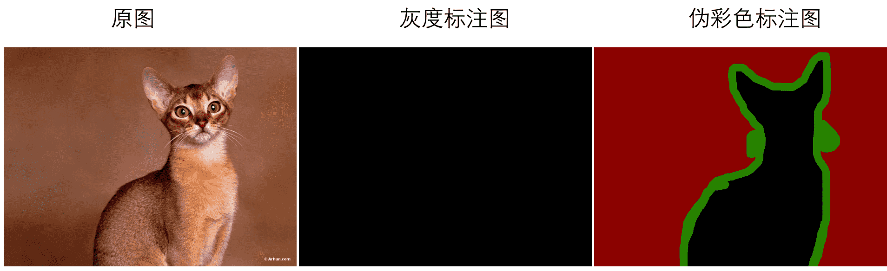

English|[简体中文](marker_cn.md)
# Prepare Customized Dataset

## 1 Pre-knowledge

### 1.1 Annotation Protocal

PaddleSeg uses a single-channel annotated image, each pixel value represents a category, and the pixel label category needs to increase from 0. For example, 0, 1, 2, 3 indicate that there are 4 categories.

Please use PNG lossless compression format for annotated images. The maximum number of label categories is 256.

### 1.2 Grayscale Annotation VS Pseudo-color Annotation

The general segmentation library uses a single-channel grayscale image as the annotated image, and it often shows a completely black effect. Disadvantages of gray scale annotated map:
1. After annotating an image, it is impossible to directly observe whether the annotation is correct.
2. The actual effect of segmentation cannot be directly judged during the model testing process.

PaddleSeg supports pseudo-color images as annotated images, and injects palettes on the basis of the original single-channel images. On the basis of basically not increasing the size of the picture, it can show a colorful effect.

At the same time, PaddleSeg is also compatible with gray-scale icon annotations. The user's original gray-scale dataset can be used directly without modification.

<div align="center">
  
</div>

### 1.3 Convert grayscale annotations to pseudo-color annotations

If users need to convert to pseudo-color annotation maps, they can use our conversion tool. Applies to the following two common situations:
* If you want to convert all grayscale annotation images in a specified directory to pseudo-color annotation images, execute the following command to specify the directory where the grayscale annotations are located.
```buildoutcfg
python tools/data/gray2pseudo_color.py <dir_or_file> <output_dir>
```

|Parameter|Effection|
|-|-|
|dir_or_file|Specify the directory where gray scale labels are located|
|output_dir|Output directory of color-labeled pictures|

* If you only want to convert part of the gray scale annotated image in the specified dataset to pseudo-color annotated image, execute the following command, you need an existing file list, and read the specified image according to the list.
```buildoutcfg
python tools/data/gray2pseudo_color.py <dir_or_file> <output_dir> --dataset_dir <dataset directory> --file_separator <file list separator>
```
|Parameter|Effection|
|-|-|
|dir_or_file|Specify the directory where gray scale labels are located|
|output_dir|Output directory of color-labeled pictures|
|--dataset_dir|The root directory where the dataset is located|
|--file_separator|File list separator|

## 2 Annotate custom datasets

If you want to use a custom dataset, you need to collect images for training, evaluation, and testing in advance, and then use the data annotation tool to complete the data annotation. If you want to use ready-made datasets such as Cityscapes and Pascal VOC, you can skip this step.

PaddleSeg already supports 2 kinds of labeling tools: `LabelMe`, and `EISeg`. The annotation tutorial is as follows:

- [EISeg Tutorial](../../../EISeg/README.md)
- [LabelMe Tutorial](../transform/transform.md)
## 3 Dataset Organization

After annotating all data, we need to organize them as following structure. All origin images are saved in a directory, and all annotated images are saved in another directory.

Besides, please check the name of origin images and annotated images are corresponding.

```
custom_dataset
    |
    |--images           # save the origin images
    |  |--image1.jpg
    |  |--image2.jpg
    |  |--...
    |
    |--labels           # save the annotated images
    |  |--label1.png
    |  |--label2.png
    |  |--...
```

## 4 Split a custom dataset

As we all known, the dataset is usually divided into training set, validation set, and test set.

For all data that is not divided into training set, validation set, and test set, PaddleSeg provides a script to generate segmented data and generate a file list.

The following commands support enabling specific functions through different Flags.

```
python tools/data/split_dataset_list.py <dataset_root> <images_dir_name> <labels_dir_name> ${FLAGS}
```

Parameters:
- dataset_root: Dataset root directory
- images_dir_name: Original image filename
- labels_dir_name: Annotated image filename

FLAGS:

|FLAG|Meaning|Default|Parameter numbers|
|-|-|-|-|
|--split|Dataset segmentation ratio|0.7 0.3 0|3|
|--separator|File list separator|"&#124;"|1|
|--format|Data format of pictures and label sets|"jpg"  "png"|2|
|--postfix|Filter pictures and label sets according to whether the main file name (without extension) contains the specified suffix|""   ""（2 null characters）|2|

The example of usage:
```
python tools/data/split_dataset_list.py <dataset_root> images annotations --split 0.6 0.2 0.2 --format jpg png
```

After running, `train.txt`, `val.txt`, `test.txt` and `labels.txt` will be generated in the root directory of the dataset.

```
custom_dataset
    |
    |--images
    |  |--image1.jpg
    |  |--image2.jpg
    |  |--...
    |
    |--labels
    |  |--label1.png
    |  |--label2.png
    |  |--...
    |
    |--train.txt
    |
    |--val.txt
    |
    |--test.txt
```


These three txt files contain the following content. Each line is the rativate path of origin image and annoted image.
```
images/image1.jpg  annotations/image1.png
images/image2.jpg  annotations/image2.png
...
```

Finally, we have prepared customized dataset.
