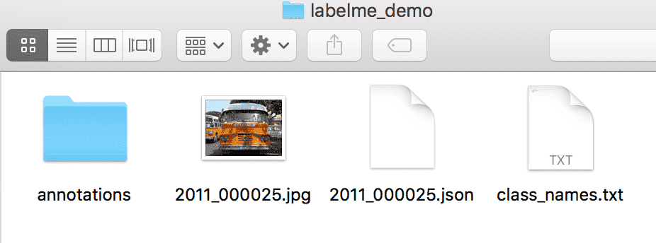

English|[简体中文](transform_cn.md)
# Annotating Tutorial

Whether it is semantic segmentation, panoramic segmentation, or instance segmentation, we all need sufficient training data. If you want to use an unlabeled original dataset for segmentation tasks, you must first annotate the original image. If you are using a dataset with segmentation annotations such as `Cityscapes`, you can skip this step.
- This document will provide tutorials for using 3 kinds of labeling tools: [EISeg](#1、EISeg), [LabelMe](#2、LabelMe), [Colabeler](#3、Colabeler).

# 1、EISeg

EISeg(Efficient Interactive Segmentation) is an efficient and intelligent interactive segmentation and annotation software developed based on [PaddlePaddle](https://www.paddlepaddle.org.cn/). It covers high-quality interactive segmentation models in different directions such as high-precision and lightweight, which is convenient for developers to quickly implement semantic and instance label labeling, and reduce labeling costs. In addition, by applying the annotations obtained by EISeg to other segmentation models provided by PaddleSeg for training, a high-precision model of a customized scene can be obtained, and the entire process of segmentation tasks from data annotation to model training and prediction can be opened up.

## Demo


## <span id = "jump">Model Preparation</span>

Before using EIseg, please download the model parameters first. EISeg has opened four labeling models trained on COCO+LVIS and large-scale portrait data to meet the labeling requirements of general scenes and portrait scenes. The model structure corresponds to the network selection module in the EISeg interactive tool, and users need to select different network structures and loading parameters according to their own scenario requirements.

| Model Type | Applicable Scene | Model Structure | Download |
| --- | --- | --- | ---|
| High-precision model  | Suitable for general scenes |HRNet18_OCR64 | [hrnet18_ocr64_cocolvis](https://bj.bcebos.com/paddleseg/dygraph/interactive_segmentation/ritm/hrnet18_ocr64_cocolvis.pdparams) |
| Lightweight model | Suitable for general scenes |HRNet18s_OCR48 | [hrnet18s_ocr48_cocolvis](https://bj.bcebos.com/paddleseg/dygraph/interactive_segmentation/ritm/hrnet18s_ocr48_cocolvis.pdparams) |
| High-precision model  | Suitable for portrait marking scenes |HRNet18_OCR64 | [hrnet18_ocr64_human](https://bj.bcebos.com/paddleseg/dygraph/interactive_segmentation/ritm/hrnet18_ocr64_human.pdparams) |
| Lightweight model | Suitable for portrait marking scenes |HRNet18s_OCR48 | [hrnet18s_ocr48_human](https://bj.bcebos.com/paddleseg/dygraph/interactive_segmentation/ritm/hrnet18s_ocr48_human.pdparams) |


* 1.Installation

EISeg provides a variety of installation methods, among which [pip](#PIP), [conda](#Conda) and [Run Code](#Code) are compatible with Windows, Mac OS and Linux. In order to avoid environment conflicts, it is recommended to install in a virtual environment created by conda.


Requirements:

   * PaddlePaddle >= 2.1.0

Please refer to [Official Website](https://www.paddlepaddle.org.cn/install/quick?docurl=/documentation/docs/zh/install/pip/windows-pip.html) for PaddlePaddle installation.

### PIP

The pip installation method is as follows:

```shell
pip install eiseg
```
pip will automatically install dependencies. After the installation is complete, enter the command line:
```shell
eiseg
```
then can run the software.

### Conda
First install Anaconda or Miniconda, refer to [Tsinghua Mirror Tutorial](https://mirrors.tuna.tsinghua.edu.cn/help/anaconda/).

```shell
conda create -n eiseg python=3.8
conda activate eiseg
conda install qtpy
pip install eiseg
eiseg
```

### Windows exe

EISeg uses [QPT](https://github.com/GT-ZhangAcer/QPT) for packaging. You can download the latest EISeg from [Baidu Cloud Disk](https://pan.baidu.com/s/1KXJ9PYjbnBgQozZJEJE-bA) (extraction code: 82z9). After decompression, double-click the launcher.exe to run the program. The first time the program runs, it will initialize the packages needed for installation. Please wait a moment.

### Code

First clone this project to the local.
```shell
git clone https://github.com/PaddlePaddle/PaddleSeg
cd PaddleSeg/contrib/EISeg
pip install -r requirements.txt
python -m eiseg
```
then start execution.


## UI


The interface of EISeg mainly consists of 4 parts, `namely menu & toolbar`, `status bar`, `image display area` and `work area`.

- The menu bar, toolbar and status bar are PyQt defaults. The toolbar can be dragged to any position, or placed at the top and bottom ends. The introduction of related tools is displayed in the status bar when the mouse is hovered.
-The work area adopts QDockWidget, which can also be dragged and placed to any position or fixed on the left and right ends. The work area can be mainly set and switched.
-The image display area is responsible for the display and interaction of images. Use QGraphicsView, load QGraphicsScene, and add images in the form of Qpixmap. When the image is loaded, the zoom ratio is automatically calculated according to the image size to ensure that the image is displayed completely.


* 2.Using

Before marking, you need to make the following settings:

1. **Load Parameters**

      Select the appropriate network and load the corresponding model parameters. In EISeg, the current network is divided into `HRNet18s_OCR48` and `HRNet18_OCR64`, and two model parameters of portrait and general are provided respectively. For download of model parameters, please refer to [Model Preparation](#jump). After the model parameters are loaded correctly, the status bar in the lower right corner will give instructions. If the network parameters do not match the model parameters, a warning will pop up. At this time, the loading fails and you need to reload. The correctly loaded model parameters will be recorded in the `Recent Model Parameters`, which can be easily switched, and the model parameters at the time of exit will be automatically loaded when the software is opened next time.

2. **Load Images**

   ​	Open the image/image folder. When you see that the main interface image is loaded correctly, the image path appears correctly in the `data list`, it done.

3. **Annotation Adding/Loading**

   ​	You can create a new label through `Add label`. The label is divided into 4 columns, corresponding to pixel value, description, color, and deletion. The newly created label can be saved as a txt file through `Save label list`, and other collaborators can import the label through `Load label list`. Labels imported by loading method will be automatically loaded after restarting the software.

4. **Automatically Saving Setting**

   ​	You can set the `auto save` setting and set the folder (currently only supports the English path), so that when you switch the image during use, the marked image will be automatically saved.

When the setting is completed, you can start marking. By default, the commonly used keys/shortcut keys are:

| Keys/Shortcuts           | Effection             |
| --------------------- | ---------------- |
| **Leftmouse**          | **Add positive sample points** |
| **Rightmouse**          | **Add negative sample points** |
| MMB              | Image translation         |
| Ctrl+MMB（wheel） | Image scaling         |
| S                     | Switch to the previous image |
| F                     | Switch to the next image |
| Space（空格）         | Complete annotating |
| Ctrl+Z                | Undo one click |
| Ctrl+Shift+Z          | Clear all clicks |
| Ctrl+Y                | Undo one click |
| Ctrl+A                | Open image |
| Shift+A               | Open folder |
| Ctrl+M                | Load model parameters|

# Developers

[Yuying Hao](https://github.com/haoyuying), [Yizhou Chen](https://github.com/geoyee), [Lin Han](https://github.com/linhandev/), [GT](https://github.com/GT-ZhangAcer), [Zhiliang Yu](https://github.com/yzl19940819)


# 2、LabelMe
* 1.Installation

After the user has collected the images for training, evaluation, and prediction, he needs to use the data labeling tool [LabelMe] (https://github.com/wkentaro/labelme) to complete the data labeling. LabelMe supports the use of Windows/macOS/Linux three systems, and the label format under the three systems is the same. For the specific installation process, please refer to the [Official Installation Guide](https://github.com/wkentaro/labelme).

* 2.Using

Open the terminal and enter `labelme`, and an interactive interface of LabelMe will appear. You can preview the marked image given by `LabelMe` before starting to label the custom dataset.


<div align="left">
    <p>Figure 1 : Schematic diagram of LableMe interactive interface</p>
 </div>


   * Preview annotated Images

Get `LabelMe` source code：

```
git clone https://github.com/wkentaro/labelme
```

Enter `labelme` in the terminal and the LableMe interactive interface will appear. Click `OpenDir` to open `<path/to/labelme>/examples/semantic_segmentation/data_annotated`, where `<path/to/labelme>` is the cloned `labelme` After opening, it shows the truth label of semantic segmentation.


<div align="left">
    <p>Figure 2 : Schematic diagram of annotated images</p>
 </div>


   * Start Annotating

Please follow the steps below to label the dataset:

​		(1) Click `OpenDir` to open the directory where the picture to be labeled is located, click `Create Polygons`, draw polygons along the edges of the target, and enter the target category after completion. During the marking process, if a point is drawn wrong, you can press the undo shortcut key to undo the point. The undo shortcut key under Mac is `command+Z`.


<div align="left">
    <p>Figure 3 : Schematic diagram of marking a single target</p>
 </div>


​		(2) Right-click and select `Edit Polygons` to move the position of the polygon as a whole or to move a certain point; right-click and select `Edit Label` to modify the category of each target. Please perform this step according to your own needs, if you don't need to modify it, you can skip it.


<div align="left">
    <p>Figure 4 : Schematic diagram of modified annotation</p>
 </div>


​		(3) After marking all targets in the picture, click `Save` to save the json file, **please put the json file and the picture in the same folder**, and click `Next Image` to mark the next picture.

The truth value files produced by LableMe can refer to the [folder] (https://github.com/PaddlePaddle/PaddleSeg/blob/release/v0.8.0/docs/annotation/labelme_demo) given by us.


<div align="left">
    <p>Figure 5 : Schematic diagram of the truth file produced by LableMe</p>
 </div>


 **Note：**

Marking method for targets with holes in the middle: After marking the target outline, draw a polygon along the edge of the hole area and assign it to another category, and if it is a background, assign it to `_background_`. as follows:


 <div align="left">
    <p>Figure 6 : Schematic diagram of labeling with holes in the target</p>
 </div>


* 3.Data format conversion

Finally, use the data conversion script we provide to convert the data format produced by the above-mentioned annotation tool into the data format required for model training.

* The dataset directory structure after data format conversion is as follows:

 ```
 my_dataset                 # Root directory
 |-- annotations            # Ground-truth
 |   |-- xxx.png            # Pixel-level truth information
 |   |...
 |-- class_names.txt        # The category name of the dataset
 |-- xxx.jpg(png or other)  # Original image of dataset
 |-- ...
 |-- xxx.json               # Json file,used to save annotation information
 |-- ...

 ```



<div align="left">
    <p>Figure 7 : Schematic diagram of the structure of the dataset catalog after format conversion</p>
 </div>


* 4.Run the following code to convert the annotated data into a dataset that meets the above format:

```
  python tools/labelme2seg.py <PATH/TO/LABEL_JSON_FILE>
```

Among them, `<PATH/TO/LABEL_JSON_FILE>` is the directory of the folder where the picture and the json file produced by LabelMe are located, and it is also the directory of the folder where the converted label set is located.

We have built a example, you can run the following code to experience:

```
python tools/labelme2seg.py legacy/docs/annotation/labelme_demo/
```

The converted dataset can refer to the [folder] (https://github.com/PaddlePaddle/PaddleSeg/blob/release/v0.8.0/docs/annotation/labelme_demo) given by us. Among them, the file `class_names.txt` is the name of all the annotation categories in the dataset, including the background class; the folder `annotations` saves the pixel-level truth information of each picture, the background class `_background_` corresponds to 0, and other targets The category starts from 1 and increases up to 255.


<div align="left">
    <p>Figure 8 : Schematic diagram of the contents of each catalog of the dataset after format conversion</p>
 </div>


# 3、Colabeler
# Colabeler Tutorial

* 1.Installation

After the user has collected the pictures for training, evaluation and prediction, he can use the [Spirit Data Annotation Tool](http://www.jinglingbiaozhu.com/) to complete the data annotation. Wizard labeling supports the use of Windows/macOS/Linux three systems. For Mac, you can search for colabeler in the MacStore and download it.

* 2.Using

Before starting to annotate custom datasets, you can preview the [Text Tutorial](http://www.jinglingbiaozhu.com/?type=tutorial&cat_id=4) and [Video Tutorial](http://www.jinglingbiaozhu .com/?type=tutorial&cat_id=5).

   * Start Annotating

Open colabeler.

<div align="center">
    
    <p>Figure 1 : Schematic diagram of the sprite labeling interactive interface</p>
 </div>

Please follow the steps below to label the dataset:

(1) Click `New`, then select `Location labeling`, select `Picture folder`, modify and fill in the required `category value` (Note: separated by commas), click the `Create` button, the software will automatically Load the pictures (png, jpg, gif) in the folder and create a project.

Position annotation supports three types: rectangle, polygon and curve. Select the simple and easy-to-use `polygon box`, draw a polygon along the edge of the target, and enter the target category on the right after completion.

**Note: Remember to save a single picture after marking, click the tick button in the center below or use the shortcut key ctrl+s**.

Then you can click the previous one on the left or directly use the left and right buttons of the keyboard to switch pictures.

<div align="center">
    
    <p>Figure 2 : Schematic diagram of marking a single target</p>
 </div>

(2) Click the target box and drag the mouse to move the position of the polygon as a whole; click the `delete marquee` on the left to delete the wrong target frame; click the `mark information` on the right to modify the target category. Please perform this step according to your own needs, if you don't need to modify it, you can skip it.

<div align="center">
  	
    <p>Figure 3 : Schematic diagram of modified annotation</p>
 </div>

(3) When the annotations of all the pictures are completed, click `Export` on the left, select `JSON` as the output method, specify the `Save location`, and click `OK Export` to save the annotation files of all the pictures.

**Note: The exported annotation file is located in the `outputs` directory under the `save location`.**

The truth-value files produced by the wizard can refer to the [folder](../../../legacy/docs/imgs/annotation/jingling_demo) we gave

<div align="center">
    
    <p>Figure 4 : Schematic diagram of the truth-value file produced by the wizard</p>
 </div>

**Note:** For targets with a hollow in the middle (such as a swimming ring), the marking of the hollow part is temporarily not supported. If necessary, you can use [labelme](./labelme2seg.md).

* 3. Data Format Conversion
Finally, use the data conversion script we provide to convert the data format produced by the above-mentioned annotation tool into the data format required for model training.

   * The dataset directory structure after data format conversion is as follows:


 ```
 my_dataset                 # root directory
 |-- outputs                # Export directory
 |   |-- annotations            # Gound-truth
 |       |-- xxx.png            # Pixel-level truth information
 |       |...
 |   |-- class_names.txt        # The category name of the dataset
 |   |-- xxx.json               # 标注json文件
 |-- xxx.jpg(png or other)  # Original image of dataset
 |-- ...

 ```

<div align="center">
    
    <p>Figure 5 Schematic diagram of the structure of the dataset catalog after format conversion</p>
 </div>

* Run the following code to convert the annotated data into a dataset that meets the above format:

```
python tools/jingling2seg.py <PATH/TO/LABEL_JSON_FILE>
```

Among them, `<PATH/TO/LABEL_JSON_FILE>` is the directory of the folder where the json file marked and output by the wizard is located. Generally, it is the `outputs` directory under the `save location` in the wizard tool use (3).

We have built an annotated example, you can run the following code to experience:

```
python tools/jingling2seg.py legacy/docs/annotation/jingling_demo/outputs/
```

For the converted dataset, please refer to the [folder](../../../legacy/docs/imgs/annotation/jingling_demo) we gave. Among them, the file `class_names.txt` is the name of all the annotation categories in the dataset, including the background class; the folder `annotations` saves the pixel-level truth information of each picture, the background class `_background_` corresponds to 0, and other targets The category starts from 1 and increases up to 255.

<div align="center">
    
    <p>Figure 6 : Schematic diagram of the contents of each catalog of the dataset after format conversion</p>
 </div>


