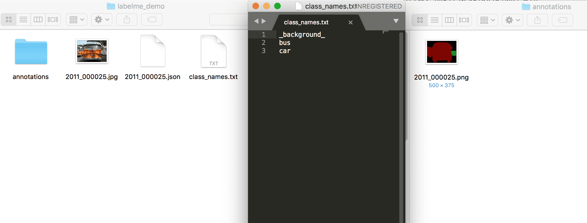

简体中文|[English](transform.md)
# 数据标注教程

无论是语义分割，全景分割，还是实例分割，我们都需要充足的训练数据。如果你想使用没有标注的原始数据集做分割任务，你必须先为原始图像作出标注。如果你使用的是Cityscapes等已有分割标注的数据集，你可以跳过本步骤。
- 本文档将提供2种标注工具的使用教程：EISeg、LabelMe。

# 一、LabelMe
* 1.LabelMe的安装

用户在采集完用于训练、评估和预测的图片之后，需使用数据标注工具[LabelMe](https://github.com/wkentaro/labelme)完成数据标注。LabelMe支持在Windows/macOS/Linux三个系统上使用，且三个系统下的标注格式是一样。具体的安装流程请参见[官方安装指南](https://github.com/wkentaro/labelme)。

* 2.LabelMe的使用

打开终端输入`labelme`会出现LableMe的交互界面，可以先预览`LabelMe`给出的已标注好的图片，再开始标注自定义数据集。


<div align="left">
    <p>图1 LableMe交互界面的示意图</p>
 </div>


   * 预览已标注图片  

获取`LabelMe`的源码：

```
git clone https://github.com/wkentaro/labelme
```

终端输入`labelme`会出现LableMe的交互界面，点击`OpenDir`打开`<path/to/labelme>/examples/semantic_segmentation/data_annotated`，其中`<path/to/labelme>`为克隆下来的`labelme`的路径，打开后示意的是语义分割的真值标注。


<div align="left">
    <p>图2 已标注图片的示意图</p>
 </div>


   * 开始标注

请按照下述步骤标注数据集：

​		(1)   点击`OpenDir`打开待标注图片所在目录，点击`Create Polygons`，沿着目标的边缘画多边形，完成后输入目标的类别。在标注过程中，如果某个点画错了，可以按撤销快捷键可撤销该点。Mac下的撤销快捷键为`command+Z`。


<div align="left">
    <p>图3 标注单个目标的示意图</p>
 </div>


​		(2)   右击选择`Edit Polygons`可以整体移动多边形的位置，也可以移动某个点的位置；右击选择`Edit Label`可以修改每个目标的类别。请根据自己的需要执行这一步骤，若不需要修改，可跳过。


<div align="left">
    <p>图4 修改标注的示意图</p>
 </div>


​		(3)   图片中所有目标的标注都完成后，点击`Save`保存json文件，**请将json文件和图片放在同一个文件夹里**，点击`Next Image`标注下一张图片。

LableMe产出的真值文件可参考我们给出的[文件夹](https://github.com/PaddlePaddle/PaddleSeg/blob/release/v0.8.0/docs/annotation/labelme_demo)。


<div align="left">
    <p>图5 LableMe产出的真值文件的示意图</p>
 </div>


 **Note：**

 对于中间有空洞的目标的标注方法：在标注完目标轮廓后，再沿空洞区域边缘画多边形，并将其指定为其他类别，如果是背景则指定为`_background_`。如下：


 <div align="left">
    <p>图6 带空洞目标的标注示意图</p>
 </div>


* 3.数据格式转换

最后用我们提供的数据转换脚本将上述标注工具产出的数据格式转换为模型训练时所需的数据格式。

* 经过数据格式转换后的数据集目录结构如下：

 ```
 my_dataset                 # 根目录
 |-- annotations            # 数据集真值
 |   |-- xxx.png            # 像素级别的真值信息
 |   |...
 |-- class_names.txt        # 数据集的类别名称
 |-- xxx.jpg(png or other)  # 数据集原图
 |-- ...
 |-- xxx.json               # 标注json文件
 |-- ...

 ```


<div align="left">
    <p>图7 格式转换后的数据集目录的结构示意图</p>
 </div>


* 4.运行以下代码，将标注后的数据转换成满足以上格式的数据集：

```
  python tools/labelme2seg.py <PATH/TO/LABEL_JSON_FILE>
```

其中，`<PATH/TO/LABEL_JSON_FILE>`为图片以及LabelMe产出的json文件所在文件夹的目录，同时也是转换后的标注集所在文件夹的目录。

我们已内置了一个标注的示例，可运行以下代码进行体验：

```
python tools/labelme2seg.py docs/annotation/labelme_demo/
```

转换得到的数据集可参考我们给出的[文件夹](https://github.com/PaddlePaddle/PaddleSeg/blob/release/v0.8.0/docs/annotation/labelme_demo)。其中，文件`class_names.txt`是数据集中所有标注类别的名称，包含背景类；文件夹`annotations`保存的是各图片的像素级别的真值信息，背景类`_background_`对应为0，其它目标类别从1开始递增，至多为255。



<div align="left">
    <p>图8 格式转换后的数据集各目录的内容示意图</p>
 </div>


# 二、EISeg
EISeg的使用请参考[文档](../../../EISeg/README.md)
