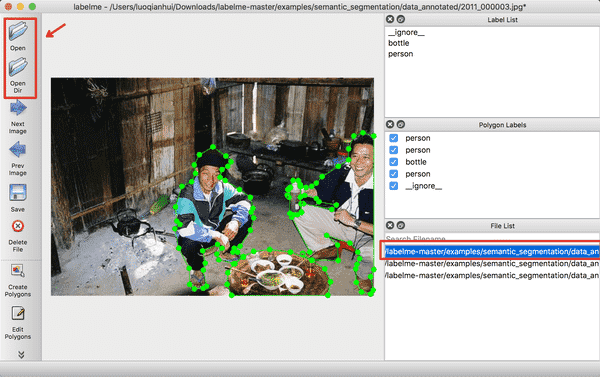
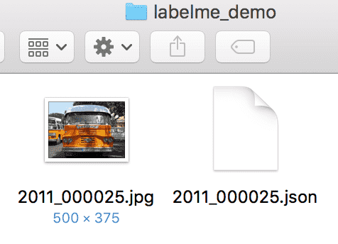

简体中文|[English](transform.md)

# LabelMe分割数据标注

无论是语义分割，全景分割，还是实例分割，我们都需要充足的训练数据。

本文档简要介绍使用LabelMe软件进行分割数据标注，并将标注数据转换为PaddleSeg支持的格式。
## 1. 安装LabelMe

LabelMe支持在Windows/macOS/Linux三个系统上使用，且三个系统下的标注格式是一样。

LabelMe的安装流程请参见[官方安装指南](https://github.com/wkentaro/labelme)。

## 2. 使用LabelMe
### 预览已标注图片

打开终端输入`labelme`会出现LableMe的交互界面，可以先预览`LabelMe`给出的已标注好的图片。


<div align="center">
  
<p>图1 LableMe交互界面的示意图</p>
</div>

点击`OpenDir`打开`<path/to/labelme>/examples/semantic_segmentation/data_annotated`，其中`<path/to/labelme>`为克隆下来的`labelme`的路径，打开后显示的是语义分割的真值标注。


<div align="center">
  
<p>图2 已标注图片的示意图</p>
</div>


### 开始标注图片

(1) 点击`OpenDir`打开待标注图片所在目录，点击`Create Polygons`，沿着目标的边缘画多边形，完成后输入目标的类别。在标注过程中，如果某个点画错了，可以按撤销快捷键可撤销该点。Mac下的撤销快捷键为`command+Z`。

<div align="center">
  
<p>图3 标注单个目标的示意图</p>
</div>


​(2) 右击选择`Edit Polygons`可以整体移动多边形的位置，也可以移动某个点的位置；右击选择`Edit Label`可以修改每个目标的类别。请根据自己的需要执行这一步骤，若不需要修改，可跳过。


<div align="center">
  
<p>图4 修改标注的示意图</p>
</div>


(3) 图片中所有目标的标注都完成后，点击`Save`保存json文件，**请将json文件和图片放在同一个文件夹里**，点击`Next Image`标注下一张图片。

LableMe产出的真值文件可参考我们给出的[文件夹](https://github.com/PaddlePaddle/PaddleSeg/blob/release/v0.8.0/docs/annotation/labelme_demo)。


<div align="center">
  
<p>图5 LableMe产出的真值文件的示意图</p>
</div>


**Note：**

对于中间有空洞的目标的标注方法：在标注完目标轮廓后，再沿空洞区域边缘画多边形，并将其指定为其他类别，如果是背景则指定为`_background_`。如下：


<div align="center">
  
<p>图6 带空洞目标的标注示意图</p>
</div>


## 3. 数据格式转换

使用PaddleSeg提供的数据转换脚本，将LabelMe标注工具产出的数据格式转换为PaddleSeg所需的数据格式。

运行以下代码进行转换，其中`<PATH/TO/LABEL_JSON_FILE>`为图片以及LabelMe产出的json文件所在文件夹的目录，同时也是转换后的标注集所在文件夹的目录。

```
python tools/labelme2seg.py <PATH/TO/LABEL_JSON_FILE>
```

经过数据格式转换后的数据集目录结构如下：
```
my_dataset                 # 根目录
|-- annotations            # 标注图像的目录
|   |-- xxx.png            # 标注图像
|   |...
|-- class_names.txt        # 数据集的类别名称
|-- xxx.jpg(png or other)  # 原图
|-- ...
|-- xxx.json               # 标注json文件
|-- ...

```


<div align="center">
  
<p>图7 格式转换后的数据集目录的结构示意图</p>
</div>
