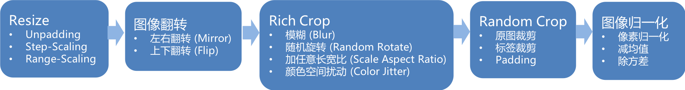
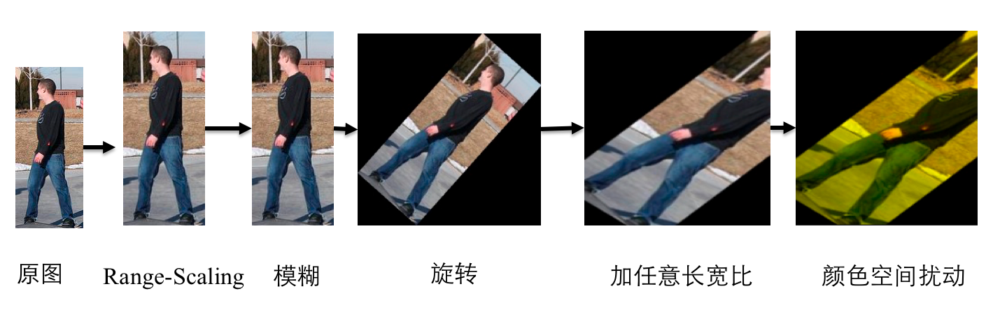

# PaddleSeg 数据增强

## 数据增强基本流程

## Resize  

resize 步骤是指将输入图像按照某种规则先进行resize，PaddleSeg支持以下3种resize方式:

- unpadding
将输入图像直接resize到某一个固定大小下，送入到网络中间训练，对应参数为AUG.FIX_RESIZE_SIZE。预测时同样操作。

- stepscaling
将输入图像按照某一个比例resize，这个比例以某一个步长在一定范围内随机变动。设定最小比例参数为`AUG.MIN_SCALE_FACTOR`, 最大比例参数`AUG.MAX_SCALE_FACTOR`，步长参数为`AUG.SCALE_STEP_SIZE`。预测时不对输入图像做处理。

- rangescaling
固定长宽比resize，即图像长边对齐到某一个固定大小，短边随同样的比例变化。设定最小大小参数为`AUG.MIN_RESIZE_VALUE`，设定最大大小参数为`AUG.MAX_RESIZE_VALUE`。预测时需要将长边对齐到`AUG.INF_RESIZE_VALUE`所指定的大小，其中`AUG.INF_RESIZE_VALUE`在`AUG.MIN_RESIZE_VALUE`和`AUG.MAX_RESIZE_VALUE`范围内。

rangescaling示意图如下：

## 图像翻转

PaddleSeg支持以下2种翻转方式：

- 左右翻转（Mirror）
使用开关`AUG.MIRROR`，为True时该项功能开启，为False时该项功能关闭。

- 上下翻转（Flip）
使用开关`AUG.FLIP`，为True时该项功能开启，`AUG.FLIP_RATIO`控制是否上下翻转的概率。为False时该项功能关闭。

以上2种开关独立运作，可组合使用。故图像翻转一共有如下4种可能的情况：

## Rich Crop  

Rich Crop是PaddleSeg结合实际业务经验开放的一套数据增强策略，面向标注数据少，测试数据情况繁杂的分割业务场景使用的数据增强策略。流程如下图所示:

rich crop是指对图像进行多种变换，保证在训练过程中数据的丰富多样性，PaddleSeg支持以下几种变换。`AUG.RICH_CROP.ENABLE`为False时会直接跳过该步骤。

- blur
图像加模糊，使用开关`AUG.RICH_CROP.BLUR`，为False时该项功能关闭。`AUG.RICH_CROP.BLUR_RATIO`控制加入模糊的概率。

- rotation
图像旋转，`AUG.RICH_CROP.MAX_ROTATION`控制最大旋转角度。旋转产生的多余的区域的填充值为均值。

- aspect
图像长宽比调整，从图像中crop一定区域出来之后在某一长宽比内进行resize。控制参数`AUG.RICH_CROP.MIN_AREA_RATIO`和`AUG.RICH_CROP.ASPECT_RATIO`。

- color jitter
图像颜色调整，控制参数`AUG.RICH_CROP.BRIGHTNESS_JITTER_RATIO`、`AUG.RICH_CROP.SATURATION_JITTER_RATIO`、`AUG.RICH_CROP.CONTRAST_JITTER_RATIO`。

## Random Crop  

该步骤主要是通过crop的方式使得输入到网络中的图像在某一个固定大小，控制该大小的参数为TRAIN_CROP_SIZE，类型为tuple，格式为(width, height). 当输入图像大小小于CROP_SIZE的时候会对输入图像进行padding，padding值为均值。

- 输入图片格式
    - 原图
        - 图片格式：RGB三通道图片和RGBA四通道图片两种类型的图片进行训练，但是在一次训练过程只能存在一种格式。
        - 图片转换：灰度图片经过预处理后之后会转变成三通道图片
        - 图片参数设置：当图片为三通道图片时IMAGE_TYPE设置为rgb， 对应MEAN和STD也必须是一个长度为3的list，当图片为四通道图片时IMAGE_TYPE设置为rgba，对应的MEAN和STD必须是一个长度为4的list。
    - 标注图
        - 图片格式：标注图片必须为png格式的单通道多值图，元素值代表的是这个元素所属于的类别。
        - 图片转换：在datalayer层对label图片进行的任何resize，以及旋转的操作，都必须采用最近邻的插值方式。
        - 图片ignore：设置TRAIN.IGNORE_INDEX 参数可以选择性忽略掉属于某一个类别的所有像素点。这个参数一般设置为255
