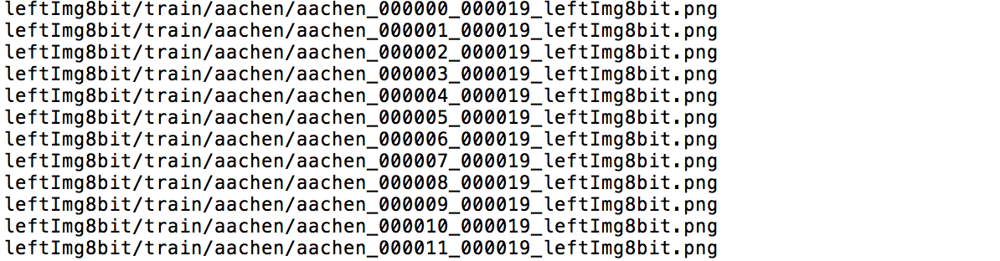

# PaddleSeg 数据准备

## 数据标注

用户需预先采集好用于训练、评估和测试的图片，然后使用数据标注工具完成数据标注。

PddleSeg已支持2种标注工具：LabelMe、精灵数据标注工具。标注教程如下：

- [LabelMe标注教程](annotation/labelme2seg.md)
- [精灵数据标注工具教程](annotation/jingling2seg.md)

最后用我们提供的数据转换脚本将上述标注工具产出的数据格式转换为模型训练时所需的数据格式。

## 文件列表

### 文件列表规范

PaddleSeg采用通用的文件列表方式组织训练集、验证集和测试集。像素标注类别需要从0开始递增。

**NOTE:** 标注图像请使用PNG无损压缩格式的图片

以Cityscapes数据集为例, 我们需要整理出训练集、验证集、测试集对应的原图和标注文件列表用于PaddleSeg训练即可。

其中`DATASET.DATA_DIR`为数据根目录，文件列表的路径以数据集根目录作为相对路径起始点。

```
./cityscapes/   # 数据集根目录
├── gtFine      # 标注目录
│   ├── test
│   │   ├── berlin
│   │   └── ...
│   ├── train
│   │   ├── aachen
│   │   └── ...
│   └── val
│       ├── frankfurt
│       └── ...
└── leftImg8bit  # 原图目录
    ├── test
    │   ├── berlin
    │   └── ...
    ├── train
    │   ├── aachen
    │   └── ...
    └── val
        ├── frankfurt
        └── ...
```

文件列表组织形式如下
```
原始图片路径 [SEP] 标注图片路径
```


其中`[SEP]`是文件路径分割符，可以在`DATASET.SEPARATOR`配置项中修改, 默认为空格。

**注意事项**

* 务必保证分隔符在文件列表中每行只存在一次, 如文件名中存在空格，请使用'|'等文件名不可用字符进行切分

* 文件列表请使用**UTF-8**格式保存, PaddleSeg默认使用UTF-8编码读取file_list文件

如下图所示，左边为原图的图片路径，右边为图片对应的标注路径。


若数据集缺少标注图片，则文件列表不用包含分隔符和标注图片路径，如下图所示。


**注意事项**

此时的文件列表仅可在调用`pdseg/vis.py`进行可视化展示时使用，
即仅可在`DATASET.TEST_FILE_LIST`和`DATASET.VIS_FILE_LIST`配置项中使用。
不可在`DATASET.TRAIN_FILE_LIST`和`DATASET.VAL_FILE_LIST`配置项中使用。


完整的配置信息可以参考[`./pdseg/utils/config.py`](../pdseg/utils/config.py)。

### 文件列表生成
PaddleSeg提供了生成文件列表的使用脚本，可适用于自定义数据集或cityscapes数据集，并支持通过不同的Flags来开启特定功能。
```
python pdseg/tools/create_dataset_list.py <your/dataset/dir> ${FLAGS}
```
运行后将在数据集根目录下生成训练/验证/测试集的文件列表（文件主名与`--second_folder`一致，扩展名为`.txt`）。

**Note:** 若训练/验证/测试集缺少标注图片，仍可自动生成不含分隔符和标注图片路径的文件列表。

#### 命令行FLAGS列表

|FLAG|用途|默认值|参数数目|
|-|-|-|-|
|--type|指定数据集类型，`cityscapes`或`自定义`|`自定义`|1|
|--separator|文件列表分隔符|'&#124;'|1|
|--folder|图片和标签集的文件夹名|'images' 'annotations'|2|
|--second_folder|训练/验证/测试集的文件夹名|'train' 'val' 'test'|若干|
|--format|图片和标签集的数据格式|'jpg'  'png'|2|
|--postfix|按文件主名（无扩展名）是否包含指定后缀对图片和标签集进行筛选|''   ''（2个空字符）|2|

#### 使用示例
- **对于自定义数据集**

如果用户想要生成自己数据集的文件列表，需要整理成如下的目录结构：
```
./dataset/   # 数据集根目录
├── annotations      # 标注目录
│   ├── test
│   │   ├── ...
│   │   └── ...
│   ├── train
│   │   ├── ...
│   │   └── ...
│   └── val
│       ├── ...
│       └── ...
└── images       # 原图目录
    ├── test
    │   ├── ...
    │   └── ...
    ├── train
    │   ├── ...
    │   └── ...
    └── val
        ├── ...
        └── ...
Note：以上目录名可任意
```
必须指定自定义数据集目录，可以按需要设定FLAG。

**Note:** 无需指定`--type`。
```
# 生成文件列表，其分隔符为空格，图片和标签集的数据格式都为png
python pdseg/tools/create_dataset_list.py <your/dataset/dir> --separator " " --format png png
```
```
# 生成文件列表，其图片和标签集的文件夹名为img和gt，训练和验证集的文件夹名为training和validation，不生成测试集列表
python pdseg/tools/create_dataset_list.py <your/dataset/dir> \
        --folder img gt --second_folder training validation
```


- **对于cityscapes数据集**

必须指定cityscapes数据集目录，`--type`必须为`cityscapes`。

在cityscapes类型下，部分FLAG将被重新设定，无需手动指定，具体如下：

|FLAG|固定值|
|-|-|
|--folder|'leftImg8bit' 'gtFine'|
|--format|'png' 'png'|
|--postfix|'_leftImg8bit' '_gtFine_labelTrainIds'|

其余FLAG可以按需要设定。
```
# 生成cityscapes文件列表，其分隔符为逗号
python pdseg/tools/create_dataset_list.py <your/dataset/dir> --type cityscapes --separator ","
```
