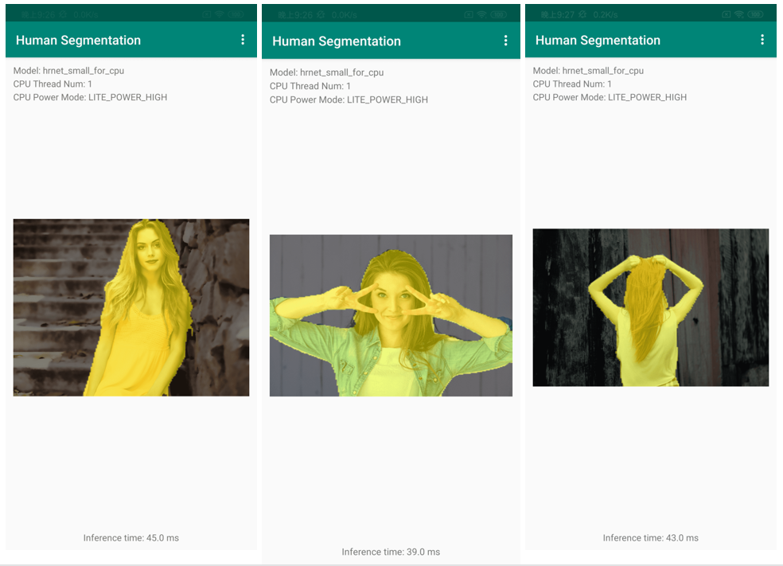

English | [简体中文](lite_cn.md)
# Deployment by PaddleLite

## 1. Introduction

PaddlePaddle provides several inference libraries to deploy models on different devices as the following image. Please refer to the [document](https://paddleinference.paddlepaddle.org.cn/product_introduction/summary.html) for more detail information about PaddlePaddle.


In this tutorial, we introduce the usage of [Paddle Lite](https://github.com/PaddlePaddle/Paddle-Lite) by the demo of deploying the human segmentation model on Android mobile phone.

## 2. Usage of the Andoird App

### 2.1 Requirements

* Android Studio 3.4
* Android mobile phone

### 2.2 Install the Android App

* run `git clone https://github.com/PaddlePaddle/PaddleSeg.git`.
* Open Android Studio, click "Open an existing Android Studio project" in the "Welcome to Android Studio" window, select the "PaddleSeg/deploy/lite/humanseg_android_demo/" as the path, click "Open" button to import the project. It will automatically download the inference model and the inference libray of Paddle Lite, and then build the project.
* Use USB to connect the Android mobile phone to our computer.
* Once the project is built, click the 'Run->Run APP', select the connected mobile phone in 'Select Deployment Target' window, click 'OK' button to install the Android App.
* Please refer to [Paddle-Lite-Demo](https://github.com/PaddlePaddle/Paddle-Lite-Demo) for more detail information about Paddle Lite.

### 2.3 Run the Android APP

* Open the App, it will load a portrait image and show the segmentation result and time-consuming.
* The App also support loading other images from gallery or taking photoes, and then outputting the segmentation results.


### 2.4 Results




## 3. Development of the Android App

Based on the Android App, we can easily update the inference library and use other models.

### 3.1 Update the Inference Libray

The inference libray of Paddle Lite contains three files:
* PaddlePredictor.jar
* arm64-v8a/libpaddle_lite_jni.so
* armeabi-v7a/libpaddle_lite_jni.so

There are two ways to obtain the inference libray of Paddle Lite as follows.

Firstly, download the release library from [github](https://github.com/PaddlePaddle/Paddle-Lite/releases/). For instance, the Android App use the [v2.8.0](https://paddlelite-demo.bj.bcebos.com/libs/android/paddle_lite_libs_v2_8_0.tar.gz) inference library in default. Besides, the dirname of PaddlePredictor.jar is `jave/`, the dirname of arm64-v8a and armeabi-v7a is `jave/libs`.

Secondly, prepare the compiling environment and compile the inference libray of Paddle Lite.  Please refer to the [preparement document](https://paddle-lite.readthedocs.io/zh/latest/source_compile/compile_env.html) and [compiling document](https://paddle-lite.readthedocs.io/zh/latest/source_compile/linux_x86_compile_android.html). There are several [demos](https://github.com/PaddlePaddle/Paddle-Lite-Demo) about the usege of Paddle Lite.


### 3.2 Export the Inference Model

We use the HRNet_w18_small_v1 as the backbone of humanseg model. We have exported the inference model and you can download it from [link](https://bj.bcebos.com/paddleseg/deploy/lite/android/hrnet_w18_small.tar.gz). If you need to export other models, please refer to the [document](../../model_export.md).


### 3.3 Convert the Inference Model

#### 3.3.1 OPT Tool

After preparing the inference model, we use the opt tool in Paddle Lite to convert it.

Download the opt tool from [github](https://github.com/PaddlePaddle/Paddle-Lite/releases/). The version of opt tool unsed in the Android App is [v2.8](https://paddle-lite.readthedocs.io/zh/release-v2.8/quick_start/release_lib.html#opt).

The usage of opt tool is as follows and the full usage can be found in [PaddleLite](https://paddle-lite.readthedocs.io/zh/latest/user_guides/opt/opt_bin.html).
```
./opt \
    --model_dir=<model_param_dir> \
    --model_file=<model_path> \
    --param_file=<param_path> \
    --optimize_out_type=(protobuf|naive_buffer) \
    --optimize_out=<output_optimize_model_dir> \
    --valid_targets=(arm|opencl|x86|x86_opencl|npu) \
    --record_tailoring_info =(true|false) \
    --quant_model=(true|false) \
    --quant_type=(QUANT_INT8|QUANT_INT16)
```

#### 3.3.2 Update the Inference Model

Use the converted model to replace the old model in `app/src/main/assets/image_segmentation/models/hrnet_small_for_cpu`.


## FAQ

Q: No permission to build Android project, `/Users/xxx/human_segmentation_demo/app/cache/71j4bd3k08cpahbhs9f81a9gj9/cxx/libs/arm64-v8a/libhiai_ir_build.so (Permission denied)`.

A: Run `chmod -R 777 /Users/xxx/human_segmentation_demo/app/cache/`.
