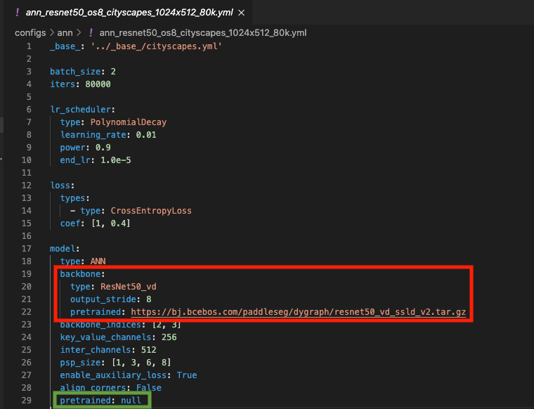

English | [简体中文](faq_cn.md)
# FAQ

## Q1: How to load the weight parameters of the pre-trained model locally？

* **Answer**:

> The recommended configuration parameters of the model are stored in the yaml file of each model folder under PaddleSeg/configs. For example, one of the configurations of ANN is given in /PaddleSeg/configs/ann/ann_resnet50_os8_cityscapes_1024x512_80k.yml. As shown below:





> The red part in the figure is the storage location of the pre-training model parameter file of the backbone network. **Note**: Here, we will download the pre-training model parameters provided by us directly in the form of a https link. If you have the pre-trained model parameters of the backbone network locally, please replace the `pretrained` under `backbone` in the yaml file with the absolute path. Or, you should set the relative path for the storage location of the pre-training model parameters according to the directory where the `train.py` will be executed.

> The green part in the figure is the storage location of the pre-training model parameter file of the segmentation network. If you have the pre-trained model parameters of the segmentation network locally, please replace the `pretrained` in the yaml file with the absolute path or relative path where it is stored.


## Q2: Why PaddleSeg do not setting epoch?
* **Answer**: 

> The way to set the `epoch` will be affected by the size of the dataset. So we support set `iters`.

> **Supplement:** The relationship between training configuration parameters

- Define the parameters as follows:
    - 1. Dataset size: N
    - 2. Batch size: batch_size
    - 3. Number of GPUs: num_gpus
    - 4. Total number of iterations: iters

- Then:
    - epoch = (iters * batch_size * num_gpus) / N


## Q3: What is the loading sequence of the data augmentation configuration?
* **Answer**: 

> Since the configuration of data augmentation is specified in the yaml file, it's important to introduce the basic knowledge of the configuration file in PaddleSeg.

> Cityscapes is one of the most commonly used datasets in the field of semantic segmentation, so some common configurations on Cityscapes have been given.

> PaddleSeg uses `_base_` to specify the inheritance relationship between configurations:


```yaml
_base_: '../_base_/cityscapes.yml'
_base_: '../_base_/cityscapes_1024x1024.yml'
```


- Instruction:
    - 1. Data augmentation is specified by `transforms` and loaded sequentially from top to bottom.
    - 2. The subclass overrides the configuration of the same name in its parent class.
    - 3. The command line (such as `--batch_size 4`) overwrites the configuration with the same name inside --config (such as `batch_size: 8` specified in yaml).


## Q4: Why does the data augmentation configuration cause a DataLoader reader thread error?
* **Answer**: 

> If you are using a custom dataset with inconsistent shapes, this may be an error caused by improper data augmentation loading sequence.

> In Q3, we already know that PaddleSeg's data augmentation configuration is loaded in order.

> For example, `RandomRotation` will change the size of the image. If it is set after other augmentations to correct the size (such as Crop, Resize), the image size will be inconsistent. This causes a DataLoader reader thread error.

> Therefore, before starting training, please refer to Q3 to check the data augmentation configuration sequence.


## Q5: What is the current SOTA model of PaddleSeg on CityScapes?
* **Answer**:

> The current SOTA model on CityScapes can reach 87% mIoU.

> Please refer: https://github.com/PaddlePaddle/PaddleSeg/tree/develop/contrib/CityscapesSOTA


## Q6: Why is best_model not saved during training?
* **Answer**:

> The `best_model` is obtained by evaluation and comparison during the training process. 

> Therefore, you need to enable the option `--do_eval` before training.


## Q7: After resuming training, why does vdl only visualize the second half? How to visualize the interrupted half?

> Due to some reasons, the model may not be trained at one time.
A relatively simple method is: copy the contents of the first generated log and the second generated log to a new binary file, then read it.

> We will support multiple log merging in the new version in the near future.

> In addition, if it is similar to the situation of continuing training after interruption, you can specify the log name when calling visualdl, so that you can continue to write directly in the specified log file.

> Please refer: https://github.com/PaddlePaddle/VisualDL/blob/develop/docs/faq_CN.md#%E5%A6%82%E4%BD%95%E4%BF%AE%E6%94%B9%E5%B7%B2%E6%9C%89%E7%9A%84%E6%97%A5%E5%BF%97%E6%96%87%E4%BB%B6


