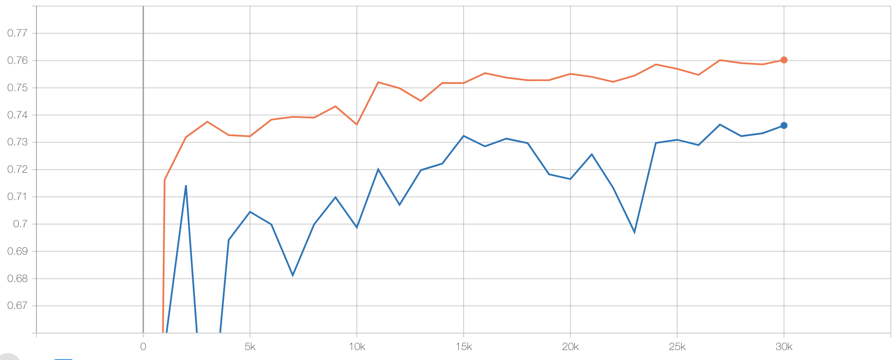

# dice loss解决二分类中样本不均衡问题

对于二类图像分割任务中，往往存在类别分布不均的情况，如：瑕疵检测，道路提取及病变区域提取等等。
在DeepGlobe比赛的Road Extraction中，训练数据道路占比为：%4.5。如下为其图片样例：
<p align="center">
   <br />
 </p>
可以看出道路在整张图片中的比例很小。
 
## 数据集下载
我们从DeepGlobe比赛的Road Extraction的训练集中随机抽取了800张图片作为训练集，200张图片作为验证集，
制作了一个小型的道路提取数据集[MiniDeepGlobeRoadExtraction](https://paddleseg.bj.bcebos.com/dataset/MiniDeepGlobeRoadExtraction.zip)

## softmax loss与dice loss

在图像分割中，softmax loss(sotfmax with cross entroy loss)同等的对待每一像素，因此当背景占据绝大部分的情况下，
网络将偏向于背景的学习，使网络对目标的提取能力变差。`dice loss(dice coefficient loss)`通过计算预测与标注之间的重叠部分计算损失函数，避免了类别不均衡带来的影响，能够取得更好的效果。
在实际应用中`dice loss`往往与`bce loss(binary cross entroy loss)`结合使用，提高模型训练的稳定性。

dice loss的定义如下：

 

其中  表示*Y*和*P*的共有元素数，
实际计算通过求两者的乘积之和进行计算。如下所示：

<p align="center">
   <br />
 </p>

[dice系数详解](https://zh.wikipedia.org/wiki/Dice%E7%B3%BB%E6%95%B0)

## PaddleSeg指定训练loss

PaddleSeg通过`cfg.SOLVER.LOSS`参数可以选择训练时的损失函数，
如`cfg.SOLVER.LOSS=['dice_loss','bce_loss']`将指定训练loss为`dice loss`与`bce loss`的组合

## 实验比较

在MiniDeepGlobeRoadExtraction数据集进行了实验比较。

* 数据集下载
```shell
python dataset/download_mini_deepglobe_road_extraction.py
```

* 预训练模型下载
```shell
python pretrained_model/download_model.py deeplabv3p_mobilenetv2-1-0_bn_coco
```
* 配置/数据校验
```shell
python pdseg/check.py --cfg ./configs/deepglobe_road_extraction.yaml
```

* 训练
```shell
python pdseg/train.py --cfg ./configs/deepglobe_road_extraction.yaml --use_gpu SOLVER.LOSS "['dice_loss','bce_loss']"

```

* 评估
```
python pdseg/eval.py --cfg ./configs/deepglobe_road_extraction.yaml --use_gpu SOLVER.LOSS "['dice_loss','bce_loss']"

```

* 结果比较

softmax loss和dice loss + bce loss实验结果如下图所示。
图中橙色曲线为dice loss + bce loss，最高mIoU为76.02%，蓝色曲线为softmax loss， 最高mIoU为73.62%。
<p align="center">
   <br />
 </p>

 

