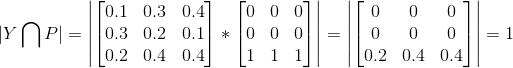

# loss的选择

通过cfg.SOLVER.LOSS参数可以选择训练时的损失函数，目前支持`softmax_loss(sotfmax with cross entroy loss)`, 
`dice_loss(dice coefficient loss)`, `bce_loss(binary cross entroy loss)`三种损失函数。
其中`dice_loss`和`bce_loss`仅在两类分割问题中适用，`softmax_loss`不能与`dice_loss`
或`bce_loss`组合，`dice_loss`可以和`bce_loss`组合使用。使用示例如下：

`['softmax_loss']`或`['dice_loss','bce_loss']`

## softmax_loss

多分类交叉熵损失函数，公式如下所示：

}) 

 

## dice_loss

dice loss是对分割评价指标优化的损失函数，是一种二分类的损失函数，在前景背景比例严重不平衡的情况下往往能取到较好的效果。
在实际应用中dice loss往往与bce loss结合使用，提高模型训练的稳定性

 

其中  表示*Y*和*P*的共有元素数，
实际计算通过求两者的乘积之和进行计算。如下所示：

    
 

[dice系数](https://zh.wikipedia.org/wiki/Dice%E7%B3%BB%E6%95%B0)

 
 

## bce_loss

二分类用的交叉熵损失函数，公式如下所示：

}+(1-y_i)log(1-p_i))

其中和*Y*为标签，
 和*P*为预测结果

## 默认值

['softmax_loss']
