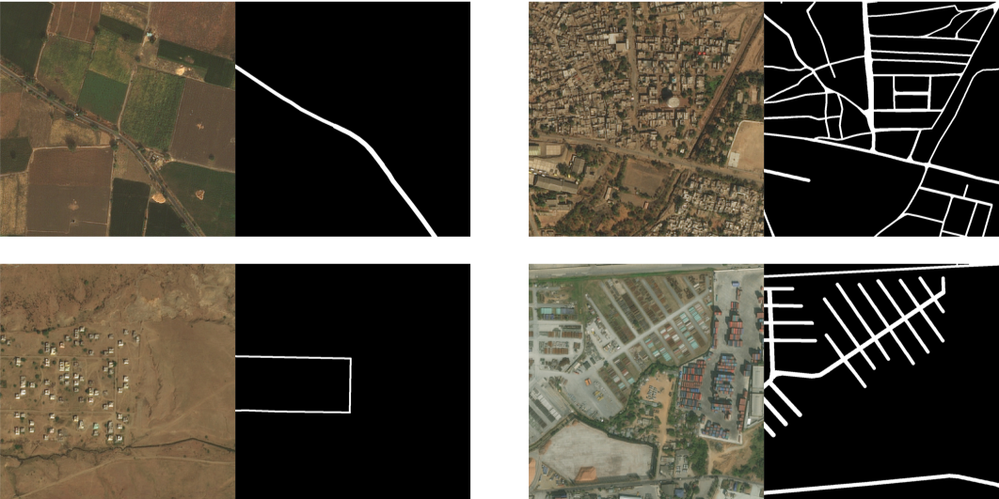
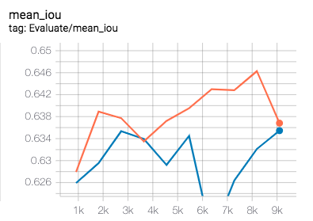

# Lovasz loss
对于图像分割任务中，经常出现类别分布不均匀的情况，例如：工业产品的瑕疵检测、道路提取及病变区域提取等。

我们可使用lovasz loss解决这个问题。Lovasz loss根据分割目标的类别数量可分为两种：lovasz hinge loss适用于二分类问题，lovasz softmax loss适用于多分类问题。


## Lovasz hinge loss
### PaddleSeg指定训练loss

PaddleSeg通过`cfg.SOLVER.LOSS`参数可以选择训练时的损失函数，
如`cfg.SOLVER.LOSS=['lovasz_hinge_loss','bce_loss']`将指定训练loss为`lovasz hinge loss`与`bce loss`的组合。

### Lovasz hinge loss使用示例

我们以道路提取任务为例应用lovasz hinge loss.
在DeepGlobe比赛的Road Extraction中，训练数据道路占比为：4.5%. 如下为其图片样例：
<p align="center">
   <br />
 </p>
可以看出道路在整张图片中的比例很小。

#### 实验对比

在MiniDeepGlobeRoadExtraction数据集进行了实验对比。

* 数据集下载
我们从DeepGlobe比赛的Road Extraction的训练集中随机抽取了800张图片作为训练集，200张图片作为验证集，
制作了一个小型的道路提取数据集[MiniDeepGlobeRoadExtraction](https://paddleseg.bj.bcebos.com/dataset/MiniDeepGlobeRoadExtraction.zip)

```shell
python dataset/download_mini_deepglobe_road_extraction.py
```

* 预训练模型下载
```shell
python pretrained_model/download_model.py deeplabv3p_mobilenetv2-1-0_bn_coco
```
* 配置/数据校验
```shell
python pdseg/check.py --cfg ./configs/lovasz_hinge_deeplabv3p_mobilenet_road.yaml
```

* 训练
```shell
python pdseg/train.py --cfg ./configs/lovasz_hinge_deeplabv3p_mobilenet_road.yaml --use_gpu SOLVER.LOSS "['lovasz_hinge_loss','bce_loss']"
```

* 评估
```shell
python pdseg/eval.py --cfg ./configs/lovasz_hinge_deeplabv3p_mobilenet_road.yaml --use_gpu SOLVER.LOSS "['lovasz_hinge_loss','bce_loss']"
```

* 结果比较

lovasz hinge loss + bce loss和softmax loss的对比结果如下图所示。
<p align="center">
   <br />
 </p>

图中蓝色曲线为lovasz hinge loss + bce loss，最高mIoU为76.2%，橙色曲线为softmax loss， 最高mIoU为73.44%，相比提升2.76个百分点。


## Lovasz softmax loss
### PaddleSeg指定训练loss

PaddleSeg通过`cfg.SOLVER.LOSS`参数可以选择训练时的损失函数，
如`cfg.SOLVER.LOSS=['lovasz_softmax_loss','softmax_loss']`将指定训练loss为`lovasz softmax loss`与`softmax loss`的组合。

### Lovasz softmax loss使用示例

我们以Pascal voc为例应用lovasz softmax loss.


#### 实验对比

在Pascal voc数据集上与softmax loss进行了实验对比。

* 数据集下载
```shell
python dataset/download_and_convert_voc2012.py
```

* 预训练模型下载
```shell
python pretrained_model/download_model.py deeplabv3p_mobilenetv2-1-0_bn_coco
```
* 配置/数据校验
```shell
python pdseg/check.py --cfg ./configs/lovasz_softmax_deeplabv3p_mobilenet_pascal.yaml
```

* 训练
```shell
python pdseg/train.py --cfg ./configs/lovasz_softmax_deeplabv3p_mobilenet_pascal.yaml --use_gpu SOLVER.LOSS "['lovasz_softmax_loss','softmax_loss']"

```

* 评估
```shell
python pdseg/eval.py --cfg ./configs/lovasz_softmax_deeplabv3p_mobilenet_pascal.yaml --use_gpu SOLVER.LOSS "['lovasz_softmax_loss','softmax_loss']"

```

* 结果比较

lovasz softmax loss + softmax loss和softmax loss的对比结果如下图所示。
<p align="center">
   <br />
 </p>

图中橙色曲线代表lovasz softmax loss + softmax loss，最高mIoU为64.63%，蓝色曲线代表softmax loss， 最高mIoU为63.55%，相比提升1.08个百分点。
