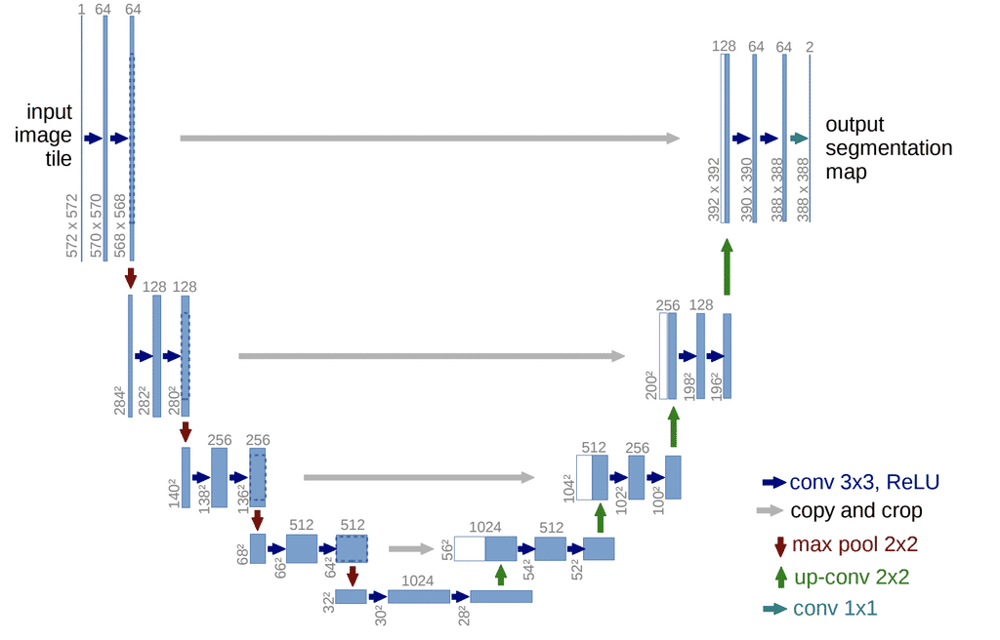
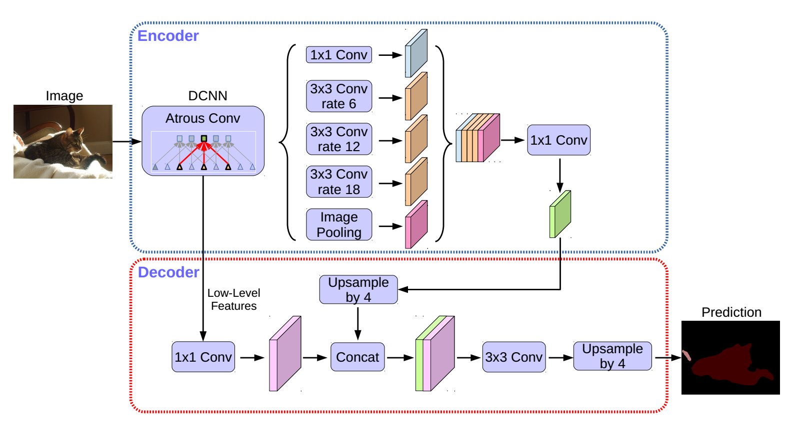
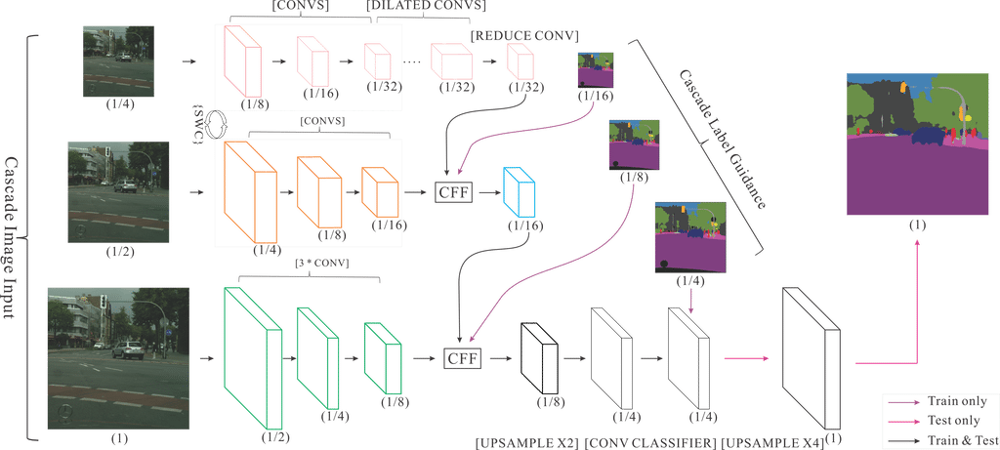

# PaddleSeg 模型列表

### U-Net
U-Net 起源于医疗图像分割，整个网络是标准的encoder-decoder网络，特点是参数少，计算快，应用性强，对于一般场景适应度很高。

### DeepLabv3+

DeepLabv3+ 是DeepLab系列的最后一篇文章，其前作有 DeepLabv1，DeepLabv2, DeepLabv3,
在最新作中，DeepLab的作者通过encoder-decoder进行多尺度信息的融合，同时保留了原来的空洞卷积和ASSP层，
其骨干网络使用了Xception模型，提高了语义分割的健壮性和运行速率，在 PASCAL VOC 2012 dataset取得新的state-of-art performance，89.0mIOU。

在PaddleSeg当前实现中，支持两种分类Backbone网络的切换

- MobileNetv2:
适用于移动设备的快速网络，如果对分割性能有较高的要求，请使用这一backbone网络。

- Xception:
DeepLabv3+原始实现的backbone网络，兼顾了精度和性能，适用于服务端部署。

### ICNet

Image Cascade Network（ICNet)主要用于图像实时语义分割。相较于其它压缩计算的方法，ICNet即考虑了速度，也考虑了准确性。 ICNet的主要思想是将输入图像变换为不同的分辨率，然后用不同计算复杂度的子网络计算不同分辨率的输入，然后将结果合并。ICNet由三个子网络组成，计算复杂度高的网络处理低分辨率输入，计算复杂度低的网络处理分辨率高的网络，通过这种方式在高分辨率图像的准确性和低复杂度网络的效率之间获得平衡。

整个网络结构如下：

## 参考

- [Encoder-Decoder with Atrous Separable Convolution for Semantic Image Segmentation](https://arxiv.org/abs/1802.02611)

- [U-Net: Convolutional Networks for Biomedical Image Segmentation](https://arxiv.org/abs/1505.04597)

- [ICNet for Real-Time Semantic Segmentation on High-Resolution Images](https://arxiv.org/abs/1704.08545)

# PaddleSeg特殊网络结构介绍

### Group Norm

关于Group Norm的介绍可以参考论文：https://arxiv.org/abs/1803.08494

GN 把通道分为组，并计算每一组之内的均值和方差，以进行归一化。GN 的计算与批量大小无关，其精度也在各种批量大小下保持稳定。适应于网络参数很重的模型，比如deeplabv3+这种，可以在一个小batch下取得一个较好的训练效果。

### Synchronized Batch Norm

Synchronized Batch Norm跨GPU批归一化策略最早在[MegDet: A Large Mini-Batch Object Detector](https://arxiv.org/abs/1711.07240)
论文中提出，在[Bag of Freebies for Training Object Detection Neural Networks](https://arxiv.org/pdf/1902.04103.pdf)论文中以Yolov3验证了这一策略的有效性，[PaddleCV/yolov3](https://github.com/PaddlePaddle/models/tree/develop/PaddleCV/yolov3)实现了这一系列策略并比Darknet框架版本在COCO17数据上mAP高5.9.

PaddleSeg基于PaddlePaddle框架的sync_batch_norm策略，可以支持通过多卡实现大batch size的分割模型训练，可以得到更高的mIoU精度。

