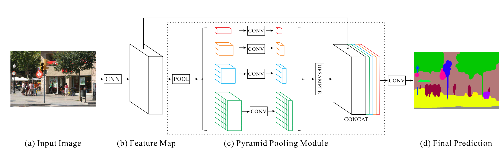
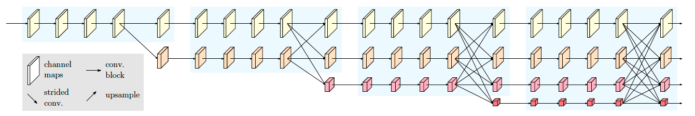

# PaddleSeg 分割模型介绍

- [U-Net](#U-Net)
- [DeepLabv3+](#DeepLabv3)
- [PSPNet](#PSPNet)
- [ICNet](#ICNet)
- [HRNet](#HRNet)
- [Fast-SCNN](#Fast-SCNN)

## U-Net
U-Net [1] 起源于医疗图像分割，整个网络是标准的encoder-decoder网络，特点是参数少，计算快，应用性强，对于一般场景适应度很高。U-Net最早于2015年提出，并在ISBI 2015 Cell Tracking Challenge取得了第一。经过发展，目前有多个变形和应用。

原始U-Net的结构如下图所示，由于网络整体结构类似于大写的英文字母U，故得名U-net。左侧可视为一个编码器，右侧可视为一个解码器。编码器有四个子模块，每个子模块包含两个卷积层，每个子模块之后通过max pool进行下采样。由于卷积使用的是valid模式，故实际输出比输入图像小一些。具体来说，后一个子模块的分辨率=(前一个子模块的分辨率-4)/2。U-Net使用了Overlap-tile 策略用于补全输入图像的上下信息，使得任意大小的输入图像都可获得无缝分割。同样解码器也包含四个子模块，分辨率通过上采样操作依次上升，直到与输入图像的分辨率基本一致。该网络还使用了跳跃连接，以拼接的方式将解码器和编码器中相同分辨率的feature map进行特征融合，帮助解码器更好地恢复目标的细节。

## DeepLabv3+

DeepLabv3+ [2] 是DeepLab系列的最后一篇文章，其前作有 DeepLabv1, DeepLabv2, DeepLabv3.
在最新作中，作者通过encoder-decoder进行多尺度信息的融合，以优化分割效果，尤其是目标边缘的效果。
并且其使用了Xception模型作为骨干网络，并将深度可分离卷积(depthwise separable convolution)应用到atrous spatial pyramid pooling(ASPP)中和decoder模块，提高了语义分割的健壮性和运行速率，在 PASCAL VOC 2012 和 Cityscapes 数据集上取得新的state-of-art performance.

在PaddleSeg当前实现中，支持两种分类Backbone网络的切换:

- MobileNetv2
适用于移动设备的快速网络，如果对分割性能有较高的要求，请使用这一backbone网络。

- Xception
DeepLabv3+原始实现的backbone网络，兼顾了精度和性能，适用于服务端部署。

## PSPNet

Pyramid Scene Parsing Network (PSPNet) [3] 起源于场景解析(Scene Parsing)领域。如下图所示，普通FCN [4] 面向复杂场景出现三种误分割现象：（1）关系不匹配。将船误分类成车，显然车一般不会出现在水面上。（2）类别混淆。摩天大厦和建筑物这两个类别相近，误将摩天大厦分类成建筑物。（3）类别不显著。枕头区域较小且纹理与床相近，误将枕头分类成床。

PSPNet的出发点是在算法中引入更多的上下文信息来解决上述问题。为了融合了图像中不同区域的上下文信息，PSPNet通过特殊设计的全局均值池化操作（global average pooling）和特征融合构造金字塔池化模块 (Pyramid Pooling Module)。PSPNet最终获得了2016年ImageNet场景解析挑战赛的冠军，并在PASCAL VOC 2012 和 Cityscapes 数据集上取得当时的最佳效果。整个网络结构如下：

## ICNet

Image Cascade Network（ICNet) [5] 是一个基于PSPNet的语义分割网络，设计目的是减少PSPNet推断时期的耗时。ICNet主要用于图像实时语义分割。ICNet由三个不同分辨率的子网络组成，将输入图像变换为不同的分辨率，随后使用计算复杂度高的网络处理低分辨率输入，计算复杂度低的网络处理分辨率高的网络，通过这种方式在高分辨率图像的准确性和低复杂度网络的效率之间获得平衡。并在PSPNet的基础上引入级联特征融合单元(cascade feature fusion unit)，实现快速且高质量的分割模型。

整个网络结构如下：

### HRNet

High-Resolution Network (HRNet) [6] 在整个训练过程中始终维持高分辨率表示。
HRNet具有两个特点：（1）从高分辨率到低分辨率并行连接各子网络，（2）反复交换跨分辨率子网络信息。这两个特点使HRNet网络能够学习到更丰富的语义信息和细节信息。
HRNet在人体姿态估计、语义分割和目标检测领域都取得了显著的性能提升。

整个网络结构如下：

### Fast-SCNN

Fast-SCNN [7] 是一个面向实时的语义分割网络。在双分支的结构基础上，大量使用了深度可分离卷积和逆残差（inverted-residual）模块，并且使用特征融合构造金字塔池化模块 (Pyramid Pooling Module)来融合上下文信息。这使得Fast-SCNN在保持高效的情况下能学习到丰富的细节信息。

整个网络结构如下：

## 参考文献

[1] [U-Net: Convolutional Networks for Biomedical Image Segmentation](https://arxiv.org/abs/1505.04597)

[2] [Encoder-Decoder with Atrous Separable Convolution for Semantic Image Segmentation](https://arxiv.org/abs/1802.02611)

[3] [Pyramid Scene Parsing Network](https://arxiv.org/abs/1612.01105)

[4] [Fully Convolutional Networks for Semantic Segmentation](https://arxiv.org/abs/1411.4038)

[5] [ICNet for Real-Time Semantic Segmentation on High-Resolution Images](https://arxiv.org/abs/1704.08545)

[6] [Deep High-Resolution Representation Learning for Visual Recognition](https://arxiv.org/abs/1908.07919)

[7] [Fast-SCNN: Fast Semantic Segmentation Network](https://arxiv.org/abs/1902.04502)
