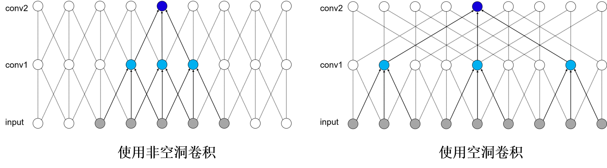

# DeepLab V3+
### **Principle**

For the currently very popular real-time segmentation scenarios, such as the short video field and the live broadcast field, real-time segmentation algorithms are required, which requires our algorithms to be lightweight enough. So what does a good segmentation model network look like? First, let's take a look at the structure of a common segmentation network. The output of a segmentation network is a probability map of N * H * W, where N is a vector, and the dimension of the vector is expressed as the number of categories, that is, each element of the vector corresponds to a category, and this The numeric value of the element is the probability value, expressed as the probability corresponding to the class. Because each pixel category is given, the size of H * W needs to be consistent with the original image. The segmentation network can be regarded as a fully convolutional network without a fully connected layer. The common network structure can be divided into two parts: Encoder and Decoder:

- The length and width of the feature map of the Encoder part will gradually shrink, that is, downsampling is required.
- The length and width of the decoder part of the feature map will gradually increase, that is, upsampling is required.

What problems does a good segmentation network need to solve? The first question is how to obtain a larger receptive field by using fewer Encoder layers. First, let's look at what a receptive field is. The value of each point on the output feature map is obtained by multiplying the elements of the area of size k_h * k_w on the input image with each element of the convolution kernel, therefore, the change of the value of each element in the k_h * k_w area of the input image will affect the pixel value of the output point. We call this region the receptive field of the corresponding point on the output feature map. The change in the value of each pixel in the perception field will affect the value change of the output point. Therefore, the receptive field can also be expressed as the size of the image area affected by each point on the feature map. The size of the receptive field is an important evaluation metric for the feature representation ability of the segmentation network, because we want to increase the size of the receptive field as much as possible. The most direct method is to increase the number of layers of the Encoder network, but this method will bring some drawbacks while expanding the receptive field, such as increasing the scale of network parameters, resulting in increased training time. So is there a better way?

By expanding the reachable area of the convolution kernel, the receptive field is enlarged, and the range of information contained in the convolution is expanded. As shown in the figure below, the figure is a schematic diagram of the effect of hole convolution. It can be seen that the network without atrous convolution, an output dark blue point can cover 5 input pixels. After using atrous convolution, one output point can cover the points of 9 input pixels. For specific application examples, please refer to the network structure of DeepLabv3+.

The second problem that the segmentation network needs to face is that the length and width of the features are constantly decreasing during the downsampling process. Although we obtain high-order features, the dimensions are small. If it is directly used as an upsampling input, some information may be lost. How to solve this problem? In this case, the skip connection function can be used. Through skip connections, the upsampling process can use not only high-order features, but also low-order features of the same dimension. For specific usage examples, see the introduction to the U-Net model in Basic Principles.

In addition to the above two problems, the segmentation network also needs to solve the multi-scale problem. The multi-scale problem refers to the size of the target in the same image. How to ensure that targets of different scales can be handled well? The ASPP network structure can be used here. In layman's terms, the realization idea is to let the targets of different scales be processed by the convolutional layers of different receptive fields, the large receptive field handles the big target, and the small receptive field handles the small target. For specific application examples, please refer to the network structure of DeepLabv3+ below.

### DeepLabv3+

DeepLabv3+ is the last version in the DeepLab series, with its predecessors DeepLabv1, DeepLabv2 and DeepLabv3. In the latest work, the author combines the advantages of the encoder-decoder structure and the Spatial Pyramid Pooling (SPP) module to propose a new semantic segmentation network DeepLabv3+, on the PASCAL VOC 2012 and Cityscapes datasets Get new state-of-art performance.
The overall structure is shown below. The main body of the Encoder is the backbone network with atrous convolution (Atrous Convolution). The backbone network can use commonly used classification networks such as ResNet. The author uses the improved Xception model as the backbone network. The following Atrous Spatial Pyramid Pooling (ASPP) module introduces multi-scale information. Compared with the previous work DeepLabv3, DeepLabv3+ adds a decoder module to further integrate shallow features and deep features to optimize the segmentation effect, especially the effect of the target edge. In addition, the author applies Depthwise Separable Convolution to ASPP and Decoder modules, which improves the robustness and running rate of semantic segmentation.

DeepLabv3+

For details, please refer to[Encoder-Decoder with Atrous Separable Convolution for Semantic Image Segmentation](https://arxiv.org/abs/1802.02611).
