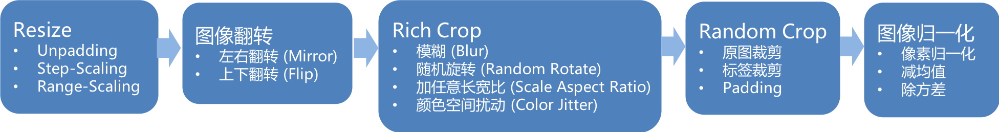
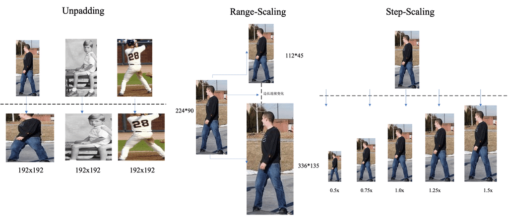
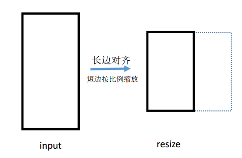
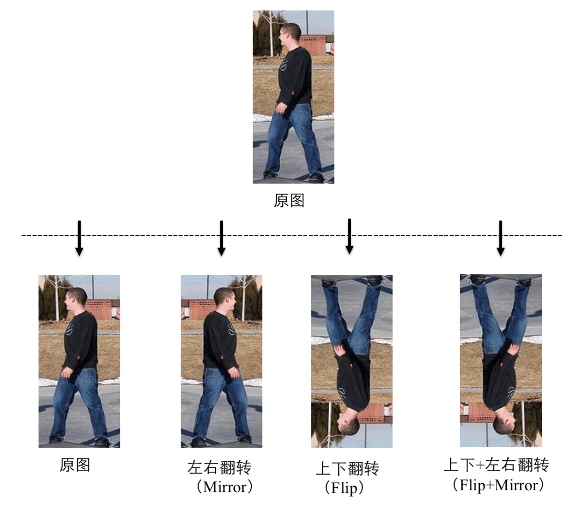
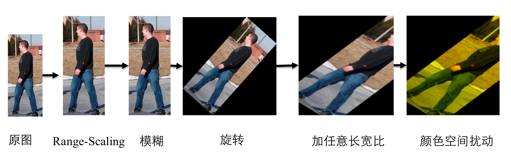

English|[简体中文](data_cn.md)
# PaddleSeg Data Augmentation

## Data augmentation basic procedure

## Resize  

Resize means rescale the input image to a certain size according to a certain rule. PaddleSeg support the following three ways to resize:

- Unpadding
Resize the input image to a certain fixed size and send it to the network for training. Do the same when predict.

- Step-Scaling
Resize the input image based on a certain ratio, which randomly changes within a certain range with a certain step. The input image remains the same during prediction.

- Range-Scaling
Resize the input image based on the long edge, which means scale the long edge to a certain length, and the short edge changes based on the original image ratio. The image's long edge will be rescaled to another assigned length during prediction.

Range-Scaling's diagram is as follows:

|Resize method|config parameter|meaning|Note|
|-|-|-|-|
|Unpadding|AUG.FIX_RESIZE_SIZE|the fixed size of Resize|
|Step-Scaling|AUG.MIN_SCALE_FACTOR|the minimum ratio of Resize|
||AUG.MAX_SCALE_FACTOR|the maximum ratio of Resize|
||AUG.SCALE_STEP_SIZE|the step size of Resize|
|Range-Scaling|AUG.MIN_RESIZE_VALUE|the minimum value of the long edge of image|
||AUG.MAX_RESIZE_VALUE|the maximum value of the long edge of image|
|&nbsp;&nbsp;&nbsp;&nbsp;&nbsp;&nbsp;&nbsp;&nbsp;&nbsp;&nbsp;&nbsp;&nbsp;&nbsp;&nbsp;&nbsp;&nbsp;&nbsp;&nbsp;&nbsp;&nbsp;&nbsp;&nbsp;&nbsp;&nbsp;&nbsp;&nbsp;&nbsp;&nbsp;&nbsp;&nbsp;|AUG.INF_RESIZE_VALUE|the assigned fixed length when rescale the long edge |must range between  [AUG.MIN_RESIZE_VALUE,  AUG.MAX_RESIZE_VALUE] .|

**PS：All configuration parameters in this article can be set in your yaml file in the configs directory**

## Image flip

PaddleSeg support following two ways to flip:

- Vertival flip(Mirror)
Flip the image left and right with 50% probability.

- Horizontal Flip
Flip the image upside down with a certain probability.

The above two kinds of switches operate independently and can be used in combination. Therefore, there are 4 possible situations for image flipping as follows:

|Image flip method| Config parameter |Meaning|Note|
|-|-|-|-|
|Mirror|AUG.MIRROR|vertival flip switch |open when set with True|
|Flip|AUG.FLIP|horizontal flip switch|open when set with True|
||AUG.FLIP_RATIO|Control the probability of flip upside down|invalid whtn AUG.FLIP is False|

## Rich Crop  
Rich Crop is a set of data enhancement strategies open by PaddleSeg based on actual business experience. It is a data enhancement strategy for segmentation scenarios with less labeled data and complex test data. The process is shown in the figure below:

Rich Crop refers to a variety of transformations on the image to ensure the rich diversity of the data during the training process. It includes the following 4 transformations:

-Blur
Use Gaussian Blur to smooth the image.

-Rotation
Image rotation, the rotation angle is randomly selected within a certain range. And the extra area generated by the rotation is filled with the value of `DATASET.PADDING_VALUE`.

-Aspect
Image aspect ratio adjustment, resize after cropping a certain area from the image according to a certain size and aspect ratio.

-Color jitter
The image color is jittered, and the three color attributes of brightness, saturation and contrast are adjusted.

|Rich crop method|Config parameter|Meaning|Note|
|-|-|-|-|
|Rich crop|AUG.RICH_CROP.ENABLE|Rich crop overall switch|open with True, close all transformation with False|
|Blur|AUG.RICH_CROP.BLUR|Image blur switch|open with True, close with False|
||AUG.RICH_CROP.BLUR_RATIO|the probability of blur |invalid when AUG.RICH_CROP.BLUR is False|
|Rotation|AUG.RICH_CROP.MAX_ROTATION|maximum rotation angle of clockwise rotation|range between 0~90°，Actual rotation angle is randomly set within \[-AUG.RICH_CROP.MAX_ROTATION, AUG.RICH_CROP.MAX_ROTATION]|
|Aspect|AUG.RICH_CROP.MIN_AREA_RATIO|The minimum area ratio of the cropped image to the original image|The value is 0~1, the smaller the value, the larger the range of change, if it is 0, no adjustment will be made|
||AUG.RICH_CROP.ASPECT_RATIO|The range of cropped image aspect ratio|The value is non-negative, the smaller the value, the larger the range of change, if it is 0, no adjustment is made|
|Color jitter|AUG.RICH_CROP.BRIGHTNESS_JITTER_RATIO|Brightness adjustment factor|The value is between 0~1, the larger the value, the larger the range of change, if it is 0, no adjustment is made|
||AUG.RICH_CROP.SATURATION_JITTER_RATIO|Saturation adjustment factor|The value is 0~1, the larger the value, the larger the range of change, if it is 0, no adjustment is made|
|&nbsp;&nbsp;&nbsp;&nbsp;&nbsp;&nbsp;&nbsp;&nbsp;&nbsp;&nbsp;&nbsp;&nbsp;&nbsp;&nbsp;&nbsp;&nbsp;&nbsp;&nbsp;&nbsp;&nbsp;&nbsp;&nbsp;&nbsp;&nbsp;&nbsp;&nbsp;&nbsp;&nbsp;&nbsp;&nbsp;|AUG.RICH_CROP.CONTRAST_JITTER_RATIO|Contrast adjustment factor&nbsp;&nbsp;&nbsp;&nbsp;&nbsp;&nbsp;&nbsp;&nbsp;&nbsp;&nbsp;&nbsp;&nbsp;&nbsp;&nbsp;&nbsp;&nbsp;&nbsp;&nbsp;&nbsp;&nbsp;&nbsp;|The value is 0~1, the larger the value, the larger the range of change, if it is 0, no adjustment is made|

## Random Crop  

Randomly crop pictures and label images. This step crop the input images of the network to a fixed size.

Random crop process is divided into 3 situations:
- When the input image size is equal to CROP_SIZE, return to the original image.
- When the input image size is larger than CROP_SIZE, crop directly.
- When the input image size is smaller than CROP_SIZE, use the `DATASET.PADDING_VALUE` value and the `DATASET.IGNORE_INDEX` value to fill the image and label image, and then crop them.
