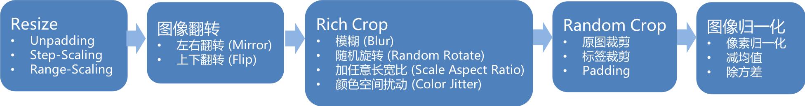
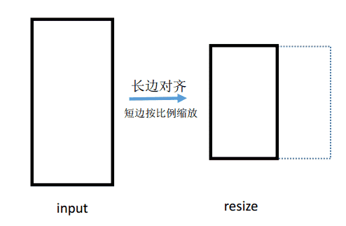
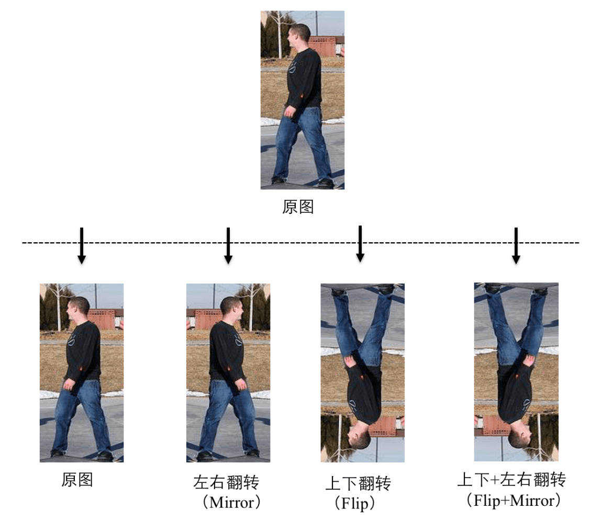

简体中文|[English](data.md)
# PaddleSeg 数据增强

## 数据增强基本流程

## Resize  

Resize步骤是指将输入图像按照某种规则讲图片重新缩放到某一个尺寸，PaddleSeg支持以下3种resize方式:

- Unpadding
将输入图像直接resize到某一个固定大小下，送入到网络中间训练。预测时同样操作。

- Step-Scaling
将输入图像按照某一个比例resize，这个比例以某一个步长在一定范围内随机变动。预测时不对输入图像做处理。

- Range-Scaling
将输入图像按照长边变化进行resize，即图像长边对齐到某一长度，该长度在一定范围内随机变动，短边随同样的比例变化。
预测时需要将长边对齐到另外指定的固定长度。

Range-Scaling示意图如下：

|Resize方式|配置参数|含义|备注|
|-|-|-|-|
|Unpadding|AUG.FIX_RESIZE_SIZE|Resize的固定尺寸|
|Step-Scaling|AUG.MIN_SCALE_FACTOR|Resize最小比例|
||AUG.MAX_SCALE_FACTOR|Resize最大比例|
||AUG.SCALE_STEP_SIZE|Resize比例选取的步长|
|Range-Scaling|AUG.MIN_RESIZE_VALUE|图像长边变动范围的最小值|
||AUG.MAX_RESIZE_VALUE|图像长边变动范围的最大值|
|&nbsp;&nbsp;&nbsp;&nbsp;&nbsp;&nbsp;&nbsp;&nbsp;&nbsp;&nbsp;&nbsp;&nbsp;&nbsp;&nbsp;&nbsp;&nbsp;&nbsp;&nbsp;&nbsp;&nbsp;&nbsp;&nbsp;&nbsp;&nbsp;&nbsp;&nbsp;&nbsp;&nbsp;&nbsp;&nbsp;|AUG.INF_RESIZE_VALUE|预测时长边对齐时所指定的固定长度|取值必须在 [AUG.MIN_RESIZE_VALUE,  AUG.MAX_RESIZE_VALUE] 范围内。|

**注：本文所有配置参数可在configs目录下您的yaml文件中进行设置。**

## 图像翻转

PaddleSeg支持以下2种翻转方式：

- 左右翻转（Mirror）
以50%概率对图像进行左右翻转。

- 上下翻转（Flip）
以一定概率对图像进行上下翻转。

以上2种开关独立运作，可组合使用。故图像翻转一共有如下4种可能的情况：

|图像翻转方式|配置参数|含义|备注|
|-|-|-|-|
|Mirror|AUG.MIRROR|左右翻转开关|为True时开启，为False时关闭|
|Flip|AUG.FLIP|上下翻转开关|为True时开启，为False时关闭|
||AUG.FLIP_RATIO|控制是否上下翻转的概率|当AUG.FLIP为False时无效|

## Rich Crop  

Rich Crop是PaddleSeg结合实际业务经验开放的一套数据增强策略，面向标注数据少，测试数据情况繁杂的分割业务场景使用的数据增强策略。流程如下图所示:

Rich Crop是指对图像进行多种变换，保证在训练过程中数据的丰富多样性，包含以下4种变换:

- Blur
使用高斯模糊对图像进行平滑。

- Rotation
图像旋转，旋转角度在一定范围内随机选取，旋转产生的多余的区域使用`DATASET.PADDING_VALUE`值进行填充。

- Aspect
图像长宽比调整，从图像中按一定大小和宽高比裁取一定区域出来之后进行resize。

- Color jitter
图像颜色抖动，共进行亮度、饱和度和对比度三种颜色属性的调节。

|Rich crop方式|配置参数|含义|备注|
|-|-|-|-|
|Rich crop|AUG.RICH_CROP.ENABLE|Rich crop总开关|为True时开启，为False时关闭所有变换|
|Blur|AUG.RICH_CROP.BLUR|图像模糊开关|为True时开启，为False时关闭|
||AUG.RICH_CROP.BLUR_RATIO|控制进行模糊的概率|当AUG.RICH_CROP.BLUR为False时无效|
|Rotation|AUG.RICH_CROP.MAX_ROTATION|图像正向旋转的最大角度|取值0~90°，实际旋转角度在\[-AUG.RICH_CROP.MAX_ROTATION, AUG.RICH_CROP.MAX_ROTATION]范围内随机选取|
|Aspect|AUG.RICH_CROP.MIN_AREA_RATIO|裁取图像与原始图像面积比最小值|取值0~1，取值越小则变化范围越大，若为0则不进行调节|
||AUG.RICH_CROP.ASPECT_RATIO|裁取图像宽高比范围|取值非负，越小则变化范围越大，若为0则不进行调节|
|Color jitter|AUG.RICH_CROP.BRIGHTNESS_JITTER_RATIO|亮度调节因子|取值0~1，取值越大则变化范围越大，若为0则不进行调节|
||AUG.RICH_CROP.SATURATION_JITTER_RATIO|饱和度调节因子|取值0~1，取值越大则变化范围越大，若为0则不进行调节|
|&nbsp;&nbsp;&nbsp;&nbsp;&nbsp;&nbsp;&nbsp;&nbsp;&nbsp;&nbsp;&nbsp;&nbsp;&nbsp;&nbsp;&nbsp;&nbsp;&nbsp;&nbsp;&nbsp;&nbsp;&nbsp;&nbsp;&nbsp;&nbsp;&nbsp;&nbsp;&nbsp;&nbsp;&nbsp;&nbsp;|AUG.RICH_CROP.CONTRAST_JITTER_RATIO|对比度调节因子&nbsp;&nbsp;&nbsp;&nbsp;&nbsp;&nbsp;&nbsp;&nbsp;&nbsp;&nbsp;&nbsp;&nbsp;&nbsp;&nbsp;&nbsp;&nbsp;&nbsp;&nbsp;&nbsp;&nbsp;&nbsp;|取值0~1，取值越大则变化范围越大，若为0则不进行调节|

## Random Crop  

随机裁剪图片和标签图，该步骤主要是通过裁剪的方式使得输入到网络中的图像在某一个固定大小。

Random crop过程分为3种情形：
- 当输入图像尺寸等于CROP_SIZE时，返回原图。
- 当输入图像尺寸大于CROP_SIZE时，直接裁剪。
- 当输入图像尺寸小于CROP_SIZE时，分别使用`DATASET.PADDING_VALUE`值和`DATASET.IGNORE_INDEX`值对图像和标签图进行填充，再进行裁剪。
