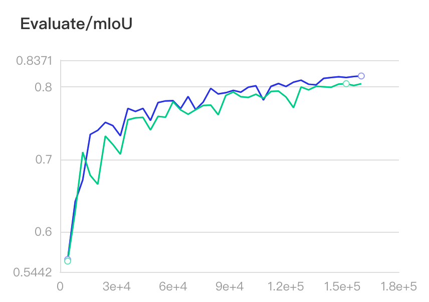
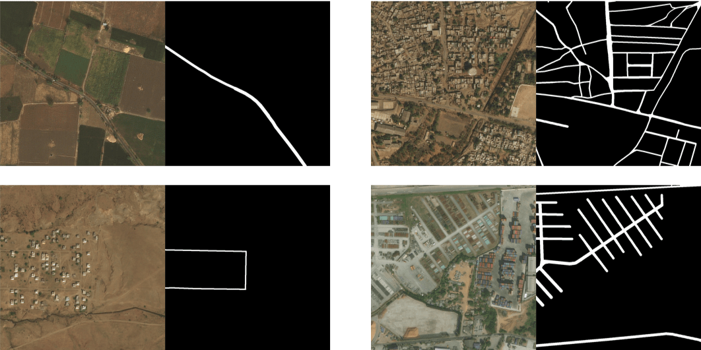

# Lovasz loss
在图像分割任务中，经常出现类别分布不均匀的情况，例如：工业产品的瑕疵检测、道路提取及病变区域提取等。我们可使用lovasz loss解决这个问题。

Lovasz loss基于子模损失(submodular losses)的凸Lovasz扩展，对神经网络的mean IoU损失进行优化。Lovasz loss根据分割目标的类别数量可分为两种：lovasz hinge loss和lovasz softmax loss. 其中lovasz hinge loss适用于二分类问题，lovasz softmax loss适用于多分类问题。该工作发表在CVPR 2018上，可点击[参考文献](#参考文献)查看具体原理。


## Lovasz loss使用指南
接下来介绍如何使用lovasz loss进行训练。需要注意的是，通常的直接训练方式并一定管用，我们推荐另外2种训练方式：
- （1）与cross entropy loss或bce loss(binary cross-entropy loss)加权结合使用。
- （2）先使用cross entropy loss或bce loss进行训练，再使用lovasz softmax loss或lovasz hinge loss进行finetuning.

以方式（1）为例，通过`MixedLoss`类选择训练时的损失函数， 通过`coef`参数对不同loss进行权重配比，从而灵活地进行训练调参。

一般的网络仅有一个输出logit，使用示例如下：

Lovasz softmax loss示例
```yaml
loss:
  types:
    - type: MixedLoss
      losses:
        - type: CrossEntropyLoss
        - type: LovaszSoftmaxLoss
      coef: [0.8, 0.2]
  coef: [1]
```

Lovasz hinge loss示例
```yaml
loss:
  types:
    - type: MixedLoss
      losses:
        - type: CrossEntropyLoss
        - type: LovaszHingeLoss
      coef: [1, 0.02]
  coef: [1]
```

对于多个输出logit的网络，使用示例如下（以2个输出为例）：
```yaml
loss:
  types:
    - type: MixedLoss
      losses:
        - type: CrossEntropyLoss
        - type: LovaszSoftmaxLoss
      coef: [0.8, 0.2]
    - type: MixedLoss
      losses:
        - type: CrossEntropyLoss
        - type: LovaszSoftmaxLoss
      coef: [0.8, 0.2]
  coef: [1, 0.4]
  ```

## Lovasz softmax loss实验对比

接下来以经典的[Cityscapes](https://www.cityscapes-dataset.com/)数据集为例应用lovasz softmax loss. Cityscapes数据集共有19类目标，其中的类别并不均衡，例如类别`road`、`building`很常见，`fence`、`motocycle`、`wall`则较为罕见。我们将lovasz softmax loss与softmax loss进行了实验对比。这里使用OCRNet模型，backbone为HRNet w18.


* 数据准备

见[数据集准备教程](data_prepare.md)

* Lovasz loss训练
```shell
CUDA_VISIBLE_DEVICES=0,1,2,3 python -u -m paddle.distributed.launch train.py \
--config configs/ocrnet/ocrnet_hrnetw18_cityscapes_1024x512_160k_lovasz_softmax.yml \
--use_vdl  --num_workers 3 --do_eval
```

* Cross entropy loss训练
```shell
CUDA_VISIBLE_DEVICES=0,1,2,3 python -u -m paddle.distributed.launch train.py \
--config configs/ocrnet/ocrnet_hrnetw18_cityscapes_1024x512_160k.yml \
--use_vdl  --num_workers 3 --do_eval
```

* 结果比较

实验mIoU曲线如下图所示。
<p align="center">
   <br />
 </p>


图中蓝色曲线代表lovasz softmax loss + cross entropy loss，绿色曲线代表cross entropy loss，相比提升1个百分点。

可看出使用lovasz softmax loss后，精度曲线基本都高于原来的精度。


|Loss|best mIoU|
|-|-|
|cross entropy loss|80.46%|
|lovasz softmax loss + cross entropy loss|81.53%|

## Lovasz hinge loss实验对比

我们以道路提取任务为例应用lovasz hinge loss.
基于MiniDeepGlobeRoadExtraction数据集与cross entropy loss进行了实验对比。
该数据集来源于[DeepGlobe CVPR2018挑战赛](http://deepglobe.org/)的Road Extraction单项，训练数据道路占比为 4.5%. 道路在整张图片中的比例很小，是典型的类别不均衡场景。图片样例如下：
<p align="center">
   <br />
 </p>

这里使用OCRNet模型，backbone为HRNet w18.

* 数据集
我们从DeepGlobe比赛的Road Extraction的训练集中随机抽取了800张图片作为训练集，200张图片作为验证集，
制作了一个小型的道路提取数据集[MiniDeepGlobeRoadExtraction](https://paddleseg.bj.bcebos.com/dataset/MiniDeepGlobeRoadExtraction.zip)。
运行训练脚本将自动下载该数据集。

* Lovasz loss训练
```shell
CUDA_VISIBLE_DEVICES=0,1,2,3 python -u -m paddle.distributed.launch train.py \
--config configs/ocrnet/ocrnet_hrnetw18_road_extraction_768x768_15k_lovasz_hinge.yml \
--use_vdl  --num_workers 3 --do_eval
```

* Cross entropy loss训练
```shell
CUDA_VISIBLE_DEVICES=0,1,2,3 python -u -m paddle.distributed.launch train.py \
--config configs/ocrnet/ocrnet_hrnetw18_road_extraction_768x768_15k.yml \
--use_vdl  --num_workers 3 --do_eval
```

* 结果比较

实验mIoU曲线如下图所示。
<p align="center">
   <br />
 </p>


图中紫色曲线为lovasz hinge loss + cross entropy loss，蓝色曲线为cross entropy loss，相比提升0.5个百分点。

可看出使用lovasz hinge loss后，精度曲线全面高于原来的精度。

|Loss|best mIoU|
|-|-|
|cross entropy loss|78.69%|
|lovasz softmax loss + cross entropy loss|79.18%|


## 参考文献
[Berman M, Rannen Triki A, Blaschko M B. The lovász-softmax loss: a tractable surrogate for the optimization of the intersection-over-union measure in neural networks[C]//Proceedings of the IEEE Conference on Computer Vision and Pattern Recognition. 2018: 4413-4421.](http://openaccess.thecvf.com/content_cvpr_2018/html/Berman_The_LovaSz-Softmax_Loss_CVPR_2018_paper.html)
