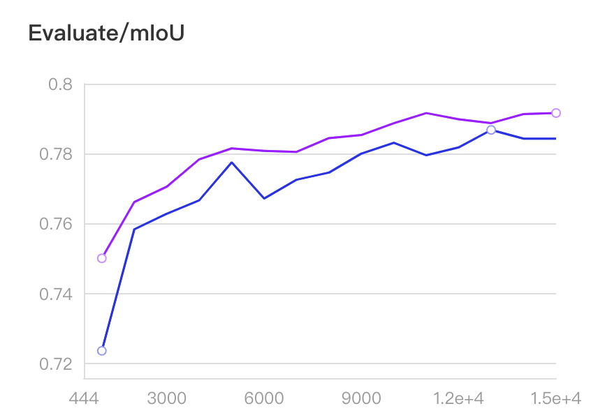

# Lovasz loss

In image segmentation tasks, uneven distribution of categories often occurs, such as flaw detection of industrial products, road extraction, and diseased area extraction. We can use lovasz loss to solve this problem.

Lovasz loss is based on the convex Lovasz extension of submodular losses, which optimizes the mean IoU loss of the neural network. Lovasz loss can be divided into two types according to the number of categories of the segmentation target: lovasz hinge loss and lovasz softmax loss. Among them, lovasz hinge loss is suitable for two classification problems, and lovasz softmax loss is suitable for multi-classification problems. This work was published on CVPR 2018, and you can click [References](#references) to view the specific principles.


## LovaszLoss usage guidance
Next, we will tell you how to use lovasz loss for training. It should be noted that the usual direct training method does not work, we recommend two other training methods:
-(1) Used in combination with cross entropy loss or bce loss (binary cross-entropy loss) weighting.
-(2) First use cross entropy loss or bce loss for training, and then use lovasz softmax loss or lovasz hinge loss for finetuning.

Taking method (1) as an example, the loss function during training is selected through the `MixedLoss` class, and different losses are weighted through the `coef` parameter, so as to flexibly adjust the training parameters.

The general network has only one output logit, and the usage example is as follows:

Lovasz softmax loss example
````yaml
loss:
   types:
     - type: MixedLoss
       losses:
         - type: CrossEntropyLoss
         - type: LovaszSoftmaxLoss
       coef: [0.8, 0.2]
   coef: [1]
````

Lovasz hinge loss example
````yaml
loss:
   types:
     - type: MixedLoss
       losses:
         - type: CrossEntropyLoss
         - type: LovaszHingeLoss
       coef: [1, 0.02]
   coef: [1]
````

For a network with multiple outputs logit, the usage example is as follows (take 2 outputs as an example):
````yaml
loss:
   types:
     - type: MixedLoss
       losses:
         - type: CrossEntropyLoss
         - type: LovaszSoftmaxLoss
       coef: [0.8, 0.2]
     - type: MixedLoss
       losses:
         - type: CrossEntropyLoss
         - type: LovaszSoftmaxLoss
       coef: [0.8, 0.2]
   coef: [1, 0.4]
   ````


## Lovasz softmax loss experimental comparison

Next, take the classic [Cityscapes](https://www.cityscapes-dataset.com/) dataset as an example to apply lovasz softmax loss. The Cityscapes dataset has 19 categories of targets, and the categories are not balanced, such as the category `road `And `building` are very common, while `fence`, `motocycle`, and `wall` are relatively rare. We compared lovasz softmax loss with softmax loss experimentally. The OCRNet model is used here, and the backbone is HRNet w18.


* Data preparation

Please see the data set preparation tutorial.

* Lovasz loss training
```shell
CUDA_VISIBLE_DEVICES=0,1,2,3 python -u -m paddle.distributed.launch train.py \
--config configs/ocrnet/ocrnet_hrnetw18_cityscapes_1024x512_160k_lovasz_softmax.yml \
--use_vdl  --num_workers 3 --do_eval
```

* Cross entropy loss training
```shell
CUDA_VISIBLE_DEVICES=0,1,2,3 python -u -m paddle.distributed.launch train.py \
--config configs/ocrnet/ocrnet_hrnetw18_cityscapes_1024x512_160k.yml \
--use_vdl  --num_workers 3 --do_eval
```

* Comparison of results

The experimental mIoU curve is shown in the figure below.


The blue curve in the figure represents lovasz softmax loss + cross entropy loss, and the green curve represents cross entropy loss, which is an increase of 1%.

It can be seen that after using lovasz softmax loss, the accuracy curve is basically higher than the original accuracy.


|Loss|best mIoU|
|-|-|
|cross entropy loss|80.46%|
|lovasz softmax loss + cross entropy loss|81.53%|

## Lovasz hinge loss experimental comparison

We take the road extraction task as an example to apply lovasz hinge loss.
Based on the MiniDeepGlobeRoadExtraction data set and cross entropy loss, an experiment was compared.
This data set comes from the Road Extraction single item of [DeepGlobe CVPR2018 Challenge](http://deepglobe.org/), and the training data roads account for 4.5%. Roads have a small proportion in the entire picture, which is a typical category Unbalanced scene. The picture sample is as follows:


The OCRNet model is used here, and the backbone is HRNet w18.

* Dataset
We randomly selected 800 pictures from the training set of the Road Extraction of the DeepGlobe competition as the training set and 200 pictures as the validation set.
Created a small road extraction data set [MiniDeepGlobeRoadExtraction](https://paddleseg.bj.bcebos.com/dataset/MiniDeepGlobeRoadExtraction.zip).
Running the training script will automatically download the data set.

* Lovasz loss training
```shell
CUDA_VISIBLE_DEVICES=0,1,2,3 python -u -m paddle.distributed.launch train.py \
--config configs/ocrnet/ocrnet_hrnetw18_road_extraction_768x768_15k_lovasz_hinge.yml \
--use_vdl  --num_workers 3 --do_eval
```

* Cross entropy loss training
```shell
CUDA_VISIBLE_DEVICES=0,1,2,3 python -u -m paddle.distributed.launch train.py \
--config configs/ocrnet/ocrnet_hrnetw18_road_extraction_768x768_15k.yml \
--use_vdl  --num_workers 3 --do_eval
```

* Comparison of results

The experimental mIoU curve is shown in the figure below.



The purple curve in the figure is lovasz hinge loss + cross entropy loss, and the blue curve is cross entropy loss, which is 0.5% higher than that.

It can be seen that after using lovasz hinge loss, the accuracy curve is overall higher than the original accuracy.

|Loss|best mIoU|
|-|-|
|cross entropy loss|78.69%|
|lovasz softmax loss + cross entropy loss|79.18%|


## References
[Berman M, Rannen Triki A, Blaschko M B. The lovász-softmax loss: a tractable surrogate for the optimization of the intersection-over-union measure in neural networks[C]//Proceedings of the IEEE Conference on Computer Vision and Pattern Recognition. 2018: 4413-4421.](http://openaccess.thecvf.com/content_cvpr_2018/html/Berman_The_LovaSz-Softmax_Loss_CVPR_2018_paper.html)
