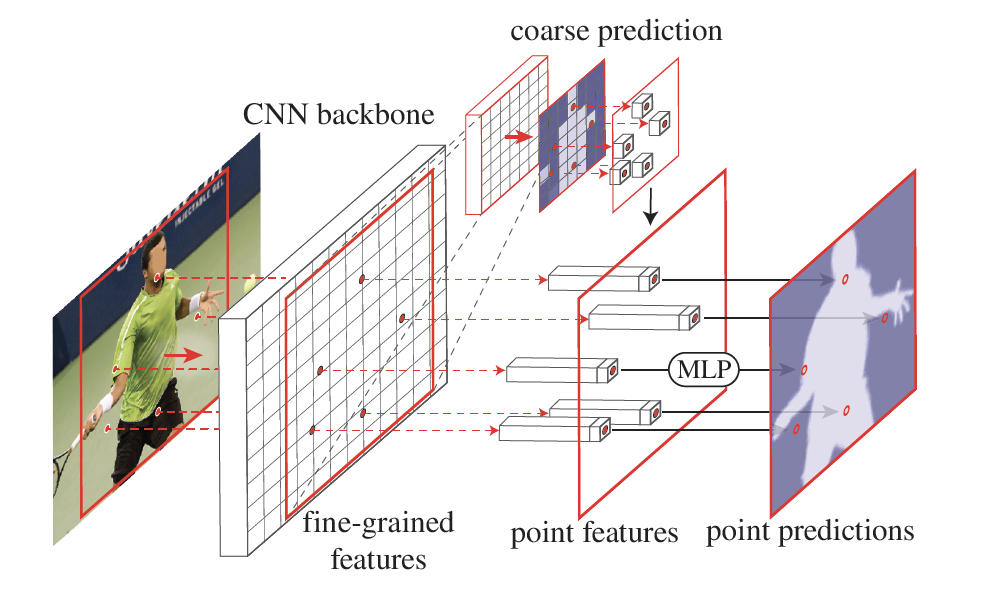

# PointRend的使用

## PointRend介绍
PointRend将分割问题当作渲染问题，提升目标边缘分割效果。
PointRend从CNN backbone中获取coarse prediction和fine-frained featureds,
按照不确定性原则从coarse prediction选取需要被渲染的点，
再从fine-frained featureds和coarse prediction获取point features，
最后利用MLP对选取的点进行渲染，使分割性能得到提升。
在预测过程中，采用细分策略，逐步进行渲染，直到达到所需的分辨率。


## PaddelSeg使用PointRend
PaddleSeg通过cfg.MODEL.WITH_POINTREND选择是否在原有分割模型的基础上增加PointRend模块
（目前PointRend只能应用于 **DeepLabv3+** 系列分割模型，更多分割模型的支持将在后期实现），
cfg.MODEL.POINTREND.K指定在训练选点时过采样的倍数，
cfg.MODEL.POINTREND.BETA指定选点时重要点选取的系数。

## 使用示例

### 一. 准备待训练数据


我们提前准备好了一份眼底医疗分割数据集，包含267张训练图片、76张验证图片、38张测试图片。通过以下命令进行下载：

```shell
python dataset/download_optic.py
```

### 二. 下载预训练模型

接着下载对应的预训练模型

```shell
python pretrained_model/download_model.py deeplabv3p_xception65_bn_cityscapes
```
更多的预训练模型请参见[PaddleSeg预训练模型](./model_zoo.md)。如果需要使用其他预训练模型，下载该模型并将配置中的MODEL_NAME、BACKBONE等进行替换即可。

### 三. 准备配置

接着我们需要确定相关配置，从本示例的角度，配置分为三部分：

* 数据集
  * 训练集主目录
  * 训练集文件列表
  * 测试集文件列表
  * 评估集文件列表
* 预训练模型
  * 预训练模型名称
  * 是否启用pointrend
  * 预训练模型的backbone网络
  * 预训练模型的Normalization类型
  * 预训练模型路径
* 其他
  * 学习率
  * Batch大小
  * ...

在三者中，预训练模型的配置尤为重要，如果模型配置错误，会导致预训练的参数没有加载，进而影响收敛速度。预训练模型相关的配置可参考各模型的教程。
目前预训练模型名称只能选deeplabv3p。

数据集的配置和数据路径有关，在本教程中，数据存放在`dataset/optic_disc_seg`中

其他配置则根据数据集和机器环境的情况进行调节，最终我们保存一个如下内容的yaml配置文件，存放路径为**configs/pointrend_optic.yaml**

```yaml
# 数据集配置
DATASET:
    DATA_DIR: "./dataset/optic_disc_seg/"
    NUM_CLASSES: 2
    TEST_FILE_LIST: "./dataset/optic_disc_seg/test_list.txt"
    TRAIN_FILE_LIST: "./dataset/optic_disc_seg/train_list.txt"
    VAL_FILE_LIST: "./dataset/optic_disc_seg/val_list.txt"
    VIS_FILE_LIST: "./dataset/optic_disc_seg/test_list.txt"

# 预训练模型配置
MODEL:
    MODEL_NAME: "deeplabv3p"
    DEFAULT_NORM_TYPE: "bn"
    WITH_POINTREND: True
    DEEPLAB:
        BACKBONE: "xception65"
        ENCODER_WITH_ASPP: True
        ENABLE_DECODER: True

# 其他配置
TRAIN_CROP_SIZE: (512, 512)
EVAL_CROP_SIZE: (512, 512)
AUG:
    AUG_METHOD: "unpadding"
    FIX_RESIZE_SIZE: (512, 512)
BATCH_SIZE: 2
TRAIN:
    PRETRAINED_MODEL_DIR: "./pretrained_model/deeplabv3p_xception65_bn_cityscapes/"
    MODEL_SAVE_DIR: "./saved_model/pointrend_optic/"
    SNAPSHOT_EPOCH: 5
TEST:
    TEST_MODEL: "./saved_model/pointrend_optic/final"
SOLVER:
    NUM_EPOCHS: 10
    LR: 0.001
    LR_POLICY: "poly"
    OPTIMIZER: "adam"
```

### 四. 配置/数据校验

在开始训练和评估之前，我们还需要对配置和数据进行一次校验，确保数据和配置是正确的。使用下述命令启动校验流程

```shell
python pdseg/check.py --cfg ./configs/pointrend_optic.yaml
```

## 五. 开始训练

校验通过后，使用下述命令启动训练

```shell
# 指定GPU卡号（以0号卡为例）
export CUDA_VISIBLE_DEVICES=0
# 训练
python pdseg/train.py --use_gpu --cfg ./configs/pointrend_optic.yaml
```

### 六. 进行评估

模型训练完成，使用下述命令启动评估

```shell
python pdseg/eval.py --use_gpu --cfg ./configs/pointrend_optic.yaml
```

### 七. 进行可视化

使用下述命令启动预测和可视化

```shell
python pdseg/vis.py --use_gpu --cfg ./configs/pointrend_optic.yaml
```

预测结果将保存在`visual`目录下，以下展示其中1张图片的预测效果：


## 参考文献

[1] [PointRend: Image Segmentation as Rendering](https://arxiv.org/abs/1912.08193)

[2] [Encoder-Decoder with Atrous Separable Convolution for Semantic Image Segmentation](https://arxiv.org/abs/1802.02611)
