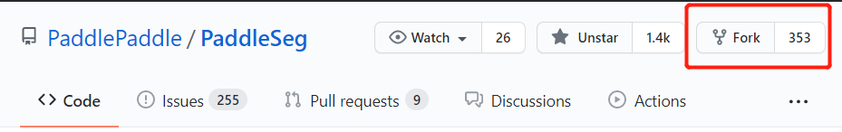
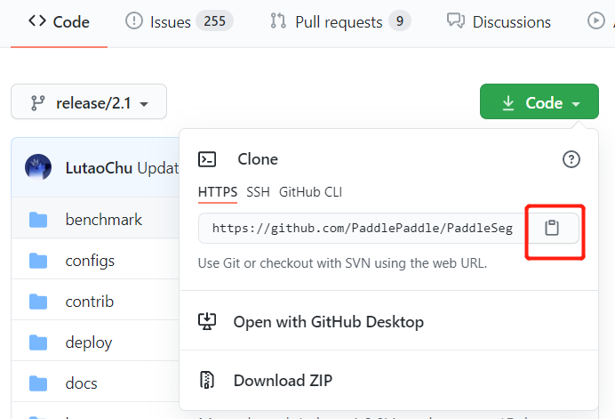
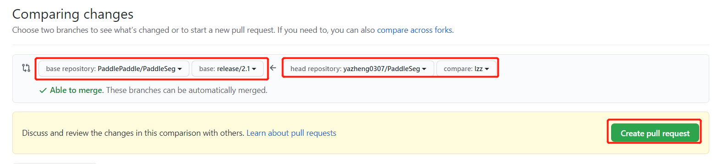

English|[简体中文](pr_cn.md)
# PaddleSeg code submission process and specifications

## 1. Fork and clone code

* Jump to [PaddleSeg GitHub home page](https://github.com/PaddlePaddle/PaddleSeg), and then click the fork button to generate a repository in your own directory, such as `https://github.com/USERNAME/PaddleSeg` .

  


* Clone the remote repository to the local.

    ```shell
    # Pull the code of the develop branch
    git clone https://github.com/USERNAME/PaddleSeg.git -b develop
    cd PaddleSeg
    ```

The address of clone can be obtained from below:

   


## 2. Establish a connection with the remote repository

First check the information of the current remote repository through `git remote -v`.

```
origin https://github.com/USERNAME/PaddleSeg.git (fetch)
origin https://github.com/USERNAME/PaddleSeg.git (push)
```

It only shows the information of the forked remote repository, which is PaddleSeg under the user name. Next, we will create a remote connection to the original PaddleSeg repository and name it upstream.

```shell
git remote add upstream https://github.com/PaddlePaddle/PaddleSeg.git
```

Use `git remote -v` to view the information of the current remote repository. The output is as follows. There are two remote repositories, which includes origin and upstream.

```
origin https://github.com/USERNAME/PaddleSeg.git (fetch)
origin https://github.com/USERNAME/PaddleSeg.git (push)
upstream https://github.com/PaddlePaddle/PaddleSeg.git (fetch)
upstream https://github.com/PaddlePaddle/PaddleSeg.git (push)
```

It can be used to keep the local repository up to date with the original repo when submitting a pull request (PR) in the future.

## 3. Create a local branch

You can create a new local branch based on the current branch, the command is as follows:

```shell
git checkout -b new_branch
```

You can also create a new branch based on a remote or upstream branch, the command is as follows:

```shell
# Create a new_branch branch based on the develop of the user's remote repository (origin)
git checkout -b new_branch origin/develop
# Create a new_branch branch based on the develop of the upstream remote repository (upstream)
# If you need to create a new branch from upstream, you need to use git fetch upstream to get the upstream code first
git checkout -b new_branch upstream/develop
```

Eventually the git repo will switch to the new branch, the output information is as follows:

```
Branch new_branch set up to track remote branch develop from upstream.
Switched to a new branch'new_branch'
```

## 4. Use pre-commit hook

Paddle developers use the pre-commit tool to manage Git pre-commit hooks. It can help us format the source code (C++, Python), and automatically check some basic rules before commit (for example, there is only one EOL for each file, don't add large files in Git, etc.).

The pre-commit test is part of the unit test in Travis-CI. PRs that do not satisfy the hook cannot be submitted to PaddleSeg. First install and run it in the current directory:

```shell
pip install pre-commit
pre-commit install
```

* **Notice**
1. Paddle uses clang-format to adjust the C/C++ source code format, please make sure the `clang-format` version is above 3.8.
2. The yapf installed by `pip install pre-commit` and `conda install -c conda-forge pre-commit` is slightly different. PaddleSeg developers use `pip install pre-commit`.

## 5. Modify and submit code

You can view the changed files through `git status`.if you made changes to the `README.md` of PaddleSeg, and hope to submit it. You can go through the following steps:

```shell
git add README.md
pre-commit
```

Repeat the above steps until the pre-comit format check does not report an error as follows:


Use the following command to complete the submission.

```shell
git commit -m "your commit info"
```

## 6. Keep the local repository up to date

Get the latest code from upstream and update the current branch. The upstream here comes from the section `Establishing a connection with a remote repository` in Section 2.

```shell
git fetch upstream
# If you want to submit to other branches, you need to pull the code from other branches of upstream, here is develop
git pull upstream develop
```

## 7. push to remote repository

```shell
git push origin new_branch
```

## 8. Submit a Pull Request

Click new pull request, select the local branch and target branch, as shown in the figure below. In the description of the PR, fill in the functions completed by the PR. Next, wait for the review. If there is any need to modify, follow the steps above to update the corresponding branch in origin.




## 9. Sign the CLA agreement and pass the unit test

* Sign the CLA
When submitting a Pull Request to PaddlePaddle for the first time, you need to sign a CLA (Contributor License Agreement) to ensure that your code can be incorporated. The specific signing method is as follows:

1. Please check the Check section in PR, find license/cla, and click on the detail on the right to enter the CLA website.
2. Click "Sign in with GitHub to agree" on the CLA website, and you will be redirected back to your Pull Request page after clicking Finish.

## 10. Delete branch

* Delete remote branch

After the PR is merged into the main repository, we can delete the branch of the remote repository on the PR page.

You can also use `git push origin :branch name` to delete remote branches, such as:


```shell
git push origin :new_branch
```

* Delete local branch

```shell
# Switch to the develop branch, otherwise the current branch cannot be deleted
git checkout develop

# Delete new_branch branch
git branch -D new_branch
```

## 11. Some conventions for submitting code

In order to make official maintainers focus on the code itself when reviewing the code, please abide by the following conventions every time you submit the code:

1) Please ensure that the unit tests in Travis-CI can pass smoothly. If not, it means that there is a problem with the submitted code, and the official maintainer generally does not review it.

2) Before submitting PUll Request:

Please pay attention to the number of commits.

Example: There are occasions when only one file is modified but more than a dozen commits are submitted, and each commit only makes a small amount of modification. These scienarios usaully cause great troubles for the reviewer. The reviewer needs to check each commit one by one to know what changes have been made, and it does not rule out that the changes between commits that covers each other.

Suggestion: Keep as few commits as possible whenever you commit, and you can use git commit --amend to supplement the last commit. For multiple commits that have been pushed to the remote repository, please refer to [squash commits after push](https://stackoverflow.com/questions/5667884/how-to-squash-commits-in-git-after-they-have-been-pushed).

Please pay attention to the name of each commit: it should reflect the content of the current commit.

1) If you solve a certain Issue, please add: fix #issue_number in the first comment box of the PUll Request, so that when the PUll Request is merged, the corresponding Issue will be closed automatically. Key words include: close, closes, closed, fix, fixes, fixed, resolve, resolves, resolved. Please select the appropriate vocabulary. For details, please refer to [Closing issues via commit messages](https://help.github.com/articles/closing-issues-via-commit-messages).

In addition, when responding to the reviewer’s comments, please abide by the following conventions:

1) Every review opinion of the official maintainer should be replied.

   - Give a simple Done if you agree to the review opinion and modify it according to it;
   - If you disagree with the review comments, please give your own reasons for refutation.

2) If there are more review opinions:

   - Please give the overall revision status.
   - Please use `start a review` to reply instead of replying directly. The reason is that every reply will send an e-mail, which will cause e-mail disaster.
