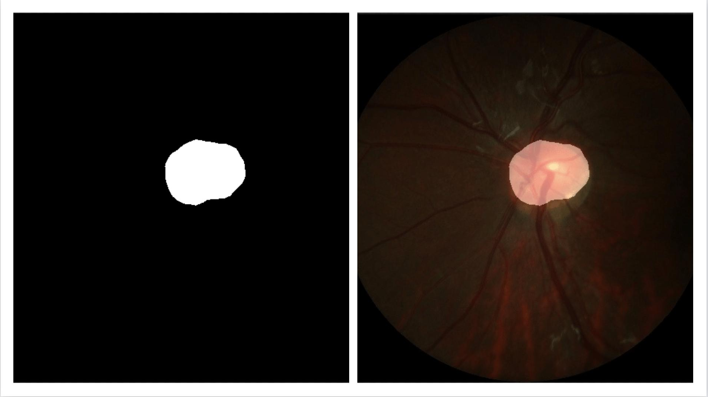

English | [简体中文](predict_cn.md)

# Prediction

In addition to analyzing the `IOU`, `ACC` and `Kappa`, we can also check the segmentation effect of some specific samples, and inspire further optimization ideas from Bad Case.

The `predict.py` script is specially used to visualize prediction cases. The command format is as follows:

```
python tools/predict.py \
       --config configs/quick_start/pp_liteseg_optic_disc_512x512_1k.yml \
       --model_path output/iter_1000/model.pdparams \
       --image_path dataset/optic_disc_seg/JPEGImages/H0003.jpg \
       --save_dir output/result
```

Where `image_path` can be the path of a picture, a file list containing image paths, or a directory. At this time, that image or all images in file list or directory will be predicted and the visualization results will be saved.

Similarly, you can use `--aug_pred` to turn on multi-scale flip prediction, and `--is_slide` to turn on sliding window prediction.


## 1.Prepare Dataset

- When performing prediction, only the original image is needed. You should prepare the contents of `test.txt` as follows:
    ```
    images/image1.jpg
    images/image2.jpg
    ...
    ```

- When calling `predict.py` for visualization, annotated images can be included in the file list. When predicting, the model will automatically ignore the annotated images given in the file list. Therefore, you can also directly use the training and validating datasets to do predictions. In other words, if the content of your `train.txt` is as follows：
    ```
    images/image1.jpg labels/label1.png
    images/image2.jpg labels/label2.png
    ...
    ```

## 2.API
Parameter Analysis of Forecast API

```
paddleseg.core.predict(
                    model,
                    model_path,
                    transforms,
                    image_list,
                    image_dir=None,
                    save_dir='output',
                    aug_pred=False,
                    scales=1.0,
                    flip_horizontal=True,
                    flip_vertical=False,
                    is_slide=False,
                    stride=None,
                    crop_size=None,
                    custom_color=None
)
```

- Parameters

| Parameter          | Type          | Effection                                                 | Is Required | Default |
| --------------- | ----------------- | ---------------------------------------------------- | ---------- | -------- |
| model           | nn.Layer          | Segmentation model                            | Yes         | -        |
| model_path      | str               | The path of parameters in best model          | Yes         | -        |
| transforms      | transform.Compose | Preprocess the input image                    | Yes         | -        |
| image_list      | list              | List of image paths to be predicted             | Yes         | -        |
| image_dir       | str               | The directory of the image path to be predicted     | No         | None     |
| save_dir        | str               | Output directory                                         | No         | 'output' |
| aug_pred        | bool              | Whether to use multi-scale and flip augmentation for prediction          | No         | False    |
| scales          | list/float        | Set the zoom factor, take effect when `aug_pred` is True                 | No         | 1.0      |
| flip_horizontal | bool              | Whether to use horizontal flip, take effect when `aug_pred` is True  | No         | True     |
| flip_vertical   | bool              | Whether to use vertical flip, take effect when `aug_pred` is True    | No         | False    |
| is_slide        | bool              | Whether to evaluate through a sliding window                             | No         | False    |
| stride          | tuple/list        | Set the width and height of the sliding window, effective when `is_slide` is True       | No         | None     |
| crop_size       | tuple/list        | Set the width and height of the crop of the sliding window, which takes effect when `is_slide` is True | No         | None     |
| custom_color    | list              | Set custom segmentation prediction colors,len(custom_color) = 3 * (pixel classes)  | No        | Default color map |

Import the API interface and start predicting.

```
from paddleseg.core import predict
predict(
        model,
        model_path='output/best_model/model.pdparams',# Model path
        transforms=transforms, # Transform.Compose， Preprocess the input image
        image_list=image_list, # List of image paths to be predicted。
        image_dir=image_dir, # The directory where the picture to be predicted is located
        save_dir='output/results' # Output path
    )
```

## 3.Instruction of File Structure
If you don't specify the output location, `added_prediction` and `pseudo_color_prediction` will be generated under the default folder `output/results`, which store the results of the pseudo map and blended prediction respectively.

    output/result
        |
        |--added_prediction
        |  |--image1.jpg
        |  |--image2.jpg
        |  |--...
        |
        |--pseudo_color_prediction
        |  |--image1.jpg
        |  |--image2.jpg
        |  |--...


## 4.Custom Color Map
After prediction, what we get is the predicted segmentation result depend on default color map. Take the medical video disc segmentation dataset as an example:


​                                                                                            pseudo map / blended prediction

In the segmentation result, the foreground is marked in red, and the background is marked in black. If you want to use other colors, you can refer to the following command:
```python
python tools/predict.py \
       --config configs/quick_start/pp_liteseg_optic_disc_512x512_1k.yml \
       --model_path output/iter_1000/model.pdparams \
       --image_path data/optic_disc_seg/JPEGImages/H0003.jpg \
       --save_dir output/result \
       --custom_color 0 0 0 255 255 255
```
The segmentation results are as follows:


​                                                                                            pseudo map / blended prediction

- Parameters
- You can see that we added `--custom_color 0 0 0 255 255 255` at the end. What does this mean? In the RGB image, the final color of each pixel is determined by the components of the three RGB channels, so every three digits after the command line parameter represent the color of a pixel, and the color of each class in `label.txt` is releated to 3 digits sequentially.
- If you use a custom color map, the number of input `color values` should be equal to `3 * pixel classes` (depending on the dataset you are using). For example, if your data set has 3 types of pixels, you can consider run:
```pythons
python tools/predict.py \
       --config configs/quick_start/pp_liteseg_optic_disc_512x512_1k.yml \
       --model_path output/iter_1000/model.pdparams \
       --image_path data/optic_disc_seg/JPEGImages/H0003.jpg \
       --save_dir output/result \
       --custom_color 0 0 0 100 100 100 200 200 200
```

We recommend that you refer to the RGB color value comparison table to set `--custom_color`.
